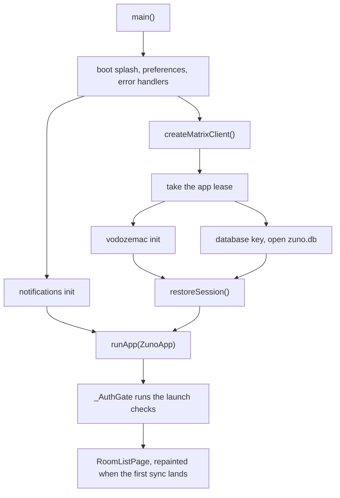
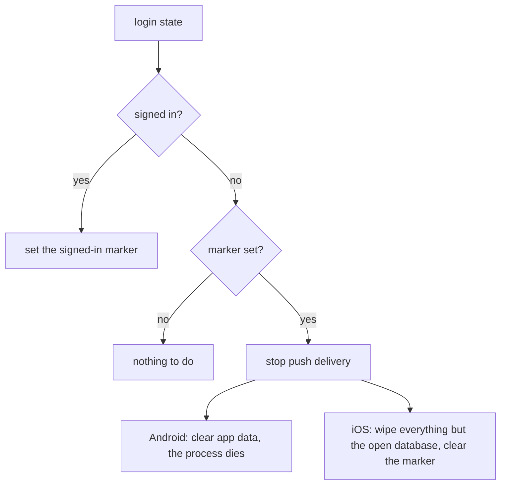
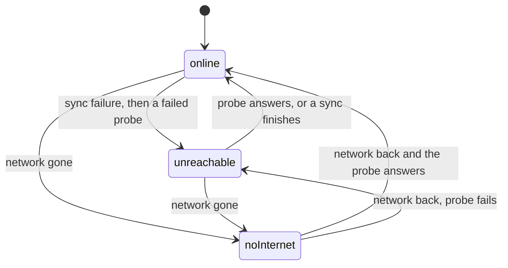

# App foundation

The layer every screen sits on: one Matrix client per process, startup, navigation, look and motion, the android/ios split, the iOS project and its single Flutter engine, encrypted storage, the sign-out wipe, connectivity and error handling.

## Architecture

### Client and startup

**One `Client` for the app's lifetime.** `createMatrixClient()` (`matrix_client_provider.dart`) builds a `ZunoClient`, which is awaited before `runApp`. There is no repository or service layer: screens call SDK methods directly, and the SDK types (`Client`, `Room`, `Event`, `Timeline`) are the app state. Riverpod only exposes the client and the streams derived from it.

| Provider | What it gives |
|---|---|
| `matrixClientProvider` | The `Client`, overridden in `main.dart` with the started client. |
| `isLoggedInProvider` | Login state, seeded with `client.isLogged()` because `onLoginStateChanged` never replays its current value. |
| `firstSyncProvider` | Done once a first sync has finished, or at once for a restored session. Onboarding and the chat list's empty state wait on it, because `client.login` can give up waiting for that sync. |
| `connectionStatusProvider`, `isOfflineProvider` | Connectivity (below). |

**The HTTP stack** has two deliberate quirks.
- The `HttpClient` has a connect-only timeout, so a dead route fails fast while a slow upload or download is never cut off.
- The SDK refreshes an expiring token only inside its sync loop, so `FreshTokenHttpClient` holds any request carrying the current token until one shared refresh has run. Without it, requests racing the first sync at cold start would go out with an expired token.

**Cold start** runs independent steps concurrently and joins them only where a real dependency exists:

- `restoreSession()` does not wait for the first sync (`waitForFirstSync: false`). The room list loads from the database and repaints from `onSync` when the sync lands.
- **A failed start** is retried automatically, then `StartupFailurePage` offers Try again or a confirmed Start over that discards the key and the database. The SDK clears the whole store on an unexpected init error, so `ZunoClient` skips that clear during session restore.
- `main()` also serves Android's headless push engines, which build a background client and never call `runApp`. On iOS, a ring or notification-action wake runs the normal `main()` in the app's one engine (below).

### One Matrix client per process (`client_lease.dart`)

**At most one Matrix client is live per process, and the app's always wins.** matrix SDK 12 writes the Olm account and session maps as whole values from each client's own cache, so two live clients on one store silently lose each other's crypto writes.

- The app takes its lease before opening the store and keeps it for the life of the process. A background holder is asked to yield, and after a short grace period the app is granted anyway.
- A background client (`createMatrixClient(backgroundSync: false)`) is denied while the app holds the lease. Each denied path falls back on something already in place: a push keeps its instant notice (`notifications.md`), and a decline or notification action hands off to the app's live route (`calls.md`).
- **Background clients never clear the store or mint a database key.** The SDK's own `clear()` on a failed init or refresh would otherwise wipe the shared database from a push engine.
- Native code arbitrates across engines: `ClientLeases` in `zuno_notifications` on Android, `ClientLeasePlugin` on iOS.
- A new background entry point (engine or isolate) opens its client only through `createMatrixClient(backgroundSync: false)` and handles `ClientLeaseDenied`. It calls `installUserAgent()` first, because the User-Agent is set per isolate and map tiles depend on it.

### Navigation

**`_AuthGate` (`lib/app.dart`) is the only routing decision.** It swaps the root between `SignedOutEntry` and `RoomListPage`, and keeps the signed-out screens while a sign-in is in flight. Everything else is `Navigator.push`, and code without a `BuildContext` uses `globalNavigatorKey` and `globalScaffoldMessengerKey`. `_AuthGate` also runs the launch checks, starts and stops notification delivery, and owns the sign-out wipe and the background sync pause.

**Launch targets hold the splash.** On a logged-in cold start, `_AuthGate` keeps the splash while it runs every launch check concurrently under a time cap: a pending ring, a launch shortcut, a notification tap, a call action and a launch share. The root swaps to `RoomListPage` only afterwards, so a target is already on top and the room list never flashes alone.

**A launch target is taken once.** Android hands a relaunch from Recents the original launch intent again, so `MainActivity` swaps it for a bare `ACTION_MAIN` before the plugins attach, and a share or notification tap never repeats. A share or room open that arrives before anyone listens is held, latest only.

**Signing out pops to root from one place.** `_AuthGate` swaps only the root route's content, so a pushed screen (Settings, where Sign out lives) would otherwise stay up. The pop runs from `onLoginStateChanged`, which also covers a remote sign-out, and only on a real logged-in to logged-out transition.

### Look and motion (`lib/core/ui/`)

Colors, type, shape and transitions are set here and nowhere else, and screens read `Theme.of(context)`. The direction is quiet: warm paper surfaces, amber only where it means something, and depth from surface steps rather than shadows.

| File | Holds |
|---|---|
| `zuno_theme.dart` | The light and dark themes: a seeded `ColorScheme` with the key roles pinned, Roboto at weights 400, 500 and 700 only (older Android has no 600 and snaps to bold), and the component themes. |
| `zuno_colors.dart` | The brand colors and the `ZunoColors` extension for what Material has no slot for, such as the outgoing bubble. |
| `zuno_motion.dart` | `ZunoDurations`, the Android slide transition and `ForwardExitPageRoute`. |
| `zuno_splash.dart` | `ZunoSplash`, matched to the OS launch screen (Decisions). |

Motion:
- **Android** slides every `MaterialPageRoute` through a builder registered in the theme: movement only, no fade, on one `fastOutSlowIn` curve.
- **iOS** keeps the Cupertino transition, and with it the edge swipe back.
- **`ForwardExitPageRoute`** (onboarding) can `popForward`, which exits toward the leading edge like a pager step. Any other pop is the normal reverse.
- Reduced motion drops the slides, and right-to-left mirrors them.

Shared pieces:

| Piece | Used for |
|---|---|
| `CardListView`, `CardGroup`, `CircleIcon` | The grouped-card look of Settings, room info and the pages under them. |
| `StepLayout`, `StepHero` | One-question screens, with the actions pinned at the bottom above the keyboard. |
| `RowMemo` | Returns the identical widget for an equal record, so a list row rebuilds only when its value-equal record changes. |
| `RouteSettled` | `onRouteSettled()` fires once the push slide has finished, for work that would otherwise land mid-slide. |

**Performance rules**, binding on every screen. The floor is a mid-range phone from about 2021.

| Rule | Why |
|---|---|
| No blur, shader masks or soft shadows | They stall mid-range GPUs. |
| No `Opacity` around list rows; dim with color instead | `Opacity` renders the row off-screen, then blends it. |
| Animate position, never size or padding | Size and padding changes re-lay-out every frame. |
| Fixed-height rows where the design allows | The list skips measuring while it scrolls. |
| Decode images at display size | An avatar never holds a full-size bitmap. |
| A sync rebuilds only the rows that changed, without animation | Wholesale rebuilds and reorder animations stutter on every sync. |

**Request rules**:
1. Draw from what the SDK holds in memory; never fetch inside `build`.
2. One fetch per immutable key, deduplicated while in flight.
3. No request until the screen's slide has finished, so a screen the user backed out of costs nothing.
4. No polling from screens; sync is the only live channel.

### Platform split (`lib/core/platform/`)

Every platform difference is a capability. Why the split is shaped this way: `../decisions/platform-flavors.md`.

- `app_platform.dart` is the only file that reads `Platform.isIOS`, so `flutter test` runs as android. The pure `capabilitiesFor(AppPlatform)` returns a const `PlatformCapabilities` whose fields are all required.
- Consumers watch `platformCapabilitiesProvider`, or take a `PlatformCapabilities` parameter that defaults to `ambientCapabilities`, which only tests assign.
- Where iOS reimplements rather than skips, the difference is a seam in `lib/core/calls/platform/`, built by a `*For(capabilities)` factory (`calls.md`).
- Every `zuno/*` wrapper is gated: with its flag off it is a no-op that returns a neutral default, and it catches `MissingPluginException`.

Each flag is one of these kinds:

| Kind | Examples |
|---|---|
| Native handler on both platforms | `screenSecurity`, `inboundShare`, `nativeSignOutWipe`, `clientLease`, `pictureInPicture` |
| Awaiting an iOS handler | `deviceSafetyChecks` |
| Off on iOS by design (`../decisions/ios-push-and-ring.md`) | `notificationImages`, `notificationAvatars` |
| Android concept, iOS `false` for good | `batteryExemption`, `foregroundSyncService`, `fullScreenIntent`, `homeScreenShortcuts` |
| Android-only behavior | `atomicDatabaseBatches`, `instantPushNotices` |
| iOS-only behavior | `apnsRegistration`, `voipRing`, `nseNotifications`, `signOutWipeKeepsProcess` |
| Call seam selectors | `nativeIncomingRingUi`, `callForegroundService` and `nativeRingbackTone` on Android, `callKit` on iOS. The factories check `callKit` first, so the Android three never flip. |
| Apple limitation | `recorderWritesOgg` (Apple cannot write Ogg), `screenshotBlocking` (no app can block a screenshot) |

The `zuno/*` channels, each behind its flag:

| Area | Both platforms | Android | iOS |
|---|---|---|---|
| Calls (`calls.md`) | `zuno/calls`: call presentation, ringback, audio routes, screen security and the sensitive clipboard | `zuno/call_style` | `zuno/voip` |
| Push and notifications (`notifications.md`) | `zuno/push_wakelock`, `zuno/push_diag` | `zuno/fcm`, `zuno/background_sync`, `zuno/conversations`, `zuno/vibration` | `zuno/apns`, `zuno/nse`, `zuno/notification_actions` |
| Media and uploads | `zuno/image`, `zuno/video`, `zuno/upload_service` | | |
| App | `zuno/app_data` (the sign-out wipe), `zuno/client_lease`, `zuno/network`, `zuno/shortcuts`, `zuno/share`, `zuno/wake_lock` | `zuno/device_safety` | `zuno/launch` (the wake reason) |

### iOS project

| Path | Holds |
|---|---|
| `ios/Runner/` | The app target and its `zuno/*` plugins |
| `ios/ShareExtension/` | The share extension (`chats-messaging.md`) |
| `ios/NotificationService/` | The notification service extension (`notifications.md`) |
| `ios/Shared/` | Swift compiled into the app and the share extension |
| `ios/NotifyShared/` | Swift compiled into the app and the notification extension, such as the read model and the ring decisions |
| `ios/RunnerTests/` | XCTests through `@testable import Runner`, which compiles both shared folders |

- An extension's version must match its app's, so each extension takes Flutter's build name and number through its own xcconfig.
- **App Groups are team-scoped**, because a group registered on a Personal Team may stay stuck there. Code never spells a group name: it reads `ZunoAppGroup` or `ZunoNotifyGroup` from its own Info.plist.

  | Group | Members | Holds |
  |---|---|---|
  | `group.im.zuno.chat.$(DEVELOPMENT_TEAM)` | App, share extension | The share inbox |
  | `group.im.zuno.chat.notify.$(DEVELOPMENT_TEAM)` | App, notification extension (never the share extension) | The notification read model, and the notify Keychain item |

- **Keychain items** are all `AfterFirstUnlockThisDeviceOnly` and never synchronized. They outlive an uninstall, so a reinstall's first launch deletes the notify and VoIP items (`NotifySweep`), never the database key.

  | Service | Access | Holds |
  |---|---|---|
  | flutter_secure_storage's default | App only | The database key |
  | `im.zuno.chat.notify` | Notify group | The read-model keys and the extension's credential |
  | `im.zuno.chat.voip` | App only | The VoIP key |

- **Info.plist** sets `FlutterDeepLinkingEnabled` to `false`, so an opened URL never becomes a route; plugins claim URLs through `addSceneDelegate`. It has no storyboard keys, because `Main.storyboard`'s `FlutterViewController` would create Flutter's implicit engine.
- Each target has a privacy manifest, and a new required-reason API in any target needs its entry.

### One Flutter engine on iOS (`EngineHost.swift`)

**iOS runs one app-owned engine, not Flutter's implicit one.** The implicit engine needs a scene, which a ring or a notification action in the background lacks, and two engines cannot share a `Client`, the lease or WebRTC objects. The full `main()` runs however the engine starts.

| Trigger | What happens |
|---|---|
| A scene connects | The engine starts or is reused, and `SceneDelegate` builds its window around a `FlutterViewController` on it |
| A VoIP ring | The engine starts headless with `--zuno-wake=ring`, after CallKit has the call |
| Reply or Mark as read | The engine starts headless with `--zuno-wake=action` |

- **No engine starts before first unlock**, because the database key and the app's files are unreadable until then. A ring stays native until then (`calls.md`).
- **Plugins register once, in `EngineHost.registerPlugins`.** A new plugin goes there, and its Dart wrapper is a no-op behind a capability flag.
- **Native events are pulled, not pushed.** A native-to-Dart call made before Dart's handler exists is dropped, so native code queues events and Dart takes them.

### Storage

**One SQLCipher database, `zuno.db`**, in Application Support, holds everything the SDK tracks: the access token, the Olm account, Megolm sessions and cached room and event state. There is no app-level database beside it. Push engines and notification actions open the same file from their own engines, one client at a time.
- It always opens with its key, and a plaintext `zuno.db` fails to open rather than being read unencrypted.
- On iOS the app's database also exports inbound Megolm sessions to the notification read model (`notifications.md`).

**Only the app mints a database key.** A `zuno.db` whose key is gone can never open, so `obtainDatabaseCipher` deletes it before generating a key, and the device starts signed out instead of failing at launch. That happens when the key store loses the key while the file survives, such as a Keychain item stranded by a Team ID change (Gotchas); backups cannot cause it, since they carry neither. An unreadable key (a locked Keychain) throws instead, so a background client can never replace the app's store.

**Nothing discards the key on a read error** (`secret_store.dart`). flutter_secure_storage's Android default deletes every secret after one Keystore read error, which would lose the key and with it the database. Only Start over discards.

**SQLCipher's derived key is cached** in secure storage, tagged with the file's salt, because the passphrase is already a random key and SQLCipher's key stretching on every cold process buys nothing.

**On Android, every SDK write transaction is one native batch** (`AtomicBatchDatabase`). sqflite_sqlcipher shares one native connection per path across every engine in the process, and a Dart-side transaction spans several channel round trips. An engine that dies inside one would leave the shared connection mid-transaction, and every later write in the process would be silently discarded. The wrapper therefore replays each commit as `BEGIN IMMEDIATE … COMMIT` in one native call. For the same reason, an open that meets another engine's abandoned transaction rolls it back rather than failing (`shared_database_open.dart`). iOS opens a connection per engine and stays unwrapped.

**App data stays out of device backups.** Android sets `allowBackup="false"`, and iOS excludes Application Support, Documents and the App Group folders. `Library/Preferences` still backs up, so a restore brings back the signed-in marker without a database, and the sign-out wipe clears it on first launch.

### Sign-out wipe (`sign_out_wipe.dart`)

**Every sign-out ends in a full app-data wipe**, so sign-out paths clean nothing local themselves. `_AuthGate` hands each login state to `SignOutWipe`:

- The marker separates a sign-out from a device that never signed in, and it catches a remote sign-out at the next launch. A wipe that fails keeps the marker, so the next launch retries.
- **Android** drops files, preferences, keys, notifications, channels, shortcuts and permissions, so the next launch is a fresh install.
- **iOS keeps the process, so it keeps the open database** (`signOutWipeKeepsProcess`). An iOS app cannot quit itself, and deleting the live SQLCipher file or its key would strand a same-session sign-in. The SDK has already emptied the database, so Dart `VACUUM`s it, the native wipe empties everything else the app owns, and Dart reloads `SharedPreferences`.
- **A same-session sign-in must start clean**, so a provider that keeps session state in memory watches `isLoggedInProvider`.

### Connectivity and background sync

`connectionStatusProvider` gives `online`, `noInternet` or `unreachable` from the pure `ConnectionMonitor`, which is fed by two signals. `isOfflineProvider` is anything but `online`.

| Signal | Source | Drives |
|---|---|---|
| Device network | `zuno/network`: Android's default-network callback, iOS `NWPathMonitor` | `noInternet`, once the network has stayed gone briefly |
| Homeserver | Sync failures, confirmed by probing `/_matrix/client/versions` | `unreachable` |

- A sync connection failure is never trusted alone, only probed, because `forceSyncNow` and network handoffs throw stray errors. A finished sync clears to `online`.
- **The banner** sits above the `Navigator`, so it shows over every screen and dialog, and it stays exactly as long as the problem.
- Core Matrix traffic stays ungated offline, since the SDK queues and retries it. Only doomed extras are gated: link-preview images, history requests and starting a call.

**Backgrounding pauses `/sync`.** `_AuthGate` calls `client.abortSync()` on `paused`, which also tears down the in-flight long-poll, and sets `client.backgroundSync = true` on `resumed`.
- The background-service delivery mode is exempt, since keeping `/sync` alive is its whole purpose.
- A call or a ring keeps sync running, because a call learns of the other side leaving, and a ring of an answer elsewhere, only through sync. A CallKit answer on the lock screen never resumes the app, so on iOS a ring or call that starts in the background turns sync back on.
- Attachment sends survive backgrounding: `abortSync()` leaves the HTTP client alone, and an in-flight send holds a foreground service or background task (`chats-messaging.md`).

### Errors

- `main()` runs in `runZonedGuarded`, and the global handlers chain onto `FlutterError.onError` and `PlatformDispatcher.onError`. Unhandled errors go to crash reporting (`crash-reporting.md`) and, in debug builds only, to an error SnackBar.
- A caught error the user sees gets a plain sentence, never the exception's text, and the exception goes to `logCaught` (`core/errors/best_effort.dart`). The one deliberate exception is the push diagnostics page, which shows the last pusher error as is (`notifications.md`).
- `isConnectionError` is the one test for a network failure, and `failureMessage` adds a check-your-connection hint for one.

## Decisions

- **Single `Client`, no repository layer**: one source of truth, and no app-level model drifting from the SDK's own.
- **Minimum OS Android 8.0 (API 26), iOS 18.0.** The floors remove older-OS fallbacks and drop OS versions without security patches; neither buys speed. They are pinned in several places (every `packages/*` plugin, every Xcode target, the Podfile), so raise them together.
- **A failed start asks before deleting anything.** A full disk or a flaky Keystore must not cost someone their encryption keys, and a client that cannot start gets a screen instead of an endless splash.
- **Cold start never waits on the network, or on independent steps run in sequence.** Sequential setup was a measured cost with no correctness benefit.
- **Device network and homeserver are separate signals.** The sync stream alone cannot tell "your internet is down" from "the server is down", and the banner must not blame the wrong one.
- **`/sync` pauses in the background**: a long-poll with no screen wastes battery when push carries the wake-up.
- **One app-owned iOS engine, not Flutter's `LaunchEngine` or a second headless engine.** `LaunchEngine` starts an engine at every launch and crashes when mixed with implicit-engine registration, and a separate ring engine would strand an answered call's WebRTC objects where the UI cannot reach them.
- **The boot splash matches the OS launch screen pixel for pixel.** A cold start paints the mark twice, from two independent layers, and any mismatch reads as two loading screens. Holding launch targets behind it costs a plain cold start about a second, the price of no room-list flash under a ring.
- **gzip only**: zstd saved little on real sync payloads, where IDs, keys and ciphertext do not compress, and it cost a dependency.
- **No localization**: every string is hardcoded English.
- **Atomic batches, not a forked plugin.** A batch failing after `BEGIN` can still roll back another engine's write in that window, but only on a full disk, an I/O error or corruption. Owning a fork of the crypto database plugin was judged the bigger risk.

## Gotchas

**Theme and layout**
- **Two ambers.** Brand amber is too faint as text, so `primary` is a darker amber for text, icons and lines, and `primaryContainer` is brand amber as a fill. A soft tint uses `secondaryContainer`, because a tonal button on `primaryContainer` disappears.
- **A theme edit restyles screens its diff never touches**, through call sites that override only part of a themed component (a local `InputDecoration.border` loses to the themed state borders), so sweep them.
- **A `ListView` with explicit `padding` stops handling the system insets**, so its last row sits under the navigation bar; `CardListView` handles them, and any other nested scrollable takes `padding: EdgeInsets.zero`.
- **The push curve must start gently**, because a push spends its first frames building the new screen and whatever the curve covers then is never seen (`zuno_motion_test.dart` pins it).

**Client, SDK and Riverpod**
- **`vod.init()` throws on a second call in the same isolate**, so always use `ensureVodozemacInitialized()`.
- **The SDK's `BoxCollection.transaction` has no `try/finally`**, so after a throwing action, later direct writes land in a batch nobody commits while the cache already shows them.
- **`Client.importantStateEvents` must list every state type a feature needs live**, or the SDK silently drops its live updates in rooms that are not fully loaded (`m.call.member` is there for this).
- **`oneShotSync` joins an in-flight long-poll instead of starting a sync**, so any "refresh now" goes through `forceSyncNow` (`force_sync.dart`), which aborts first and restores the sync loop afterwards.
- **`softLoggedOut` is a token refresh in flight, not a sign-out**: only `loggedOut` reads as signed out.
- **Riverpod 3 retries a failed provider on its own**, so a `FutureProvider` whose error must reach the UI passes `retry: (_, _) => null`.
- **`_AuthGate`'s `ref.listenManual` subscriptions must not become `build()`-driven**, because `_AuthGate` sits under every route and Flutter defers rebuilding an element under a covered route.
- **A SnackBar or provider change made from `FlutterError.onError` or `dispose()` defers with `scheduleMicrotask`**, since both can run while the build pipeline finalizes, and `addPostFrameCallback` fires only if another frame comes.
- **The `sqlite3` package (pulled in by the SDK) is not bundled.** Nothing imports it, so `pubspec.yaml` points its build hook at the system library (`hooks: user_defines: sqlite3: source: system`) to drop an unused SQLite from both apps, and Android has no system copy an app can load. The day anything imports `package:sqlite3`, remove that user define first: `sqlite3_unbundled_test.dart` fails until then. Never open `zuno.db` through it either, since two SQLite copies on one file in one process break each other's locks.

**Storage and iOS**
- **Never give flutter_secure_storage a `groupId` or change its `accessibility` without migrating first**: the database key then reads as absent, and `obtainDatabaseCipher` deletes `zuno.db`.
- **Never give `zuno.db` a plaintext header**, because the key cache and the shared open read the salt from its first bytes. Those reads also drop the process's POSIX locks on the file, one more reason the database never moves to an App Group (`../decisions/ios-push-and-ring.md`).
- **SQLCipher 5 cannot open a 4.x database with its defaults**, so a bump needs compatibility settings or a migration.
- **App Group files are written through a temp file and a rename, never in the purged `Library/Caches`**, because a file lock held at suspension gets the process killed (`0xdead10cc`). The write takes the temp file's protection class, so set it on the temp file.
- **Darwin notifications between the app and its extensions are system-wide**, so they only ever mean "go re-read" and never carry data or authority.
- **Changing the Team ID strands the App Group containers and the Keychain items**, because their identifiers carry it.
- **Never call the AppDelegate's `registrar(forPlugin:)`, `hasPlugin` or `valuePublishedByPlugin`**, including a plugin README's `GeneratedPluginRegistrant.register(with: self)`: they silently start Flutter's `LaunchEngine`, a second engine with a second Matrix client.
- **A headless engine's display links do not tick in the background**, so a ring or action wake must not wait on frames.
- **Edit `project.pbxproj` only with CocoaPods' bundled xcodeproj gem** (`tool/xcode/add_sources.rb`), because Xcode 27 saves it at an `objectVersion` CocoaPods cannot read. Keep "Embed Foundation Extensions" above "Run Script" in Runner, or Thin Binary forms a build cycle.
- **Every target compiles in Swift 6 mode**, so a channel handler copies the `@MainActor` shape of those in `ios/Runner/`, and one run off the main thread crashes instead of racing.
- **A missing usage-description key crashes on first use**, and permission_handler compiles out any permission whose key it cannot find, so builds from Xcode.app need `PERMISSION_HANDLER_INFO_PLIST` in launchd's environment, which a reboot clears.

**Capability flags and assets**
- **`canUseFullScreenIntent()` answers `true` wherever `fullScreenIntent` is off**, which onboarding relies on to skip the Android page, so an iOS row must not read it.
- **Flipping a flag re-shows the UI it gates**, so its copy must hold on iOS first.
- **The adaptive-icon safe zone is a circle**, so a square mark is sized to the safe-zone diameter / √2.
- **`values-night` outranks `values-v31`**, so a dark Android 12+ splash override goes in `values-night-v31/`.
- **Notification small icons are alpha masks**, so they need a dedicated single-color drawable.
- **The iOS app icon** is one opaque 1024 px image per appearance, since App Store validation rejects transparency.

## Testing

- `buildTestClient` never syncs, so a test that reaches `firstSyncProvider` overrides it.
- A logged-in `ZunoApp` test mocks `zuno/shortcuts` and `zuno/share`, or the launch checks never finish (`test/app_launch_target_test.dart`).
- A new layout passes `expectSurvivesLayoutMatrix` (`test/helpers/layout_matrix.dart`), and a does-it-fit assertion loads the real font with `loadRealRoboto`, since the test font is about twice as wide.
