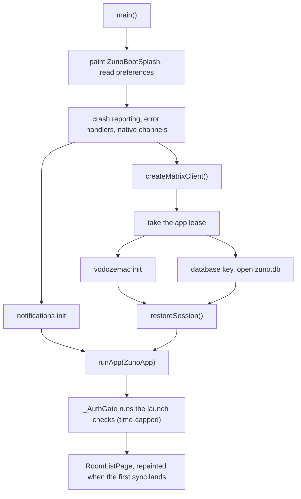
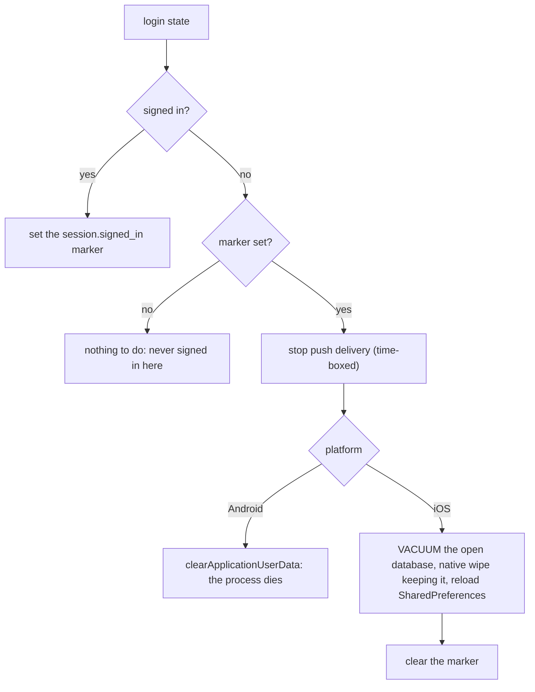
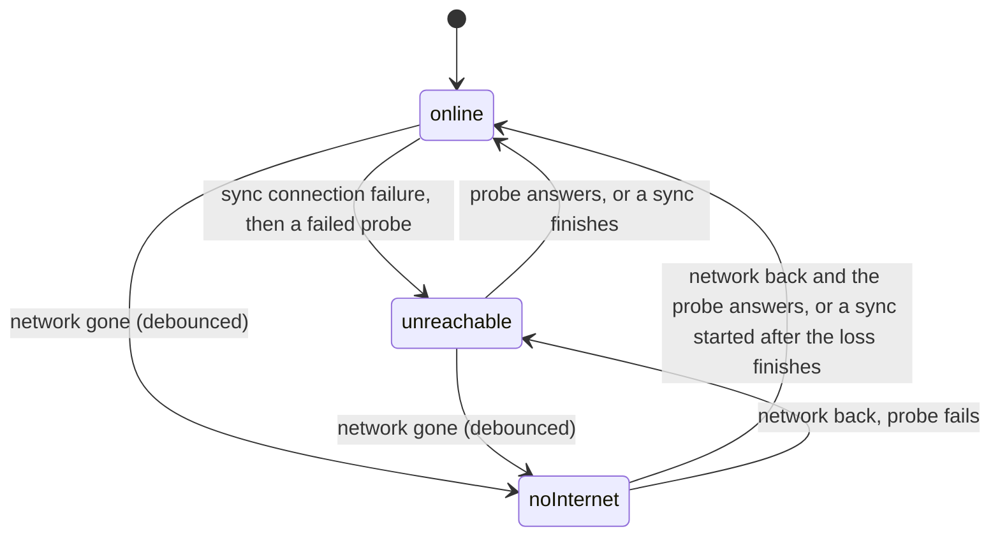

# App foundation

The layer every screen sits on: one Matrix client per process, startup, navigation, look and motion, the android/ios split, the iOS project and its single Flutter engine, encrypted storage, the sign-out wipe, connectivity and error handling. It is not a user-facing feature, but every screen depends on it.

## Architecture

### Client and startup

**One `Client` for the app's lifetime.** It is a `ZunoClient`, built by `createMatrixClient()` (`matrix_client_provider.dart`) and awaited before `runApp`. There is no repository or service layer: screens call SDK methods directly, and the SDK types (`Client`, `Room`, `Event`, `Timeline`) are the app state. Riverpod only exposes the client and the streams derived from it.

| Provider | What it gives |
|---|---|
| `matrixClientProvider` | The `Client`. It throws until `main.dart` overrides it with the started client. |
| `isLoggedInProvider` | Seeded with `client.isLogged()`, then follows `onLoginStateChanged`. That stream never replays its current value, so without the seed a fresh install would sit in `AsyncLoading`. Only `loggedOut` reads as signed out (Gotchas). |
| `signInInFlightProvider` | `true` while a sign-in call runs; `_AuthGate` keeps the signed-out screens up until it returns (`authentication.md`). |
| `firstSyncProvider` | Done at once when the client has a sync token (a restored session), otherwise at the first finished sync. It watches `isLoggedInProvider`, so every sign-in and sign-out re-arms it. Onboarding and the chat list's empty state wait on it, because `client.login` gives up waiting for the first sync after a timeout. |
| `uploadProgressHttpClientProvider` | The upload-progress wrapper. It is exposed on its own because the SDK wraps `Client.httpClient` further (`FixedTimeoutHttpClient`), and it cannot be unwrapped later. |
| `connectionStatusProvider`, `isOfflineProvider` | Connectivity (below). |

**The HTTP stack** is `UploadProgressHttpClient(FreshTokenHttpClient(IOClient(HttpClient)))`.
- The `HttpClient` has a connect-only timeout, so a dead route fails fast while a slow upload or download is never cut off. The SDK's `FixedTimeoutHttpClient.defaultNetworkRequestTimeout` stays at its default for the same reason.
- The SDK refreshes an expiring token only inside its sync loop, so at cold start anything racing the first sync (the pusher read, key-backup lookups) would go out with an expired token. `FreshTokenHttpClient` holds any request that carries the current token until `ensureNotSoftLoggedOut()` has run (one shared refresh, a no-op unless the token is about to expire), then swaps in the new token.
- Responses come gzip-compressed: `HttpClient` advertises gzip and decodes it itself.

**Cold start** runs independent steps concurrently and joins them only where a real dependency exists:

- vodozemac is joined before the first crypto use, not before the database opens.
- `restoreSession()` is `init(waitForFirstSync: false)`. The SDK's default would hold `runApp` until a live `/sync` round trip, although everything the room list needs is already loaded from the database. The sync loop still starts, and the room list repaints from `onSync` when the first sync lands.
- **A failed start** is retried twice after short pauses. After that, `StartupFailurePage` (`lib/features/startup/`) says nothing was deleted and offers Try again, or a confirmed Start over that discards the key and the database and starts signed out. Each failure that reaches that page is reported like a zone error (crash reporting); the automatic retries before it are only logged. The SDK clears the whole store on an unexpected init error; `ZunoClient` skips that clear during session restore, while sign-in and registration still clear.
- `main()` also serves Android's headless push engines (`--fcm-bg`, `--unifiedpush-bg`), which build a background client and never call `runApp`. An iOS ring or notification-action wake runs the normal `main()` in the app's one engine (EngineHost, below).

### One Matrix client per process (`client_lease.dart`)

**At most one Matrix client is live per process, and the app's always wins.** matrix SDK 12 writes `olm_account` and each identity key's Olm session map as whole values from the client's own cache, so two live clients on one store silently lose each other's crypto writes (one-time keys, Olm sessions). Push engines and notification actions therefore open short-lived clients only under the lease.

| Holder | Rule |
|---|---|
| App (`createMatrixClient()`) | Takes the app lease before opening the store and keeps it for the life of the process. A background holder is asked to yield; if it has not after a short grace period, the app is granted anyway, the one case where two clients overlap. If native code never answers, Dart goes on after a timeout. |
| Background (`createMatrixClient(backgroundSync: false)`) | Denied while the app holds the lease. Otherwise it waits a bounded time behind another background holder, which is asked to yield. `ZunoClient.dispose` releases the lease; when an engine detaches, its leases are released and its waiters denied. |

What each background path does on `ClientLeaseDenied`:

| Path | Then |
|---|---|
| Push | Dropped; the instant notice stays (`notifications.md`) |
| A push engine's ring hold sending a decline | Hands the decline to the app's live route (`calls.md`) |
| Notification action, or Decline in the Android action engine | Retries the hand-off to the app's live route for a few seconds |
| FCM token move in a push engine | Saved as a pending token for the next client |

- The native halves arbitrate across engines: on Android `ClientLeases` over the pure, JUnit-tested `ClientLeaseBook` (`zuno_notifications`, on every engine that plugin reaches), on iOS `ClientLeasePlugin` over `ClientLeaseLedger` on EngineHost's one engine. Without one (`MissingPluginException`), both kinds go on unleased.
- **Background clients never clear the store or mint a key** (`ZunoClient(appClient: false)`, `createIfMissing: false`). The SDK's own `clear()` on a failed init or refresh would otherwise wipe the shared database from a push engine.
- The cost: a background push or action is denied while the app holds the client. The native notice or the hand-off to the app covers it.

### Navigation

**`_AuthGate` (`lib/app.dart`) is the only routing decision.** It swaps the root between `SignedOutEntry` and `RoomListPage`, and keeps `SignedOutEntry` while a sign-in is in flight. Everything else is `Navigator.push`, and code without a `BuildContext` uses `globalNavigatorKey` and `globalScaffoldMessengerKey`, both wired on `MaterialApp`. `_AuthGate` also owns:
- the launch checks (below), a launch share included (`chats-messaging.md`);
- starting and stopping notification delivery as login state, delivery mode and notification permission change, and retrying failed delivery when the app comes back online;
- the sign-out wipe and the background sync pause (both below).

**Launch targets hold the splash.** On the first build that is logged in with no sign-in in flight, `_AuthGate` keeps the splash and runs every launch check concurrently (`_handleLaunch`: pending ring, launch shortcut, notification tap, call launch action, launch share) under a time cap. The root swaps to `RoomListPage` only afterwards, so a target pushed by a check is already on top and the room list is never painted alone. Launch pushes use `LaunchRoute` (no forward transition, normal reverse), and the call router takes `instant: true` for the same reason.

**A launch target is taken once.** Android hands a relaunch from Recents and a restored activity the original launch intent again, so `MainActivity.onCreate` swaps such an intent for a bare `ACTION_MAIN` before the plugins attach (`LaunchIntentDecision`). A share, room open or notification tap therefore never repeats. A share or room open that arrives before anyone listens is held, latest only: natively on iOS until the engine takes its launch value (`LaunchHandoff`), and in Dart for the first listener (`HeldBroadcast`).

**Signing out pops to root from one place.** `_AuthGate` swaps only the root route's content, so anything pushed on top (Settings, where Sign out lives) would otherwise stay on screen. `onLoginStateChanged` also fires for a remote sign-out, so the pop to root (`shouldReturnToRootRoute`, `root_route_reset.dart`) runs from that one stream instead of from each sign-out button. It needs a real logged-in to logged-out transition: a cold start also emits `false`, and the user may be mid-flow on a pushed sign-in screen.

### Look and motion (`lib/core/ui/`)

Colors, type, shape and transitions are set here and nowhere else. Screens read `Theme.of(context)`, so these files restyle the whole app. The direction is quiet: warm paper surfaces, amber only where it means something, and depth from surface steps rather than shadows.

| File | Holds |
|---|---|
| `zuno_theme.dart` | `zunoLightTheme` and `zunoDarkTheme`: a seeded `ColorScheme` with the key roles pinned (the rest stay generated so they harmonize), Roboto at weights 400/500/700 only (older Android has no 600 and snaps to bold), `ZunoRadius`, the component themes, and `InkRipple` (quieter than the Material 3 sparkle, no shader). |
| `zuno_colors.dart` | `zunoAmber`, `zunoInk`, the avatar tones, and the `ZunoColors` theme extension for what Material has no slot for (outgoing bubble, success, link). |
| `zuno_motion.dart` | `ZunoDurations` (one each for small swaps such as icons and badges, for sheets and expanding, and for a screen push), `ZunoSlideTransitionsBuilder` and `ForwardExitPageRoute`. |
| `zuno_splash.dart` | `ZunoSplash`, matched to the OS launch screen (Decisions). |

Motion:
- **Android** registers `ZunoSlideTransitionsBuilder` in the theme, so every `MaterialPageRoute` slides with no call-site change. The new screen slides in from the trailing edge while the old one shifts part way toward the leading edge. It is movement only, with no fade, on one `fastOutSlowIn` curve.
- **iOS** keeps the Cupertino transition, and with it the edge swipe back.
- **`ForwardExitPageRoute`** (the onboarding flow) pushes with the platform's transition. `popForward` exits it toward the leading edge while the route below arrives from the trailing edge (`delegatedTransition`), like a pager step, on both platforms. Only `popForward` on a settled top route exits forward; any other pop (sign-out, a call ending) is the normal reverse.
- Reduced motion drops the slides; right-to-left mirrors them.

Shared pieces:

| Piece | Used for |
|---|---|
| `CardListView`, `CardGroup`, `CircleIcon` | The grouped-card look of Settings, room info and the pages under them. Hub rows that navigate or act lead with a `CircleIcon`; rows inside sub-pages keep a plain icon. |
| `StepLayout`, `StepHero` | One-question screens (first run, recovery, backup, approve this device). `StepLayout` pins the actions at the bottom, above the keyboard, under a scrolling middle. When the middle would get too short (landscape, very large text), the whole page becomes one scroll view. `actionsFollowContent` puts the actions right under the text instead. |
| `RowMemo` | Returns the identical widget for an equal record, so a row rebuilds only when its value-equal record changes. Each list bounds it: the chat list prunes rows that are gone, the chat room caps its size. |
| `RouteSettled` | `onRouteSettled()` fires once the push slide has finished. Work that would otherwise land mid-slide (applying a timeline, requesting members) goes there. |

**Performance rules**, binding on every screen. The floor is a mid-range phone from about 2021.

| Rule | Why |
|---|---|
| No blur, shader masks or soft shadows | They stall mid-range GPUs. |
| No `Opacity` around list rows; dim with color instead | `Opacity` renders the row off-screen, then blends it. |
| Animate position (or the opacity of small elements), never size or padding | Size and padding changes re-lay-out every frame. |
| The first frame draws from memory; paging and requests start after the slide | One animation at a time, and no requests for a screen the user backed out of. |
| Fixed-height rows where the design allows | The list skips measuring while it scrolls. |
| Decode images at display size | An avatar never holds a full-size bitmap. |
| A sync rebuilds only the rows that changed, without animation | Wholesale rebuilds and reorder animations stutter on every sync. |

**Request rules**:
1. Draw from what the SDK holds in memory; never fetch inside `build`.
2. One fetch per immutable key, deduplicated while in flight.
3. No request until the screen's slide has finished.
4. No polling from screens; sync is the only live channel.

### Platform split (`lib/core/platform/`)

Every platform difference is a capability. Why the split is shaped this way: `../decisions/platform-flavors.md`.

- `AppPlatform` comes from `Platform.isIOS` in `app_platform.dart`, the only file that reads it, so `flutter test` runs as android. The pure `capabilitiesFor(AppPlatform)` returns a const `PlatformCapabilities` whose fields are all required: the flags, `videoCodecOrder`, `deliveryModes` and `defaultDeliveryMode`.
- Consumers watch `platformCapabilitiesProvider` where a `Ref` is reachable. Elsewhere they take a `PlatformCapabilities` parameter that defaults to `ambientCapabilities`. Production never assigns `ambientCapabilities`; its setter is `@visibleForTesting`, so a test can run a whole flow as iOS.
- Where iOS reimplements rather than skips, the difference is an interface in `lib/core/calls/platform/`, each built by a `*For(capabilities)` factory. The six call seams and their per-platform table are in `calls.md`.
- Every `zuno/*` wrapper is gated: when its flag is off it is a no-op that returns a neutral default, and it catches `MissingPluginException`.

Each flag is one of these kinds:

| Kind | Flags |
|---|---|
| Native handler on both platforms | `screenSecurity`, `sensitiveClipboard`, `headlessWakeLocks`, `inboundShare`, `nativeSignOutWipe`, `nativeImageResize`, `nativeVideoTools`, `uploadForegroundService`, `networkAvailabilityEvents`, `nativeRoomOpens` (room opens only; pinning stays on `homeScreenShortcuts`), `clientLease`, `pictureInPicture`, `pushDiagnostics` |
| Awaiting an iOS handler | `notificationImages` (iOS fetches no thumbnail), `notificationAvatars` (without communication notifications iOS shows no sender avatar, so none is fetched), `deviceSafetyChecks` |
| Android concept, iOS `false` for good | `batteryExemption`, `backgroundDataRestriction`, `autostartSettings`, `lockScreenCallUi`, `foregroundSyncService`, `vibrationPatterns`, `keyboardLearningOptOut`, `fullScreenIntent`, `homeScreenShortcuts` (pinning; iOS quick actions would be a new flag) |
| Android-only behavior | `atomicDatabaseBatches` (one database connection shared by every engine), `instantPushNotices` (a native notice posted from the push; on iOS the APNs alert is the system's) |
| Seam selectors | `nativeIncomingRingUi`, `callForegroundService`, `nativeRingbackTone` (Android) and `callKit` (iOS). The call factories check `callKit` first, so the Android three never flip. |
| iOS-only behavior | `apnsRegistration`, `playerNeedsMediaType`, `callMuteByInputMixer`, `signOutWipeKeepsProcess`, `videoRendererNeedsDetach`, `cameraStopsInBackground` (the OS stops the camera in the background, so the engine keeps the track; `calls.md`) |
| iOS push stack | `voipRing` (the PushKit ring, `calls.md`), `nseNotifications` (the notification service extension, `notifications.md`), `nativeNotificationActions` (Reply and Mark as read queued natively) |
| Apple limitation | `recorderWritesOgg` (Apple cannot write Ogg), `videoCodecOrder` (`null` on iOS, `calls.md`), `locationServicesSettings` (no link into Location Services), `filesTypedByExtension` (other apps type a file by its name), `screenshotBlocking` (no app can block a screenshot; it picks the screen-privacy copy) |

The `zuno/*` channels, each behind its flag:

| Channel | Handlers | Carries |
|---|---|---|
| `zuno/calls` | both | The call seams (ring and ongoing-call presentation, ringback, audio routes), screen security and the sensitive clipboard |
| `zuno/call_style`, `zuno/conversations` | Android | The CallStyle ring notification; conversation shortcuts and instant push notices |
| `zuno/fcm`, `zuno/background_sync` | Android | FCM availability and token; the background-service delivery mode and its battery, background-data and autostart settings |
| `zuno/vibration`, `zuno/device_safety` | Android | Notification vibration patterns; device safety checks |
| `zuno/image`, `zuno/video`, `zuno/upload_service` | both | Image resizing, video compression and thumbnails, and keeping an upload alive in the background |
| `zuno/shortcuts`, `zuno/share` | both | Room opens (pinning on Android only); inbound shares (`chats-messaging.md`) |
| `zuno/app_data`, `zuno/client_lease`, `zuno/network` | both | The sign-out wipe, the client lease, device network events |
| `zuno/wake_lock`, `zuno/push_wakelock` | both | Tagged wake locks around push handling and sends; background tasks on iOS |
| `zuno/push_diag` | both | The diagnostics snapshot (`notifications.md`) |
| `zuno/apns` | iOS | The APNs token and environment, removal of delivered alerts |
| `zuno/voip`, `zuno/launch` | iOS | VoIP registration and ring events; the wake reason and MetricKit lines |
| `zuno/nse` | iOS | The extension's read model, marks and outcomes, the badge (`voipRing`, with `nseNotifications` for the notification half) |
| `zuno/notification_actions` | iOS | Queued Reply and Mark as read |

### iOS project

| Path | Holds |
|---|---|
| `ios/Runner/` | The app target: the `zuno/*` plugins, `Runner.entitlements`, `PrivacyInfo.xcprivacy`, bundled sounds (message tone, silent ring, fallback ring) |
| `ios/ShareExtension/` | The share extension (`im.zuno.chat.ShareExtension`, `chats-messaging.md`) |
| `ios/NotificationService/` | The notification service extension (`im.zuno.chat.NotificationService`, `notifications.md`), with the notify group and Time Sensitive entitlements and a bridging header for the Megolm ABI |
| `ios/Shared/` | Swift compiled into the app and the share extension (`ShareInbox.swift`) |
| `ios/NotifyShared/` | Swift compiled into the app and the notification extension: the read model, sealed files, Keychain items, the extension's pipeline, ring decisions, `VoipBlob`, `CallIdentity` |
| `ios/RunnerTests/` | XCTests through `@testable import Runner`, which compiles both shared folders |

- Each extension has its own Info.plist, entitlements, privacy manifest and an xcconfig that takes its version from Flutter's build name and number, since an extension's version must match its app's.
- **App Groups are team-scoped**, because a group registered on a Personal Team may stay stuck there. Both come from project-level build settings, and code never spells them: it reads `ZunoAppGroup` or `ZunoNotifyGroup` from its own Info.plist.

  | Group | Setting | Members | Holds |
  |---|---|---|---|
  | `group.im.zuno.chat.$(DEVELOPMENT_TEAM)` | `ZUNO_APP_GROUP` | App, share extension | The share inbox |
  | `group.im.zuno.chat.notify.$(DEVELOPMENT_TEAM)` | `ZUNO_NOTIFY_GROUP` | App, notification extension (never the share extension) | The read model in `Library/Application Support/zuno-nse/`, readable after first unlock; also the notify Keychain item's access group |

- **Keychain items** are all `AfterFirstUnlockThisDeviceOnly` and never synchronized:

  | Service | Access | Holds |
  |---|---|---|
  | flutter_secure_storage's default | App only | The database key and its derived raw key |
  | `im.zuno.chat.notify` | Notify group | The read-model and install keys, and the extension's credential |
  | `im.zuno.chat.voip` | App only | The VoIP key and its predecessor |
  | `im.zuno.chat.unlock-probe` | App only | One byte that reads only after first unlock |

- **A reinstall gets fresh notify and VoIP items** (`NotifySweep`). Keychain items outlive an uninstall, so the first launch without its install marker deletes both, never the database key.
- **Privacy manifests** list each target's required-reason APIs: UserDefaults (including the notify group's suite) and file timestamps in the app, file timestamps in the share extension, UserDefaults in the notification extension. A new required-reason API in any target needs its entry.
- **The app's Info.plist**, beyond usage descriptions:

  | Key | Why |
  |---|---|
  | `UIBackgroundModes` | `voip` (PushKit), `audio` (calls), `remote-notification` |
  | `CFBundleURLTypes` | The `im.zuno.chat` scheme, which the share extension opens |
  | `FlutterDeepLinkingEnabled` `false` | Flutter would otherwise turn an opened URL into a route. Plugins claim URLs through `addSceneDelegate`, and an unclaimed one is ignored. |
  | `UIApplicationSupportsMultipleScenes` `false` | One window scene, around the one engine |
  | `SRResearchDataGeneration` `false` | SensorKit research apps may not collect speech metrics during Zuno's CallKit calls |
  | `ZunoAppGroup`, `ZunoNotifyGroup` | `$(ZUNO_APP_GROUP)` and `$(ZUNO_NOTIFY_GROUP)`, for code |

  There are no storyboard keys (`UIMainStoryboardFile`, `UISceneStoryboardFile`): `Main.storyboard`'s `FlutterViewController` would create Flutter's implicit engine.

### One Flutter engine on iOS (`EngineHost.swift`)

**iOS runs one app-owned engine, not Flutter's implicit one.** The implicit engine needs a scene, which a ring or a notification action in the background lacks, and two engines cannot share a `Client`, the lease or WebRTC objects. The full `main()` runs however the engine starts, so a ring or an action uses the app's own client, lease and call stack.

| Trigger | Caller | What happens |
|---|---|---|
| A scene connects | `SceneDelegate` → `rootViewController(for:)` | The engine starts (or is reused) and `SceneDelegate` builds its window around a `FlutterViewController` on it |
| A VoIP ring | `PushRingHandler` → `startForRing()` | The engine starts headless with `--zuno-wake=ring`, after CallKit has the call |
| Reply or Mark as read | `AppDelegate` → `start(.action)` | The engine starts headless with `--zuno-wake=action` |

- A headless start sets the lifecycle to `paused`, and Dart reads the wake reason back over `zuno/launch`. A scene that connects later gets the same engine.
- **No engine starts before first unlock** (`ProtectedData`), because the database key and the app's files are unreadable until then. A scene shows the launch screen and gets the Flutter view once protected data arrives; a ring stays native (`calls.md`).
- **Plugins register once, in `EngineHost.registerPlugins`**: the generated registrant, then the Zuno plugins. URLs and user activities arrive through the scene, on a cold start too, and reach plugins through `addSceneDelegate`. The notification-center delegate is set in `didFinishLaunching`, as Apple requires.
- **Native events are pulled, not pushed.** A native-to-Dart call made before Dart's handler exists is dropped, so native code queues events and Dart takes them.

### Storage

**One SQLCipher database, `zuno.db`**, in Application Support, holds everything the SDK tracks: the access token, the Olm account, Megolm sessions and cached room and event state. No app-level database sits beside it. Push engines and notification actions open the same file from their own engines in the same process, one client at a time.
- It is always opened with its key, and there is no plaintext upgrade path: a plaintext `zuno.db` fails to open rather than being read unencrypted. `PRAGMA cipher_version` is checked after opening, because `PRAGMA key` fails silently on stock sqlite3.
- On iOS the app's database is wrapped to export inbound Megolm sessions to the notification read model (`notifications.md`).

**Only the app mints a database key.** A `zuno.db` whose key is gone can never open, so `obtainDatabaseCipher` deletes it and its sidecar files before generating a key, and the device starts signed out instead of failing at launch. A new key must survive a write and read-back before anything is encrypted with it.
- The likely cause is an iOS backup restored on another phone: the key is `first_unlock_this_device` and never travels.
- Only an absent key does this. An unreadable one (a locked Keychain) throws `DatabaseKeyUnavailable` instead, and so does a background client that finds no key, so it can never replace the app's store.
- On iOS the Keychain key survives sign-out by design (the wipe keeps the open database, below) and survives an uninstall; a reinstall reuses it for a fresh database.

**Nothing discards the key on a read error.** On Android, `SecureSecretStore` sets `resetOnError: false`: flutter_secure_storage's default deletes every stored secret after one Keystore read error, which would lose the key and make the next open delete the database. Only Start over uses the discarding variant (`SecureSecretStore.discardingUnreadable`).

**SQLCipher's derived key is cached** (`database_raw_key.dart`) in secure storage, tagged with the file's salt. The passphrase is already 256 random bits, so SQLCipher's 256,000 PBKDF2 rounds per cold process buy nothing.
- An open with the cache needs a matching salt and must pass a read-only probe of the keyed tables. Any failure forgets the cache and opens with the passphrase; the file is never touched.
- Only the app derives it, in an isolate once its store is open. Minting or discarding the database key forgets the cache. It is shared Dart, so iOS has it too.

**On Android, every SDK write transaction is one native batch** (`AtomicBatchDatabase`, `atomicDatabaseBatches`). Android's sqflite_sqlcipher keeps one native connection per path in a process-wide registry, shared by every engine. A Dart-side transaction spans several channel round trips, so an engine that dies inside one leaves the shared connection mid-transaction, and every later write in the process, Olm and Megolm state included, is silently discarded. The wrapper replays each batch commit as `BEGIN IMMEDIATE … COMMIT` in one native call, rolls back on failure, refuses `continueOnError` and serializes every call. iOS registers a connection per engine, so it stays unwrapped.

**Opening the shared store** (`shared_database_open.dart`): on Android, a keyed open that meets another engine's open transaction fails. The open retries briefly, then treats the transaction as abandoned: for a file whose header says it is encrypted, and only then, it reopens with `rollbackActiveTransactionOnOpen`, which returns the shared keyed connection rolled back. It never deletes the store: it deletes a file only when the header proves it plaintext, and leaves an unreadable file alone.

**App data stays out of device backups.**
- Android sets `allowBackup="false"`.
- iOS flags Application Support (the database, notification avatars) and Documents `isExcludedFromBackup` at every launch; the flag on a directory covers files created in it later. The App Group share inbox and the notify group's `zuno-nse` folder are flagged when created.
- `Library/Preferences` still backs up, because cfprefsd rewrites the plist and a flag would not stick. A restore therefore brings back the signed-in marker without a database, and the sign-out wipe clears it on first launch.

### Sign-out wipe (`sign_out_wipe.dart`)

**Every sign-out ends in a full app-data wipe**, so sign-out paths clean nothing local themselves. A `_AuthGate` listener hands each login state to `SignOutWipe`:

- The marker separates a sign-out from a device that never signed in, and it catches a sign-out noticed elsewhere (a remote one) at the next launch. Push engines never sign out on their own, since background clients never clear the store.
- The wipe runs over `zuno/app_data`, and only a `true` reply counts. Anything else keeps the marker, so the next launch retries. A wipe that leaves the process running (iOS) clears the marker, so a later sign-in and sign-out wipe again.
- **Android** drops files, preferences, keys, notifications, channels, shortcuts and runtime permissions. The next launch is a fresh install.
- **iOS keeps the process, so it keeps the open database** (`signOutWipeKeepsProcess`). An iOS app cannot quit itself, and deleting the live SQLCipher file or its key would strand a same-session sign-in: its data would go to a deleted file, and the next launch would sign out and lose its keys. The SDK has already emptied the database (`clear()` runs before `loggedOut`), so Dart `VACUUM`s it (deleted rows leave free pages) and passes its path as `keep`. `AppDataPlugin` refuses without one, then empties the rest of Application Support, Documents, Caches, tmp, the share inbox, the app-switcher snapshots, saved application state and the preferences domain, skipping iOS's own `com.apple.*` items. Dart then reloads `SharedPreferences`, whose in-memory cache would otherwise keep the old values.
- The push teardown that runs first also clears what the notification extension and the VoIP ring keep (`notifications.md`).
- **A same-session sign-in must start clean.** A provider that keeps session state in memory watches `isLoggedInProvider` (the onboarding and security-prompt stores do), and `_AuthGate` invalidates `homeserverProvider` on sign-out (`authentication.md`).

### Connectivity and background sync

`connectionStatusProvider` gives `online`, `noInternet` or `unreachable` from the pure, fake-async-tested `ConnectionMonitor`, fed by two signals. `isOfflineProvider` is anything but `online`.

| Signal | Source | Drives |
|---|---|---|
| Device network | `zuno/network`: Android's default-network callback, iOS `NWPathMonitor` (any status but `unsatisfied` is available) | `noInternet`, once the network has stayed gone briefly |
| Homeserver | `onSyncStatus`, confirmed by probing `/_matrix/client/versions` (any status below 500 counts as reachable) | `unreachable` |

- A sync connection failure (`SyncConnectionException` or `TimeoutException`) is never trusted alone; it only triggers a probe. A stray error from `forceSyncNow` (which aborts a long-poll without cancelling its HTTP request) or from a network handoff is contradicted by the probe.
- While not online, reprobes back off, in the foreground only; returning to the foreground probes at once.
- A finished sync or any `MatrixException` response clears to `online` and cancels pending probes, and a late failed probe is ignored. The network coming back does not clear `noInternet` by itself, and a sync that started before the loss proves nothing.
- Android's `DefaultNetworkTracker` ignores `onLost` for a network already replaced as default, so a Wi-Fi to cellular handoff never reports a loss.
- `syncErrorTimeoutSec` is set below the SDK default, so the retry cadence adds no lag to noticing recovery.
- **The banner** sits above the `Navigator` (`MaterialApp.builder`), so it shows over every screen, dialog and full-screen route (`CallPage`), and it has no dismiss: it stays exactly as long as the problem. It says there is no internet only for `noInternet`, and that Zuno cannot connect for `unreachable`, so a homeserver outage never blames the user's network.
- Core Matrix traffic (sync, sending) stays ungated offline, since the SDK queues and retries it. Only doomed extras are gated: link-preview images, history requests and starting a call.

**Backgrounding pauses `/sync`.** `_AuthGate.didChangeAppLifecycleState` calls `client.abortSync()` on `paused` and sets `client.backgroundSync = true` on `resumed`, through the pure predicates in `background_sync_lifecycle.dart`.
- The background-service delivery mode is exempt, since keeping `/sync` alive in the background is its whole purpose.
- A call (`activeCallProvider`) or a ring (`SystemRing`) also keeps sync running, because a call learns of the other side leaving, and a ring of an answer elsewhere, only through sync. When the call, or on Android the ring, ends while still `paused`, `_AuthGate` aborts sync then.
- A CallKit answer on the lock screen never resumes the app, so on iOS a ring or call that starts in the background turns sync back on.
- The pause calls `abortSync()` rather than only clearing `backgroundSync`, because it also tears down the in-flight long-poll at once instead of letting it run to its next timeout.
- Attachment sends survive backgrounding on their own: `abortSync()` leaves the HTTP client alone, and an in-flight send holds a foreground service on Android or a background task on iOS (`chats-messaging.md`).

### Errors

- `main()` runs in `runZonedGuarded`, and `installGlobalErrorHandlers` chains onto `FlutterError.onError` and `PlatformDispatcher.onError`. Unhandled errors go to crash reporting (`crash-reporting.md`) and, in debug builds only, to an error SnackBar with a Copy action. Silent framework errors (`FlutterErrorDetails.silent`, such as an image load that fails after its widget is gone) skip the SnackBar but still reach the previous handler.
- A caught error the user sees always gets a plain sentence, never the exception's text, and the exception goes to `logCaught(label, e)` (`core/errors/best_effort.dart`) so the log keeps it. `runBestEffort` covers failures the user never sees. The one deliberate exception is the Push target diagnostics page, which shows the last pusher error as is (`notifications.md`).
- `isConnectionError` is the one test for a network failure. `failureMessage(e, failed:)` gives the `failed` sentence, plus a check-your-connection hint for a connection error.

### Key dependencies

| Package | Role |
|---|---|
| matrix SDK 12 | `Client`, `MatrixSdkDatabase`, `NativeImplementations`: the foundation this layer wraps |
| sqflite_sqlcipher | The encrypted database; on Android one native connection per path, shared by every engine |
| vodozemac | E2EE through the SDK, initialized once per isolate; also a direct dependency for the PBKDF2 that derives the cached SQLCipher key |
| flutter_riverpod | Provider plumbing for the client, login state and connectivity |

## Decisions

- **Single `Client`, no repository layer**: one source of truth, and no app-level model drifting from the SDK's own.
- **Minimum OS Android 8.0 (API 26), iOS 18.0.** Neither floor buys speed, since newer APIs were already used at runtime where present. They remove the older-OS fallbacks (pre-channel notifications, no picture-in-picture, legacy vibration, PNG launcher icons) and drop OS versions without security patches. iOS 18 runs on the same iPhones as 17. `minSdk = 26` is pinned in `android/app` and in every `packages/*` plugin rather than taken from `flutter.minSdkVersion`, and iOS sets the minimum on every Xcode target and in the Podfile's `platform`. Raise them together.
- **A failed start asks before deleting anything.** A full disk or a flaky Keystore must not cost someone their encryption keys, and a client that cannot start gets a screen instead of an endless splash. A stored session needs no network to init, so an offline launch never fails the start.
- **`waitForFirstSync: false` and concurrent setup**: cold start must not wait on a network round trip, or on independent steps run in sequence. Sequential setup was a measured cold-start cost with no correctness benefit.
- **Device network and homeserver are separate signals, and a probe confirms a sync failure.** The sync stream alone cannot tell "your internet is down" from "the server is down", and the banner must not blame the wrong one. One cheap request disproves a stray error faster than waiting for a second failure. The device signal is a native default-network callback, not a plugin.
- **`/sync` pauses in the background**: a long-poll with no screen wastes battery when push carries the wake-up. The background-service mode exists to do the opposite, so it is exempt rather than fighting itself.
- **One app-owned iOS engine, not Flutter's `LaunchEngine` or a second headless engine.** `LaunchEngine` (plugins registered through the AppDelegate) is a compatibility path that starts an engine at every launch and crashes when mixed with implicit-engine registration. A separate headless engine for rings would strand an answered call's WebRTC objects in an isolate the UI cannot reach.
- **The boot splash matches the OS launch screen pixel for pixel.** `ZunoBootSplash` (painted at the very first `runApp`) and `_AuthGate`'s loading branch both render `ZunoSplash`, matched in color and mark size to Android's `LaunchTheme` and iOS's `LaunchScreen.storyboard`. A cold start paints the mark twice, from two independent layers, and any mismatch reads as two loading screens. Holding launch targets behind the splash costs a plain cold start about a second, mostly the active-ring notification query. Gating on the fast reads only would bring the room-list flash back for a ring.
- **gzip only**: zstd saved 1–2% over gzip on real sync payloads (event IDs, keys and ciphertext do not compress) and cost a dependency. Brotli is out for the same reason.
- **No localization**: every string is hardcoded English, so there is no string catalog to update.
- **Atomic batches, not a forked plugin.** The residual risk: a batch failing after `BEGIN` needs a second `ROLLBACK` call, and another engine's write in that window can roll back with it. The trigger is a full disk, an I/O error or corruption. Owning a fork of the crypto database plugin was judged the bigger risk.

## Gotchas

**Theme and layout**
- **Two ambers.** Brand amber as text on the paper surface is 2:1, so `primary` is a darker amber for text, icons and lines, and `primaryContainer` is brand amber as a fill with an ink label. For a soft tint use `secondaryContainer`: `FilledButton.tonal` shares `FilledButtonTheme` with `FilledButton`, so a tonal button on a `primaryContainer` surface disappears. `zuno_theme_test.dart` fails any text role under 4.5:1 on any surface step.
- **A theme edit restyles screens its diff never touches**, so sweep the call sites that override only part of a themed component. Known cases:
  - A local `InputDecoration.border` is the *last* fallback, so the themed `enabledBorder`, `focusedBorder` and `disabledBorder` win. The theme therefore sets every state, as an underline so labels float inside the fill. A field with its own container (the composer) opts out with `filled: false` and `InputBorder.none` on each state.
  - `appBarTheme.titleTextStyle` stays unset, or it would stop following a local `foregroundColor` (the media viewers are white on black).
  - `ListTile` keeps a themed style's own color, so the subtitle style pins `onSurfaceVariant`.
  - `dividerTheme.space` stays unset, because `const Divider()` sites rely on the 16 px default.
  - A call site that overrides only a themed background (such as a muted badge) sets the text color too.
- **A `ListView` with its own `padding` stops handling the system insets.** With `padding: null` it pads itself by `MediaQuery.padding` and hides that padding from its children. With explicit padding it does neither: the last row sits under the navigation bar, and a nested shrink-wrapped scrollable adds the inset as its own padding, a hole mid-page. `CardListView` does both jobs; any other nested scrollable takes `padding: EdgeInsets.zero`.
- **Fields, dialogs and steps.** Stacked filled fields need a gap, or they merge into one block. A dialog with more than one field is `scrollable: true`, or it overflows above the keyboard on a small phone. Actions that may not share a row set `actionsOverflowDirection: VerticalDirection.up`, so the stack reads action first and Cancel last. Never move `StepLayout` buttons into `children`: they would scroll off a small phone.
- **The push curve must start gently.** A push spends its first frames building the new screen, and whatever the curve covers in that window is never seen. `fastOutSlowIn` covers little by then; a decelerate curve covers most of the distance and reads as a stutter. `zuno_motion_test.dart` pins it.
- **A pushed route's animation reports `completed` at first build**; it only starts running after that frame. `RouteSettled` therefore checks it in the first post-frame callback.
- **A `delegatedTransition` reaches only a route below whose result type it matches.** `ForwardExitPageRoute` is `<Never>`, which matches every type, so its forward exit also slides over a typed route.

**Client, SDK and Riverpod**
- **`vod.init()` throws on a second call in the same isolate**; it does not no-op. Always use `ensureVodozemacInitialized()`, since push engines and the notification-action isolate call `createMatrixClient()` more than once.
- **The SDK's `BoxCollection.transaction` has no `try/finally`.** An action that throws leaves `_activeBatch` set, so later direct writes land in a batch nobody commits until the next transaction replaces it, while the cache already shows them.
- **`Client.importantStateEvents` must list every state type a feature needs live.** The SDK updates `room.states` from a live state event only when the room is fully loaded or the type is in that list; otherwise the update is silently dropped until `room.postLoad()`, which this app never calls. `m.call.member` is there for this reason.
- **`oneShotSync` joins an in-flight sync rather than starting one.** With the SDK's long-poll already open, the caller's timeout is discarded, so a refresh built on `oneShotSync(timeout: Duration.zero)` can wait out the whole long-poll while asking the server nothing. Any "refresh now" goes through `forceSyncNow` (`force_sync.dart`): it aborts first (a blackholed sync never advances `prevBatch`, so nothing is skipped), runs the zero-timeout sync, then restores the loop.
- **`abortSync()` also sets `backgroundSync = false`, and the SDK has no getter for the old value.** `forceSyncNow` restores `true` unconditionally in a `finally`, so an exception in between (an offline pull) cannot leave the app with no sync loop. Background clients run without a sync loop on purpose and never call it.
- **`softLoggedOut` is a token refresh in flight, not a sign-out.** Treating it as one flashes the sign-in screen, pops open screens and tears down notification delivery on every refresh.
- **Riverpod 3 retries a failed provider on its own.** A `FutureProvider` whose error must reach the UI passes `retry: (_, _) => null`; otherwise it keeps retrying with backoff and the screen stays in `AsyncLoading`.
- **`_AuthGate`'s `ref.listenManual` subscriptions must not become `build()`-driven.** `_AuthGate` sits at the bottom of the stack, and Flutter defers rebuilding an element under a covered route. Delivery-mode and notification-permission changes happen with routes stacked on top, so only direct listeners react at the moment of the change.
- **A SnackBar with an `action` defaults to `persist: true`**, which ignores `duration`. The global error SnackBar always carries a Copy action, so it sets `persist: false`.
- **A SnackBar or provider change made from `FlutterError.onError` or `dispose()` defers with `scheduleMicrotask`.** Both can run while the build pipeline finalizes (a `dispose()` during a navigator transition), where Riverpod's and Flutter's assertions fire on any state change. `addPostFrameCallback` is no substitute: it fires only if another frame comes.
- **The User-Agent is per isolate.** `installUserAgent()` sets `HttpOverrides.global`, so every `dart:io` client created afterwards (the SDK, modules, images, map tiles) sends a `Zuno/<version>` agent naming the platform and app. Map tiles depend on it. It runs first in `_runApp` and in the notification-action isolate. Sentry sends its own agent.
- **The `sqlite3` package (pulled in by the SDK) is not bundled.** Nothing imports it, so `pubspec.yaml` points its build hook at the system library (`hooks: user_defines: sqlite3: source: system`), which drops an unused SQLite from both apps. iOS has a system copy to load; Android has none an app can load. The day anything imports `package:sqlite3`, remove that user define first: `sqlite3_unbundled_test.dart` fails until then. Never open `zuno.db` through it either: two SQLite copies on one file in one process break each other's locks.
- **Live state streams are distinct.** `onSync`, `onRoomState` and `onSyncStatus` fire for different things; check which one carries an update before assuming `onSync` covers it.

**Storage and iOS**
- **Never give flutter_secure_storage a `groupId` or change its `accessibility` without migrating first.** The database key then reads as absent, `obtainDatabaseCipher` deletes `zuno.db`, and a changed accessibility also fails the next write. Native Keychain items use their own service names.
- **Never give `zuno.db` a plaintext header.** The raw-key cache and the shared open read the salt from its first 16 bytes. Those `dart:io` reads also drop the process's POSIX locks on the file, which is harmless only while no other process opens it: one more reason the database never moves to an App Group (`../decisions/ios-push-and-ring.md`).
- **SQLCipher 5 cannot open a 4.x database with its defaults**, so a bump needs compatibility settings or a migration. sqflite_sqlcipher's delete removes only the main file on iOS, which is why `obtainDatabaseCipher` deletes the sidecars itself.
- **App Group files** never go in `Library/Caches`, which is purged. They are written to a temp file in the same directory, then renamed: a rename takes no file lock, and a lock held at suspension gets a process killed (`0xdead10cc`). An atomic write takes the temp file's protection class and clears per-file flags, so set the protection class on the temp file and the backup exclusion on the directory.
- **Darwin notifications between the app and its extensions (`DarwinHint`) are system-wide**: any app can post or observe them. They only ever mean "go re-read"; they never carry data or authority.
- **Changing the Team ID strands the App Group containers and the Keychain items**, because their identifiers carry it.
- **Never call the AppDelegate's `registrar(forPlugin:)`, `hasPlugin` or `valuePublishedByPlugin`**, including a plugin README's `GeneratedPluginRegistrant.register(with: self)`. They silently start Flutter's `LaunchEngine`, a second engine running `main()` with a second Matrix client.
- **Engines are created on the main thread.** `EngineHost` is `@MainActor`; starting an engine from another thread crashes.
- **A headless engine draws its first frame without a view**, but display links do not tick in the background, so a later `endOfFrame` await or route animation in a ring or action wake can stall until a scene attaches a view. Wake paths should not wait on frames.
- **Edit `project.pbxproj` only with CocoaPods' bundled xcodeproj gem** (`tool/xcode/add_sources.rb`), which keeps `objectVersion` at 60. Xcode 27 writes 110, which CocoaPods cannot read, and `pod install` then fails. Keep "Embed Foundation Extensions" above "Run Script" in Runner, or Thin Binary forms a build cycle. Keep the extensions out of the Podfile.
- **Every target compiles in Swift 6 mode.** A channel handler copies the shape of those in `ios/Runner/`: a `@MainActor` class with `@preconcurrency` on the Flutter import and plugin conformance, since Flutter's headers carry no concurrency annotations. Blocking work leaves the main actor, and `result` is called back on it. Swift 6 checks this at runtime: a handler run off the main thread crashes instead of racing.
- **A missing usage-description key crashes on first use**; it is not a denied permission. permission_handler (built through SwiftPM) also compiles out any permission whose key it cannot find at build time. Builds and archives from Xcode.app therefore need `PERMISSION_HANDLER_INFO_PLIST` pointing at `ios/Runner/Info.plist` in launchd's environment, which a reboot clears.

**Capability flags and Android assets**
- **`canUseFullScreenIntent()` answers `true` wherever `fullScreenIntent` is off**, which onboarding relies on to skip the Android page. An iOS row must not read it.
- **Flipping a flag re-shows the UI it gates**, so its copy must hold on iOS first.
- **The adaptive-icon safe zone is a circle**: size a square mark to the safe-zone diameter / √2 to clear a round mask.
- **`values-night` outranks `values-v31`**, so a dark Android 12+ splash override goes in `values-night-v31/`.
- **Notification small icons are alpha masks**: the system discards the color and tints the shape, so they need a dedicated single-color drawable.
- **The iOS app icon** is one opaque 1024 px image per appearance (default, dark, tinted), from `assets/logo/ios-icon-1024*.svg`; App Store validation rejects transparency.

## Adding to this layer

- **A new global signal** (another stream-derived UI state) follows `isLoggedInProvider` and `connectionStatusProvider`: a `StreamProvider` seeded with a synchronous current value where the stream does not replay, read with `ref.watch` in screens, never behind a new repository.
- **A new startup step** in `main()` or `createMatrixClient()` starts concurrently and joins only where a real dependency exists.
- **A widget that reacts to backgrounding** follows `_AuthGate`'s `WidgetsBindingObserver` pattern, including its skip-the-first-resume guard where a cold start and a warm resume need different handling.
- **A new background entry point** (engine or isolate) calls `installUserAgent()` before anything builds an HTTP client, or its traffic goes out as `Dart/x.y`. It opens its client only through `createMatrixClient(backgroundSync: false)`, handles `ClientLeaseDenied`, and never runs `CallNotificationService.initialize()` with the default claim (`calls.md`).
- **A new Swift file or target** goes in through the xcodeproj gem. Swift shared with the share extension goes in `ios/Shared/`, with the notification extension in `ios/NotifyShared/`; each file there joins both targets, and RunnerTests reach it through Runner. Not every class has its own file: `WakeLockPlugin` and `ClientLeasePlugin` live in `UploadServicePlugin.swift`, `RoomLaunchPlugin` in `ApnsTokenPlugin.swift`.
- **A new iOS plugin** registers in `EngineHost.registerPlugins`, and its Dart wrapper is a no-op behind a capability flag.

## Testing

- `test/flutter_test_config.dart` resets `ambientCapabilities` around every test and mocks `zuno/network`. Set the ambient in `setUp` or the test body, never at declaration or in `setUpAll`. `test/helpers/platform_capabilities.dart` holds both platform tables and `capabilitiesLike` for one-flag variations.
- Never a real `Client` on sqflite, whose native FFI init hangs in sandboxed environments: use `fake_matrix.dart`. `RoomPage`, `RoomListPage` and `CallPage` render from seeded in-memory state, but nothing syncs in a widget test, so sync and pagination against a server stay uncovered. `buildTestClient` has no sync token, so a test that reaches `firstSyncProvider` (onboarding steps, an empty `RoomListPage`) overrides it.
- Logic that can be pulled out as a pure function is tested directly: `shouldReturnToRootRoute`, `becameOnline`, the background-sync predicates, `ConnectionMonitor` under fake async.
- A logged-in `ZunoApp` test mocks `zuno/shortcuts` and `zuno/share`. An unmocked channel never answers inside fake-async pumps, so the launch checks never finish and the splash never yields (`test/app_launch_target_test.dart` is the harness).
- A new layout passes `expectSurvivesLayoutMatrix` (`test/helpers/layout_matrix.dart`): small phones, large text, landscape and right-to-left, all with system insets. It only catches thrown errors, so pass `afterEach` to assert what must stay visible; content clipped inside a scroll view throws nothing.
- The test font is 1 em per glyph, about twice Roboto's width, so a does-it-fit assertion means nothing with it. `loadRealRoboto` (`test/helpers/real_fonts.dart`) loads the real font.
