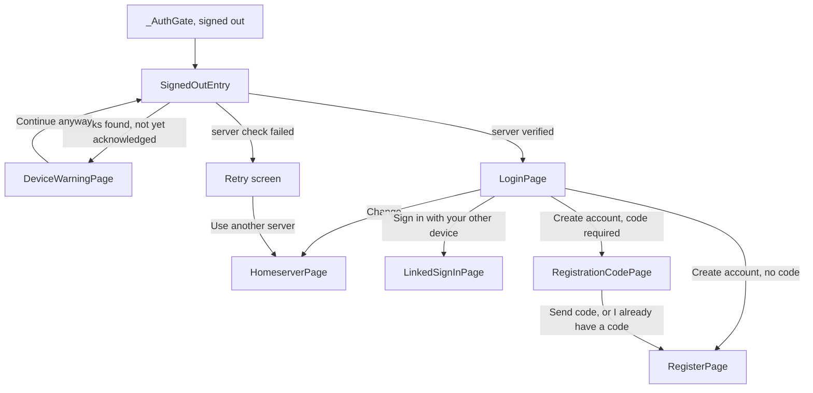
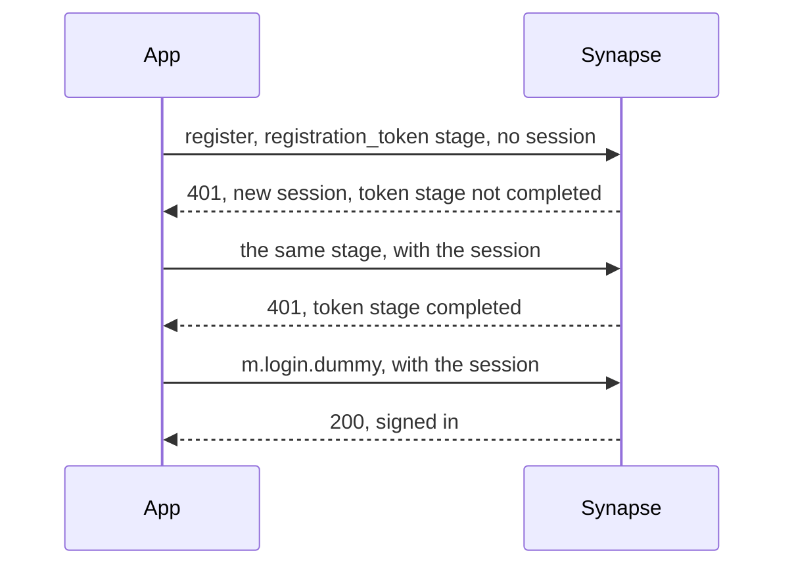

# Authentication

The signed-out side of the app and the account lifecycle: choosing a server,
signing in with a password or with a code from another device, signing up
with an emailed code, keeping the session alive with refresh tokens, signing
out and deleting the account. The device safety check and the password rules
live here too.

There is no repository or local session model. Screens call the Matrix SDK
directly, and the `Client`, its login state and `client.userID` are the
source of truth. Protocol logic is kept in pure functions in
`lib/core/matrix/`, so no widget holds any. Routing (`_AuthGate`) and the
sign-out wipe are in `app-foundation.md`; the device list and verification
are in `security-verification.md`.

## Architecture

### Signed-out screens

| Piece | Role |
|---|---|
| `SignedOutEntry` | What `_AuthGate` shows when signed out. On Android it shows the device warning first, then `LoginPage` once the server is verified, or a retry screen that also offers another server. |
| `homeserverProvider` | An `AsyncNotifier<Uri>` holding the verified server. Its build checks the default, `zuno.chat`, in every build mode. `use(uri)` verifies a typed server and adopts it on success. |
| `HomeserverPage` | Pushed from "Change" or from the retry screen. Continue runs `use()` and pops on success. |
| `LoginPage` | Username and password, the link to sign in with another device, and "Create account" when the probe allows it. The footer names the server with "Change". It is the root's content, so after a sign-in the gate swaps it out; it pops nothing itself. |
| `LinkedSignInPage` | Scans a sign-in code with the shared `QrScannerPage`, or takes the token typed, then signs in with `m.login.token`. |
| `RegistrationCodePage` | Asks for an email address and has the server mail a sign-up code. Shown only when the server's registration flow needs a code. "I already have a code" skips the send. |
| `RegisterPage` | Username, password and confirmation, plus a code field when `requiresCode` is set. |
| `auth_scaffold.dart` | The shell every signed-out screen shares: the logo, a card holding the form, and a footer for actions that are not the form's own (Create account, the server, the terms). It scrolls as one, so it stays usable above the keyboard. |
| `password_field.dart` | `PasswordField` and the `PasswordReveal` mixin: one show/hide toggle per page. While a password is shown, screenshots are blocked (`FLAG_SECURE`, the iOS cover); hiding it or leaving the page restores the person's own setting. |
| `retry_wait.dart` | The `RetryWait` mixin, which holds a submit for as long as a rate limit said. |

### Supporting logic (`lib/core/matrix/`)

| File | Role |
|---|---|
| `registration_support.dart` | The registration probe, the form's input checks, and the UIA stage machine: the pure `nextRegistrationStep` (which stage to send next, "the code was refused" or "stop") and `runRegistration`, which drives `client.register` until the flow completes |
| `registration_code_request.dart` | The one call that asks the server for a sign-up code, plus its status-to-outcome mapping |
| `linked_sign_in.dart` | Encodes, decodes, mints and redeems sign-in codes |
| `session_refresh.dart` | `refreshSession`, the client's `onSoftLogout` handler |
| `homeserver_input.dart` | Parses and validates the server field, and renders a `Uri` back the way a person would type it (`homeserverInputText`) |
| `server_name.dart` | The account's Matrix server name, which is not the API host (Decisions) |
| `username_field.dart` | `signupUsernameChars` and the input formatters every username field shares |
| `auth_error_message.dart` | Maps every login, registration, server, sign-up code and deletion refusal to user-facing copy, and owns `retryWaitFor` |

In Settings, `SignInAnotherDevicePage` (opened from Your devices) mints
sign-in codes, `ChangePasswordDialog` changes the password, and
`DeleteAccountTile` sits on the Settings root, below Sign out. The
password rules (`lib/core/security/password_strength.dart` and
`password_strength_bar.dart`) are shared by registration, change password
and the security phrase in `secure_backup_page.dart`.

## Flows

### Sign-in and session refresh

Every sign-in (password, code from another device, registration) runs
inside `SignInInFlight.during`, which keeps the signed-out screens up until
the SDK call returns (Decisions). It also passes `refreshToken: true`: the
homeserver issues short-lived access tokens, so every session refreshes,
with `refreshSession` as the client's `onSoftLogout`. Which refusals end a
session, and why a refusal is retried once, are under Decisions.

### Registration

1. **Probe.** A raw POST of an empty body to `/_matrix/client/v3/register`,
   read for its refusal. A `401` whose `flows` include one made only of
   `m.login.dummy` and `m.login.registration_token` is `available`; a `401`
   with only other flows (captcha, email or phone verification) is
   `unsupportedFlow`; a `403` is `disabled`; anything else, offline included,
   is `unknown`. Only `available` shows "Create account".
   `requiresRegistrationToken` is true when every completable flow needs a
   code, and it alone decides whether the email screen appears.
2. **Code.** An unauthenticated `POST /_synapse/client/zuno/register/token`
   with a JSON `{email}` body. The `zuno_register` Synapse module mails a
   single-use registration token. `202` means go on; `400` or `413` is a bad
   address; `404` or `503` means sign-up is closed (a module without mail
   settings registers no route); `429` is rate limited; anything else is a
   server error the person can retry. A light local check keeps obvious
   typos off the wire, but the module is the real validator. There is no
   automatic retry: the button is the retry. The UI always says "code"; the
   wire and the Dart code say registration token.
3. **Register.** `runRegistration` sends one UIA stage per
   `client.register` call, with a bounded number of calls, each next stage
   chosen by `nextRegistrationStep`. The first call carries no session, and
   when a code is required the token stage goes first. Without a code it is
   a single `m.login.dummy` call.

`RegistrationCodePage` stays on the stack under `RegisterPage`, so "Send a
new code" is a pop and the typed address survives. Against Synapse, a
registration with a code takes three round trips:

### Sign-in on another device

| Side | What happens |
|---|---|
| Signed-in device | `SignInAnotherDevicePage` asks for the password (UIA), then mints a login token (`issueLinkedSignInCode`, MSC3882). It shows a QR code holding `ZUNO-SIGN-IN 1 <server name> <token>`, and the token as text to type, until the server's expiry. Screenshots are blocked while it is open. `M_UNRECOGNIZED` means the server cannot make codes. |
| New device | `LinkedSignInPage` scans the QR code, or takes the token typed. It signs in with `m.login.token`. `M_FORBIDDEN` here means an invalid or expired code, not a wrong password. |

### Sign-out and account deletion

| Path | Steps, in order |
|---|---|
| Sign out (Settings root; its dialog is in `settings.md`) | `stopAllNotificationDelivery`, then `client.logout()` |
| Sign out this device (Your devices) | The same as Sign out |
| Delete account (`DeleteAccountTile`) | Warning dialog, typed username, UIA password, `deactivateAccount(erase: true)`, best-effort push teardown, then `client.clear(reason: logout)` |

- **Sign-out stops push delivery while the access token still works**:
  afterward the server would keep pushing to an endpoint nobody listens to.
  What `stopAllNotificationDelivery` tears down is in `notifications.md`.
  Any new sign-out path keeps this order.
- **Deletion clears instead of calling `logout()`**, whose server call would
  only fail against the token deactivation just killed. Both paths end in
  `client.clear`, which flips `isLoggedInProvider` and triggers the
  `_AuthGate` wipe; neither cleans local data itself. Keep every path ending
  there.
- **The typed confirmation is the username part of the Matrix ID** (no `@`,
  no server). It is friction on purpose, beyond what UIA already asks,
  because nothing undoes a deletion.

### Device safety (Android only)

`SignedOutEntry` checks the device before the first sign-in. On platforms
without `deviceSafetyChecks` the check returns no risks.

| Piece | Role |
|---|---|
| `DeviceSafety.kt` (`zuno/device_safety`, `check`) | Gathers the signals off the main thread: an attested throwaway Keystore key, one `getprop` dump, `su` paths, root manager packages (listed in the manifest's `<queries>`) and `Build.TAGS` |
| `RootOfTrustParser.kt` | A minimal DER reader for `deviceLocked` and `verifiedBootState` in the hardware-enforced root of trust (tag 704); a software-level attestation is ignored |
| `DeviceSafetyDecision.kt` | The pure verdict, `unlockedBootloader` and `rooted` |
| `deviceRisksProvider` | Runs the check once per process; any failure, or no answer within a short budget, is an empty set |
| `DeviceWarningPage` | A plain view of the risks found and "Continue anyway"; `deviceWarningAcknowledgedProvider` persists the tap |

## Decisions

### Server and sign-in

- **Any build can use another server; `zuno.chat` is the default.**
  Sign-in is the root screen and the server is a "Change" away, in release
  builds too.
- **"Change" pushes the server screen rather than popping to it.**
  `LoginPage` is always the root, and the server screen is a modal step
  that pops back, so nothing is rebuilt and the probe re-runs in place.
- **A failed server check restores the previous homeserver.** The SDK's
  `checkHomeserver` sets `client.homeserver` to null on failure, which would
  leave the sign-in screen underneath unable to sign in, so `use()` puts the
  previous value back before rethrowing.
- **A server name is not the homeserver host.** `checkHomeserver` follows
  `.well-known` and replaces `client.homeserver` with the delegated base
  URL, so that host cannot stand in for the server name. User IDs and
  aliases take the domain of `client.userID`; signed out, the screens show
  the domain that was typed or the default, since no account exists yet.
  Only module URLs (calls, sign-up codes) and push derive from
  `client.homeserver`, because those endpoints live on the API host.
- **A sign-in code never switches the server.** The code carries the
  server name of the account that minted it, and the new device refuses a
  mismatch, naming the server. Switching automatically would let a hostile
  code sign someone into an attacker's server. A typed code carries only
  the token and always uses the chosen server.
- **Sign-in codes are plain text, scanned in-app only.** A URL would open
  from the system camera and leave the token in its scan history and in
  browser history.
- **A sign-in leaves the signed-out screens only once its SDK call
  returns.** The SDK reports `loggedIn` before its first sync, so the gate
  would otherwise show an empty chat list mid-call and onboarding would
  decide on pre-sync facts. `client.login` can give up waiting for that
  sync, so the chat list and onboarding also wait for `firstSyncProvider`
  (`app-foundation.md`). While the request runs, Back is blocked on the
  pushed `RegisterPage` and `LinkedSignInPage`: the request cannot be
  cancelled, and a popped page can no longer run its own `popUntil`, which
  would strand a signed-in person on a signed-out screen.
- **One message for a wrong username or a wrong password.** Matrix itself
  does not say which one is wrong, to prevent account enumeration, and the
  app keeps that ambiguity.

### Sessions

- **Only `M_UNKNOWN_TOKEN` and `M_FORBIDDEN` end a session.** Any other
  Matrix error from `/refresh`, such as a rate limit or a 500, becomes a
  plain exception. The SDK answers a `MatrixException` from the handler by
  clearing the local session, so a transient server fault would otherwise
  wipe the device's keys. Only the app's client clears; background clients
  never do (`app-foundation.md`).
- **A refused refresh is retried once if the stored token changed.** The
  app and a push engine's client share one refresh token, and the server
  rotates it on every use, so the loser of that race holds a dead token.
  The handler waits, re-reads the token the other isolate stored, and
  retries with it. Only an unchanged token counts as a verdict.

### Registration and sign-up codes

- **The probe is a raw HTTP POST, not `Client.register`.** The SDK method
  throws on `401` and signs the caller in on success; neither fits a probe
  that only wants to read the refusal. A raw POST is also mockable with
  `MockClient`.
- **Three refusal outcomes, not two.** `unsupportedFlow` and `disabled` look
  the same on screen (no button), but `unsupportedFlow` is a different
  server state and the one that matters once a captcha or terms stage is
  built.
- **`registrationSupportProvider` is an `autoDispose` provider, not an
  `initState` fetch.** It is dropped with `LoginPage`, it throws on
  `unknown` so Riverpod's backoff asks again (a cached failure would hide
  "Create account" until restart), and it watches `homeserverProvider`, so
  a changed server is probed afresh while `LoginPage` stays mounted. Tests
  override it, since a widget test's fake clock never resumes a real HTTP
  future.
- **No fallback line when sign-up is unavailable.** There is no web sign-up
  to point to, and a line the reader cannot act on does not belong on the
  screen.
- **Each real attempt opens its own UIA session.** Synapse binds a session
  to the exact body that opened it, so the probe's session (opened with an
  empty body) is never reused. `isUiaSessionMismatch` recognizes the
  "changed during the UI authentication session" refusal by its message,
  since Synapse gives it no distinct errcode, and restarts once. It is
  best-effort: if it ever misses, registration fails as it would without
  it.
- **A stage refused before any session was sent is resent with the session
  the server just opened, whatever the stage.** Synapse does not examine a
  registration token until a session exists: without one it answers
  `M_MISSING_PARAM` with the stage absent from `completed`. A code it
  checked and rejected looks the same apart from the errcode, so only the
  resend earns the right to blame the code. After the resend, a token stage
  that still fails is reported as a refused code; any other stage stops the
  flow with the server's error.
- **A refused code is detected from `completed`, not from the errcode.** A
  bad code and "one more stage needed" are both a `401` carrying `flows` and
  a `session`, so `requireAdditionalAuthentication` cannot tell them apart.
  The stage just sent missing from `completed` is what means the server
  rejected it; Synapse's `M_UNAUTHORIZED` is not specific enough to rely on.
- **An interrupted sign-up resumes its session** (`RegistrationProgress`).
  A dropped connection after the code stage leaves the code spent in that
  session, so starting over would report "code not valid". The session is
  reused only while the username, password and code are unchanged, because
  Synapse binds it to the first body, password included. It restarts once
  if the server forgot or replaced it, and a taken username after a network
  failure tries signing in with the same credentials. This is best-effort:
  it is built from Synapse's documented behavior, not verified against a
  live server.
- **Nothing negotiates the code alphabet or lifetime; both mirror
  `zuno_register`.** The code field uppercases its input and filters it to
  `A-HJ-NP-Z2-9`, since Synapse matches the token exactly, and the copy says
  24 hours (the module's `token_ttl`). If the server ever widens the
  alphabet, the field silently truncates what people type, so the two move
  together.
- **A `202` promises no delivery.** The module also answers `202` when it
  suppressed a send under its per-address rate limit, so the screen after
  it says where to look for the code, never that one was sent.
- **An email address buys a code and nothing else.** No account is tied to
  it, and there is still no email reset for a lost password.
  `../brand-voice.md` holds the claim in the form the app may make it.
- **Creating an account accepts the terms, and `RegisterPage` says so**,
  with links to the terms and the privacy policy. Google Play requires
  acceptance before anyone can post. There is no checkbox, and the line
  appears only on `zuno.chat`, since another server's terms are not Zuno's.

### Passwords and usernames

- **Password rules follow NIST SP 800-63B, not composition rules.** The
  floor is 12 characters, matching Synapse's `minimum_length` and counted
  in code points as the homeserver counts them; a lower app floor would
  push the refusal to the server, in wording the app cannot shape. The UI
  steers toward 15. There are no character-class requirements, since
  800-63B forbids them: they produce `Password1!` and block strong
  passphrases. Character variety raises the score but is never required,
  and a weak password that passes the gate is shown as weak and allowed.
- **The gate scores what is left once the guessable parts are gone.** An
  exact-match list of common passwords misses padded variants. So common
  words, years, keyboard walks and character runs are masked out, the rest
  is scored with a small allowance per masked span, and anything below a
  minimum strength is refused. That refuses a known-bad password with
  padding (`summer2026!!`) while three everyday words pass as weak. A
  password that is or contains the username is checked first, as the more
  specific diagnosis, then the common-password list, then the score.
- **"Confirm password" stays, beside the reveal toggle.** There is no email
  reset, so a typo at sign-up loses the account.
- **Two character sets for usernames.** `signupUsernameChars` (`a-z0-9._`)
  is what a new Zuno account may be called: stricter than Matrix, because a
  username gets spoken aloud, typed on a phone and put in a URL, and a slash
  is the easiest of those to get wrong. It filters every field where a local
  username is typed (sign-up, starting a chat, inviting) as the person
  types, through shared input formatters. `matrixLocalpartChars`
  (`matrix_ids.dart`, adding `= - / +`) is what any localpart may hold, and
  mentions match it, so a federated or admin-created name still resolves.
- **`LoginPage` lowercases the username but never filters it**, so a full
  `@user:server` and older names with now-disallowed characters still sign
  in, and an auto-capitalizing phone keyboard does no harm.
- **New usernames are stricter than Synapse on purpose.** They cannot start
  with an underscore (reserved for bridges), need at least one letter
  (Synapse refuses all-digit names, and "needs a letter" is a rule a person
  can follow), and must keep the user ID within 255 characters. Each is
  checked as the person types; otherwise the server would answer with a
  generic "not allowed".

### Autofill and keyboard

- **Every text field states its autofill choice.** Flutter leaves autofill
  on unless `autofillHints` is `null`: an empty list still opens a session
  with the password manager on focus and hands it the field's text, message
  drafts included. Credential fields name real hints, every other field
  passes `null`, and `autofill_opt_in_test.dart` fails on a field that says
  nothing.
- **The sign-up code field sits outside the `AutofillGroup` with `null`
  hints**, so a password manager cannot capture a one-time code.
- **Re-auth prompts never offer a save; change password offers one only
  after the server accepts.** The UIA password prompt, the session-token
  tile and recovery-code entry sit in an `AutofillGroup` that cancels on
  dispose. `ChangePasswordDialog` calls `finishAutofillContext()` only on
  success, and its read-only username field lets the manager update the
  right entry.
- **The security phrase fields opt out of autofill.** A manager would offer
  the account password there, and the homeserver sees that password at
  login, so reusing it would hand the server the key backup.
- **A rate limit holds the submit for as long as the server said.**
  `retryWaitFor` reads `retry_after_ms`, then the `Retry-After` header,
  within a cap. The hold lives in the submit handler, not only on the
  button, because the keyboard's Done calls the handler directly.

### Account deletion

- **Deactivation always sets `erase: true`, with no toggle.** Erasure is
  best-effort redaction for people who join a room later. It does not
  retract messages from anyone who already has them, nor from other
  homeservers. A toggle would present that partial guarantee as a stronger
  promise than it is.
- **Push teardown runs after a successful deactivation, unlike sign-out.**
  Deactivation sits behind a password prompt that can still fail or be
  cancelled, and tearing down push first would silence a live account for
  nothing. A teardown request racing the now-dead token is harmless: a
  deactivated account receives no pushes to lose.

### Device safety

- **The warning informs; it never blocks.** It shows on the signed-out
  screen until "Continue anyway" is tapped once, then never again. A failed
  or slow check shows nothing: a false alarm on a first launch costs more
  than a miss, and someone hiding root on purpose already knows.
- **Unlocked means an attested unlocked or unverified boot, or boot
  properties saying `orange`, `red` or unlocked.** A relocked custom system
  (attested `SelfSigned`, "yellow") counts as safe. The two sources are
  OR-ed, so a spoofed attestation with honest properties still warns, and a
  device without attestation falls back to its properties. The certificate
  chain is not verified: whoever could forge it locally could hook the app
  anyway. Play Integrity is out: it needs Google and a server, and it fails
  relocked custom systems.
- **The check is lazy.** Only `SignedOutEntry` watches it, and only until
  the warning is acknowledged. `main()` cannot know whether a session exists
  before the client is up, so running it there would mint an attestation
  key on every signed-in cold start. `ZunoSplash` holds while it runs.

## Gotchas

- Parse server input only with `parseHomeserverInput`. `Uri.https(x)`
  rejects any input with a slash and reads a pasted `@user:example.org` as a
  host with a port. Input with spaces is percent-encoded by a naive `Uri`,
  then fails much later as an opaque failed host lookup, so validation must
  happen before the network call. Only `https` is accepted.
- Route every refusal through `auth_error_message.dart`, and add new copy
  beside its existing mappers rather than in a second formatter. These
  screens show every line they are given, so a raw `FormatException` leaks
  a caret diagram to the person.
- The server screen and the sign-in screen word the same network failure
  differently: on the server screen the likely cause is the address, on
  sign-in the connection. Do not share one generic string.
- A server's `flows` may list a captcha or terms stage as optional beside
  `m.login.dummy`; any one completable flow is enough, so the app routes
  around the harder stage. A mandatory captcha or terms stage makes the
  probe `unsupportedFlow` and hides "Create account" entirely.
- On Android, `enableSuggestions: false` adds the visible-password variation
  to the input type, which replaces the `@` and `/` keys. Email and URL
  fields therefore set only `autocorrect: false`.
- Flutter gives an autofill service only a field's hints, hint text and
  value: no input type, no label. A field without hints is never
  recognized, which is why re-auth prompts name `AutofillHints.password`.
- Nothing on the submit side can force a save offer. When the autofill
  service answers the first focus with nothing, Android ends the session at
  once, ignores every later value, and `finishAutofillContext()` commits
  nothing. An explicit save needs Credential Manager, which is not built.
- Close the keyboard before every submit or push. A popped route hands
  focus back to the field that had it, so without the unfocus the keyboard
  comes back on return from Change or Create account.
- After a sign-out the server resets to the default: `_AuthGate` invalidates
  `homeserverProvider`, because `clear()` nulls `client.homeserver`.
- `test-keys` and `ro.debuggable=1` count as `rooted`. Some cheap stock
  systems ship `test-keys`; the warning is warranted (anyone can sign a
  system update for them), but the label is approximate.
- `DeleteAccountTile` touches the client only inside its tap handler, where
  it subscribes to `onUiaRequest` just for the request and cancels after.
  `SettingsPage` tests render with no client, and `matrixClientProvider`
  throws until `main.dart` overrides it.

## Testing

- A test that renders a signed-out screen overrides `homeserverProvider`
  with `FixedHomeserver` (`test/helpers/`), or its build calls
  `checkHomeserver` over the real network.
- A test that pumps `SignedOutEntry` or a signed-out `ZunoApp` overrides
  `deviceRisksProvider`, or the first frames are the splash.
- `nextRegistrationStep` is table-tested, and `runRegistration` runs against
  a `Client` with a `MockClient`, so protocol changes need no widget.
  `RegisterPage` tests never reach success (a `200` drags in login and
  sync); stage sequences are asserted on the request bodies.
- The device verdict and the DER reader have JUnit tests
  (`android/app/src/test/`).

## Extending

- **A new UIA stage (captcha, terms)**: add it to
  `supportedRegistrationStages`, give `nextRegistrationStep` the input it
  needs, and add its UI to `RegisterPage`. Ship the client stage before
  turning the requirement on server-side; a server that demands a stage the
  app cannot complete hides "Create account". Synapse's
  `registration_requires_token` follows the same order.
- **A new password-gated flow** reuses `password_strength.dart` rather than
  inventing rules; the NIST reasoning applies wherever Zuno asks someone to
  pick a secret.

## Not built

- Data export ("download my data"), which would sit beside Delete account.
- An explicit password-manager save (Credential Manager).
- The sign-up code is deliberately minimal: no resend countdown, no link
  from the email into the app, the code is not remembered, no invite
  allowlist, and no delivery feedback.
