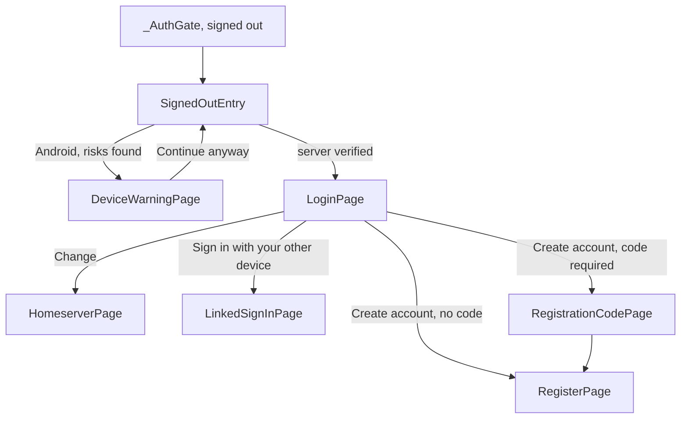
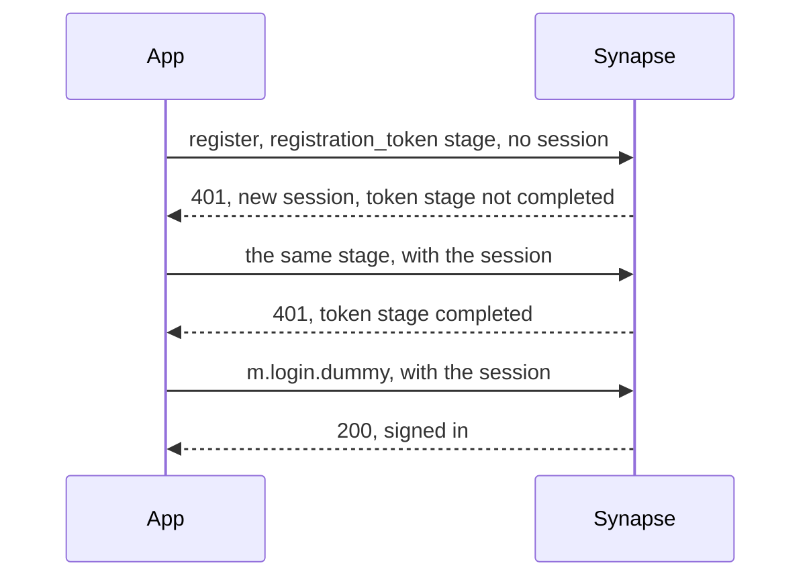

# Authentication

The signed-out side of the app and the account lifecycle: choosing a server,
signing in with a password or with a code from another device, signing up
with an emailed code, keeping the session alive with refresh tokens, signing
out and deleting the account. The device safety check and the password rules
live here too.

There is no repository or local session model. Screens call the Matrix SDK
directly, and the `Client` and its login state are the source of truth.
Protocol logic lives in pure functions in `lib/core/matrix/`, not in
widgets. Routing (`_AuthGate`) and the sign-out wipe are in
`app-foundation.md`; the device list and verification are in
`security-verification.md`.

## Architecture

| Piece | Role |
|---|---|
| `SignedOutEntry` | What `_AuthGate` shows when signed out: the device warning first on Android, then `LoginPage` once the server is verified, or a retry screen. |
| `homeserverProvider` | Holds the verified server, `zuno.chat` by default in every build. `use(uri)` verifies a typed server and adopts it on success. |
| `LoginPage` | The root signed-out screen: username and password, sign-in with another device, "Create account" when the server allows it, and "Change" for the server. |
| `LinkedSignInPage` | Signs in with a code from another device, scanned or typed. |
| `RegistrationCodePage` | Has the server email a sign-up code. Shown only when the server's registration flow needs one. |
| `RegisterPage` | Username, password and confirmation, plus the code when one is required. |
| `registration_support.dart` | The registration probe, input checks and the UIA stage machine (`nextRegistrationStep`, driven by `runRegistration`). |
| `linked_sign_in.dart` | Encodes, decodes, mints and redeems sign-in codes. |
| `session_refresh.dart` | `refreshSession`, the client's `onSoftLogout` handler. |
| `homeserver_input.dart`, `server_name.dart` | Parse the server field, and derive the account's server name, which is not the API host. |
| `auth_error_message.dart` | Maps every auth refusal to user-facing copy. |
| `device_safety.dart` + `DeviceSafety.kt` | The Android root and bootloader check behind the device warning. |

In Settings, `SignInAnotherDevicePage` mints sign-in codes,
`ChangePasswordDialog` changes the password and `DeleteAccountTile` deletes
the account. The password rules (`password_strength.dart`) are shared by
registration, change password and the security phrase.

## Flows

### Sign-in and session refresh

Every sign-in (password, code from another device, registration) runs
inside `SignInInFlight.during`, which keeps the signed-out screens up until
the SDK call returns. Every sign-in also asks for a refresh token, because
the homeserver issues short-lived access tokens, and `refreshSession`
renews the session on soft logout.

### Registration

1. **Probe.** A raw POST of an empty body to `/_matrix/client/v3/register`,
   read for its refusal. A `401` offering a flow made only of
   `m.login.dummy` and `m.login.registration_token` is `available`, other
   flows are `unsupportedFlow`, a `403` is `disabled`, and anything else is
   `unknown`. Only `available` shows "Create account", and whether every
   completable flow needs a code decides whether the email screen appears.
2. **Code.** `POST /_synapse/client/zuno/register/token` with `{email}`
   asks the `zuno_register` Synapse module to mail a single-use
   registration token. `202` means go on; a `404` or `503` means sign-up is
   closed, since a module without mail settings registers no route. The UI
   always says "code"; the wire and the Dart code say registration token.
3. **Register.** `runRegistration` sends one UIA stage per
   `client.register` call, the token stage first when a code is required.
   Without a code it is a single `m.login.dummy` call.

Against Synapse, a registration with a code takes three round trips:

### Sign-in on another device

| Side | What happens |
|---|---|
| Signed-in device | `SignInAnotherDevicePage` asks for the password, mints a login token (MSC3882) and shows it as a QR code holding `ZUNO-SIGN-IN 1 <server name> <token>`, and as text to type, until it expires. |
| New device | `LinkedSignInPage` scans or takes the token and signs in with `m.login.token`. |

### Sign-out and account deletion

| Path | Steps, in order |
|---|---|
| Sign out (Settings, or this device in Your devices) | `stopAllNotificationDelivery`, then `client.logout()` |
| Delete account | Warning, typed username, password, `deactivateAccount(erase: true)`, best-effort push teardown, then `client.clear()` |

Both paths end in `client.clear`, which triggers the `_AuthGate` wipe;
neither cleans local data itself, and every new path must end there too.
What the push teardown does is in `notifications.md`.

## Decisions

### Server and sign-in

- **Any build can use another server; `zuno.chat` is the default**, a
  "Change" away from the sign-in screen, in release builds too.
- **A server name is not the homeserver host.** `checkHomeserver` follows
  `.well-known` to the API host, so user IDs and aliases take the domain of
  `client.userID`, and only module URLs and push use `client.homeserver`.
- **A sign-in code never switches the server.** The code names the server
  that minted it and a mismatch is refused, because switching automatically
  would let a hostile code sign someone into an attacker's server.
- **Sign-in codes are plain text, scanned in-app only.** A URL would open
  from the system camera and leave the token in scan and browser history.
- **A sign-in leaves the signed-out screens only once its SDK call
  returns.** The SDK reports `loggedIn` before its first sync, so the gate
  would otherwise show an empty chat list and onboarding would decide on
  pre-sync facts.
- **One message for a wrong username or a wrong password**, keeping
  Matrix's ambiguity against account enumeration.

### Sessions

- **Only `M_UNKNOWN_TOKEN` and `M_FORBIDDEN` from `/refresh` end a
  session.** The SDK clears the local session on any `MatrixException` from
  the handler, so other errors become plain exceptions, or a transient
  server fault would wipe the device's keys.
- **A refused refresh is retried once if the stored token changed.** The
  app and a push engine's client share one refresh token that the server
  rotates on every use, so the loser of that race re-reads the winner's
  token and retries.

### Registration and sign-up codes

- **The probe is a raw HTTP POST, not `Client.register`**, which throws on
  `401` and signs the caller in on success.
- **Each real attempt opens its own UIA session.** Synapse binds a session
  to the body that opened it, so the probe's session is never reused, and a
  "changed during the UI authentication session" refusal restarts once.
- **A stage refused before any session existed is resent with the new
  session.** Synapse examines a registration token only once a session
  exists, so only the resend can blame the code.
- **A refused code is detected from `completed`, not the errcode.** A bad
  code and "one more stage needed" are both a `401` with `flows` and a
  `session`; the sent stage missing from `completed` is the only reliable
  sign.
- **An interrupted sign-up resumes its session** while the username,
  password and code are unchanged, because the code is already spent in it.
  This is built from Synapse's documented behavior, not verified live.
- **The code field mirrors `zuno_register`.** It uppercases and filters
  input to the module's alphabet (`A-HJ-NP-Z2-9`), and the copy states its
  24-hour lifetime, so the field and the module must change together.
- **A `202` promises no delivery**, because the module also answers `202`
  when its rate limit suppressed the send.
- **An email address buys a code and nothing else.** No account is tied to
  it, and there is no email password reset.
- **Creating an account accepts the terms, and `RegisterPage` says so**, as
  Google Play requires; the line appears only on `zuno.chat`.

### Passwords and usernames

- **Password rules follow NIST SP 800-63B, not composition rules.** The
  floor is 12 characters to match Synapse's `minimum_length`, and there are
  no character-class requirements, since they produce `Password1!` and
  block strong passphrases.
- **The gate scores what is left once the guessable parts are gone.**
  Common words, years, keyboard walks and runs are masked out before
  scoring, so a padded known-bad password (`summer2026!!`) is refused while
  three everyday words pass as weak.
- **"Confirm password" stays**, because with no email reset a typo at
  sign-up loses the account.
- **New usernames use a stricter set than Matrix.** `signupUsernameChars`
  (`a-z0-9._`, at least one letter, no leading underscore) filters every
  field where a username is typed, since names get spoken, typed on phones
  and put in URLs. Mentions match the wider `matrixLocalpartChars`, so
  federated names still resolve.
- **`LoginPage` lowercases the username but never filters it**, so a full
  `@user:server` and older names still sign in.

### Autofill

- **Every text field states its autofill choice.** Flutter leaves autofill
  on unless `autofillHints` is `null`, which would hand message drafts to a
  password manager; `autofill_opt_in_test.dart` fails on a field that says
  nothing.
- **Only an accepted credential is offered for saving.** Re-auth prompts
  cancel their autofill context, and change password finishes it only on
  success.
- **The security phrase fields opt out of autofill**, because a manager
  would offer the account password there, and the homeserver sees that
  password at login.

### Account deletion

- **Deactivation always erases, with no toggle.** Erasure only hides
  messages from people who join later, and a toggle would present that as a
  stronger promise than it is.
- **The typed username is friction on purpose**, because nothing undoes a
  deletion.
- **Sign-out stops push before `logout()`, deletion after deactivating.**
  Sign-out must tear down while the token still works, while deletion can
  still fail at its password prompt, and tearing down first would silence a
  live account.

### Device safety (Android only)

- **The warning informs; it never blocks.** It shows until "Continue
  anyway" is tapped once, and a failed or slow check shows nothing, since a
  false alarm costs more than a miss.
- **Unlocked means an attested unlocked boot or boot properties saying so.**
  The two sources are OR-ed, a relocked custom system counts as safe, and
  Play Integrity is out because it needs Google and a server.
- **The check is lazy.** Only `SignedOutEntry` runs it, so a signed-in cold
  start never mints an attestation key.

## Gotchas

- Parse server input only with `parseHomeserverInput`, because a naive
  `Uri` misreads `@user:example.org` and fails late on spaces.
- A failed `checkHomeserver` nulls `client.homeserver`, so `use()` restores
  the previous server before rethrowing.
- After a sign-out the server resets to the default, because `clear()`
  nulls `client.homeserver` and `_AuthGate` invalidates
  `homeserverProvider`.
- Route every refusal through `auth_error_message.dart`, because these
  screens show any text they are given, raw exceptions included.
- A mandatory captcha or terms stage hides "Create account", so ship the
  client stage before turning a requirement on server-side.
- On Android, `enableSuggestions: false` swaps out the `@` and `/` keys, so
  email and URL fields set only `autocorrect: false`.
- Nothing on the submit side can force a password-manager save on Android;
  that needs Credential Manager.
- A rate limit holds the submit in its handler, not only on the button,
  because the keyboard's Done calls the handler directly.
- `DeleteAccountTile` touches the client only in its tap handler, because
  `SettingsPage` tests render without one.
- Tests rendering a signed-out screen override `homeserverProvider` with
  `FixedHomeserver`, and `deviceRisksProvider`, or they hit the network or
  stall on the splash.

## Not built

- Data export ("download my data"), which would sit beside Delete account.
- An explicit password-manager save (Credential Manager).
- Sign-up code extras: resend countdown, a link from the email into the
  app, an invite allowlist and delivery feedback.
