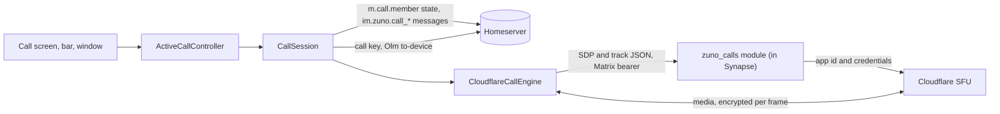
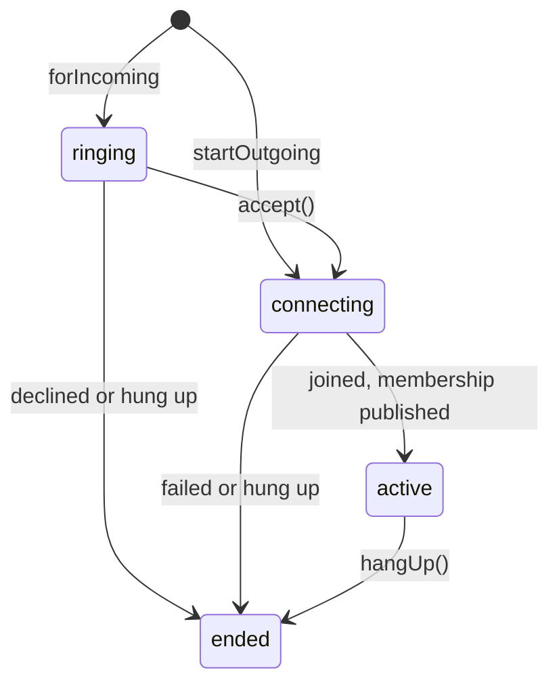
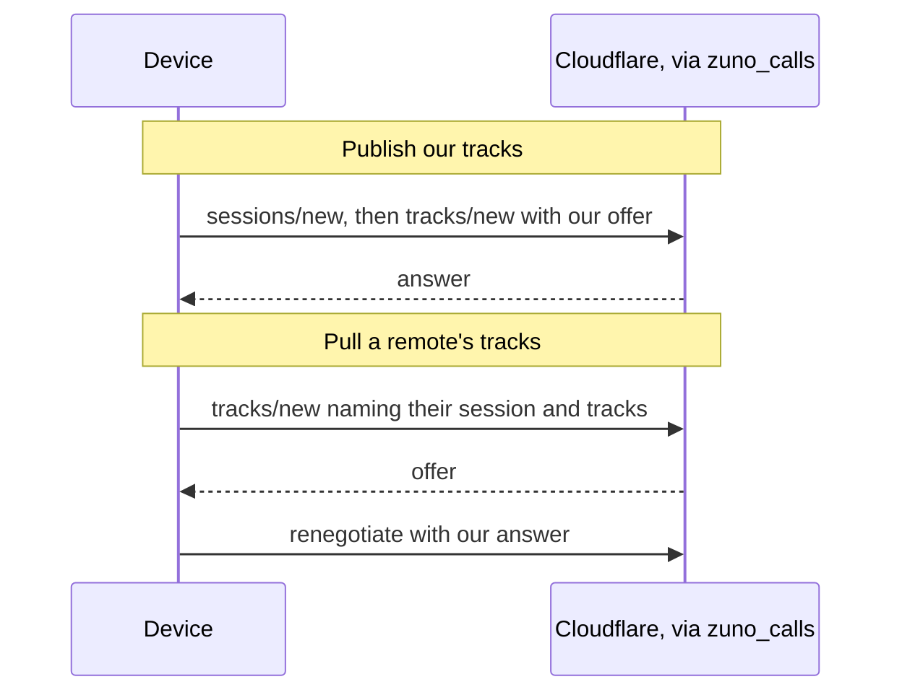
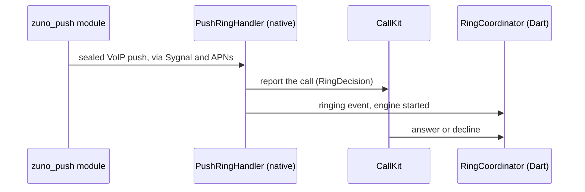

# Calls

Voice and video calls, one-to-one and group (6 people at most), always
routed through Cloudflare's SFU behind the `zuno_calls` Synapse module.
There is no peer-to-peer mode, by design. Signaling is a custom layer
loosely modeled on MatrixRTC (MSC3401), not a conformant implementation.
Media is encrypted per frame with a random key for each call. Android rings
with a native `CallStyle` notification and keeps the call in a foreground
service. iOS rings through CallKit: from sync while Zuno runs, and from a
server-sent VoIP push while it is closed.

## Architecture

| Part | Where | Role |
|---|---|---|
| `CallSession` | `lib/core/calls/matrixrtc/` | Matrix-side signaling and the call lifecycle: invite, decline, ring timeout, `m.call.member` publish and reconcile, the call key, hang-up and the summary |
| `CallEngine` → `CloudflareCallEngine` | `lib/core/calls/cloudflare/` | Media: one peer connection and one Cloudflare session per call, with every participant's tracks muxed onto it |
| `LocalMedia` | same | Our microphone and camera: opened at call start, muted, switched and closed; the engine publishes what it holds |
| `calls_module.dart` | same | Speaks Cloudflare's own API to the module, which adds the app id and credentials server-side. Only signaling goes through it; media flows straight between the device and the SFU |
| `ActiveCallController` | `lib/core/calls/` | The device side of the active call for its whole life: renderers, audio route, ringback, foreground service, wake lock, lock-screen display, ear sensor, picture-in-picture and teardown. It starts when `activeCallProvider` gets a session, with no frame |
| `CallPage` → `CallView`, `CallLayer` | `lib/features/calls/presentation/` | `CallPage` is the call screen and only draws. `CallLayer` sits above the Navigator and shows a minimized call and Android picture-in-picture. `CallView` only lays out plain values |
| Ring routing | `lib/core/calls/notifications/`; iOS `RingCoordinator` | Presenting, cancelling, answering and declining rings |

**Platform seams** (`lib/core/calls/platform/`). Whatever the OS shows or
plays for a call goes through one of six interfaces, each built by a
`*For(capabilities)` factory that checks `callKit` first
(`app-foundation.md`).

| Seam | Android | iOS |
|---|---|---|
| `IncomingCallPresenter` | `CallStyle` notification with a native ring | CallKit |
| `OngoingCallPresenter` | `CallForegroundService` | No-op: CallKit shows the call |
| `RingbackTonePlayer` | A tone in native `CallAudio` | A native synthesized tone |
| `SystemCall` | No-op | The CallKit call |
| `CallAudioOutput` | Native `CallAudio` owns focus, mode and route | Native routes in CallKit's session |
| `PushRingBridge` | No-op | Binds pushed rings to their calls |

### Call lifecycle

- **Both factories return at once.** Connecting (permissions, the engine,
  the join and the first membership publish) runs in the background, so
  the call screen renders before any of it finishes.
- **Local media opens before the join.** A caller checks the microphone
  permission before it rings anyone, then opens the microphone and camera
  while the invite is sent; answering opens them at once. Joining only
  publishes them, and the session follows the app's lifecycle from the
  moment local media opens.
- **Permissions**: a refused microphone fails the call with the microphone
  message on every platform, and a refused camera starts a video call with
  the camera off.
- **The engine is built at call start and lives as long as the session**,
  so the call screen's controls act from the first frame and a mute or
  camera change made while ringing carries into the call. Every end path
  releases it, and one built after the call ended is released at once.
- **A call ends** as hung up, declined by either side, missed (the
  caller's ring timed out with nobody joined) or failed. A failure carries
  a user-facing message.
- **Ended means torn down locally.** The membership clear and the end
  notice go out after the phase turns ended, and iOS holds a short
  background task once CallKit ends the call so they still leave.
- **A caller that fails after its invite went out ends as a hang-up does**,
  so its summary stops the other side ringing.
- **It also ends, without writing anything, once its room is left** (from
  any device, watched from the start) **or this device is signed out**,
  because neither a left room nor a revoked token takes writes.
- **One call at a time.** Starting or answering is refused while a call
  that has not ended is held, and the call's own room reopens it instead.
- **"Prevent accidental calls"** (on by default, Settings → Chats & calls)
  asks for confirmation before a call starts.

### Signaling

- **`m.call.member` state is the only roster**: one entry per device in the
  call, never a client-local list. Each entry's `fociInfo` carries the
  Cloudflare session, the published tracks and media flags such as
  `videoEnabled`, `encrypted` and `lowBandwidth`. The room's "call in
  progress" banner reads the same state, so a missed ring or a closed app
  still finds the call.
- **Membership is published only once the session listens for to-device
  call keys**, so a key sent in reply is never lost; refreshes before that
  are ignored. After that it is republished periodically and on every
  change, with user toggles coalesced, because state events are permanent
  room history.
- **One serial writer per room carries all of our membership writes**, each
  waited on for a bounded time, and the latest membership is written again
  if a stale write lands late, so a quick redial is never wiped by the
  previous call's clear. A clear is written only if we requested a
  membership.
- **Invite, decline and summary are `im.zuno.call_*` msgtypes** on
  `m.room.message`, so they ride the existing timeline plumbing. Only the
  summary renders.
- **They are sent without a local pending copy, and the chat's not-sent
  retry skips call messages**, so a call that is over is never resent.
- **Every end sends one end notice**, the one signal both sides can rely
  on: the callee learns of an early cancel from it, the caller of a late
  decline.

  | Who ends | Sends |
  |---|---|
  | Anyone with others still in the room's live memberships | Nothing: the last one out posts the summary |
  | A caller whose invite was never delivered | Nothing, so hanging up during the microphone prompt is silent |
  | A callee that never joined | A decline |
  | A callee whose connect failed before it joined | Nothing, so its other phones can still answer |
  | Anyone else | The summary: declined, missed or ended |
- **Declines and answered summaries carry an `m.reference`**, which stays
  cleartext in encrypted rooms, so a push rule keeps them off the push path
  (`notifications.md`). Missed and declined summaries still push, because
  they stop the ring on the callee's other devices.

**Group calls** break assumptions a one-to-one call could get away with:

- Leaving is not ending: whoever is last out, by the room's live
  memberships, posts the summary.
- Any device holding the call key relays it to a newcomer, not only the
  caller.
- The 6-person cap is enforced only on the client, since the module cannot
  tell which call a session belongs to. When simultaneous joins overshoot,
  each device ranks itself by join time and the extras hang up, with no
  coordination needed.

### Media

A publish and a pull run in opposite directions:

| Rule | Why |
|---|---|
| ICE is gathered whole before an offer goes out | Cloudflare's REST signaling takes candidates only inside the offer, so there is no trickle ICE |
| A lost connection rejoins with a new session and peer connection, a few times, before the call ends as "Connection lost" | Cloudflare sessions cannot ICE-restart |
| TURN credentials are minted through the module when the engine is built at call start, and a failed mint means no TURN, not a failed call | Only some networks need TURN |
| A black placeholder stands in whenever the camera is not sending, and a track is advertised only once it has sent bytes | Cloudflare drops a published track that receives no packets for 30 s, and advertising earlier lets someone pull a track the SFU does not have yet |
| Opus goes out without DTX | A muted microphone with DTX sends nothing, so the 30 s rule would drop the audio track |
| Every track swap is `replaceTrack`, never a mid-call re-offer | A re-offer recreates the receive streams, and Android's flutter_webrtc then renders nothing (flutter-webrtc#2124) |
| Android pins VP8, then H264. iOS sets no codec order and gets hardware H264 | Only VP8 has a software fallback on Android, and every receiver decodes both |

**The placeholder** is a tiny native black video, Cloudflare's own pattern
(partytracks sends black video for a device that is off). The video slot
is published at join, and the placeholder fills it in three cases:

- **A voice call**, until it switches to video, which is one way.
- **Camera off**: the camera stops, its light included.
- **The app in the background**, unless a picture-in-picture window keeps
  the camera. Android releases the camera, and local media opened in the
  background leaves it off until the app returns. iOS stops it itself
  (`cameraStopsInBackground`), so the engine keeps the track.

### Quality and data use

The engine samples `getStats()` every few seconds and classifies this
device's connection as good, degraded or poor by incoming loss and RTT. It
moves between tiers with hysteresis, so one bad sample never flaps the
tier.

- **Each tier writes explicit encoder limits** (resolution, frame rate,
  bitrate) to the video sender through `setParameters`, with no
  renegotiation. Weak links lose resolution before smoothness.
- **A remote's `lowBandwidth` caps us at degraded.** We publish it whenever
  our own tier is not good, so one side's struggling downlink stops the
  other from sending more than it can absorb. Audio is never scaled.
- **Low-data calls are on by default, by design** (Settings → Data &
  storage): 360p capture and a 500 kbps cap, so soft video is expected, not
  a bug. The setting is read once per call, since switching mid-call would
  mean re-capturing the camera.

### Encryption

- **One random key per call**, applied per frame with AES-GCM through
  flutter_webrtc's `FrameCryptor`. It is deliberately not the room's
  Megolm session, which follows room membership rather than the call and
  whose ordered ratchet does not suit lossy media.
- **The key travels Olm-encrypted over to-device**, from any device holding
  it to each device that joins. The first valid key wins: one from a
  known, unblocked device of a current participant, looked up only among
  its sender's own devices.
- **The key is never rotated**, since rotating on every departure would
  interrupt everyone's media.
- **Media is gated on keys.** Each local sender owns its frame cryptor,
  tied to the live connection and that sender, and a track is enabled only
  while its current sender has its own cryptor. A remote is pulled only
  once both sides report `encrypted`. There is no unencrypted fallback.
  Until the key lands, the call shows "encrypting".
- **A rejoin wraps the new connection's senders afresh**, and a key that
  lands mid-reconnect is applied to the new connection.

### Call screens

- **One page for the whole call**, always dark. The layout follows the
  call:

  | Situation | Layout |
  |---|---|
  | Waiting, or a one-to-one voice call | Portrait stage: picture, name, one status line |
  | One-to-one, the other camera on | Their camera edge to edge, a self view and floating controls |
  | Three or more people | A two-column grid |

  A new call state extends `CallStatus` and `CallView`, never a new screen.
- **Confirming the other person**: in a one-to-one call, a pill offers to
  confirm someone unconfirmed or changed, once both ends can finish it
  (`security-verification.md`).
- **The buttons and the notice over them (weak connection, or the confirm
  offer) form one bottom dock**, and everything but a full-screen camera
  sits above its measured height, since a fixed reserve under-measures the
  notice at large text sizes.
- **Your own view drags to any corner** and snaps to the nearest, for the
  rest of the call, minimizing included; a new call starts top-right. The
  bottom corners sit above the dock and the top-left one below the name and
  Minimize button, which never move and paint above your view, so it never
  covers them, even on a short landscape screen.
- **One corner drag in `lib/core/ui/` serves your view and the minimized
  window**: it owns the drag, the snap and the screen-reader actions that
  move the view to each corner, and the parent places the view, the call
  screen at layout time so it clears the header measured in the same frame.
- **Audio route**: a call starts on a connected headset, else the earpiece
  for voice and the speaker for video, and a newly connected headset takes
  the sound. On Android each call picks its own starting route. iOS adopts
  CallKit's system route, and the in-app button follows CallKit's.
- **Screen**: a voice call on the earpiece blanks the screen by proximity,
  and a video call keeps it awake.

### Minimized calls

Back, or the minimize button under the call's top-left pill, closes the
call screen and keeps the call. Every way back in goes through
`showCallScreen`, which never opens a second call screen: the bar or
window, the call buttons of the call's own room, answering, and on Android
the ongoing-call notification. A page opened from outside (a notification,
a shortcut or a share) takes the call screen's place, so Back from it goes
to what was under the call.

| Situation | Shows |
|---|---|
| No remote camera on | A green bar at the top of the app: the room, the timer or the call's status, Muted, and "Return to call" |
| A remote camera on | A floating window with that person's video, at its aspect |
| Android picture-in-picture | The remote tile over the whole app, whatever screen is on top |

- **The window drags and snaps to the nearest corner** below the app bar,
  or moves by screen-reader action, and stays clear of the keyboard and of
  the open page's bottom bar and sheets (`app-foundation.md`).
- **Video goes only where it shows**: every camera while the call screen is
  open, only the windowed person while minimized, none behind the bar. A
  renderer exists only for someone with video, on both platforms.
- **Minimized, the ear sensor and Android's lock-screen display are off**,
  so minimizing on a locked phone returns to the lock screen. The camera
  keeps sending and a video call keeps the screen awake, since the app is
  still in front.

### Picture-in-picture

Picture-in-picture shows the other side's camera only, so it is offered
while any remote has video on. Dart picks the person and sends the
window's eligibility, aspect ratio and stream to native code.

| | Android | iOS |
|---|---|---|
| Entry | When the user leaves the app, or presses Back on the first screen | AVKit's video-call PiP starts on its own |
| Rendering | Flutter draws one remote tile over the whole app | Native renders the remote track, since the app has no GPU in the background |
| Ending | Hidden when the last remote camera goes off; the call carries on behind its notification | Closed natively (see Gotchas) |

A visible window keeps the camera sending, so the app does not count as in
the background. With "Hide screen content" on, iOS also hides the window's
video while the screen is recorded or mirrored.

### The Android engine during a call

Closing the picture-in-picture window or swiping the task away destroys the
activity, which would take the Flutter engine and the call with it. While a
call or a live location share runs, `MainActivity` hands the engine to
`KeptEngine` instead, which keeps it for as long as any of those reasons
holds; the call carries on behind `CallForegroundService` until it ends or
the system kills it. The next activity adopts the engine and re-applies its
per-engine state, such as lock-screen display, the wake lock and call audio.
An old activity can finish after a new one has set up its engine, so
engine-wide state (the push flag, the calls channel, live location
capture) is released only by the engine that set it. Back on the first
screen during a call sends the task to the back instead of finishing it,
as Android 16 already does, so the activity is not torn down mid-call.

### Android call audio

Native `CallAudio` owns Android call audio, and `MainActivity` turns off
flutter_webrtc's AudioSwitch session management, so focus, mode and route
have one owner that is ready before the microphone opens. Dart drives it
over `zuno/calls` (`nativeCallAudio`); starting it returns the current
state, so a headset already connected at start is seen. iOS leaves the
session to CallKit.

| Owns | Rule |
|---|---|
| Audio focus | Requested for voice communication, accepting delayed gain |
| Mode | `MODE_IN_COMMUNICATION` while active, and always `MODE_NORMAL` on stop, so another owner's mode is never restored |
| Route | `setCommunicationDevice` on Android 12+; speakerphone plus paired Bluetooth SCO on 8–11, where the effective route comes from SCO state broadcasts |
| Microphone mute | A stale system-wide mute is cleared for the call and restored after it |
| Headsets | Device and route changes are reported to Dart |
| Ringback | Plays only while wanted and while call audio is active |

### Ringing

**Rules for both platforms**

| Rule | Why |
|---|---|
| The ringing-call store is written before a ring is presented | Written after, a decline in the gap misses the cancel and the ring sounds on |
| A ring is idempotent per call id across push and sync, and every cancel names its call | Push and sync often deliver the same invite, and one call's end must never take down another's ring |
| A resolved call (summary, decline, answer elsewhere or unanswered ring) never rings again | A late push would otherwise ring a finished call |
| A second call while on one, or while another rings, is auto-declined with a "missed call" notice | Isolates cannot see the active call, so they read a process-wide marker instead |
| A ring ends when another of my devices joins or declines | Nothing about an answer elsewhere pushes, so only sync tells, and sync keeps running during a ring (`app-foundation.md`) |

**Android ring**

- **The `CallStyle` notification is built natively** (`zuno_call_style`),
  since flutter_local_notifications has no `CallStyle` API. Its Accept and
  Decline intents copy that plugin's intent shape, so the plugin's own
  dispatch handles them.
- **A running app also opens `IncomingCallPage`.** A locked phone reaches
  it through the full-screen intent, which needs full-screen-intent access
  (onboarding asks); without it, a locked phone shows only a heads-up
  notification.
- **Only a ring's own launch shows Zuno over a locked keyguard.** Every
  other lock-screen decision belongs to the ring page and the call
  controller, so no other launch can show chats over the lock screen.
- **The ring's sound and vibration are native and process-wide**
  (`IncomingRing`), because Dart audio dies with its engine and freezes
  with the process. Several stops back each other up (cancel, the
  notification's delete intent, Answer, an alarm and a timer), and every
  one names its call.
- **Ringback is a tone on the voice-call stream inside native call audio**,
  so it follows the chosen route. It stops when the other side's
  membership appears, not when our own join finishes. Neither the ring nor
  the tone takes audio focus of its own, since the call's audio focus
  would pause it.
- **Hang up from the ongoing notification or the PiP window** goes to the
  live engine, because teardown needs the live session. Only the ring's
  Decline can run headless.

**Live routes (Android).** A Decline, Reply or Mark as read tap runs in a
separate engine, so it hands the work to the running app first
(`live_isolate_route.dart`). The hand-off is a handshake over named ports,
each step under its own bound, and the sender does the work itself if any
step misses. Only `main.dart`'s `CallNotificationService.initialize()`
claims the routes.

- A busy but alive app must never read as gone, because a second client's
  stale Megolm session can reuse a message index.
- Every path of one action carries one txid, so a timed-out hand-off and
  its fallback never both send.
- A Decline is sent by the notification action engine, by the app, or by a
  push engine that holds while its ring shows. Each marks the call
  resolved and sends through whoever holds the client.

**iOS ring.** Why the server rings a closed Zuno:
[ios-push-and-ring.md](../decisions/ios-push-and-ring.md). Native code owns
CallKit and the audio session (`CallKitCenter.swift`, `CallAudio.swift`),
driven by Dart over `zuno/calls`. The VoIP push transport and the sealed
blob are in `notifications.md`.

A running app rings from sync instead, on the same CallKit UUID. Native
events queue until Dart takes them, so a cold-started Dart misses no ring.

`RingDecision` maps each push to one action:

| Push | Action |
|---|---|
| A new call | Rings, named from the room at the preview level (`notifications.md`) |
| Stale, resolved, my own, or forged | Reported, then ended at once |
| Unknown key | A generic ring that Dart binds to the newest recent call or ends, plus a re-registration |
| Before first unlock | A generic ring that stays native; the blob is opened once protected data is available |
| Signed out | Reported, ended, and VoIP pushes turned off |

- **Answering a pushed ring** first re-reads the caller's membership from
  the server, since local state is stale after suspension. CallKit's
  answer is held until Dart reports the call connected.
- **The call ledger** (notify App Group) records each CallKit call's state,
  so a late push never rings a resolved call and the extension can tell
  whether CallKit rang.
- **The extension's fallback ring.** The invite's message push reaches the
  notification extension too. With no ledger entry it waits briefly, then
  shows a time-sensitive fallback ring and asks the module's `ring/status`
  whether a VoIP ring went out; a ring that should not sound becomes a
  quiet call line. Once CallKit shows the ring, the app removes the
  fallback.

| CallKit rule | Why |
|---|---|
| Every VoIP push is reported to CallKit before PushKit's completion; one that must not ring is reported and ended at once | iOS kills an app that returns from a VoIP push without reporting a call |
| A call's UUID is UUIDv5 over room and call id | Sync, push, the extension and Dart all name the same call |
| CallKit is the only ring UI; `IncomingCallPage` shows only when CallKit is unavailable | No double ring UI, and a ring filtered by Focus stays silent |
| The system call follows `activeCallProvider`, not `CallPage` | Nothing renders while locked, so a lock-screen answer may never build the page |
| The audio engine starts only from CallKit's `didActivate`, with flutter_webrtc's own session management off | Audio must start in the session CallKit activates |
| Mute goes through the input mixer and mirrors CallKit's mute | A track mute would outlive the call, and CallKit's mute holds the uplink system-wide |
| A native backstop ends a ring before CallKit's own timeout | CallKit's own end looks like a decline |
| Recents are off, and the handle is an opaque room token | Recents sync through iCloud, and nothing handles a redial |
| Native watchdogs end a stuck call as failed | The engine may never start, and CallKit would otherwise show a dead call |

## Decisions

| Decision | Why |
|---|---|
| SFU only, permanently | Groups need it anyway, and on mobile CGNAT networks peer-to-peer often falls back to a TURN relay regardless |
| Custom signaling, not the SDK's VoIP module | The SDK's `GroupCallSession` hard-codes mesh and LiveKit backends. A LiveKit backend is designed, not built: it would go behind `CallEngine` |
| The module takes the user's Matrix token | Synapse checks it on every request, so nothing is stored and a sign-out revokes at once |
| A placeholder, not separate publish and receive connections (as in partytracks) | Separate connections make every camera toggle a re-publish and a re-pull by every viewer |
| No automatic voice downgrade, and voice to video is one way | A downgrade needs distributed coordination and risks flicker, and an off camera costs little |
| Screen share is not built | Android capture needs its own MediaProjection consent and foreground-service type |
| New mid-call facts ride `fociInfo`; new signaling is an `im.zuno.*` msgtype | Both sides already reconcile `fociInfo`, and a msgtype gets timeline plumbing for free |
| A call-lifetime controller outside the call screen, drawn by an app-level layer | A lock-screen answer may never build the screen, and the screen, the bar, the window and picture-in-picture share one set of renderers |
| Microphone and camera open at call start, not at join | The controls act on them before the call connects |
| Android call audio is native, not flutter_webrtc's AudioSwitch | AudioSwitch entered call mode only on microphone capture and stuck to the last chosen device, so ringback and the route waited on the microphone |
| A minimized call is a bar for voice and a window for video, and a tap only opens it | One tap target, never a second set of controls |

## Gotchas

- Nothing over live video clips, blurs or uses `Opacity`, because
  everything there is drawn on every video frame with no raster cache.
- `CallView` slots and `CallGrid` cells are keyed, and End call has no
  long-press tooltip, because a remount or a tooltip drops a press on End
  call.
- The controller re-syncs video from the latest roster the engine reported,
  never the last one it applied, because the call screen can open while the
  first roster is still being applied.
- The engine's local participant carries a placeholder ID, not your Matrix
  ID, so the call screen resolves you from the signed-in account, or your
  own tile shows no avatar.
- `hangUp()` is memoized rather than phase-guarded, because several
  callers race it and the phase changes only at the end of teardown.
- Negotiation rounds run one at a time through a serial lock, but teardown
  never waits on it, so negotiation re-checks that its connection is still
  live after every await.
- `createOffer` takes explicit empty constraints, because called bare it
  adds receive-only slots that the next pull lands on.
- Never `stop()` a pulled transceiver locally, because Cloudflare hands
  the freed mid to the next pull.
- Every quality tier writes explicit caps, because a null limit never
  reaches Android's encoder and so never lifts a cap.
- RTT comes only from the transport's selected candidate pair, because
  unused TURN relay pairs keep stale RTTs that read as a weak link.
- "Everyone left" needs two empty passes, because a republish can read as
  empty once.
- "Was this call answered" is a flag set once (`everHadRemote`), because a
  departing participant leaves the roster before the auto hang-up checks
  it.
- `m.call.member` must stay in `client.importantStateEvents`
  (`app-foundation.md`), or one side never sees the other join.
- The calls module resolves against `client.homeserver`, the
  well-known-resolved base, not the address typed at login, and per
  request, so building an engine never fails.
- Calls-module errors (sessions, tracks, TURN) name the request by a fixed
  route template and carry only the module's error code, never a session
  ID or the response body, because their text reaches crash reports
  (`crash-reporting.md`).
- After a flutter_webrtc bump, check the Android placeholder on a device,
  because it reaches plugin internals by reflection and fails quietly.
- iOS sets no codec preferences, because flutter_webrtc's iOS side would
  find the transceiver by its still-empty mid and hit the audio one.
- iOS clears a renderer's `srcObject` shortly before disposing it
  (`videoRendererNeedsDetach`), because flutter_webrtc's iOS renderer
  crashes on queued frames and a crashed app never clears its
  `m.call.member`.
- Re-verify the `CallStyle` intents on a flutter_local_notifications
  major, because they copy its undocumented intent shape and a mis-wire
  fails only on a real tap.
- The foreground service starts when the call is set, with no frame,
  because Android allows starting one only shortly after user interaction.
- The foreground service asks for the camera type only while the camera
  permission is granted, else falls back to microphone only, because
  Android 14+ throws a `SecurityException` otherwise; Dart re-sends the
  start when the camera turns on, which widens it.
- Hang-up and rejoin switch tracks off and dispose the peer connection
  before the frame cryptors and the key provider, because on iOS a
  disposed cryptor passes frames through unencrypted.
- A null result from sending the invite fails the call, because the SDK
  returns null rather than throwing when a send fails.
- `LocalMedia` releases a capture it fails to adopt and never captures
  after close, because a late or broken open would otherwise leave the
  microphone or camera live.
- The active-call provider disposes every session it drops, because a
  dropped session would otherwise keep its engine and listeners alive.
- On Android the notification router checks for a call screen before it
  starts a call, so a call it cannot show is never started.
- A call's device effects run through one serial lock and are released
  only while no other call holds the device, because one call's end must
  never undo the next call's start.
- Hang-up stops local media before the membership clear, so a stalled
  request never keeps the microphone or camera live. An engine failure on
  a connection teardown has already closed, such as a cut-off track close,
  is expected and is not reported.
- On Android, native code takes flutter_webrtc's plugin from the engine
  that asked, never `sharedSingleton`, which points at the last engine
  created, such as a notification action's.
- `CallsChannelPlugin` registers only on `EngineHost`'s engine, because
  CallKit state is process-wide and another engine's reset would end the
  app's calls.
- iOS closes the PiP window by clearing its content source, because
  `stopPictureInPicture()` is ignored in the background.
- A `CXSetMutedCallAction` timeout in the log right after a call ends is
  harmless: iOS sent an unmute for a call Zuno had already ended.
- Voices clipping when both talk on loudspeaker are the phone's echo
  canceller, not an app bug, and the earpiece or headphones avoid it.

## Extending

Server-side limits (rate limits, concurrent-call caps, abuse controls)
belong in the `zuno_calls` module, never the client.

## Testing

The call screen, the bar, the window and picture-in-picture run on a
`FakeCallSession` through `call_page_harness.dart`, which mounts
`CallLayer` as the app does, and the engine runs on a scripted SFU
(`cloudflare_engine_harness.dart`). CallKit tests run on Linux as iOS
through `fake_calls_channel.dart`.
