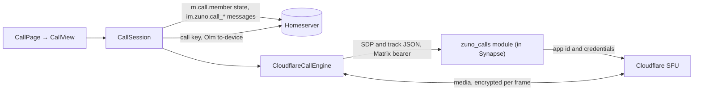
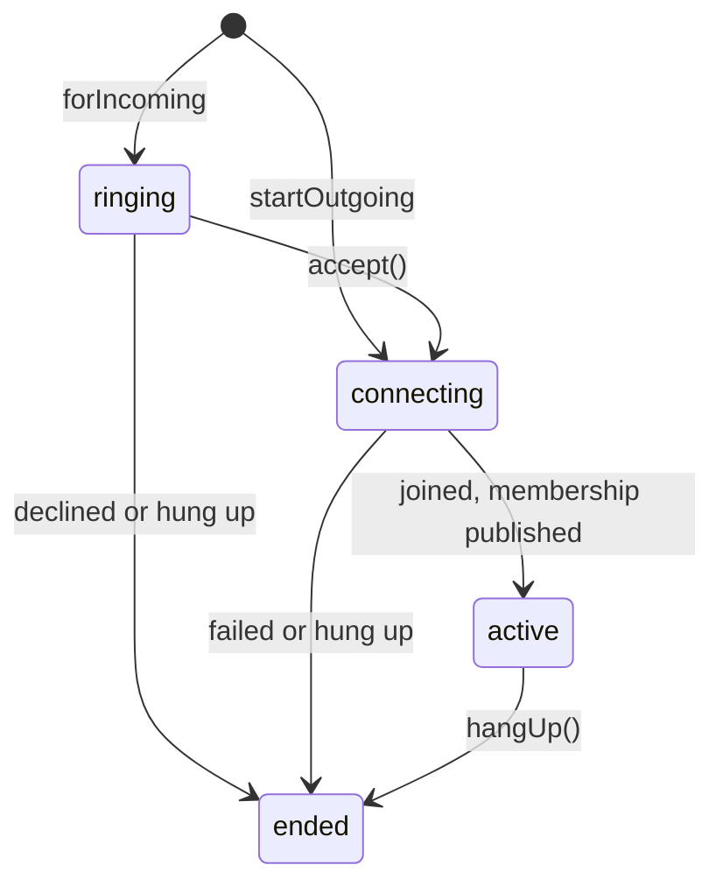
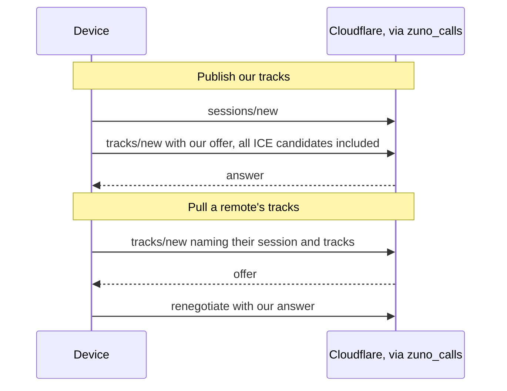
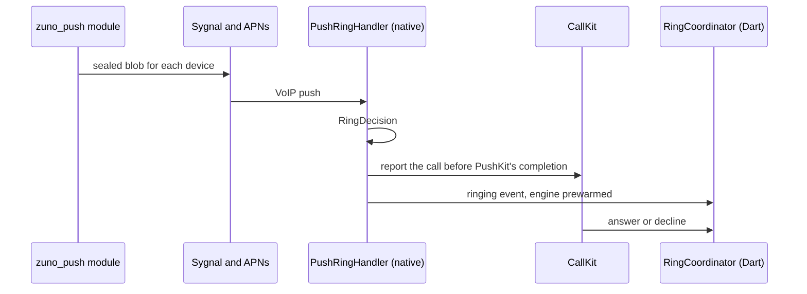

# Calls

Voice and video calls, one-to-one and group (6 people at most), always
routed through Cloudflare's SFU behind the `zuno_calls` Synapse module.
There is no peer-to-peer mode, by design. Signaling is a custom layer
loosely modeled on MatrixRTC (MSC3401), not a conformant implementation.
Media is encrypted per frame with a random key for each call. Android rings
with a native `CallStyle` notification and keeps the call in a foreground
service. iOS rings through CallKit: from sync while Zuno runs, and from a
server-sent VoIP push while it is closed.

## Architecture

| Part | Where | Role |
|---|---|---|
| `CallSession` | `lib/core/calls/matrixrtc/` | Matrix-side signaling and the call lifecycle: invite, decline, ring timeout, `m.call.member` publish and reconcile, the call key, hang-up and the summary event |
| `findActiveRoomCall` | same (`active_room_call.dart`) | Drives the room's "call in progress" banner from live `m.call.member` state, so a missed ring, a closed app or a mid-call join still finds the call |
| `canPublishCallMemberState` | same (`call_member_state.dart`) | Mirrors the homeserver's power-level check for `m.call.member`, so no one is offered a call they could never join |
| `CallEngine` → `CloudflareCallEngine` | `lib/core/calls/cloudflare/` | Media. One `RTCPeerConnection` and one Cloudflare session per call, with every participant's tracks muxed onto that connection as transceivers. Policy lives in pure, tested files (`call_quality_policy.dart`, `remote_track_plan.dart`) |
| `calls_module.dart`, `CloudflareApiClient` | same | Speak Cloudflare's own paths and JSON to the module, which fills in the app id and credentials. Only signaling is proxied: media flows straight between the device and the SFU, so the module affects setup latency only |
| `CallPage` → `CallView` | `lib/features/calls/presentation/` | `CallPage` owns the session, the renderers and every side effect. `CallView` is a plain widget that only lays out values |
| Ring routing | `lib/core/calls/notifications/`; iOS `RingCoordinator` | Presenting, cancelling, answering and declining rings |

**Platform seams** (`lib/core/calls/platform/`). Whatever the OS shows or
plays for a call goes through one of six interfaces. Each has a
`*For(capabilities)` factory that checks `callKit` first (how selectors
work in general: `app-foundation.md`).

| Seam | Android | iOS |
|---|---|---|
| `IncomingCallPresenter` | `zuno/call_style` notification with a native ring | CallKit. `activeRing` is always `null`, so `IncomingCallPage` never covers CallKit's own ring |
| `OngoingCallPresenter` | `CallForegroundService` | No-op: `systemCallSyncProvider` drives CallKit |
| `RingbackTonePlayer` | `ToneGenerator` on the voice-call stream | Native `CallRingback`, a synthesized tone that plays once the audio session is active |
| `SystemCall` | No-op | The CallKit call |
| `CallAudioOutput` | flutter_webrtc `Helper`, `ondevicechange` | Native routes, reported as `audioRouteChanged` |
| `PushRingBridge` (`voipRing`) | No-op | Binds pushed rings to their calls |

### Call lifecycle

- **Both factories return at once.** The connect sequence (permissions and
  the engine build in parallel, then join, then the first membership
  publish) runs in the background, so the call screen renders before any
  of it finishes.
- **The caller gives up after 45 s** with nobody joined, and the call ends
  as missed.
- **End reasons** (`CallEndReason`): `hungUp`, `declinedByUs`,
  `declinedByThem`, `missed` and `failed`. A failure carries a
  user-facing `failedMessage` (no microphone, connection lost, call full),
  which `CallPage` shows as a SnackBar.
- **Starting a call** from a room checks, in order: not already in a call,
  allowed to publish `m.call.member`, someone to call, online. "Prevent
  accidental calls" (on by default, Settings → Chats & calls) then asks
  for confirmation.

### Signaling

- **`m.call.member` state is the only roster.** It holds one entry per
  device in the call, never a client-local list. Each entry carries
  `created_ts` and `fociInfo`: the Cloudflare session, the published
  tracks and the device's media flags (such as `videoEnabled`, `encrypted`
  and `lowBandwidth`).
- **Membership is republished periodically**, well before each entry
  expires, and on every change. Engine-driven changes (quality tier,
  rejoin, key arrival) publish at once. User toggles (mute, camera, voice
  to video) go through a short leading-and-trailing window: the first
  publishes immediately and later ones coalesce into one trailing publish.
  State events are permanent room history, so a mashed button costs at
  most two events per window.
- **Invite, decline and summary are `im.zuno.call_*` msgtypes** on
  `m.room.message`, so they ride the existing timeline plumbing. Invite
  and decline are hidden from the timeline; only the summary renders.
- **Every end path sends a summary.** It is the one signal both sides can
  rely on: the callee's ring page uses it to see an early cancel, and the
  caller uses it to see a late decline.
- **Declines and answered summaries carry an `m.reference`** to a call
  membership event, so the push rule keeps them off the push path
  (`notifications.md`). Missed and declined summaries still push, because
  they stop the ring on the callee's other devices.
- **Push rules cannot read call content in encrypted rooms**: the server
  sees only ciphertext and the cleartext relation. Silencing therefore
  goes through `m.reference`, and the unread count is corrected on the
  client for hidden call events and answered summaries
  (`callUnreadCorrectionProvider`).

**Group calls** break assumptions a one-to-one call could get away with:

- Leaving is not ending. Whoever is the last one out posts the summary,
  whatever their role. If the last two leave at the same instant, each
  still sees the other, and no summary goes out.
- Any device holding the call key relays it to a new device, not only the
  caller.
- "Was this call answered" is `everHadRemote`, set once and never cleared.
  The reconcile removes a departing participant before the auto hang-up
  runs, so checking for an empty roster would report every finished call
  as missed.
- The 6-person cap is enforced only on the client, since the module does
  not know which call a session belongs to. Everyone is still rung.
  `accept()` refuses a full call before asking for permissions. When
  simultaneous joins still reach 7, each device ranks itself by
  (`created_ts`, user id) on every reconcile, and the 7th and later hang
  up. Each device judges only itself, so no coordination is needed.

### Media

A publish and a pull run in opposite directions:

| Rule | Why |
|---|---|
| A pull that cannot complete is forgotten locally and its mids force-closed on the SFU | The next membership sync pulls it again. Left marked as pulled, that person stays silent and invisible until they rejoin |
| ICE is gathered whole before an offer goes out, until gathering completes or candidates stop arriving, under a hard cap | Cloudflare's REST signaling takes candidates only inside the offer, so there is no trickle ICE |
| Session and track requests retry only a `SocketException` or a 429 (after the module's `retry_after_ms`) | Those requests create resources, so retrying one that may have landed risks a duplicate. The module refuses a 429 before calling Cloudflare, so that one is safe |
| Each request to the module has a deadline above the module's own upstream timeout, and a 401 is final | A dead socket fails the join instead of hanging it |
| TURN credentials are minted through the module alongside `sessions/new`, under a short cap. A failed mint means an empty ICE list, not a failed call | Only some networks need TURN, so a slow mint must never delay or fail the call |
| On `disconnected` the engine waits a short grace period. On `failed`, or when the grace runs out, it rejoins a few times with jittered backoff, then the call ends as "Connection lost" | Cloudflare sessions cannot ICE-restart, so a rejoin (new session and peer connection, local tracks re-added, remotes re-pulled) is the only way back |
| A native black placeholder stands in whenever the camera is not sending, and a track is advertised only once its sender reports `bytesSent > 0` | Cloudflare drops a published track that receives no packets for 30 s, mid-call included. Advertising earlier lets someone pull a track the SFU does not have yet |
| Opus goes out with in-band FEC and without DTX (`withOpusSendParams` rewrites each remote description) | A muted microphone with DTX sends no packets at all, so the 30 s rule would drop the audio track after a long mute |
| Every swap is `sender.replaceTrack`, never a mid-call re-offer | A re-offer recreates the receive streams, and Android's flutter_webrtc then drops the renderer's sink: frames keep decoding and nothing renders (flutter-webrtc#2124) |
| Android pins VP8, then H264. iOS sets no codec order and gets hardware H264 first | Only VP8 has a software fallback in this Android build. Every receiver decodes both, so the asymmetry is harmless |
| A remote's video is first pulled once its `videoEnabled` is true, and the pull stays open when the camera goes off; the tile hides from `videoEnabled` | The placeholder costs almost nothing to receive, and keeping the pull avoids a re-pull on every toggle |

**The placeholder** is native, a tiny black frame at a low frame rate
(`PlaceholderVideo.kt`, `PlaceholderVideo` in `CallsChannelPlugin.swift`).
It is Cloudflare's own pattern: partytracks sends black video for a device
that is off. The video transceiver is published at join, and the
placeholder covers three cases:

- **A voice call.** The video slot carries the placeholder until the call
  switches to video, which is one way.
- **Camera off.** The camera stops, its light included, and restarts on
  the last-used side.
- **The app in the background.** `videoEnabled` reads false meanwhile.
  Android also releases the camera, so its indicator goes off. iOS stops
  the camera itself (`cameraStopsInBackground`), so the engine keeps the
  track. "Background" means the lifecycle is hidden, paused or detached
  with no picture-in-picture window keeping the camera; `inactive` is
  ignored. A call answered on the iPhone's lock screen starts on the
  placeholder, since CallKit shows there, not the app. A call showing over
  Android's lock screen has its activity resumed, so its camera runs.

Publishing and every camera change share one queue, and publishing ends by
applying the wanted camera state, so a toggle that overlaps a join or a
rejoin still lands. A camera that will not restart stays off with the
placeholder in place, and the call shows a notice. Without a placeholder
(the native side unavailable), the video slot stays track-less and
camera-off only disables the camera track.

### Quality and data use

Every few seconds the engine reads `getStats()` and classifies this
device's own connection into good, degraded or poor, by incoming loss and
RTT. `CallQualityClassifier` exits a tier at stricter thresholds than it
enters it, and needs a streak to move: a short one to go down a tier, a
longer clean one to come back up. One bad sample never flaps the tier.

- **Loss** is judged only on samples with enough packets, so one lost
  packet in a quiet stretch is not "weak". Each incoming stream counts
  from its second sample, so a freshly pulled stream's start-up never
  lands in one window.
- **RTT** comes only from the transport's selected candidate pair (see
  Gotchas).
- **Each tier writes explicit encoder limits** (resolution, frame rate,
  bitrate) to the local video sender through `setParameters`, with no
  renegotiation. They apply whenever the camera goes onto the sender, so
  the good tier's cap holds from the first frame. Weak links lose
  resolution and bitrate first, not smoothness (`maintain-framerate`).
- **A remote's `lowBandwidth` caps us at degraded.** We publish
  `lowBandwidth` whenever our own tier is not good, so a struggling
  downlink on one side stops the other from sending more than it can
  absorb. Audio is never scaled.
- **Low-data calls are on by default, by design** (`lowDataCallsProvider`,
  Settings → Data & storage). Capture drops from 480p to 360p and the good
  tier's cap to 500 kbps, so soft video is expected, not a bug.
  The setting is read once per call, because switching mid-call would mean
  re-capturing the camera. These phones' cameras deliver 4:3 frames for
  both sizes, so the bitrate spreads over more pixels than the requested
  size suggests.

### Encryption

- **One random 32-byte key per call**, applied per frame with AES-GCM
  through flutter_webrtc's `FrameCryptor`. It is deliberately not the
  room's Megolm session: Megolm's key follows room membership and key
  backup, not the call, and its ordered ratchet does not suit lossy media.
- **The key is sent Olm-encrypted over to-device** to each device as it
  appears in the call, by any device that holds it, with a few attempts
  per device. A device that comes back under a new `sessionId`
  (an app restart, or a full leave and rejoin) gets it again.
- **The first valid key from a current participant's device wins.** Valid
  means it came Olm-encrypted from a known, unblocked device of its
  sender. A key from a device not yet in the call is held until that
  device's membership appears. A slow caller never blocks the call.
- **The key is never rotated.** A member who leaves and rejoins simply gets
  the same key, and rotating on every departure would interrupt everyone's
  media.
- **Media is gated on keys.** A remote is pulled only when both sides
  report `encrypted`: two unkeyed peers pulling each other wedge the
  decoder once the first key lands and one sender flips to ciphertext.
  Local tracks stay disabled until their sender's frame cryptor exists, so
  no plaintext reaches the SFU while the key is in flight. There is no
  unencrypted fallback.
- **Waiting for a key shows as "encrypting".** In a one-to-one call it is
  the status line, in a group a badge on the tile concerned. If the wait
  drags on, a hint suggests hanging up and trying again.

### Call screens

- **One page for the whole call**, always dark whatever the app theme. The
  layout follows the call:

  | Situation | Layout |
  |---|---|
  | Waiting for someone, or a one-to-one voice call | Portrait stage: picture, name, one status line |
  | One-to-one, the other camera on | Their camera edge to edge, a self view and floating controls |
  | Three or more people | A two-column grid, you last |

  `CallStatus` is calling, connecting, waiting, encrypting or talking; the
  lock and the timer show only while talking. A new state extends
  `CallStatus` and `CallView`, never a new screen. `IncomingCallPage`
  shares the portrait.
- **Confirming the other person**: in a one-to-one call, a pill offers to
  confirm someone unconfirmed or changed, shortly after they appear, unless
  this device dismissed it for that person (`call_confirm_prompt.dart`,
  `security-verification.md`).
- **Audio route** (`call_audio_route.dart`, pure): a call starts on a
  connected headset (Bluetooth first), else the earpiece for voice and the
  speaker for video. A newly connected headset takes the sound, and losing
  the one in use falls back to another headset, else the starting route.
  The speaker button toggles between the speaker and the preferred
  headset, else the earpiece.
  - **Android** selects headsets explicitly with `selectAudioOutput`,
    because AudioSwitch keeps the last user-selected device while it stays
    connected and would never hand over to a new headset.
  - **iOS** routes natively: `CallAudio` reports every route change, so
    the in-app button follows CallKit's own speaker button. Native picks
    the starting route; Dart applies only taps and headset changes.
- **Screen and wake state**: a voice call on the earpiece blanks the screen
  by proximity, with the system dialer's own mechanism (Android's
  proximity wake lock, iOS proximity monitoring). A video call holds a
  wakelock.

### Picture-in-picture

Picture-in-picture follows the other side's camera only, on both
platforms: it exists to keep watching them, so it is eligible while any
remote has video on. Dart picks the person
(`call_picture_in_picture.dart`), and `CallPage` sends the eligibility,
the remote frame's aspect ratio and that person's stream on every change.

| | Android (`MainActivity`) | iOS (`CallPictureInPicture.swift`) |
|---|---|---|
| Entry | Enters when the user leaves the app | AVKit's video-call PiP starts on its own when the app leaves |
| Rendering | Flutter draws one full-bleed remote tile with no controls | Native renders the remote track through an `AVSampleBufferDisplayLayer`, which the system draws while the app has no GPU |
| Window size | The remote frame's aspect, clamped to Android's 2.39:1 limit | The video's rotated shape, independent of its resolution |
| Ending | The last remote camera off, or the call ending, hides the window (`moveTaskToBack`) and the call carries on behind its notification | Closed by clearing the controller's content source (see Gotchas) |
| Hang up | A window action, the same broadcast as the notification's | No window action |

- **iOS details**: frames are throttled before the window opens (enough
  for a warm start-animation frame) and all pass while it is open. A
  stream briefly missing during a reconnect holds the window rather than
  closing it, since auto-start could reopen it only on the next trip to
  the background. With "Hide screen content" on, a recorded or mirrored
  screen hides the window's video.
- **A visible window keeps the camera sending.** Native reports
  `pictureInPictureCameraChanged`, and `CallSession` then does not count
  the app as in the background:
  - iOS: the window shows and the capture session is not interrupted.
    Native enables multitasking camera access (allowed for VoIP apps on
    iOS 18+). A stashed window or a locked device interrupts the camera,
    so the placeholder returns.
  - Android: in picture-in-picture mode with the activity started. Flutter
    sends no lifecycle state on `onStart`, so without this a window back
    after unlock would stay on the placeholder.

### The Android engine during a call

The picture-in-picture window's close button, or swiping the task away,
destroys the activity, which would take the engine and the call with it.
During a call `MainActivity` hands the engine to `KeptEngine` instead
(`HostEngineDecision`), and the call carries on behind
`CallForegroundService`. A system kill still ends it.

- The static `zuno/calls` channel, the FCM routing slot and the network
  handler stay with the engine, so pushes and the notification's Hang up
  reach the live call and no second headless client starts.
- The next `MainActivity` adopts the engine and re-applies its
  `HostState`: show over lock screen, prevent screenshots,
  picture-in-picture parameters, the proximity wake lock and ringback.
  That state is held per engine, not per activity, because Dart never
  re-sends it and a destroyed activity must not hold the wake lock or the
  tone.
- A kept engine whose call ends is destroyed after a short delay, so the
  summary gets out. Adopting it cancels that.

### Ringing

**Rules for both platforms**

| Rule | Why |
|---|---|
| A ringing presenter extends `RememberingIncomingCallPresenter`, which writes the ringing-call store before presenting | Written after, a decline or summary in the gap misses the cancel and the ring sounds on |
| A ring is idempotent per call id across push and sync, and a ring shown for a call that resolved meanwhile is taken back | Push and sync often deliver the same invite, and a call can resolve while its ring is being posted |
| Every cancel names its call | One call's end never takes down another call's ring |
| One ringing call per isolate (`SystemRing`), for 60 s at most | Call waiting, ring-elsewhere and the background sync rule all read it |
| A resolved call never rings again. A summary, a decline, an answer elsewhere or an unanswered ring resolves it, and each resolved call gets its own prefs key, pruned by age and count | A lost id rings a finished call again, and isolates rewriting one shared value could drop each other's ids |
| Call waiting: a second call while on one, or while another rings, is auto-declined with a "missed call" SnackBar. Headless isolates read a process-wide marker (`active_call_marker.dart`) | Isolates cannot read `activeCallProvider`. The marker dies with the process, so a crash never mutes later rings |
| A ring ends when another of my devices joins the call or declines it (`ringElsewhereProvider`) | Nothing about an answer elsewhere pushes, so only sync tells, and `/sync` keeps running during a ring or call (`app-foundation.md`) |

**Android ring**

- **`CallStyle` notifications are built natively** (`zuno_call_style`),
  since flutter_local_notifications has no `CallStyle` API. Only the
  notification object is native: its Accept and Decline intents copy the
  plugin's own intent shape, so its existing dispatch (including the
  headless Decline) handles them unchanged. The ring shows the caller's
  avatar when it can be fetched in time.
- **A running app also opens `IncomingCallPage`**, which runs the answer or
  decline itself and cancels the presenter as it closes, so two ring UIs
  never both stay up. A locked phone reaches the ring page through the
  full-screen intent, which needs full-screen-intent access. Onboarding's
  notifications step follows up with a page to grant it; without it, a
  locked phone shows only a heads-up notification.
- **The ring's sound and vibration are native and process-wide**
  (`IncomingRing`): one looping player and the vibrator, keyed by the
  ringing call. Dart-owned audio dies with its engine and never stops
  while the process is frozen, and a channel's sound is fixed at
  registration, so the ringing channels are silent and Dart passes the
  Ringtone and Vibrate-for-calls settings with each ring. Every stop names
  its call:

  | Stop | Covers |
  |---|---|
  | `cancelIncomingCallStyle`, from every `cancelIncoming` | Live sync, the push handler, the ring page closing, an accept at cold start |
  | The notification's delete intent | A swipe, and the notification's own timeout. The system delivers it even while the app is frozen or in Doze |
  | The Answer intent | Silences the ring as soon as Answer opens the app |
  | An `AlarmManager` window at the ring's limit | Backstop for a frozen process |
  | An in-process timer | A live process |

- **Ringback is a `ToneGenerator` on the voice-call stream**, so it follows
  the earpiece or speaker and the in-call volume without touching global
  audio state. It stops when the other side's membership appears, not on
  phase `active`, which for the caller means only that our own join
  finished.
- **The ring and ringback take no audio focus.** The call's own audio
  session would pause a focused tone, and Android refuses focus to an app
  in the background. Only ducking other apps is given up.
- **Hang up from the ongoing notification or the PiP window** goes to the
  live engine (`CallActionReceiver` → `hangUpCall` on `zuno/calls`), not
  to the headless route the ring's Decline uses: teardown needs the live
  session for media, membership and the summary. With no engine left, the
  receiver stops the service, so a stale notification never outlives its
  call.

**Live routes and declines (Android).** A Decline, Reply or Mark as read
tap goes to the running app first (`live_isolate_route.dart`). The app
claims two named ports when `main.dart` initializes
`CallNotificationService`, and re-claims them on every resume and every
ring it presents. A hand-off has three steps, each under its own bound:
`ping` answered by `pong`, then `accepted`, then `done`. A sender gives up
at the first step that misses its bound, and then does the work itself.

- The probe never cuts its window short. A busy but alive app read as
  gone hands the work to a second client, whose stale in-memory Megolm
  session can reuse a message index.
- Every path of one action carries one txid (`zuno-decline-<callId>` for a
  decline), so a hand-off that timed out and its fallback never both send.
- With nobody listening yet (cold start), the app holds a message and
  drops it once the `done` bound has passed, by which time its sender has
  done the work.

A Decline can be handled in three places:

| Where | Behavior |
|---|---|
| flutter_local_notifications' action engine (`runHeadlessCallDecline`) | Stops the ring, marks the call resolved and hands the decline to whoever holds the route. If nobody takes it, it opens its own client (briefly retrying the hand-off while the app holds the client) and sends with retries |
| The push engine's ring hold (`awaitHeadlessDecline`) | Claims the route only when no live app holds it. Holds while the ring shows, checking periodically that the route is still its own. Sends through its push client, or hands the decline to the app when the app holds the client |
| The app (`HeadlessCallDeclineNotifier`) | Cancels the ring, marks the call resolved, sends with retries, then reports `done` |

**iOS ring.** Why the server rings a closed Zuno:
[ios-push-and-ring.md](../decisions/ios-push-and-ring.md). Native code owns
CallKit and the audio session (`CallKitCenter.swift`, `CallAudio.swift`),
driven by Dart over `zuno/calls`. The VoIP push transport, the sealed blob
and key registration are in `notifications.md`.

A running app rings from sync instead, on the same CallKit UUID. Native
events queue until Dart takes them, and the queue replays every call still
ringing, so a cold-started Dart misses no ring.

`RingDecision` maps each push to one action:

| Push | Action |
|---|---|
| A new call | Rings, named from the room's title file (DM partner or room title) or else the blob's names, at the preview level (`notifications.md`). It rings until the blob expires |
| A call CallKit already tracks | Updates its name and video flag |
| Stale, already resolved, my own, or a canary | Reported, then ended |
| Another call ringing or active | A silent duplicate report under that call's UUID |
| Unknown key or version | A generic "Zuno call" for Dart to bind, plus a re-registration. Repeats in a short span end as failed |
| Forged | Reported, then ended as failed |
| Before first unlock | A generic ring, silent if Ringtone was off. The blob is kept and opened once protected data becomes available |
| Signed out, or no session | Reported, ended, and VoIP pushes turned off |

- **Binding a generic ring.** It carries no call, so `RingCoordinator`
  binds it to the newest call another member started recently, checked on
  each sync, or ends it if none turns up soon.
- **Answering a pushed ring** first reads the caller's membership from the
  server, under a short timeout: local state is stale after suspension. A
  call no longer listed ends as remote-ended; a timeout goes on, since the
  blob was authenticated. CallKit's answer is held until Dart reports the
  call connected, because the engine may be starting cold.
- **The call ledger** (notify App Group) records each incoming CallKit
  call's state (ringing, answered, ended, declined, missed) and source. A
  resolved entry stops a late push from ringing, and the extension reads
  it to tell whether CallKit rang.
- **The extension's fallback ring** (`NsePipelineCalls`). The invite's
  message push reaches the extension too. With no ledger entry it waits
  briefly for CallKit, then shows a time-sensitive fallback ring and asks
  the module's `ring/status`. A failed ring, a missing token or an unknown
  answer keeps the fallback; a ring the module sent gets a short window
  from its send time to show up; anything else turns it into a quiet call
  line. Once CallKit shows a pushed ring, the app removes that fallback and
  the room's recent notification lines. A missed or declined summary the
  extension sees ends that ring in the app before Dart's sync does.

| CallKit rule | Why |
|---|---|
| Every VoIP push is reported to CallKit before PushKit's completion runs; one that must not ring is reported and ended at once | iOS kills an app that returns from a VoIP push without reporting a call |
| A call's UUID is UUIDv5 over room and call id. Ended calls leave tombstones and a ledger entry | Sync, push, the extension and Dart name the same call, and a late report never rings twice |
| CallKit is the only ring UI; `IncomingCallPage` shows only when CallKit is unavailable | No double ring UI, and a filtered ring (Focus, block list) stays silent |
| The system call follows `activeCallProvider`, not `CallPage` | Nothing renders while locked, so a lock-screen answer may never build the page |
| The audio engine starts only from CallKit's `didActivate`; flutter_webrtc's own session management is off | Audio must start in the session CallKit activates |
| One `playAndRecord`/`voiceChat` session, with the speaker only by override | A mid-call mode change rebuilds the engine |
| Native owns the starting route and restores the last reported one after a media-services reset or a category change | A late `CallPage` build would undo a route picked on the CallKit screen |
| Mute goes through the input mixer; native mirrors CallKit's mute, and a refused unmute reverts Dart | A track mute outlives the call (later recordings in the app are silent). CallKit's mute holds the uplink system-wide, so the two must never disagree |
| A native backstop ends a ring before CallKit would; a system end late in the ring counts as missed, an early one as a decline | CallKit ends a ring on its own near 60 s, and that end looks like a decline |
| Recents are off, and the handle is an opaque room token, never a name | Recents sync through iCloud, nothing handles a redial, and system stores keep what a call shows |
| Ringtone off plays a silent ring file | CallKit otherwise plays the system ringtone |
| The provider configuration is re-set before every report | Apple's workaround for a call whose audio session never activates |
| A lock-screen answer without microphone permission ends shortly after, in the background | No permission prompt can show over the lock screen |
| A callee hangs up when still alone a while after joining, or when the call's summary lands before anyone joined (then without a second summary) | The caller may have given up while the answer was on its way |
| Native watchdogs end a stuck call as failed: an answer the app never adopts, or an audio session CallKit never activates | The engine may never start, and CallKit would otherwise show a dead call |
| Background tasks cover a ringing pushed call, a decline until Dart sent it, and every end | The engine must start and sync, and `leave()` and the summary must get out |
| `ActiveCallNotifier.clear(session)` is identity-checked, and the router holds the next accept until the ended call is torn down | On End & Accept two calls briefly overlap |

## Decisions

| Decision | Why |
|---|---|
| SFU only, permanently | Groups need it anyway, and on mobile CGNAT networks peer-to-peer often falls back to a TURN relay regardless. Neither Cloudflare nor LiveKit relays peer to peer, even for two |
| Custom signaling, not the SDK's VoIP module | The SDK's `GroupCallSession` hard-codes mesh and LiveKit backends. A LiveKit backend is designed for, not built: it would go behind `CallEngine`, possibly on the SDK's own module |
| The module takes the user's Matrix token | It runs inside Synapse, which checks the token on every request, so nothing is stored and a sign-out revokes at once |
| TURN is one fetch through the module, not a provider interface | It is a single request at setup, not a lifecycle, and which provider sits behind it is a server-side fact |
| A placeholder, not separate publish and receive connections (as in Cloudflare's partytracks) | Separate connections make every camera toggle or backgrounding a re-publish and a re-pull by every viewer, still under the 30 s rule |
| No automatic voice downgrade when every camera is off, and voice to video is one way | A downgrade needs distributed coordination with no single authority and risks flicker on near-simultaneous toggles. The saving is small: an off camera sends only the placeholder, or is never pulled at all |
| Voice to video reuses the camera button | Two near-identical camera icons read as ambiguous, even as screen share |
| Screen share is not built | Android capture needs its own MediaProjection consent and a `mediaProjection` foreground-service type |
| New mid-call facts ride `fociInfo`; new signaling is an `im.zuno.*` msgtype | Both sides already reconcile `fociInfo` and republish it on change. A msgtype gets timeline plumbing and filtering for free |

## Gotchas

| Rule | Why |
|---|---|
| Nothing over live video clips, blurs or uses `Opacity`; `CallTimer` repaints in its own `RepaintBoundary` | Everything there is drawn on every video frame with no raster cache, on a phone already encoding video |
| `CallView` slots and `CallGrid` cells are keyed; End call has no long-press tooltip | An unkeyed conditional sibling remounts everything after it, and a tooltip swallows the release. Either drops a press on End call |
| The build guards `session.engine` on `connecting` | The engine is null until the call connects |
| `CallKit action timed out: CXSetMutedCallAction` in the log right after a call ends is harmless | iOS sends an unmute for a call Zuno has already reported ended. Zuno completes it after iOS has forgotten the call, so iOS logs a timeout a few seconds later |
| An ended call pops every route above it before popping itself | A sheet left open over the call would otherwise be popped instead, stranding a `canPop: false` call screen |
| iOS clears a renderer's `srcObject` shortly before disposing it (`videoRendererNeedsDetach`) | flutter_webrtc's iOS renderer crashes on frames still queued, and a crashed app never clears its `m.call.member` |
| `hangUp()` is memoized, not phase-guarded; the first caller's flags stick | Four callers race (the button, a decline, the ring timeout, the last remote leaving), and the phase changes only at the end of teardown |
| `leave()` no-ops on a second call, and `dispose()` chains onto it; stream writers check `isClosed` | Native callbacks can still land after `dispose()`, and closing controllers under a suspended `leave()` makes it throw |
| Teardown never waits on `NegotiationLock`, so negotiation re-checks `_isLiveConnection` after every await | Blocking hang-up on a network round trip is worse, so a resumed step must not touch a closed or replaced connection |
| Every negotiation round on the connection goes through `NegotiationLock` | When a third person joins, two remotes' rounds race: refused requests, or a libwebrtc abort |
| `createOffer` takes explicit empty constraints | Called bare, flutter_webrtc adds receive-only slots that the next pull lands on |
| Re-fetch `getTransceivers()` and match by sender id or mid; adopt `receiver.track` on a transceiver that already existed | A cached `.mid` never updates, and `onTrack` fired before the mapping was registered |
| Never `stop()` a pulled transceiver locally | Cloudflare hands the freed mid to the next pull, which then has no receiver to wrap |
| Every quality tier writes explicit caps | `RTCRtpEncoding.toMap()` omits nulls and Android updates only present keys, so a null never lifts a cap |
| RTT comes from the transport's selected candidate pair | Unused TURN relay pairs keep stale RTTs for a while: a false weak link, and the other side then cuts its video |
| "Everyone left" needs two empty passes, the second on a short timer | A republish can read as empty once, and a backgrounded sync may idle for a whole long poll |
| `m.call.member` stays in `client.importantStateEvents` (`app-foundation.md`) | Otherwise `room.states` drops its updates and one side never sees the other join |
| The calls module resolves against `client.homeserver` | That is the well-known-resolved base, not the address typed at login |
| After a flutter_webrtc bump, check the Android placeholder on a device | It reaches plugin internals by reflection and fails quietly into the no-placeholder path. iOS uses the plugin's exported header, so a rename there breaks the build instead |
| The iPhone's hardware H264 encoder keeps encoding in the background | That is what keeps a backgrounded iPhone's placeholder video alive |
| iOS sets no codec preferences | flutter_webrtc's iOS side finds the transceiver by its still-empty `mid` and hits the audio one |
| Re-verify the `CallStyle` intents on a flutter_local_notifications major | They copy its undocumented intent shape. The `CallStyle` builders take positional `PendingIntent`s, so a mis-wire fails only on a real tap |
| The `CallStyle` caller name falls back to a generic one when blank (`zuno_call_style`) | `CallStyle` throws on a `Person` with a blank name, so a caller with no display name would post no ring at all |
| The foreground service starts first in `CallPage`, after the memoized permission request | Android allows starting one only shortly after user interaction, and a long join can drift out of that window |
| `IncomingRing` plays a cached copy of the ringtone and cancels the vibrator only if it started it | `openFd` refuses a compressed asset, and a silent ring must not cut a message buzz |
| The `AlarmManager` backstop can fire well after the ring's limit | Android 12+ stretches short alarm windows; the delete intent is the precise stop |
| The push engine's ring hold runs beside the push, never inside its queue | Held inside, it would starve the hang-up push that should end the ring |
| Only `main.dart`'s `initialize()` claims the live routes (`claimDeclinePort: false` elsewhere) | Any other caller would take them from the app |
| `shouldDestroyEngineWithHost` stays side-effect free | Flutter calls the check repeatedly |
| `CallsChannelPlugin` registers only on `EngineHost`'s engine | CallKit state is process-wide, and another engine's `resetSystemCalls` would end the app's calls |
| iOS closes the PiP window by setting `contentSource` to nil | `stopPictureInPicture()` is ignored in the background, leaving a black or frozen window |
| `endIncomingCall` ignores an answered call | The router cancels the ring on every accept, and by then CallKit's call is the ongoing one |
| Voices clipping when both talk on loudspeaker are not an app bug | It is the phone's echo canceller. The earpiece or headphones avoid it, and the only lever is WebRTC's AEC3 on iOS |

## Extending

- A second media backend goes behind `CallEngine`, beside
  `CloudflareCallEngine`. The UI and `CallSession` should need no change:
  the interface's only local-state signal is `localStateChangedStream`,
  which triggers a membership republish.
- A change to hang-up or teardown keeps the teardown gotchas: a memoized
  `hangUp()`, no waiting on negotiation, and liveness re-checks.
- Server-side limits (rate limits, concurrent-call caps, abuse controls)
  belong in the `zuno_calls` module, never the client.
- A change to how a call looks goes in `CallView` and its pieces, which
  take plain values.

## Testing

- `CallView` takes plain values (`call_view_test.dart`); `CallPage` runs on
  a `FakeCallSession` with channel recorders (`call_page_harness.dart`).
  The real-session case in `call_page_test.dart` catches a build that
  reads `session.engine` before the call connects.
- `CloudflareCallEngine` runs on a faked `WebRtcBackend` against a scripted
  SFU (`cloudflare_engine_harness.dart`, under `fakeAsync`); only real
  media and a live SFU stay uncovered.
- CallKit runs on Linux as iOS (`fake_calls_channel.dart`). Native
  decisions have XCTests (ring decision, push handling, CallKit reports,
  picture-in-picture) and JUnit tests (ring stops, picture-in-picture
  entry, the kept engine). The call UUID and VoIP blob vectors are shared
  push vectors (`notifications.md`).
