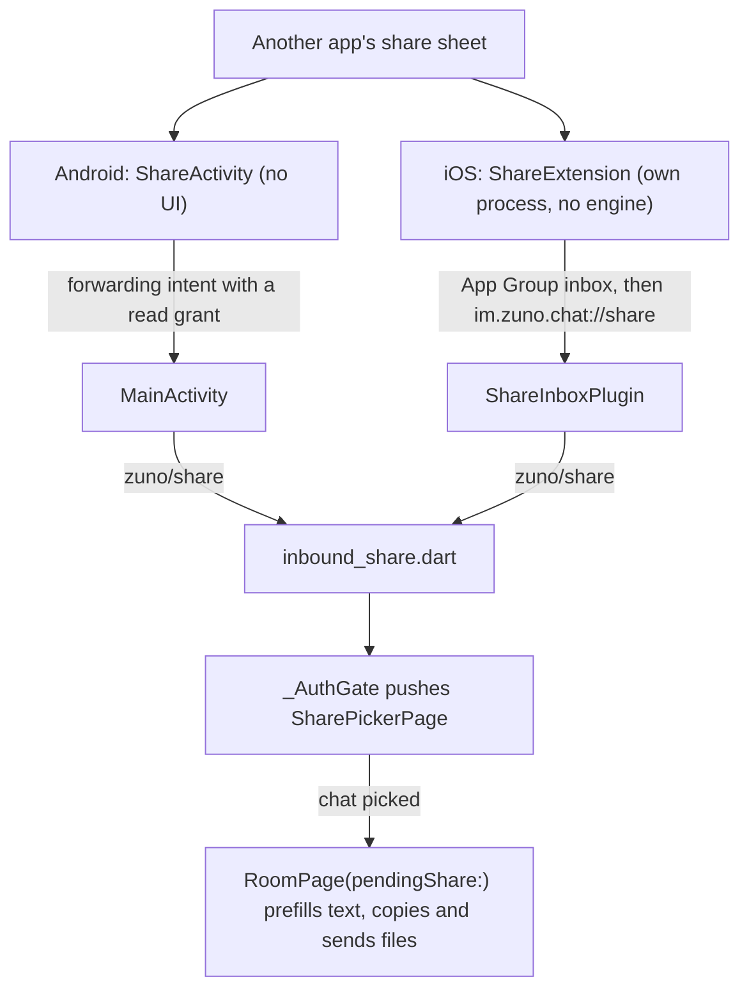

# Chats & Messaging

The chat room: its timeline, how each message is rendered, the composer,
attachments, voice messages, galleries, avatars and inbound share from
other apps. There is no message model or service layer. `RoomPage` reads
and changes the SDK's `Room`, `Timeline` and `Event` objects directly, and
holds only state and logic; every widget it draws lives in its own file.

## Components

Paths are under `lib/`. Files without a folder sit beside `room_page.dart`
in `features/chat/presentation/`.

| File | Role |
|---|---|
| `room_page.dart` | The live `Timeline`, read markers, pagination, sending, recording, typing notices and menus |
| `message_list_view.dart` | The reversed list with its row memo, day labels, end-of-history row, upload tile and failed-send tiles |
| `message_tile.dart`, `message_bubble.dart` | One row (avatar gutter, reactions, swipe-to-reply); the bubble's shape, colors and sender name |
| `message_meta.dart` | The time row and its invisible twin |
| `message_contents/` | Text, media and galleries, voice, file, call summary, reply quote, reactions, the pending upload tile |
| `message_composer.dart`, `mention_suggestions.dart` | The message box, recording row and reply or edit bar; the mention picker |
| `message_actions_sheet.dart` | The long-press sheet: reactions, then actions, then message facts |
| `features/chat/data/` | Pure helpers and shared types, including `MessageRowData` |
| `core/matrix/event_display.dart` | What an event is, for every surface |
| `core/matrix/attachment_cache.dart` | The only attachment cache |
| `core/matrix/image_send_preparation.dart`, `video_send_preparation.dart`, `video_send_plan.dart` | App-side media preparation before `sendFileEvent` |
| `core/matrix/mxc_avatar.dart`, `mxc_avatar_image.dart` | Avatars |
| `core/matrix/media_gallery_group.dart`, `gallery_viewer_page.dart` | Gallery grouping and the full-screen pager |
| `core/matrix/sanitize_message_html.dart` | The sanitizer for formatted (HTML) messages |
| `core/share/inbound_share.dart`, `features/share/presentation/share_picker_page.dart` | Inbound share: the `zuno/share` channel and the chat picker |

## Timeline

- **SDK events are the state.** Each build derives runs, day labels and
  gallery membership from one pass over the newest-first event list.
- **A message rebuilds only when its record changes.**
  `messageRowDataFor` builds a value-equal `MessageRowData` for each row
  the list asks for. `RowMemo` (pattern in `app-foundation.md`) hands back
  the identical widget for an equal record, so Flutter skips that
  subtree. The record holds everything a message's look depends on,
  including what it only points at, such as the quoted message's type and
  sender name. The memo is cleared when the `Timeline` instance changes,
  because cached rows hold the old one.
- **The page is quiet.** It rebuilds for timeline updates, for coalesced
  room-state bursts and for syncs that touch this room
  (`syncTouchesRoom`). While the active-call banner shows, any sync
  counts, because that banner expires by time rather than by an event.
  Values that change often (recording time, upload progress, the
  scroll-to-latest button) are `ValueNotifier`s read by their own small
  widgets.
- **Opening.** The first frame shows the header, wallpaper and composer.
  The timeline starts loading from the local database at once, but is
  applied only once the slide has finished (`onRouteSettled`,
  `app-foundation.md`). The first read marker and history request follow
  the apply, so neither runs during the slide. A spinner shows only if
  the slide has finished and the timeline has not.
- **Pagination** uses the `Timeline`'s own history requests. They fire on
  scroll-up, on load and after every timeline update, because a room
  whose synced window filters down to less than a screen has nothing to
  scroll. An end-of-history row replaces the loader once
  `canRequestHistory` turns false.
- **Reply quotes** whose original is not loaded ask `ReplyTargetCache`,
  once per event ID per page and never from `build`. An original that
  cannot be fetched is remembered as unavailable.
- **"Reload messages"** (room menu) wipes this room's locally cached
  timeline with the same calls the SDK's gap handling makes, renews the
  reply cache and rebuilds the `Timeline` from the server. Nothing changes
  on the server. A failed wipe still reloads, so the chat never stays on
  the spinner.
- **Reactions** are aggregated per emoji key. Zuno allows one reaction
  per person per message, a client convention rather than a Matrix rule:
  picking another emoji redacts the old one first, and picking the same
  one again removes it.
- **The wallpaper** is one doodle tile for every chat, tinted from the
  theme so one file serves light and dark. It sits in its own
  `RepaintBoundary`, and the chat list precaches it, so it neither pops
  in nor decodes during the slide.

## Event display

`core/matrix/event_display.dart` is the single source of truth for what
an event is. The chat list preview, notification body, reply quote,
timeline filter, sender runs and read marker all call it, so no surface
guesses on its own.

| Function | Answers |
|---|---|
| `isDisplayableTimelineEvent(event, showHiddenMessages:)` | Is it drawn in the timeline? |
| `summarize(event)` | Its `MessageKind` and one line of text, for previews, quotes and notifications |
| `isPreviewableLastEvent(event)` | Can the chat list show it as the last message? An edit is resolved through its `m.new_content` first |
| `canCarryReadMarker(event)` | Can a read receipt point at it? Yes once `status.isSent` |

- **Visibility.** An edit is never drawn on its own; the `Timeline` folds
  it into the original (`getDisplayEvent`). In-room verification
  signaling is never drawn. Call signaling (ring, decline) and state
  events show only with About's show-hidden-messages toggle. Every other
  message, sticker or still-encrypted event is drawn.
- **`MessageKind` switches have no `default`**, so a new kind fails to
  compile wherever it is not handled yet.
- **Call summaries** are ordinary `m.room.message` events with Zuno
  msgtypes, classified here like everything else. Only a missed one
  notifies (`isMissedCallSummary`, `notifications.md`).

## Rendering

- **Bubble widths.** Media, voice, file and location bubbles have one
  fixed width; everything else shrinks to its content under a ceiling.
  Media height follows the reported aspect ratio, clamped and
  cover-cropped, so a long screenshot cannot make a screen-tall bubble.
- **Runs.** Messages form a run when they share a sender and a day, are
  sent close together and have no hidden event between them. In a room,
  the sender's name and avatar show on the first message of a run.
- **The time row tucks into the last text line.** The paragraph ends with
  a `WidgetSpan` holding an invisible twin of the row (`TuckedMeta`), and
  the visible row sits bottom-right over it. If the twin does not fit on
  the last line, the paragraph wraps it and the row lands below the text
  with no extra code. Bubbles with no last text line (voice, file, call,
  location, uncaptioned media, a collapsed long message) place the row in
  their own layout.
- **Formatted (HTML) messages** cannot reserve room on their last line,
  so their time row stays below. Their width comes from an estimate of
  the plain-text body (text scale applied) with a minimum, because lists
  and headings render wider than their plain text.
- **The HTML path.** A formatted body loses its reply fallback, goes
  through `sanitizeMessageHtml`, and has its mentions highlighted before
  `flutter_html` draws it. The sanitizer keeps an allowlist of formatting
  tags with a few attributes each, drops scripts, styles, forms, images
  and embedded media together with their contents, and keeps an `href`
  only for a safe external URL. A body that holds nothing but text and
  mention pills (`isMentionOnlyHtml`) skips `flutter_html` and renders
  through the plain `LinkifiedText` path. Link taps to `matrix.to` are
  refused.
- **Long messages collapse** behind an expand toggle. Plain text uses a
  real `maxLines`; HTML clips to a fixed height, since `flutter_html` has
  no line limit.
- **File names keep their extension visible.** `FileNameText` ellipsizes
  only the base name; a name with no plausible extension stays whole.
- **Mention highlights come from the event's `m.mentions` only**
  (`mentionFragmentsOf`), and are bold and never tappable. `@room` is
  always highlighted. A rendered mention never shows a server name: the
  plain path draws only the part `m.mentions` vouches for, and a pill's
  text goes through `withoutServer`, which strips only a domain-like
  server part, so ordinary text after a colon survives. In real HTML,
  `matrix.to` user anchors are rewritten into highlighted spans.

## Composer and sending

- **The composer** grows a few lines, then scrolls. Enter inserts a new
  line, and only the button sends. Text goes out as typed (Decisions).
- **Mentions.** The picker inserts the SDK's own mention fragment
  (`User.mentionFragments.first`): `@Name`, or `@[Full Name]` when the
  name has spaces. That is the only shape `sendTextEvent` resolves into
  `m.mentions`, which earns the recipient a highlight push. Candidates
  are the members sync already delivered. The full member list (joined
  members only) is fetched at most once per room per session, and only
  when the list is incomplete and a couple of characters follow the `@`;
  opening or reading a room loads no members. Mention detection
  (`mentionQueryAt`) needs the `@` at the start or after whitespace and
  accepts the full Matrix localpart character set, so a hyphenated member
  can be picked.
- **Recovery code check.** Sending what looks like the recovery code opens
  a confirmation first (`recovery_code_warning.dart`; detection in
  `security-verification.md`), and the composer clears only once the
  send goes ahead.
- **Voice recording.** Holding the mic records and releasing sends. A
  short press locks recording on instead, and sliding up cancels. A
  recording too short to be deliberate is dropped. The message is an
  audio file marked as voice (MSC3245) with its duration and waveform;
  the format is under Decisions.
- **Failed text sends.** A refused text stays an own event in
  `EventStatus.error` (`isNotSent`) and shows a retry row. The SDK leaves
  that state both when `sendTextEvent` throws (`M_FORBIDDEN`, too large)
  and when it gives up silently: a 429 that outlasts its retry loop
  returns `null` with no exception. A tap on the bubble and the
  reconnect pass both call `Event.sendAgain()`. The reconnect pass scans
  the timeline for `notSentOwnEvents` rather than remembering transaction
  IDs, which is what catches the silent case. A media event left in error
  after its upload is resent the same way.
- **Failed media sends** are tracked by the page (`FailedMediaSend`) and
  shown as tap-to-retry tiles; the SDK's own error placeholder is
  discarded (`discardSendPlaceholder`). A single photo or video gets its
  own tile. A gallery item shows inline in its gallery, or with the
  gallery's other failures in one tile while the gallery is out of view.
  The reconnect pass resends them all. A file from the file picker has no
  tile, so its failure only shows a message. A server
  `FileTooBigMatrixException` is terminal and keeps no retry record.

## Attachments

### Preparation

Media send is app-side: the SDK's image shrink is bypassed, and the
prepared file, thumbnail and blurhash go to `sendFileEvent`.

- **Photos** are resized natively to a long-edge cap, smaller and at
  lower quality with "Reduce media size" (on by default). PNG stays PNG,
  and anything else, an animated GIF included, becomes a still JPEG.
  Orientation is baked into the pixels. A thumbnail is added only when
  the main image is larger and the thumbnail comes out smaller. The
  blurhash comes from a small sample, computed in an isolate.
- **Videos** get a native probe (size, bitrate, codecs, rotation), and
  `video_send_plan.dart` picks remux or re-encode against a long-edge
  cap, again smaller when reduced. H.264 with AAC or no audio, within the
  cap and close to the target bitrate, is remuxed losslessly; a failed
  remux falls back to re-encoding. Anything else is re-encoded by
  `light_compressor` at its size tier's bitrate, never above the source's
  own. The thumbnail is taken from the source on a separate native thread
  while encoding runs, and doubles as the pending tile's preview.
- **Files** from the file picker go byte-for-byte with their own names.

| Step | Android | iOS |
|---|---|---|
| Photo resize (`zuno/image`) | `ImageResizer.kt`, sampled decode | `ImageResizerPlugin.swift`, ImageIO decoding straight at the target size |
| Probe, remux, thumbnail (`zuno/video`) | `VideoTools.kt`, `MediaMuxer` | `VideoToolsPlugin.swift`, AVFoundation; the remux exports only the audio and video tracks |
| Re-encode | `light_compressor` | `light_compressor` |
| Voice recording | Ogg Opus directly | CAF, repackaged by `oggOpusFromCaf` |
| Keeping a send alive | `UploadForegroundService`: a dataSync foreground service with a progress notification | A background task of about 30 s, with no progress surface |
| Playback of cached files | As they are | Needs a type: video through a `.<ext>` symlink, voice with its MIME type |

Both native sides answer each channel with the same replies, codecs named
the Android way (`video/avc`, `audio/mp4a-latm`), each on its own
background thread.

### Pickers and caption screens

- **Which screen opens.** Photos alone go to the image caption screen,
  and one video alone to the video caption screen. Several videos, or
  photos and videos together, go to the mixed composer. More than one
  item after captioning becomes a gallery. The camera, the gallery picker
  and inbound share all use this dispatch (`_sendPickedMedia`).
- **The caption screens share one video preview**
  (`ComposerVideoPreview`). A video the player cannot open says so and
  can still be sent.
- **Pickers can throw**, a refused permission included; the attachment
  menu catches every picker failure and names the permission to allow.
  The file picker is multi-select, and each picked file is sent.
- **Picker re-encoding.** With native resizing, photos are picked with no
  size or quality limit, so on Android the resizer is the only lossy
  step. `image_picker_ios` re-encodes every pick but a GIF anyway, to
  full-quality JPEG (PNG stays PNG). The non-native path, used by no
  platform today, has the picker shrink photos instead
  (`pickerImageLimits`).

### Send flow

- **Progress.** One bar per attachment, filled first by compression and
  then by upload (`combinedSendProgress`). The SDK's upload sends the
  body as one request and reports no progress, so
  `UploadProgressHttpClient` slices the body itself; a stream transform
  over the SDK's own request sees only one chunk.
- **The pending tile.** A synthetic tile stands in until the real
  timeline row exists, matched later by `txid`. The SDK returns no
  thumbnail for a still-pending event, so the tile and the landed row
  both draw the pending send's preview bytes from memory until the
  upload finishes, or the preview vanishes the moment the row lands.
- **Keeping it alive.** The whole send, batch loops included, holds
  `UploadForegroundService`, so backgrounding cannot freeze or kill it
  (platform table above).

### Attachment cache

The SDK's own file store is off (its database keeps `maxFileSize` at 0),
so `attachment_cache.dart` is the only cache. Every consumer uses one key
per event (`attachmentCacheKey`, full or thumbnail).

| Helper | Tiers | Used for |
|---|---|---|
| `fetchCachedAttachment` | Memory, then disk, then network; a hit fills the tiers above it | Images and thumbnails drawn in bubbles |
| `fetchCachedAttachmentFile` | Disk only, returning the cached file itself | Videos and files: share, save and the video viewer never re-download or hold a large file in memory |
| `fetchCachedAvatar` | Disk only, never expiring, write awaited | Avatars |

- **Concurrent misses share a request**: widgets missing one key together
  make one fetch.
- **Attachments expire a day after last use** (sliding), so decrypted
  media does not linger. Avatar entries never expire, because an `mxc`
  address is immutable and a new avatar is a new address. An
  oldest-first size sweep bounds the whole disk tier.
- Tapping a file bubble saves it through the same path as the viewers'
  Save (`saveAttachmentWithFeedback`). Clearing the cache is a Settings
  action (`settings.md`).

### Galleries

- **Sending.** A batch of more than one item gets a gallery ID, and each
  item goes out as a normal `m.image` or `m.video` with
  `im.zuno.gallery: {id, index, count}` in its content.
- **Display.** `groupGalleries` folds each group onto its newest
  surviving member in one pass, so the per-index passes (read ticks, day
  labels, runs) keep working on plain indices. A group with one surviving
  member renders as an ordinary photo unless one of its items failed to
  send. An unrecognized gallery key (`galleryGroupOf` returns null) also
  degrades to an ordinary single item. The tile shows the first few items
  with an overflow count; `gallery_viewer_page.dart` pages through all.

### Avatars

- **One request per person per bucket.** `MxcAvatar` renders
  `MxcAvatarImage`, an `ImageProvider` equal on (`mxc`, bucket). There
  are two size buckets, a small crop for list-size avatars and a larger
  scale above that, so one person costs one request per bucket however
  many sizes show them. Flutter's image cache holds the decoded picture,
  so a rebuild never flickers.
- **The notification poster shares the disk key** (`avatarCacheKey`) and
  reuses the small-bucket entry instead of fetching (`notifications.md`).
- **Initials.** Until the first frame, or on error, the initial shows on
  a tone picked by a hash of `toneSeed`. Seed it with a stable Matrix ID
  (for a room, `directChatMatrixID ?? room.id`), so a rename keeps the
  color and a person matches everywhere. Tests pin the hash, since
  changing it recolors everyone.
- **A failed load retries.** It is evicted from Flutter's image cache,
  and bytes that fail to decode are deleted from disk, or one bad
  response would break a never-expiring entry for good.

## Inbound share

Both platforms hand Dart the same payload over `zuno/share`: optional text
plus file URIs with names and MIME types. Dart asks native to copy the
files (`copyToCache`) only after a chat is picked.

| Step | Android | iOS |
|---|---|---|
| Entry | `ShareActivity` owns the `SEND` and `SEND_MULTIPLE` filters | `ShareViewController` in the `ShareExtension` target |
| Hand-off | Forwards to `MainActivity` with `NEW_TASK` and `SINGLE_TOP` and a read grant on the URIs | `ShareInbox` (`ios/Shared/`) copies each attachment into a per-share folder in the App Group, writes `manifest.json` last, then opens the share URL |
| Reaching Dart | `onNewIntent` while running; held for `takeLaunchShare` on a cold start | Collected on app activation, on `takeLaunchShare` and on the share URL; `LaunchHandoff` holds it until Dart listens |
| `copyToCache` | Reads each content URI into `cacheDir/shared/<batch>/<i>/<name>` on one background thread | Moves the files from `Caches/Share/Imports` into `Caches/Share/Copies` and refuses any other source |
| Cleanup | Day-old batches are pruned at engine start, never at a copy, so a copy kept for a retry survives | An unopened inbox share expires within minutes and stale imports are pruned; `Caches/Share` is cleared at the first plugin registration of each process, so a second engine never deletes the first one's files |

- **The Dart side.** `_AuthGate` pushes `SharePickerPage`, which lists
  joined chats (no spaces) the person can post in, with search. It waits
  for the sign-in state if that is still loading; a share that arrives
  signed out is taken and dropped. Picking a chat replaces the picker
  with `RoomPage(pendingShare:)`. Text is prefilled into the composer and
  never sent automatically. Only then are the files copied and sent:
  images and videos through the caption-screen dispatch, everything else
  as files.
  Files that could not be copied are counted in one message, and the rest
  still go. One share goes to one chat.
- **Shared copies are reference-counted** per path while a batch or a
  retry uses them. A copy stays while a failed video send still points at
  it (a failed photo keeps its own bytes), and is deleted once unused or
  when the chat closes.
- **Android payload** (`InboundShareDecision`, JUnit-tested).
  `ShareActivity` reads every extra defensively, and joins several or
  rich-text (`CharSequence`) texts line by line, dropping duplicates. A
  file's MIME type and name fall back through the intent extras, the
  content resolver and the URI itself, skipping wildcard types. A
  relaunch from Recents never repeats the share (`app-foundation.md`).
- **iOS item kinds** (`ShareItemKind`, by type identifier), first match
  wins:
  1. A file URL.
  2. An image, video or audio item (a Live Photo shares its still).
  3. A link, sent as text.
  4. Plain text.
  5. Any other data.

  Live Photo bundles and web archives are never taken. The extension is
  offered for any share with text or an attachment conforming to
  `public.data` or `public.url`. Texts are deduplicated and joined line
  by line, as on Android.
- **The iOS share URL carries nothing.** Every trigger reads the inbox, so
  a cold start needs no URL handling, and with `FlutterDeepLinkingEnabled`
  off Flutter never turns the URL into a route (`app-foundation.md`). The
  extension opens it through the responder chain, since an extension has
  no `UIApplication.shared`; if iOS refuses, it asks the person to open
  Zuno within a few minutes. A share left unopened expires, so it can
  never pop up later.
- **Not built**: Direct Share targets in the Android share sheet. They
  would be additive and could reuse the pinned-shortcut code.

## Decisions

- **Text goes out as typed.** Every `sendTextEvent` call, composer and
  notification reply alike, passes `parseMarkdown: false,
  parseCommands: false`. The SDK has no client-wide switch, so a new call
  site must pass both. Commands off is a safety rule: the SDK's commands
  include `/leave`, `/logout` and `/ban`, which a message starting with
  that word would otherwise run.
- **Drawn, previewed and counted are three questions** in an encrypted
  room, and a fix to one does not answer the others. `room.lastEvent` can
  be a raw edit, which the chat list has no `Timeline` to fold, so
  previews resolve `m.new_content`. The server counts unread from the
  encrypted envelope before decryption, so no filter over decrypted
  content can match its count. Hence `canCarryReadMarker` is just
  `status.isSent`, excluding only a local echo whose ID can still change.
  Receipts are cumulative, so over-including is free, while
  under-including leaves a badge that never clears.
- **Galleries are a content key on ordinary events**, so other clients
  see N normal messages, and forward, redact and download keep working
  with no new code. Rejected: one multi-item event (invisible to other
  clients, with new send and render paths) and grouping by time window
  (it differs per device and shifts as history loads).
- **Media never falls back to the original bytes.** An undecodable photo
  or a failed video encode throws `MediaProcessingException` and the
  send is refused, because the untouched file leaks metadata. The SDK's
  `customImageResizer` sends the original when it throws, which is why
  preparation is app-side.
- **No location leaves with media.** Sent photos and videos get generic
  names (`photo.<ext>`, `video.mp4`), since original names carry
  timestamps. The native resizers and encoders write no location. The
  iOS remux copies only the audio and video tracks and exports with
  `metadata = []` and the `forSharing()` filter, because iPhone clips
  carry GPS and a passthrough export copies it. Avatars
  (`prepareAvatarPhoto`, `settings.md`) and the non-native path use
  `withoutLocation`, which drops the EXIF GPS directory without
  re-encoding and refuses the photo if that fails. Files from the file
  picker stay byte-for-byte by design.
- **Video bitrate is fixed by output size**, never a fraction of the
  source's, because a fraction of a 4K clip's bitrate still makes a file
  too large for the server. The cap applies to the long edge; change
  `videoLongEdge` and its tier's bitrate together.
- **Voice is Ogg Opus on every platform**: mono, 48 kHz, at a speech
  bitrate (the recorder's default stereo music setting makes files about
  four times larger). Apple cannot write Ogg and its Opus encoder refuses
  44.1 kHz, so iOS records CAF and `oggOpusFromCaf` repackages the
  packets losslessly before sending. iOS plays Ogg Opus natively.
- **Mentions ride on the event, never on a member list.** Only
  `m.mentions` earns a highlight push, and only it decides what is
  highlighted. No `matrix.to` pill is written (Markdown is off), so other
  clients show the fragment as plain text.
- **A recovery code is warned about, not blocked**: blocking would also
  stop someone saving it to their own notes, and people would retype it
  in pieces.
- **Inbound share is a trampoline on Android and an inbox on iOS.**
  `MainActivity` keeps the template's empty `taskAffinity`, so a `SEND`
  delivered to it directly would start a second `MainActivity`, and a
  second Flutter engine, in the sender's task. `ShareActivity` forwards
  with `NEW_TASK | SINGLE_TOP`, the path shortcuts and notification taps
  already use, so the running engine gets `onNewIntent`. Share plugins
  (`receive_sharing_intent`, `share_handler`) were rejected: they put the
  filters on `MainActivity` and want `singleTask`, which calls,
  picture-in-picture and the lock-screen ring were tuned against. Copying
  only after a chat is picked means no blank trampoline while a large
  video copies and no I/O when the picker is cancelled. On iOS the
  extension is its own process with no engine, so it must copy before it
  closes, and the app only moves the files.

## Gotchas

- **The HTML sanitizer lowercases attribute keys with
  `key.toString().toLowerCase()`.** Keys can be namespaced objects, and
  matching them any other way lets `xlink:href` past the allowlist.
- **A stale record is a stale message.** Anything that changes a
  message's look joins `MessageRowData`, with a test. That includes the
  quote target's type, because a target decrypted late keeps its ID.
- **The keyed list needs `findChildIndexCallback`.** Without it a new
  message shifts every index and remounts every visible row, memo or
  not: a playing voice message stops and an expanded message collapses.
  Rows also keep one shape (a `Column` keyed `row-<id>` with an optional
  day label), so a row never changes depth.
- **`Text.rich` already scales its `WidgetSpan` children**, so the
  invisible time twin sits in `MediaQuery.withNoTextScaling`, or it is
  scaled twice.
- **`IntrinsicWidth` wraps only bubbles with a reply quote**, so the quote
  can stretch to the bubble's width. That needs `stretch` on the content
  column. Nothing under it may be `double.infinity` wide: the intrinsic
  pass resolves to infinity and throws, which shows as a blank grey box.
- **A rounded `BoxDecoration` with a non-uniform `Border` throws at
  paint time.** Draw an accent edge (reply quote, reply bar) as a
  separate `Positioned` strip in a `Stack`.
- **`SwipeToReply` is `HitTestBehavior.translucent`**, so a swipe can
  start in the empty space beside a short bubble. A `GestureDetector`
  hit-tests only its child by default.
- **The send/mic swap is keyed on the button, not the icon.** The mic
  keeps its key for the whole recording, even when tap-to-record shows
  the send glyph, because a key change mid-gesture kills the
  hold-to-record pointer stream.
- **`onRoomState` storms.** Pagination fires it once per unresolved
  sender, dozens of times a round in a busy backlog, so rebuilds from it
  are coalesced. Never load members from it: `requestParticipants` emits
  one member event per member, the listener re-enters itself in an
  unbroken microtask chain, and the main isolate starves (an ANR on
  device, a hung test).
- **The member fetch is one `database.transaction`** whose action never
  throws, because the SDK does not reset its batch on error.
- **The SDK resolves mentions by display name, not username.** A member
  without a display name has no mention fragment, so mentioning them
  sends plain text with no `m.mentions` and no push. Usernames with dots
  need the bracketed form, which `mentionInsertText` produces.
- **A failed history request re-fires itself**: `requestHistory` fires
  `onUpdate` in a `finally`, and the update trigger asks again. A failure
  therefore latches history off until reconnect or the next successful
  sync, and no request is made while offline.
- **Never render `Event.body`.** It can be empty or the SDK's raw
  "Unknown message format" fallback for an HTML-only message. Use
  `plaintextBody`, which converts `formatted_body` and strips the reply
  fallback. Once `filename` is set (MSC2530), a file's `body` is its
  caption; `imageCaption` decides.
- **Undecryptable means still `m.room.encrypted`**, not only the SDK's
  `BadEncrypted` tag: an untagged one can be missing from the timeline
  yet become `room.lastEvent`. `isUndecryptableEvent` is the shared
  check. Never show the SDK's decrypt error text, which can be raw
  cryptography internals; the bubble's copy comes from
  `undecryptableReason` (`security-verification.md`).
- **`room.lastEvent` changes identity, not ID.** The sent echo and the
  synced copy are new instances with one event ID, and a redaction
  mutates only the current instance. Anything caching the last event
  must compare instances (`identical`), or a deleted message keeps its
  text.
- **Keep `roomPreviewLastEvents` narrowed** (`createMatrixClient()`) to
  messages, encrypted events and stickers. The SDK default includes call
  signaling types Zuno never draws, which would become a preview with no
  bubble behind it.
- **A video without a thumbnail never falls back to `getThumbnail`**,
  which silently downloads the whole file and then fails to draw it as an
  image. `CachedAttachmentImage` shows its `noThumbnail` stand-in.
- **The encoder takes raw sensor orientation.** A portrait phone video is
  usually a landscape sensor frame plus a rotation flag, and
  `light_compressor` applies its target to the raw frame. `encoderTarget`
  swaps the size when the probe says `rotated` (iOS); without that flag
  (Android) a portrait size is assumed stored sideways. Convert only at
  the compressor call; attachment sizes and the UI stay in display
  orientation.
- **`light_compressor`** refuses sources under 2 Mbps (most screen
  recordings and forwarded clips) unless `isMinBitrateCheckEnabled` is
  off, and takes whole megabits only. It builds from JitPack, with Gradle
  patches in `android/build.gradle.kts`.
- **Android 12+ refuses foreground-service starts from the background.**
  The upload service is acquired once per send or batch while the app is
  visible, refcounted, and never restarted between items. Android 15 caps
  dataSync services at six hours a day, so it honors `onTimeout`.
- **Players.** iOS types a local file by its extension, which cached
  files lack, so playback there needs the symlink or MIME type from the
  platform table; a voice event that names no type is sniffed from its
  bytes. `AudioPlayer.play` always restarts at 0, so a paused message
  resumes with `resume()`. A source the player cannot open throws from
  `play()` and also errors every event stream, so those subscriptions
  carry an `onError`, or the error escapes uncaught.
- **Recording length reads `clock.now()`**, not `DateTime.now()`, so the
  short-press and too-short rules run on fake time in widget tests.
- **Share and Save hand over one folder per attachment** under
  `temp/handover/`, because names repeat (every photo Zuno sends is
  `photo.jpg`). On iOS, where other apps type a file by its name, a name
  with no known extension gets one from the MIME type.
- **Cache expiry deletes are fire-and-forget.** Two readers can meet the
  same stale entry, and the loser's unawaited delete would throw where
  nothing can catch it.
- **Shared file names are attacker-controlled**: `DISPLAY_NAME` comes from
  the sending app, and an iOS attachment names itself.
  `InboundShareDecision.safeFileName` (Kotlin) and `ShareFileName.safe`
  (Swift) strip separators and reject `.` and `..`; keep the two in step.
  Android also refuses a target outside its per-file folder, and iOS a
  `copyToCache` source outside `Caches/Share/Imports`. Keep these checks
  if the copy ever moves.

## Extending

- **A new message shape** (msgtype or content key):
  1. Classify it in `isDisplayableTimelineEvent` and `summarize`, the only
     place classification belongs.
  2. Add a `MessageKind` if it needs its own rendering; every switch
     fails to compile until it handles it.
  3. Add a row to `event_display_test.dart`'s table.
  4. Teach the iOS extension's twin (`NseClassifier`) and add a case to
     `test/fixtures/push/nse_dispatch_v1.json` (`notifications.md`).

  Never special-case it in `RoomPage`, the chat list or the notification
  body.
- **A new attachment kind** uses `fetchCachedAttachment` for small media
  or `fetchCachedAttachmentFile` for anything large, and the pending-tile
  pattern (a synthetic tile keyed by `txid`) for its send, rather than a
  new loading state.
- **Anything that needs "the newest real message"** must not trust
  `room.lastEvent`, which can be an edit, hidden signaling or an
  encrypted envelope. Resolve it through `isPreviewableLastEvent` and
  `summarize`.

## Testing

- `RoomPage` runs on `room_page_harness.dart` (seeded events, bounded
  pumps, never `pumpAndSettle`).
- Inbound share has Dart tests for payload parsing and the picker filter,
  JUnit tests for `InboundShareDecision` and XCTests for `ShareInbox`.
- The share extension cannot cold-launch a debug build, because iOS runs
  one only when Flutter tooling or Xcode launches it: test sharing into a
  closed app with profile or release.
