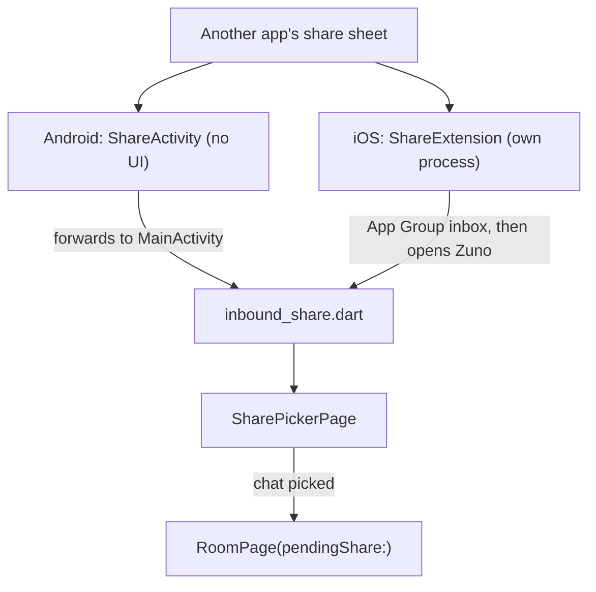

# Chats & Messaging

The chat room: its timeline, how each message is rendered, the composer,
attachments, voice messages, galleries, avatars and inbound share from
other apps. There is no message model or service layer. `RoomPage` reads
and changes the SDK's `Room`, `Timeline` and `Event` objects directly, and
holds only state and logic; every widget it draws lives in its own file.

## Components

Paths are under `lib/`. Files without a folder sit beside `room_page.dart`
in `features/chat/presentation/`.

| File | Role |
|---|---|
| `room_page.dart` | The live `Timeline`, read markers, pagination, sending and recording |
| `message_list_view.dart` | The reversed list, its row memo and the upload and failed-send tiles |
| `message_tile.dart`, `message_bubble.dart`, `message_contents/` | One row, its bubble and each kind of content |
| `message_composer.dart` | The message box, recording row and reply or edit bar |
| `features/chat/data/` | Pure helpers and shared types, including `MessageRowData` |
| `core/matrix/event_display.dart` | What an event is, for every surface |
| `core/matrix/image_send_preparation.dart`, `video_send_preparation.dart` | App-side media preparation before `sendFileEvent` |
| `core/matrix/attachment_cache.dart` | The only attachment cache |
| `core/matrix/mxc_avatar.dart` | Avatars |
| `core/matrix/media_gallery_group.dart` | Gallery grouping |
| `core/matrix/sanitize_message_html.dart` | The sanitizer for formatted (HTML) messages |
| `core/share/inbound_share.dart`, `features/share/` | Inbound share: the `zuno/share` channel and the chat picker |

## Timeline

- **SDK events are the state.** Each build derives runs, day labels and
  gallery membership from one pass over the newest-first event list.
- **A message rebuilds only when its record changes.** Each row gets a
  value-equal `MessageRowData`, and `RowMemo` (`app-foundation.md`) hands
  back the identical widget for an equal record, so Flutter skips it.
- **The page is quiet.** It rebuilds for timeline updates, coalesced
  room-state bursts and syncs that touch this room. Values that change
  often, such as recording time and upload progress, are `ValueNotifier`s
  read by their own small widgets.
- **Opening.** The header and composer show at once. The timeline loads
  from the local database straight away but is applied only after the
  slide, so the slide never stutters.
- **Pagination** uses the `Timeline`'s own history requests. They fire
  on scroll-up and after every timeline update, because a room whose
  synced window filters down to less than a screen has nothing to
  scroll.
- **"Reload messages"** in the room menu wipes this room's local timeline
  and rebuilds it from the server. Nothing changes on the server.
- **Reactions** allow one per person per message, a Zuno convention
  rather than a Matrix rule: picking another emoji redacts the old one.

## Event display

`core/matrix/event_display.dart` is the single source of truth for what
an event is. The chat list preview, notification body, reply quote,
timeline filter, sender runs and read marker all call it, so no surface
guesses on its own.

| Function | Answers |
|---|---|
| `isDisplayableTimelineEvent` | Is it drawn in the timeline? |
| `summarize` | Its `MessageKind` and one line of text, for previews, quotes and notifications |
| `isPreviewableLastEvent` | Can the chat list show it as the last message? |
| `canCarryReadMarker` | Can a read receipt point at it? |

- **Visibility.** An edit is folded into its original by the `Timeline`
  and never drawn alone, and in-room verification is never drawn. Call
  signaling and state events show only with the show-hidden-messages
  toggle.
- **`MessageKind` switches have no `default`**, so a new kind fails to
  compile wherever it is not handled yet.
- **A new message shape is classified here only**, plus its iOS
  notification twin (`notifications.md`), and never special-cased in a
  surface.
- **Call summaries** are ordinary `m.room.message` events with Zuno
  msgtypes, classified here like everything else.

## Rendering

- **Runs.** Messages from one sender on one day, sent close together,
  form a run; in a room, the name and avatar show on its first message.
- **The time row tucks into the last text line.** The paragraph ends with
  an invisible twin of the row, and the visible row sits over it. If the
  twin does not fit, the paragraph wraps it, and the row lands below the
  text with no extra code.
- **Formatted (HTML) messages** lose their reply fallback, pass through
  `sanitizeMessageHtml` and are drawn by `flutter_html`. The sanitizer
  keeps an allowlist of formatting tags, drops scripts, forms, images and
  media with their contents, and keeps only safe external links. They
  cannot reserve room on their last line, so their time row sits below.

## Composer and sending

- **Text goes out as typed.** Enter inserts a new line and only the
  button sends. Markdown and commands are off (Decisions).
- **Mentions.** The picker inserts the SDK's own mention fragment
  (`@Name`, or `@[Full Name]`), the only shape `sendTextEvent` turns into
  `m.mentions`. The full member list is fetched at most once per room per
  session, and only when someone types a mention.
- **Recovery code check.** Sending what looks like the recovery code asks
  for confirmation first (`security-verification.md`). It warns rather
  than blocks, since blocking would also stop someone saving it to their
  own notes.
- **Voice recording.** Holding the mic records and releasing sends; a
  short press locks recording on, and sliding up cancels. The message is
  an audio file marked as voice (MSC3245) with a duration and waveform.
- **Failed sends** show tap-to-retry, and a reconnect pass resends them
  all. For text it scans the timeline for unsent own events rather than
  tracking transaction IDs, because the SDK can also give up silently on
  a long 429 with no exception. Failed media sends are tracked by the
  page as their own tiles.

## Attachments

### Preparation

Media send is app-side: the SDK's image shrink is bypassed, and the
prepared file, thumbnail and blurhash go to `sendFileEvent`.

- **Photos** are resized natively to a long-edge cap, smaller with
  "Reduce media size" (on by default). PNG stays PNG; anything else,
  including an animated GIF, becomes a still JPEG.
- **Videos** are probed natively, then remuxed losslessly when they are
  already H.264 near the target size and bitrate, or else re-encoded by
  `light_compressor`.
- **Files** from the file picker go byte-for-byte with their own names.
- **One dispatch** picks the caption screen for the camera, the gallery
  picker and inbound share alike, and more than one item becomes a
  gallery.

| Step | Android | iOS |
|---|---|---|
| Photo resize (`zuno/image`) | `ImageResizer.kt` | `ImageResizerPlugin.swift`, ImageIO |
| Probe, remux, thumbnail (`zuno/video`) | `VideoTools.kt`, `MediaMuxer` | `VideoToolsPlugin.swift`, AVFoundation |
| Re-encode | `light_compressor` | `light_compressor` |
| Voice recording | Ogg Opus directly | CAF, repackaged to Ogg Opus |
| Keeping a send alive | A dataSync foreground service with a progress notification | A short background task, with no progress surface |
| Playing cached files | As they are | Needs a type: a `.<ext>` symlink or the MIME type |

Both native sides give the same replies on each channel, with codecs
named the Android way.

### Send flow

- **Progress.** One bar per attachment, filled first by compression and
  then by upload. The SDK reports no upload progress, so
  `UploadProgressHttpClient` slices the request body itself.
- **The pending tile.** A synthetic tile, matched later by `txid`,
  stands in until the real row exists. Both draw the preview from memory
  until the upload finishes, because the SDK has no thumbnail for a
  pending event.

### Attachment cache

The SDK's own file store is off, so `attachment_cache.dart` is the only
cache, with one key per event.

| Helper | Tiers | Used for |
|---|---|---|
| `fetchCachedAttachment` | Memory, then disk, then network | Images and thumbnails in bubbles |
| `fetchCachedAttachmentFile` | Disk, returning the file itself | Videos and files, so nothing large is held in memory or re-downloaded |
| `fetchCachedAvatar` | Disk, never expiring | Avatars |

Attachments expire a day after last use, so decrypted media does not
linger. Avatar entries never expire, because an `mxc` address is
immutable and a new avatar is a new address. A size sweep bounds the
whole disk tier.

### Galleries

A batch of more than one item gets a gallery ID, and each item goes out
as a normal `m.image` or `m.video` carrying
`im.zuno.gallery: {id, index, count}`. On display, `groupGalleries`
folds each group onto its newest member, so the per-index passes (read
ticks, day labels, runs) keep working. A group with one surviving member,
or an unrecognized key, renders as an ordinary item.

### Avatars

- **One request per person per size bucket.** With two buckets, one
  person costs at most two requests however many sizes show them, and the
  notification poster reuses the small one.
- **Initials** sit on a tone hashed from a stable Matrix ID, never the
  display name, so a rename keeps the color and nobody changes color
  between screens. Changing the hash recolors everyone.
- **A room's tone follows whoever it shows:** an unnamed invite takes the
  inviter's ID, a direct chat its partner's, any other room its own, so a
  direct chat matches its partner everywhere, the call screen included.
- **A failed load is evicted and its bytes deleted**, or one bad
  response would break a never-expiring entry for good.

## Inbound share

Both platforms hand Dart the same payload over `zuno/share`: optional text
plus file URIs with names and MIME types. Dart asks native to copy the
files (`copyToCache`) only after a chat is picked.

- **The picker** lists the chats the person can post in. Picking one
  opens `RoomPage(pendingShare:)`, which prefills the text, never sending
  it automatically, and then copies and sends the files. One share goes
  to one chat.
- **On iOS** the extension copies each attachment into the App Group
  inbox before it closes, and the app collects the inbox on activation.
  The URL it opens carries nothing, so a cold start needs no URL
  handling, and an unopened share expires so it never pops up later.
- **Not built**: Direct Share targets in the Android share sheet. They
  would be additive and could reuse the pinned-shortcut code.

## Decisions

- **Text goes out as typed.** Every `sendTextEvent` call passes
  `parseMarkdown: false, parseCommands: false`. The SDK has no
  client-wide switch, so a new call site must pass both, and commands off
  is a safety rule: the SDK's commands include `/leave` and `/ban`.
- **Drawn, previewed and counted are three questions** in an encrypted
  room, and a fix to one does not answer the others. The server counts
  unread from the encrypted envelope, so no filter over decrypted content
  can match it. Hence any sent event can carry the read marker: receipts
  are cumulative, so over-including is free, while under-including leaves
  a badge that never clears.
- **Galleries are a content key on ordinary events**, so other clients
  see normal messages, and forward, redact and download work with no new
  code. One multi-item event and time-window grouping were rejected.
- **Media never falls back to the original bytes.** A failed photo or
  video preparation refuses the send, because the untouched file leaks
  metadata. The SDK's resizer sends the original when it fails, which is
  why preparation is app-side.
- **No location leaves with media.** Sent media gets generic names, since
  original names carry timestamps, and the native resizers and encoders
  write no location. Files from the file picker stay byte-for-byte by
  design.
- **Video bitrate is fixed by output size**, never a fraction of the
  source's, because a fraction of a 4K clip's bitrate still makes a file
  too large for the server.
- **Voice is Ogg Opus on every platform**, mono at a speech bitrate.
  Apple cannot write Ogg, so iOS records CAF and repackages the packets
  losslessly before sending.
- **Mentions ride on the event, never on a member list.** Only
  `m.mentions` earns a highlight push and decides what is highlighted. No
  `matrix.to` pill is written, so other clients show the fragment as
  plain text.
- **Inbound share is a trampoline on Android and an inbox on iOS.** A
  `SEND` delivered straight to `MainActivity` would start a second
  Flutter engine in the sender's task, so `ShareActivity` forwards it
  with `NEW_TASK | SINGLE_TOP`. Share plugins were rejected because they
  want `singleTask`, which calls and the lock-screen ring were tuned
  against. The iOS extension is its own process with no engine, so it
  must copy before it closes.

## Gotchas

- **A stale record is a stale message**, so anything that changes a
  message's look joins `MessageRowData`, with a test.
- **The keyed list needs `findChildIndexCallback`**, or a new message
  remounts every visible row, stopping a playing voice message.
- **`Text.rich` already scales its `WidgetSpan` children**, so the
  invisible time twin opts out of text scaling, or it is scaled twice.
- **Nothing under a reply-quote bubble may be `double.infinity` wide**,
  because its `IntrinsicWidth` pass throws and shows a blank grey box.
- **A rounded `BoxDecoration` with a non-uniform `Border` throws at
  paint time**, so accent edges are separate strips in a `Stack`.
- **The send/mic swap is keyed on the button, not the icon**, because a
  key change mid-gesture kills the hold-to-record pointer stream.
- **Never load members from `onRoomState`**: loading members fires it
  once per member, and the re-entrant chain starves the main isolate.
- **The member fetch is one `database.transaction` that never throws**,
  because the SDK does not reset its batch on error.
- **The SDK resolves mentions by display name**, so a member without one
  gets plain text, with no `m.mentions` and no push.
- **A failed history request latches history off** until the next
  successful sync, because the SDK fires an update even on failure and
  the update trigger would ask again at once.
- **Never render `Event.body`**, which can be empty or a raw fallback;
  use `plaintextBody`.
- **Undecryptable means still `m.room.encrypted`**, checked with
  `isUndecryptableEvent`, and the SDK's decrypt error text is never shown
  (`security-verification.md`).
- **`room.lastEvent` can be an edit, hidden signaling or an encrypted
  envelope**, so the newest real message is resolved through
  `isPreviewableLastEvent` and `summarize`.
- **`room.lastEvent` changes identity, not ID**, so a cache of it must
  compare instances, or a deleted message keeps its text.
- **Keep `roomPreviewLastEvents` narrowed** in `createMatrixClient()`,
  because the SDK default includes call signaling that has no bubble.
- **A video without a thumbnail never calls `getThumbnail`**, which
  silently downloads the whole file and then fails to draw it.
- **The encoder takes raw sensor orientation**, so the target size is
  swapped only when the probe reports a rotation flag, and an upright
  portrait screen recording keeps its shape.
- **`light_compressor` refuses sources under 2 Mbps** unless its minimum
  bitrate check is off, and takes whole megabits only.
- **Android 12+ refuses foreground-service starts from the background**,
  so the upload service is acquired once per send while the app is
  visible, and honors Android 15's dataSync `onTimeout`.
- **`AudioPlayer.play` always restarts at 0**, so a paused message
  resumes with `resume()`, and every player stream needs an `onError`,
  or a bad source's error escapes uncaught.
- **Share and Save hand over one folder per attachment**, because names
  repeat: every photo Zuno sends is `photo.jpg`.
- **Cache expiry deletes are fire-and-forget**, because two readers can
  meet the same stale entry and the loser's delete would throw.
- **The file picker leaves a copy of each picked file in the app's
  temporary storage**, so the copy is deleted after reading, or sent files
  pile up; only a copy inside that storage is ever deleted, never an
  original.
- **Shared file names are attacker-controlled**, so both native sides
  strip separators, reject `.` and `..`, and refuse paths outside their
  share folder; keep the Kotlin and Swift checks in step.
- **The iOS share extension cannot cold-launch a debug build**, so test
  sharing into a closed app with a profile or release build.

## Testing

`RoomPage` runs on `room_page_harness.dart` (never `pumpAndSettle`).
