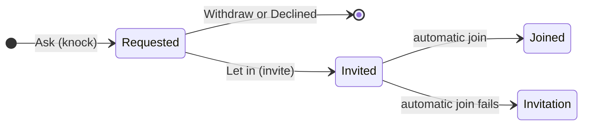

# Communities

Matrix spaces, called communities in the app: a family, club or team with several rooms. Home has two tabs, Chats and Communities, and both are fed by one split of `client.rooms` per sync. Ask to join (Matrix knocking) lives here too. The chat list itself, room access and roles are in `rooms-membership.md`.

## Architecture

| Piece | Role |
|---|---|
| `core/matrix/communities.dart` | `arrangeHome` splits the rooms once per sync, and one result feeds both tabs and the unread dots in the bottom bar. The file also holds community creation, leaving, and the `/hierarchy` read. |
| `rooms/presentation/home_bottom_bar.dart` | The tab pill, with the + button beside it. Only the visible tab is built. |
| `ChatListView.chats` / `.communities` | One list widget with two feeds. A community row is an ordinary `ChatRow` whose preview comes from the community's newest room and whose unread count adds up its unmuted rooms. |
| `communities/presentation/community_page.dart` | The header, your rooms, joinable rooms, members with their roles, and the community's settings, permissions and leave. |
| `core/matrix/join_requests.dart` | Ask to join, for both the requester and the approvers. |

`arrangeHome` produces five buckets:

| Bucket | Contains | Shown in |
|---|---|---|
| Chat invitations | Invitations to rooms that are not communities, except approvals of your own join requests | The Chats tab |
| Chats | Joined rooms that are not communities and not inside a joined community | The Chats tab |
| Community invitations | Invitations to communities | The Communities tab |
| Communities | Joined communities, ordered by the activity of their newest room | The Communities tab |
| Community rooms | Each community's joined child rooms except direct chats, newest first | Community rows and `CommunityPage` |

**Flows**
- **Joinable rooms.** `/hierarchy`, one level deep, runs when the page opens and on pull to refresh, and only when the community lists a child you have not joined.
- **New community.** One `createRoom` call with the space type and the community's power levels. A public community is listed in the same call, so a server that refuses the listing creates nothing.
- **New room in a community.** The room carries its join rule and `m.space.parent` in its initial state, and then the community gets an `m.space.child` event. If that second write fails, the room exists outside the community, and the user is told so.
- **Directory.** Find public communities asks the directory for spaces only, and Find public rooms drops them.

**Ask to join**

A joinable room shows Join when its join rule is not `knock`, and Ask or Requested when it is.

## Decisions

- **Chats never shows a community or a room inside a joined community.** A direct chat listed in a community stays in Chats, and so does a room whose community you have not joined.
- **A community is Public or Private**, and its access works like a room's.
- **New communities lock everything except rooms and invites.** Settings and messages are admin-only, adding rooms needs a moderator, and any member can invite.
- **A community room is Community, Ask to join or Private, never Public** (what each maps to: `rooms-membership.md`). This is an app rule only, so another client can still publish such a room.
- **Leaving a community also leaves the rooms that no other joined community holds**, and the confirmation says how many.
- **Rooms inherit neither roles nor access.** Matrix has no inheritance, so community admins are not admins of its rooms.
- **Only moderators and admins answer requests**, because declining is a kick, which Zuno's default levels give to moderators and up.
- **An approved request is joined automatically.** Zuno remembers which rooms you asked for, and while a request is pending its approval is not shown as an invitation. If the automatic join fails, the approval shows as a normal invitation.
- **Approvers are notified only while Zuno runs**, because there is no push rule for knocks.

## Gotchas

- **A space never opens a timeline**, so `CommunityPage` calls `postLoad()` itself, since topic, join rule and power levels are not loaded at cold start.
- **The SDK never creates a `Room` for your own knock**, so the requested state is Zuno's to keep.
- **`requestParticipants` caches members only in encrypted rooms unless asked to**, so the knock lookup asks explicitly.
- **Removing someone from a community leaves them in its rooms**, and the dialog says so.
