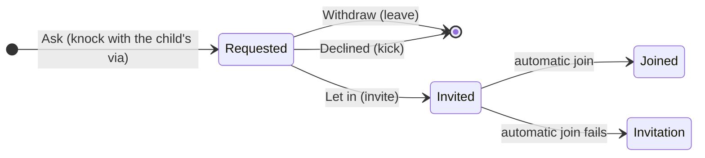

# Communities

Matrix spaces, called communities in the app: a family, club or team with several rooms. Home has two tabs, Chats and Communities, and both are fed by one split of `client.rooms` per sync. Ask to join (Matrix knocking) lives here too. The chat list itself, room access and roles are in `rooms-membership.md`.

## Architecture

| Piece | Role |
|---|---|
| `core/matrix/communities.dart` | `arrangeHome` splits the rooms once per sync (table below), and one result feeds both tabs and the unread dots in the bottom bar. The file also holds community creation, leaving, and the `/hierarchy` read. |
| `rooms/presentation/home_bottom_bar.dart` | The tab pill, with the + button beside it instead of a floating button. Only the visible tab is built, and each list keeps its scroll position. Back on Communities returns to Chats, and the app always opens on Chats. |
| `ChatListView.chats` / `.communities` | One list widget with two feeds. A community row is an ordinary `ChatRow` built by `communityRowDataFor`: its preview comes from the community's newest room, with `previewSource` naming that room, and its unread count adds up its unmuted rooms. |
| `communities/presentation/community_page.dart` | The header, Invite and New room, your rooms, joinable rooms (Join, Ask or Requested), members with their roles, and a menu with settings, permissions and leave. |
| `core/matrix/join_requests.dart` | Ask to join, for both sides. `join_requests_view.dart` draws the card in the chat, the Review sheet and the card in room info; `join_request_notification_provider.dart` notifies approvers. |
| `communityPermissionGroups` | The community's permission rows (members, rooms, settings), shown by the shared `RoomPermissionsPage`. |

`arrangeHome` produces five buckets:

| Bucket | Contains | Shown in |
|---|---|---|
| Chat invitations | Invitations to rooms that are not communities, except approvals of your own join requests | Invitations on the Chats tab |
| Chats | Joined rooms that are not communities and not inside a joined community | The Chats tab |
| Community invitations | Invitations to communities | Invitations on the Communities tab |
| Communities | Joined communities, ordered by the activity of their newest room (or their own, when empty) | The Communities tab |
| Community rooms | For each community, its joined child rooms except direct chats, newest first (`communityRooms`, which `CommunityPage` also uses) | Community rows: their preview and unread count |

The + button on the Communities tab offers New community and Find public communities.

**Flows**
- **Joinable rooms.** `/hierarchy` (one level deep) runs when the page opens and on pull to refresh, and only when the community lists a child you have not joined.
- **New community.** One `createRoom` call with the space type and `communityPowerLevels`. A public community is listed in the same call, so a server that refuses the listing creates nothing.
- **New room in a community.** The room carries its join rule and `m.space.parent` in its initial state, and then the community gets an `m.space.child` event. If that second write fails, the room exists outside the community, and the user is told so.
- **Directory.** Find public communities asks the directory for `room_types: [m.space]`, and Find public rooms drops spaces from its results.

**Ask to join**

`JoinRequestsNotifier` keeps the requester's side, and `letIn` and `declineJoinRequest` are the approver's. A joinable room shows Join when its join rule is not `knock`, and Ask or Requested when it is.

## Decisions

- **Chats never shows a community or a room inside a joined community.** A direct chat listed in a community stays in Chats, and so does a room whose community you have not joined.
- **A community is Public or Private.** Its own access works like a room's: Public is listed and open, Private is invite only.
- **New communities lock everything except rooms and invites** (`communityPowerLevels`). Settings and messages are admin-only, adding rooms needs a moderator, and any member can invite.
- **A community room is Community, Ask to join or Private, never Public** (what each maps to: `rooms-membership.md`). A new room in a community starts as Community. This is an app rule only: another client can still publish such a room.
- **Leaving a community also leaves the rooms that no other joined community holds.** The confirmation says how many rooms go with it.
- **Rooms inherit neither roles nor access.** Matrix has no inheritance, so a public community's rooms keep their own access, and community admins are not admins of its rooms.
- **Only moderators and admins answer requests**, because declining is a kick, and Zuno's default levels give kicking to moderators and up.
- **An approved request is joined automatically.** Requested room IDs are stored per account in SharedPreferences (`communities.asked.<userId>`). While a request is pending, its approval is neither listed nor announced as an invitation. If the automatic join fails, the request is forgotten, so the approval shows as a normal invitation.
- **Approvers are notified only while Zuno runs**, because there is no push rule for knocks.

## Gotchas

- **A space never opens a timeline**, so `CommunityPage` calls `postLoad()` itself. The topic, join rule and power levels are not loaded at cold start; `m.room.create`, `m.space.child` and `m.space.parent` are.
- **The SDK never creates a `Room` for your own knock**, so the requested state is Zuno's to keep.
- **`requestParticipants` caches members only in encrypted rooms unless asked to**, so the knock lookup asks explicitly. Requests are looked up only where the join rule allows knocking.
- **The community page rebuilds only for syncs that touch the community or its rooms**, and it closes itself when you are removed.
- **Removing someone from a community leaves them in its rooms**, and the dialog says so.
