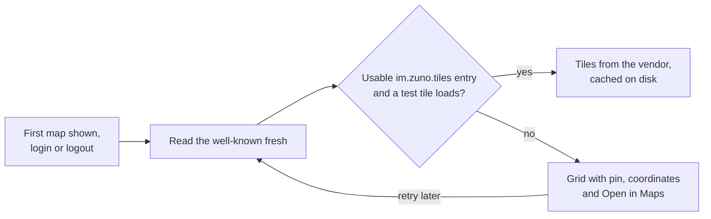
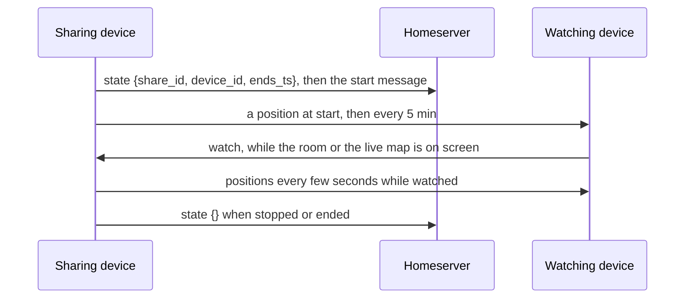

# Location Sharing

Location sharing has two halves that are architecturally opposite. The
**pin** is a one-off `m.location` message: it belongs in history, notifies
and previews like any message. **Live location** ("watch me move for the
next hour") is not a message: room state says who shares and until when,
positions travel as Olm to-device messages, and no record of where someone
was stays anywhere.

## Pin: architecture

| Piece | Role |
|---|---|
| `lib/core/location/geo_uri.dart` | Parses and formats `geo:lat,lon;u=m` (RFC 5870) |
| `location_message.dart` | Sends a pin through the SDK's `Room.sendLocation`, which owns the MSC3488 format, and reads a pin from any client |
| `current_position.dart` | Returns a fix, possibly approximate, or a typed failure |
| `map_tiles*.dart`, `map_tile_cache.dart` | The tile source, its probe and the tile cache |
| `maps_link.dart` | Hands a location to the platform's maps app |
| `lib/features/location/presentation/` | Share sheet, bubble, full-screen map with Open in Maps, and the map view |

**Flow**: attach sheet → Location → the sheet finds a fix → an ordinary
encrypted, redactable message, with nothing uploaded. On receipt the bubble
draws a mini map, and a tap opens the full-screen map.

**Tiles**: the server name's `/.well-known/matrix/client` names a raster
tile template, and the app fetches tiles straight from that vendor.

The tile cache is purged at logout, at account deletion and by Clear media
cache.

**Server contract** (outside this repo): the well-known carries
`"im.zuno.tiles": {"url": "https://…/{z}/{x}/{y}.png?key=…", "attribution":
"…"}`. The `url` must be `https` with all three placeholders, or the map
falls back to the grid. Tiles are 256 px raster, up to zoom 19.
`attribution` is optional and must not start with `©`, because flutter_map
adds its own.

## Pin: decisions

- **The pin is plain MSC3488**, the one interoperable piece of the design:
  other clients such as Element render Zuno's pins, and theirs render here.
- **The homeserver names the tile source, and the app holds no key.** A key
  rotation or style change is a well-known edit, not a release, and someone
  on another homeserver never spends Zuno's quota. The key is public by
  nature, so restrict it at the vendor.
- **The well-known is read fresh, not from the SDK's cache**, so a new or
  fixed source shows up within minutes.
- **Degrade, never fail.** With no usable source, the map becomes a grid
  with the pin, the coordinates and Open in Maps.
- **`flutter_map`, not `google_maps_flutter`**, which would pull in Play
  Services. **`geolocator` owns location** because it sees states
  `permission_handler` cannot, such as services turned off and approximate
  grants.
- **No thumbnail on the event**, because it would bake coordinates into an
  image that gets cached, saved and forwarded.
- **Approximate grants still send**, labelled approximate.
- **Tile spend is bounded**, since every cache miss is a billed request:
  the full map pans only within a neighbourhood-sized box around the pin and
  zooms out no further than that box, previews are static, and only visible
  tiles are fetched.
- **Out of scope**: place search, "someone viewed your location" receipts,
  and geofences.

## Pin: gotchas

- **A tile cache is a location history** in plain files outside the
  encrypted database, so keep the size cap and every purge site.
- **`mapTileCache()` is a forwarder, not the cache**, because a purge
  replaces flutter_map's singleton and a held instance would stop caching.
- **`geo:` intents need a `<queries>` entry** on Android, or `launchUrl`
  reports no handler.
- **iOS has no `geo:` handler**, so Open in Maps sends a `geo:` intent on
  Android and an Apple Maps link on iOS (capability `mapsApp`).
- **iOS needs `NSLocationAlwaysAndWhenInUseUsageDescription`** though Zuno
  never asks for Always, because App Store upload rejects the build without
  it.
- **The pan box, not the minimum zoom, caps zoom-out**, because flutter_map's
  contain constraint refuses any zoom whose viewport overflows the box, so
  the two are sized together.
- **The bubble's tap detector must be `HitTestBehavior.opaque`**, because
  the preview map sits inside an `IgnorePointer`.
- **The probe result lasts the whole process**, so a revoked key shows grey
  tiles until restart, and keys must be rotated with an overlap.
- Widget tests cover the bubble and sheet on the grid path, with
  `mapTilesProvider` overridden.

## Live location: architecture

| Piece | Role |
|---|---|
| `live_location_protocol.dart` | The state, start message, position and watch formats, and their validation |
| `live_location_policy.dart` | What each fix sends, to whom, and which capture mode runs |
| `live_location_sharing.dart`, with `live_location_recipients.dart` and `live_share_sweep.dart` | This device's shares: start, sending, watches, stop and leftovers |
| `live_location_viewing.dart` | Everyone else's shares: validated positions in memory, and watching |
| `live_location_capture.dart` | The channel to native capture: a foreground service on Android, a `CLLocationManager` on iOS |
| `lib/features/location/presentation/` | The duration step, the timeline tile, the room and room-list banners, and the live map |

| What | Carried by | Content |
|---|---|---|
| Who shares, until when, from which device | State `im.zuno.live_location`, state key = the sharer's user ID | `{share_id, device_id, ends_ts}` while live, `{}` once stopped |
| "Started sharing" | `m.room.message`, msgtype `im.zuno.live_location`; notifies like a message | `{body, share_id, ends_ts}` |
| A position | Olm to-device `im.zuno.live_location.position` | `{room_id, share_id, geo_uri, ts}` |
| "I am watching" | Olm to-device `im.zuno.live_location.watch`, to the sharing device | `{room_id, share_id, active}` |

A share lasts 15 minutes, 1 hour or 2 hours, 15 minutes preselected.
Viewers reject a state whose end is more than 2 h 10 min after it was sent,
so another client cannot claim a longer share.

## Live location: decisions

- **Never in history.** One timeline event per position, as Element's
  MSC3672 does, would push, reorder the room list and stay forever, while
  to-device messages touch no timeline, fire no push and stay unreadable to
  devices that join later. The start message is the only timeline trace,
  and its tile reads the end from state.
- **Encrypted rooms only**, since a position is only as private as the
  room's devices.
- **Precise only while someone looks.** Unwatched, the sharer captures
  without GPS and sends every 5 minutes; a watch switches it to GPS and a
  send every few seconds, to the watching devices only. Each send is one Olm
  message per device, so this also bounds the cost of big rooms.
- **Who receives**: every device of every joined member that passes the
  SDK's key-sharing rule, the sharer's own other devices included, minus
  ignored users and the sharing device, re-checked at send time.
- **Positions and watches are never stored or replayed** (`app-foundation.md`):
  a send that failed offline goes out again only as the newest position, on
  reconnect.
- **No end record and no state renewals**: both would be permanent history,
  and positions carry liveness.
- **The end is checked by the wall clock on every input**, because Dart
  timers stop counting in deep sleep, and native capture also stops itself
  shortly after the end.
- **A share never resumes.** One whose process died is cleared on the next
  run, since Android cannot restart location from the background and a
  silent resume would outlive the owner's intent. Leaving a room ends its
  share without a write, deleting the start message stops it first, and
  sign-out and account deletion clear every share while the token still
  works (`authentication.md`).
- **Viewers trust only what checks out**: a position counts only from a
  device in its sender's own device list that the room's state names for
  that share, from a joined member who is not ignored, with a valid
  timestamp. One that arrives before its state is held briefly.
- **Watching follows the screen**: the room and the live map watch only
  while they are visible and Zuno is in front.
- **Updating.** Once a watch goes out, a share whose shown position is more
  than a minute old reads as updating until its first fresh fix, for up to
  two minutes, so a viewer can tell an old position from a current one.
- **The live map** keeps tiles in memory only, since a moving person's
  tiles on disk would be a trail. It shows nothing until someone has a
  position, zooms out until everyone fits but no further than city level
  for one place, keeps its centre within everyone's area, follows the
  tile's sender until dragged, and can show your own location, which never
  leaves the device.
- **Sync stays on in the background while a share runs**, because watches
  and membership changes arrive only through it (`app-foundation.md`). On
  Android without the battery exemption the duration step offers it, since
  Doze can cut a still phone's network mid-share.

## Live location: platforms

| | Android | iOS |
|---|---|---|
| Capture | Foreground service of type location; the fused provider, else the platform's; a wake lock per fix until Dart's sends finish | One `CLLocationManager` with background updates and the blue indicator; only real fixes, at most one per mode interval |
| Permission | While in use; background location is never requested | When In Use; never Always |
| Capture lost | Holds the CPU long enough for Dart to clear the share | Holds a background task until Dart clears the share |
| Stop | The notification's Stop sharing, or in the app | In the app |
| Engine | Kept after a swipe-away while a call or a share runs (`calls.md`) | The one app engine |

## Live location: gotchas

- **flutter_map asserts when a new camera constraint excludes the camera**,
  so the live map's area only grows during a visit.
- **A camera constraint sees an unsized camera before the first layout**,
  and must let it through.
- **`LatLngBounds.extendBounds` leaves its derived longitude fields
  stale**, so bounds are built fresh.
- **Positions live only in memory**, so a viewer that just started shows
  nothing until the sharer's next send, which its watch prompts at once.
- **The Android service must enter the foreground before it may stop**, and
  a stop must never target one that has not, or the app crashes.
- **iOS needs the `location` background mode** and the When In Use purpose
  string, and App Review needs a note on why; Google Play needs a
  foreground-service (location) declaration.
- **Widget tests create the sharer and viewer inside the test body**,
  because objects created in `setUp` re-emit on the real event loop, outside
  the test's fake clock.
