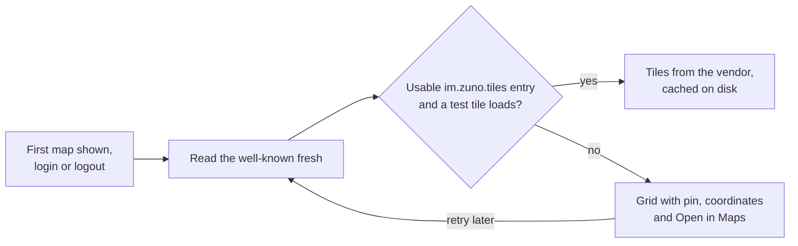

# Location Sharing

Location sharing has two halves that are architecturally opposite. The
**pin** is a one-off `m.location` message: it belongs in history, notifies
and previews like any message. It is built. The **live beacon** ("watch me
move for the next hour") is not a message but ephemeral shared state with a
hard expiry, closer to a call membership than to anything in the timeline.
It is designed, not built.

## Pin: architecture

| Piece | Role |
|---|---|
| `lib/core/location/geo_uri.dart` | Parses and formats `geo:lat,lon;u=m` (RFC 5870) |
| `location_message.dart` | Builds MSC3488 content and reads a pin from any client |
| `current_position.dart` | Returns a fix, possibly approximate, or a typed failure |
| `map_tiles*.dart`, `map_tile_cache.dart` | The tile source, its probe and the tile cache |
| `lib/features/location/presentation/` | Share sheet, bubble, full-screen map with Open in Maps, and the map view |

**Flow**: attach sheet → Location → the sheet finds a fix → an ordinary
encrypted, redactable message, with nothing uploaded. On receipt the bubble
draws a mini map, and a tap opens the full-screen map.

**Tiles**: the server name's `/.well-known/matrix/client` names a raster
tile template, and the app fetches tiles straight from that vendor.

The tile cache is purged at logout, at account deletion and by Clear media
cache.

**Server contract** (outside this repo): the well-known carries
`"im.zuno.tiles": {"url": "https://…/{z}/{x}/{y}.png?key=…", "attribution":
"…"}`. The `url` must be `https` with all three placeholders, or the map
falls back to the grid. Tiles are 256 px raster, up to zoom 19.
`attribution` is optional and must not start with `©`, because flutter_map
adds its own.

## Pin: decisions

- **The pin is plain MSC3488**, the one interoperable piece of the design:
  other clients such as Element render Zuno's pins, and theirs render here.
- **The homeserver names the tile source, and the app holds no key.** A key
  rotation or style change is a well-known edit, not a release, and someone
  on another homeserver never spends Zuno's quota. The key is public by
  nature, so restrict it at the vendor.
- **The well-known is read fresh, not from the SDK's cache**, so a new or
  fixed source shows up within minutes.
- **Degrade, never fail.** With no usable source, the map becomes a grid
  with the pin, the coordinates and Open in Maps.
- **`flutter_map`, not `google_maps_flutter`**, which would pull in Play
  Services. **`geolocator` owns location** because it sees states
  `permission_handler` cannot, such as services turned off and approximate
  grants.
- **No thumbnail on the event**, because it would bake coordinates into an
  image that gets cached, saved and forwarded.
- **Approximate grants still send**, labelled approximate.
- **Tile spend is bounded**, since every cache miss is a billed request:
  the full map pans only within a neighbourhood-sized box around the pin and
  zooms out no further than that box, previews are static, and only visible
  tiles are fetched.
- **Out of scope**: place search, "someone viewed your location" receipts,
  and geofences.

## Pin: gotchas

- **A tile cache is a location history** in plain files outside the
  encrypted database, so keep the size cap and every purge site.
- **`mapTileCache()` is a forwarder, not the cache**, because a purge
  replaces flutter_map's singleton and a held instance would stop caching.
- **`geo:` intents need a `<queries>` entry** on Android, or `launchUrl`
  reports no handler.
- **iOS needs `NSLocationAlwaysAndWhenInUseUsageDescription`** though Zuno
  never asks for Always, because App Store upload rejects the build without
  it.
- **The pan box, not the minimum zoom, caps zoom-out**, because flutter_map's
  contain constraint refuses any zoom whose viewport overflows the box, so
  the two are sized together.
- **The bubble's tap detector must be `HitTestBehavior.opaque`**, because
  the preview map sits inside an `IgnorePointer`.
- **The probe result lasts the whole process**, so a revoked key shows grey
  tiles until restart, and keys must be rotated with an overlap.
- Widget tests cover the bubble and sheet on the grid path, with
  `mapTilesProvider` overridden.

## Live beacon: designed, not built

One timeline event per position update, as Element's MSC3672 does, was
rejected: in encrypted rooms every ping would push, reorder the room list
and stay in history forever. The design mirrors the call layer instead.
Room state, keyed by user, says who is sharing and until when but never
where. Coordinates travel as Olm-encrypted to-device messages, which touch
no timeline, fire no push and stay unreadable to devices that join later.
Two timeline events mark the start and the end, so history reads right.

A share must never outlive its owner's intent, so four guards back each
other: fixed durations only, a liveness TTL on the state event, a
notification for the whole share, and a one-tap Stop. Android would capture
in a location-typed foreground service, so background location is never
requested. iOS capture is undesigned, and Element sees only the two timeline
events.
