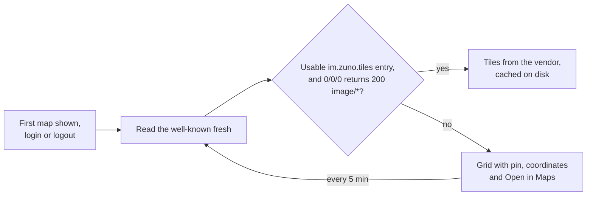

# Location Sharing

Location sharing has two halves that are architecturally opposite. The
**pin** is a one-off `m.location` message: it belongs in history, notifies
and previews like any message. It is built. The **live beacon** ("watch me
move for the next hour") is not a message but ephemeral shared state with a
hard expiry, closer to a call membership than to anything in the timeline.
It is designed, not built.

## Pin: architecture

| Piece | Role |
|---|---|
| `lib/core/location/geo_uri.dart` | Parses and formats `geo:lat,lon;u=m` (RFC 5870); malformed input gives `null`, never a throw |
| `location_message.dart` | Builds MSC3488 content; `locationOf(event)` reads a pin from any client |
| `current_position.dart` | Returns a fix (possibly approximate) or a typed failure: services off, denied, denied forever, unavailable |
| `map_tiles*.dart`, `map_tile_cache.dart` | The tile source, its probe, `mapTilesProvider` (`null` until a probe succeeds) and the tile cache |
| `lib/features/location/presentation/` | Share sheet, bubble, full-screen map with Open in Maps, and the map view (flutter_map, or a grid fallback) |

**Flow**: attach sheet → Location → the sheet finds a fix → an ordinary
encrypted, redactable message. Nothing is uploaded. Location is always
offered, like photos and files, even when nobody else is in the chat. On
receipt, `summarize()` gives every `m.location` the location kind, malformed
ones included. The bubble draws a mini map (or the grid), and a tap opens the
full-screen map.

**Tiles**: the server name's `/.well-known/matrix/client` names a raster
tile template, and the app fetches tiles straight from that vendor with the
app User-Agent and no auth header (the key rides in the query string).

flutter_map's built-in cache stores tiles under hashed names, caps its size
and honors `Cache-Control` and `ETag`. It is purged at logout, at account
deletion and by Clear media cache.

**Server contract** (outside this repo): the well-known carries
`"im.zuno.tiles": {"url": "https://…/{z}/{x}/{y}.png?key=…", "attribution":
"…"}`. The `url` must be `https` with all three placeholders, or the map
falls back to the grid; tiles are 256 px raster, zoom up to 19.
`attribution` is optional. It is shown after flutter_map's own
`flutter_map | © ` prefix, so it must not start with `©`.

## Pin: decisions

- **The pin is plain MSC3488**, the one interoperable piece of the design:
  other clients such as Element render Zuno's pins, and theirs render here.
- **The homeserver names the tile source; the app holds no key.** A key
  rotation or style change is a well-known edit, not a release, and someone
  on another homeserver never spends Zuno's quota. The key is public by
  nature, since every device sees it, so restrict it at the vendor.
- **The well-known is read fresh, not from the SDK's 3-day cache**, so a new
  or fixed source shows up within minutes. That costs one small GET at the
  first map per process, at login and logout, and every 5 minutes while no
  tiles work.
- **Degrade, never fail.** With no usable source, the map becomes a grid
  with the pin, the coordinates and Open in Maps, so the pin works on a
  homeserver with no tile entry at all.
- **`flutter_map`, not `google_maps_flutter`**, which would pull in Play
  Services. **`geolocator` owns location** because it sees states
  `permission_handler` cannot, such as services turned off and approximate
  grants. `permission_handler` keeps camera and microphone.
- **No thumbnail on the event.** MSC3488 allows one, but it would bake
  coordinates into an image that gets cached, saved and forwarded. The
  bubble draws its own map instead.
- **Approximate grants still send**, labelled approximate. The `u=`
  parameter carries the accuracy either way.
- **"Location is off" offers Open settings only where Settings opens on
  Location Services** (`locationServicesSettings`). iOS can only open the
  app's own page, which has no Location row while the service is off, so the
  message names the path instead. Blocked access opens the app's page on
  both platforms.
- **Tile spend is bounded**, since every cache miss is a billed request.
  The full map has a zoom floor and stays within a city-sized box around
  the pin (`CameraConstraint.contain`, which also stops world wrap).
  Previews are static. Only visible tiles are fetched, and fetches for
  tiles scrolled away are cancelled, so edges filling in during a pan is
  the accepted trade.
- **Attribution shows on the full-screen map only.** A bar on every preview
  read as a black footer in dark mode, and the credit stays one tap away.
  With no `attribution` in the entry, there is no bar.
- **Out of scope**: place search (a second third party), "someone viewed
  your location" receipts (the viewer would have to report on themselves),
  and geofences.

## Pin: gotchas

- **A tile cache is a location history** in plain files, outside the
  encrypted database. Keep the size cap and every purge site.
- **`mapTileCache()` is a forwarder, not the cache.** A purge destroys
  flutter_map's singleton, and a tile provider holding the old instance
  would stop caching until restart, so every call resolves the current one.
- **`geo:` intents need a `<queries>` entry** (Android 11+), or `launchUrl`
  reports no handler.
- **iOS needs `NSLocationAlwaysAndWhenInUseUsageDescription`** though Zuno
  never asks for Always. `geolocator_apple` links the Always API, so App
  Store upload rejects the build without the key (ITMS-90683). It reuses the
  When In Use string and is never shown.
- **The preview map sits inside an `IgnorePointer`**, so the bubble's
  detector must be `HitTestBehavior.opaque`. A deferring detector never sees
  the tap once tiles render.
- **The probe result lasts the whole process.** Once tiles work, nothing
  re-reads the well-known, so a revoked key shows grey tiles (not the grid)
  until restart: rotate keys with an overlap. The key is part of every tile
  URL and so of every cache key, which means a new key misses the whole
  cache once.
- No widget test renders real tiles. The bubble and sheet are tested on the
  grid path, with `mapTilesProvider` overridden.

## Live beacon: designed, not built

Nothing below exists in code. It records the design and its reasons.

**Why not a stream of timeline events.** MSC3672, which Element uses, sends
one timeline event per position update. That fails here: every room is
encrypted, and the server decides to push from the encrypted envelope,
before anything can tell a ping from a message. At a plausible cadence of
hundreds of pings an hour, each one would wake every member's phone,
reorder the room list, move read markers, and stay in federated history
forever for data that is worthless a minute later.

**Three channels instead**, mirroring the call layer one for one:

| Channel | Event | Carries | Precedent |
|---|---|---|---|
| Room state, keyed by user | `im.zuno.location_beacon` | Who is sharing and until when (`planned_until_ts`, `expires_ts`). Never coordinates | `m.call.member` |
| To-device, Olm-encrypted | `im.zuno.location_ping` | Room, beacon id, coordinates, accuracy, `ts`, `seq` | Call encryption keys |
| Timeline, twice per share | `im.zuno.location_share` and `…_end` | Start, and end with the duration, so history reads right | `im.zuno.call_summary` |

- **To-device is the right channel, not a workaround.** It never touches the
  timeline, federates no history, fires no push rules and moves no read
  marker. Olm is per device with forward secrecy, so devices that join the
  room later can never read the stream, unlike a Megolm timeline event.
- **Two timeline events, not one edited.** A start tile alone would leave the
  room list previewing "Live location" long after the share ended. Editing
  one tile at the end would depend on edit folding finding its target and
  make the tile's meaning mutable. Two events keep `summarize()` pure (it
  must stay importable from headless push isolates) and put the end at the
  right point in the transcript. They would add `MessageKind.locationShare`,
  carrying its payload on `MessageSummary` the way calls carry
  `CallSummary`.
- **Two clocks.** `planned_until_ts` is the user's fixed choice (15 minutes,
  1 hour or 8 hours; never indefinite). `expires_ts` is a short liveness
  TTL, refreshed well before it lapses, with the same timing and reasons as
  `m.call.member`. A killed app stops refreshing and the beacon goes stale
  within one TTL. A republish is skipped when nothing changed, and that
  comparison must exclude `expires_ts` (which changes every refresh) but
  include `planned_until_ts`.
- **Backlog collapse.** To-device messages queue for an offline viewer.
  Each ping carries `ts` and `seq`, and anything older than the newest seen
  for that beacon is dropped, so a viewer sees one point, not a replay.
- **Cadence.** Pings are distance-filtered and rate-limited, with a slow
  heartbeat even when still. That heartbeat tells "not moving" from "gone".
  Fan-out is one `sendToDeviceEncrypted` call for all devices.

**Android capture** would run in a location-typed foreground service, which
has location access while it runs, so `ACCESS_BACKGROUND_LOCATION` (a Play
policy review and an alarming system dialog) is never requested. Its
low-importance ongoing notification carries Stop, which runs headless
through the same isolate-port path as declining a call: opening the app to
stop would make it visible. If no live isolate answers, the process is dead
and the TTL ends the beacon. An approximate-only grant refuses live sharing,
since a dot kilometers off shown with full confidence is worse than none; a
pin still sends. iOS capture is undesigned.

**Surfaces and gating.**

- The attach sheet's Location would offer Send my location or Share live
  location, with a fixed duration.
- The beacon is a state event, so power levels gate it regardless. "Share
  live location" joins the permission catalog (`room_permission.dart`,
  default 0 so members may share) and is checked before a share starts, as
  calls check their membership event.
- A live banner in the call banner's slot names who is sharing and the time
  left. It is neutral, never an attention color: a live share is normal, and
  loud is reserved for things with consequences. It also shows for the
  sharer, since a share you cannot see is a share you forget.
- A full-screen map shows everyone sharing, with each one's last update and
  a Stop button for your own share.
- A one-screen explanation precedes the first live share only. A
  confirmation people learn to tap through is not consent.

**Termination contract.** The worst failure is a share that outlives its
owner's intent. Four independent guards prevent it: fixed durations only, the
liveness TTL, a notification for the whole share, and a one-tap Stop from the
notification, banner or map. The TTL holds when everything else fails, so the
state event's expiry is authoritative and the client's own Stop is only the
fast path.

**Accepted limits.**

- Pings generate no push, so a killed recipient sees the beacon and the last
  position only on next open. Waking phones to move a dot nobody is looking
  at is what this design avoids.
- The server and the room learn *that* you share and until when, never
  where. Without that state, someone opening the room mid-share could not
  discover it.
- There is no interop with Element's live location. Element sees only the
  two timeline events; pins interoperate fully.
- Its maps reuse the pin's tile source and grid fallback.
