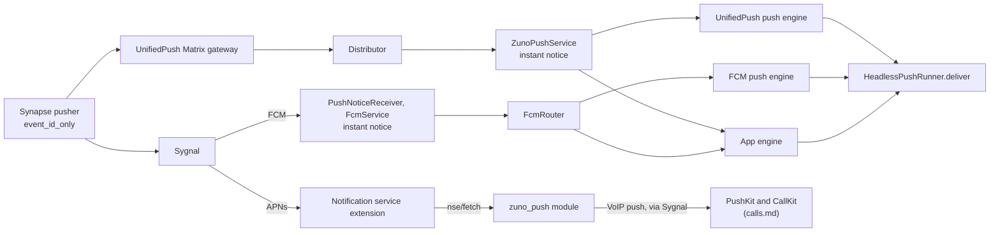

# Notifications

Android receives message pushes over one of three transports: FCM (the default), UnifiedPush, or an always-on background sync. iOS receives them over APNs, and a notification service extension (NSE) fetches and decrypts each message before it shows. Android shows each room as a conversation. On both platforms, Reply and Mark as read run without opening Zuno.

This doc also owns the iOS VoIP push transport, the `zuno_push` contract, the badge, notification settings and the push diagnostics hub. Related topics live elsewhere:

- Ring presentation, declines and the extension's fallback ring: `calls.md`.
- The client lease, `EngineHost`, the notify App Group, Keychain items and the `zuno/*` channel table: `app-foundation.md`.
- What a notification says for each event: `chats-messaging.md` (`event_display.dart`).
- Invitation announcements: `rooms-membership.md`. Join requests: `communities.md`. Which devices count as a new sign-in: `security-verification.md`.
- Why iOS works this way: `../decisions/ios-push-and-ring.md`.

## Architecture

### Push paths

Background sync has no push at all: a foreground service keeps `/sync` running.

### Delivery modes and settings

| Mode | Platform | Provider | Mechanism |
|---|---|---|---|
| `fcm` (default) | Android | `FcmDeliveryProvider` | FCM via Sygnal, received by app-owned Kotlin |
| `unifiedPush` | Android | `UnifiedPushDeliveryProvider` | The installed distributor, the system default first |
| `backgroundService` | Android | `BackgroundSyncDeliveryProvider` | An always-on `/sync` foreground service |
| `apns` (only mode) | iOS | `ApnsDeliveryProvider` | APNs via Sygnal, then the NSE |

- **`NotificationDeliveryProvider` is the transport abstraction**, with one singleton per mode. Its `start` and `stop` must be idempotent, because `_AuthGate` calls the active provider on every relevant rebuild.
- **The platform decides which modes exist** (`capabilities.deliveryModes`, `defaultDeliveryMode`). A stored mode the platform does not offer resolves to its default, and storage is left untouched. `set()` refuses a mode the platform does not offer or the picker shows disabled.
- **`_AuthGate` starts the active provider only while notifications are allowed.** Callers that bypass `_AuthGate` (the Settings Register buttons, `kickOffDeliveryMode` after a mode is chosen, the push engines) are covered because every provider re-checks permission itself before it registers. A failed permission read counts as allowed, so a broken read never silences delivery.
- **`_AuthGate` also wires the app into delivery:**
  - `bindAppStateToPushDelivery` gives both push runners the open room, an "app is resumed and syncing" check and the native "app in front" query. It then tells the FCM router that the app engine takes pushes (`markFcmAppReady`).
  - `trackPushClientFreshness` follows the app client's syncs, so a push can tell when that client is stale.
  - A reconnect calls `retryFailedDelivery`. Every resume calls `recheckDelivery`, re-claims the live routes (`calls.md`) and, on iOS, drains queued native notification actions.
  - On iOS it keeps `nseServicesProvider` and `pushRingServicesProvider` alive for the whole session.
- **Registration heals itself** (`registration_retry.dart`). Transient failures retry with exponential backoff, and a periodic pusher-list check re-posts a pusher the homeserver dropped. Final failures (no Play services, a distributor's `actionRequired`) are not retried.
- **Pusher gateways.** Every pusher uses format `event_id_only`. FCM and APNs pushers point at the homeserver's own host (`/_matrix/push/v1/notify`, from the `.well-known`-resolved homeserver), which must route to Sygnal (see the `zuno_push` section). A UnifiedPush pusher points at the distributor server's own Matrix gateway when that server advertises one, else at the public UnifiedPush Matrix gateway.
- **A failure becomes one `DeliveryFailure`**: a message and one action. It shows on the home banner and, where there is no mode choice (iOS), as a problem row on the Notifications page. Failure copy never names the server.
  - A dismissed banner stays hidden until a transport is ready again (for APNs, with no drops) or the user acts on it, so the same failure returning later shows again. The problem row ignores dismissals.
  - While notifications are off, the banner, the problem row and the delivery rows hide. Only the iOS calls failure still shows, since a VoIP ring needs no notification permission. A notification failure takes precedence over it.
- **Auto-fallback** (`delivery_auto_fallback.dart`). Three conditions trigger it: FCM cannot work (Play services missing or turned off, or a build without Firebase config), the user never chose a mode, and no FCM registration exists. The mode then flips to UnifiedPush if a distributor is installed, else to background sync, and a one-time notice says so. "Chose" means `set()` ran; a stored mode alone does not count.
- **FCM availability** (`FcmAvailabilityDecision`, `fcmAvailabilityProvider`) combines the Firebase config with the Play services status, and is re-read on resume.
  - The pickers disable FCM, with the reason, whenever it cannot work or the check is still running. "Update required" stays pickable, because choosing it offers Google's update flow.
  - A blocked device keeps its registration, offers Google's fix flow where one exists, and registers once a resume finds it usable.
  - An unknown status counts as usable: it never blocks a registration and never moves a registered user.
- **Settings → Notifications** holds the permission, sounds, Notify me, Diagnostics and, on iOS, Notification content. A row appears for any chat channel the user turned below default importance, opening its system page. Delivery is its own page only where there is a mode choice (Android): the mode, the transport's status and fixes, and the battery, background-data and Autostart rows.

### Push handling and posting (Dart, both platforms)

- **Every Android push goes through `HeadlessPushRunner.deliver`** into `handleIncomingPushNotification`. The handler resolves the event and dispatches in a fixed order: ring, room invitation, verification request, message. Every "do not notify" exit retracts the instant notice.
- **A push without an event id is a badge push.** FCM handles it natively (below). On UnifiedPush, an `unread` count of 0 cancels every chat notification.
- **The runner owns the client a push uses**, one runner per transport per isolate.
  - In the app engine, it uses the app's live client.
  - In a push engine, it opens a burst client under a background lease (`app-foundation.md`) and serializes its users through one queue. The client stays open across a burst until the app asks for the lease, the router settles the engine, or the engine ends; UnifiedPush also closes it once idle. The cost is tens of MB held in a cached process. A new burst client opens only once the previous one has finished closing.
  - `deliver` returns at the first visible outcome. Avatar and thumbnail refinement continues under its own wake-lock tag and keeps the burst client open, so the FCM ack never waits for it.
  - `settle()` closes an idle client and answers the router's retirement check (below). An FCM ring hold (`calls.md`) counts as work.
- **The runner drops a push in three cases.**
  - The app is resumed, syncing and really in front. "In front" comes with an FCM push, else from a native query, and a failed query counts as in front. A locked keyguard is never in front, so a hang-up push still stops a ring shown over the lock screen.
  - The client is signed out. The instant notice is retracted.
  - The lease is denied (`ClientLeaseDenied`). The instant notice stays.
- **Post first, refine later.** When the fetch is slow, a "New message" placeholder posts, named after the local room and routable to it. Real content replaces it silently. The placeholder records a marker but not the event id, so a later sync can still upgrade it, while an event whose placeholder the user already dealt with never posts again.
- **The `getEventByPushNotification` contract.** `null` means there is nothing to show (read on another device): it stays silent and retracts any placeholder. A throw means the fetch failed, and it is the only case that keeps the placeholder. An event that stays undecryptable keeps "New message" too, unless the user sent it.
- **A stale app client catches up beside the fetch.** When the app's client has not synced recently and no sync is running, a push starts a zero-timeout sync alongside the event fetch. A message waits briefly for it and stays silent if the sync shows it was read on another device. Rings, invitations and hang-ups never wait. The fetched event is stored only while no sync is pending, so it never races one.
- **The runner refreshes the access token before any action** (`ensureNotSoftLoggedOut`, time-bounded so the push still goes on). Fetching an event refreshes the token on its own, but re-registering a pusher after an endpoint change does not, and that failing silently would cost all notifications until Zuno is opened.
- **One poster for both producers.** The push handler and `MessageNotificationNotifier` (the sync path) both call `postMessageNotification`, with text from `event_display.dart`. Invitations, verification requests and join requests post through it too.
  - It posts the text first, with the sender's avatar when one is already on disk: the notification avatar cache, else the avatar the app itself shows.
  - It then refines the same line silently: with a fetched avatar, and with a photo's thumbnail. Where the platform shows neither (`notificationAvatars`, `notificationImages`, both off on iOS), it fetches neither.
  - The notified-events store makes a message notify once, whichever path posts first. A post without an event id is never deduped there.
- **On the sync path, a read waits for in-flight posts.** A room read while its post is still in flight is cleared once that post lands, so a late post cannot outlive the read.
- **Mentions-only** posts other messages quietly: on the push path, and on the sync path while Zuno is not in front. While Zuno is in front, it does not post them at all. A quiet placeholder that resolves to a mention alerts on the upgrade.

### State

| Store | Holds | Notes |
|---|---|---|
| Notified events (`notified_events_store.dart`) | Recently posted event ids, plus placeholder markers | A message notifies once, and a placeholder the user dealt with never returns |
| Threads (`notification_thread_store.dart`) | Per room: title, kind and the latest lines | One SharedPreferences key that every engine can read. Cleared by a cancel, by a post that takes over an instant notice, and by FCM's native badge clear |
| Room-name cache (`notification_room_cache.dart`, `notifications.rooms`) | One line per joined room: id, chat or group, name | Read natively by the instant notice. Rebuilt on a process's first sync and on syncs carrying room state, a leave or `m.direct` |
| Instant notices (native) | Room → event id, in process memory | `takePushNotice` answers true once, and only for that event |
| Avatar cache (`notification_avatar_cache.dart`) | Avatar files keyed by avatar URL | A changed avatar is a miss |
| Registrations | FCM token and a pending token; UnifiedPush endpoint, gateway and WebPush keys; APNs token, app id, dropped count and sound name | `stop` falls back to them when a permission revoke killed the process |
| Delivery log (`PushDeliveryLog.kt`) | One line per recent FCM data push: priorities, idle and standby state, handling and stage timings up to Dart's ack | Feeds Recent pushes and the hub's standby reading |

### Android presentation

- **One notification per room.** Its id is FNV-1a over the room id (`notification_ids.dart`, with a Kotlin twin `NotificationIds.kt` tested on the same vectors), because Dart's `String.hashCode` is not Java's and native code must hit the same id.
- **A `MessagingStyle` thread per room** holds its last lines. Posts to one room run one at a time and keep the lines in event-time order. A thread restarts once its notification is gone, so a swiped notification starts fresh, and a refinement for a dismissed thread is dropped.
- **Conversations.** Before each new-message post, `zuno_notifications` pushes a long-lived conversation shortcut for the room, which puts the notification in Android's Conversations section.
- **New sign-in alerts** post for every new own device, verified or not, on the `security` channel, which chat mute cannot silence. A tap opens the device list.
- **Reply and Mark as read** run in flutter_local_notifications' (FLN) action engine. They go to the app's live route first (`calls.md`), where the app's client performs each one once per txid. With no live app, they open a one-shot client under a background lease, retrying the hand-off for a few seconds while the lease is denied. A Reply that sends nothing throws, so it is retried rather than reported done.

Channels are grouped. Dart creates its own at `initialize()`, and native services create theirs through `NotificationChannels.ensure`:

| Group | Channels |
|---|---|
| Chats | `direct_messages`, `group_messages`, `quiet_messages` (low importance) |
| Calls | `calls_ringing`, `calls_ringing_group`, `calls_ongoing` (native) |
| Account | `security` (new sign-ins) |
| Background | `background_sync`, `uploads` (both native) |

A thread posts on Quiet messages only while every line in it is quiet. Retired channel ids are deleted at `initialize()`.

The native plugins in `packages/` are real `FlutterPlugin`s, because a hand-attached channel exists only on the engine that attached it. FLN's action engine registers every plugin itself, and the push engines list theirs (below). On an engine without the handler, a call throws `MissingPluginException`, which the best-effort callers swallow: no ring, no vibration, no error.

| Plugin | Provides |
|---|---|
| `zuno_notifications` | The instant notice, conversation shortcuts, push wake locks, the client lease, the thumbnail file provider |
| `zuno_vibration` | Message vibration tagged with notification usage |
| `zuno_call_style` | The CallStyle ring and its native player (`calls.md`) |

### Android: FCM pipeline

FCM is app-owned Kotlin on the Firebase Android SDK, in the app module. Dart reaches it only through `FcmBridge` over `zuno/fcm`, which does nothing where FCM is not an offered mode.

1. `PushNoticeReceiver`, a `RECEIVE` receiver beside Firebase's, drops duplicates and non-data messages, then posts the instant notice for an event push. While the app is not in front, it also takes a wake lock keyed by the message id and warms Flutter's loader.
2. `FcmService` handles a badge push natively (`FcmBadgeDecision`): an `unread` count of 0 while the app is not in front clears the chat channels and the thread store, and no engine boots. It hands an event push to `FcmRouter`, then waits for Dart's ack, up to a cap, so the process keeps service priority and Firebase's wake lock while Dart works.
3. `FcmRouter`, a main-thread executor over the pure, JUnit-tested `FcmRouting`, picks the engine:

| Situation | Result |
|---|---|
| The app engine is ready, or starting within its grace period | The app takes the push; pushes queue until it is ready |
| No app engine takes pushes | A ready headless engine (`--fcm-bg`), booting one if needed; pushes queue until it is ready |
| A headless boot is not ready in time | A failed boot. Repeated failures start a cool-down that finishes the queued pushes, leaving their instant notices |
| An engine goes away with pushes in flight, or answers `notImplemented` | The pushes are re-sent to another engine, and Dart dedupes them |
| A push has gone stale | It is finished, never replayed, so no stale ring |
| A headless engine has nothing in flight | It retires after a short idle while the app is ready, else after a long one |

4. **Retirement waits for quiet.** The router asks the engine `quiescent`, which `HeadlessPushRunner.settle()` answers; no timely answer counts as busy. A busy engine goes back to ready. A broken one is asked again periodically, then left running once the retries run out. An engine destroyed mid-write loses that write (`app-foundation.md`), so a rare leaked engine is the accepted cost.

- **Instant notice** (`PushNotice.kt`, rules in `PushNoticeDecision`): a "New message" line posted before any Dart runs, under the room's own notification id and its cached name. "In front" means the keyguard is unlocked and the process has foreground importance. The notice posts only while the app is not in front, nothing shows for the room, and Notify me is not mentions-only. Dart later replaces it in place or retracts it (`takePushNotice`, behind `instantPushNotices`).
  - A room in the name cache posts as a conversation with its shortcut, so it does not jump sections when Dart replaces it. An uncached room posts plain on `direct_messages`.
  - Dart posts silently over a notice only while that notice still shows, so a dismissed notice never mutes an alert. A notice also counts toward the tone's rate limit, so the next line in that room does not chime again.
- **Tokens.** FCM auto-init stays off until `getToken`, so a device on another mode never talks to Firebase.
  - `onNewToken` wakes Dart only when a registration is stored and the token differs. Whichever engine takes it, app or push, moves the pusher with its own client and deletes the one it replaces.
  - A move that fails (lease denied, offline) leaves the token pending, for the next push-engine client or the app's next start or recheck.
  - The deprecated `getToken`, `deleteToken` and `onNewToken` APIs stay. Their replacement needs Firebase's newer opt-in installation-ID registration, judged too new for the push path. The cost is a migration in `FcmPlatform` and `FcmService` once Google removes them.
- **Dropped messages.** When FCM reports that it deleted pending messages (`onDeletedMessages`), one native notice asks the user to open Zuno.

### Android: UnifiedPush, background sync and push engines

- **`ZunoPushService`** replaces the connector's service (`tools:node="remove"`), because the connector's bound-service delivery holds no wake lock. It posts the instant notice from `onMessage` and holds a wake lock, keyed by event id, until the Dart isolate that handled the push releases it. It delivers to the app engine while one is alive, else to a headless engine (`--unifiedpush-bg`). `Plugin.count` is an id allocator, not a liveness signal, so a generation comparison (`PushEngineDecision`) detects a superseded headless engine, which retires only once quiet, like FCM's.
- **Push engines** (FCM's headless engine and UnifiedPush's) register an explicit plugin allowlist (`PushEnginePlugins`, pinned by a test), not the generated registrant. Some plugins carry process-wide state: flutter_webrtc stops shared audio routing when its engine detaches, which would cut a live call's audio. audioplayers is out too, since the ring is native and voice messages play only in the app.
- **Battery.** Both fallbacks need a battery exemption, and UnifiedPush needs one for the distributor as well. `distributorBatteryRestricted` checks the distributor's package, since `isIgnoringBatteryOptimizations` accepts any package name. Where a maker's autostart screen resolves (`AutostartDecision`), Delivery shows an Autostart row and onboarding asks once (`onboarding.md`). Each maker's package must be listed in the manifest's `<queries>`, or Android 11+ hides it and nothing resolves.
- **Background sync** is a foreground service running `/sync` (`BackgroundSyncService`), typed `specialUse` on Android 14+ (`BackgroundSyncDecision`).
- **Designed, off: UnifiedPush over WebPush** through the homeserver's own Sygnal (`unifiedPushViaHomeserverGateway`). With the distributor's key set, the pusher would be keyed by the p256dh key, carry `endpoint` and `auth` in its data, and point at the homeserver instead of a third-party Matrix gateway. It needs a WebPush pushkin in Sygnal first.

### iOS: APNs alerts

- **The token** comes from `ApnsTokenPlugin`, registered as a plugin application delegate so the other plugins still see the token callbacks. `getToken` times out rather than waiting forever.
- **The pusher** (`apns_pusher.dart`) picks app id `im.zuno.chat.ios` or `.ios.dev` from the runtime APNs environment, because a token on the wrong environment is rejected and its pusher deleted. `PushEnvironment.swift` reads the environment from the signing profile: no profile (App Store, TestFlight) means production, and the Simulator means development. An unreadable environment falls back to the build mode for that launch only. A new app id or token re-registers and deletes the old pusher.
- **The pusher's `default_payload`** is a "New message" alert with `mutable-content: 1`, which runs the NSE. The static text is what shows when the NSE cannot run. The payload names `message_tone.caf` only while Message tone is on, so toggling the tone re-posts the pusher. The app's local posts name the same file, so both sound alike.
- **Drift and drops.** A pusher with an old gateway or format is re-posted (`checkApnsPusher`). A pusher that Sygnal deleted is counted before it is re-posted, and the count shows in the banner and in diagnostics. Sygnal deletes a pusher only after APNs rejected its token, so a rising count means a wrong environment, topic or encoding, which a quiet re-post would hide.
- **The app presents in front, the NSE out of front.** In front (resumed or inactive), the app posts from sync under the room's opaque thread id and records what it showed (`zuno/nse writeShown`), so no event shows twice. A pushed alert that arrives in front shows nothing. The app's posts follow the preview level, and quiet lines and thread updates are `passive`, so they reach the list without lighting the screen.
- **The badge is computed on the device.** It counts rooms with unread messages or an invitation, plus threads with a delivered message or invitation line. The app sets it from sync and at pause and resume, and the NSE with each line. Unread counts are the server's, minus hidden call events it still counts (`callUnreadCorrectionProvider`). The iOS Sygnal apps need badge counts off (`send_badge_counts: false`), or receipt-driven badge pushes overwrite the badge.
- **Alerts leave once read.**
  - When a room reaches zero unread, the app removes its pushed alerts (`zuno/apns removeDelivered`, matched by room id or token) before Dart cancels its own posts.
  - The NSE sweeps a room's alerts on a `read` reply and on catch-up's `read_rooms`.
  - Mark as read takes down the thread's alerts up to the notified second.
  - Native sweeps never remove Zuno's local posts.

### iOS: the notification service extension

The target is `ios/NotificationService/`, with its logic in `ios/NotifyShared/` (`NsePipeline`), Swift only.

1. With no read model (before first unlock, or signed out) or no event id, Apple's static alert passes through.
2. The floor, the room's name and "New message", goes in first, so a timeout still shows names. At preview Nothing it stops there, without any network call.
3. `POST nse/fetch` with the extension's credential returns `ok` only for a recent, unread event that notified this user; otherwise `read` or `gone`.
4. An encrypted event decrypts with a session the app exported, through the app's own vodozemac (`dlopen`ed from Runner's Frameworks). The session's owner and sender key must match the event, and a replayed (session, index) pair counts as already shown. If a session is missing while the app has only just written the read model, the extension waits briefly for its export.
5. `NseClassifier`, a Swift twin of the Dart decisions, picks the line, and `NseComposer` writes it. Catch-up and the badge follow.

| Outcome | Shows |
|---|---|
| Message, invitation, verification request | The line at the preview level. Under mentions-only, other messages show passively: an encrypted event is matched on the device (`MentionMatcher`, from the push rules the app publishes), an unencrypted one by the server's highlight. A shown invitation is marked so the app counts it announced |
| Call invite | A passive line once CallKit rang, else the fallback ring (`calls.md`) |
| Call summary | A missed one shows as a line, others are hidden. A missed or declined one also ends that ring in the app |
| `read` | A passive line, and the room's older pushed alerts go |
| Duplicate | Its newest copy again, passive, with the earlier pushed copies removed |
| Nothing to show (edits, reactions, call signaling, own events) | The thread's newest line again, passive, else a passive activity line |
| `gone`, rate limited | A quiet floor |
| Undecryptable, no credential, route failure, unreachable, mismatched | A loud floor |

- **Every push shows something.** Without Apple's filtering entitlement an extension cannot drop a push, so passive lines stand in. The entitlement is not granted, and the drop paths are not built.
- **Safe mode.** Consecutive crashed runs stop decryption for a while, and encrypted pushes show the loud floor meanwhile.
- **Catch-up.** Each fetch reply also carries `missed` (unread notified events past this device's server-side floor, which then advances) and `read_rooms` (rooms whose receipt moved). The extension takes down read rooms' alerts up to the receipt and posts missed events as passive lines, for a capped number of rooms plus one overflow line, within the extension's time and memory budget. This exists because APNs keeps only one pending push per app for an offline device. Catch-up lines are hidden while Zuno is in front.
- **Sessions are exported trimmed** (`SessionExporter`, hooked into the SDK's inbound-session writes). Per room, it keeps the newest session per sender device plus unused ones, up to a small cap. Each starts just past the highest index the app had decrypted a few minutes earlier, so the extension can decrypt only recent messages, never history. Muted rooms, long-idle rooms, preview Nothing and notifications off export none.
- **The credential** (`NseCredentialKeeper`) is re-minted daily with `POST nse/credential`, well inside the server's expiry, and sooner after an auth failure, rate-limited. It is kept in the notify Keychain item with the expiry the server set, and cleared at preview Nothing or with notifications off.

**The read model** (`zuno-nse/` in the notify App Group) is written by the app over `zuno/nse` and read by the extension:

| File | Written by | Holds |
|---|---|---|
| `meta` | App | User, device, server clock offset, ringtone, preview level, Notify me, tone, unread room tokens, mention rules, homeserver URL |
| `rooms/<t>` | App | Title, DM partner, its exported sessions, who may notify the room |
| `ledger` | App (native) | Recent CallKit calls (`calls.md`) |
| `shown.app`, `shown.nse` | App, extension | Event tokens already shown, so nothing shows twice |
| `nse.marks`, `nse.state` | Extension | What the app must act on (call summaries, invitations, test pushes); replay and undecryptable records |
| `ring.flag` | App (native) | The ringtone switch alone, unsealed so a ring before first unlock can read it |

- **Files are sealed** under the notify Keychain item and named by HMAC tokens (`t` for a room, `e` for an event). Thread ids, `userInfo` and the CallKit handle carry only tokens. Swift seals each file and writes it through a temp file and a rename, like every App Group file (`app-foundation.md`). Dart never sees the key.
- **`ReadModelPublisher`** writes `meta` and the changed room files after syncs (debounced) and at pause. **`NseServices`** adds the extension's fields, keeps the credential, syncs the badge, and reads the extension's outcomes on resume.
- **A recreated notify Keychain item** (its generation changed on resume) makes the app rebuild everything: thread tokens, exported sessions, the credential and every file.
- **Logs** `log.app` and `log.nse` sit in the notify group as plain text with hashed ids, size-capped.

### iOS: preview levels, taps and actions

| Level (`NotificationPreview`) | Line | Actions | CallKit name | Exported to the extension |
|---|---|---|---|---|
| Name and message (default) | Name and text | Reply, Mark as read | Caller or room | Titles, sessions, credential |
| Name only | Name and "New message"; a call summary keeps its text | None | Caller or room | The same |
| Nothing | "Zuno", "New message", one thread | None | "Zuno call" | Nothing |

- **The level governs every surface that can keep text**: the extension, the app's posts and CallKit, because the OS keeps what a notification showed. On an iOS version without Apple's fix for retained deleted notifications (`notificationRetentionUnpatched`), a one-time hint suggests Name only.
- **Categories.** Native code registers them; FLN gets none. Only at Name and message does a line get one: Reply and Mark as read for an event, Reply alone without one.
- **Runner is the `UNUserNotificationCenter` delegate** and completes every response exactly once (`OnceCompletion` around FLN). FLN completes its own notifications synchronously, so a response still open after FLN is one no plugin took: a pushed alert, or a local one posted before iOS terminated the app.

| Response | Handling |
|---|---|
| `willPresent`, catch-up line | Shows nothing, decided before FLN |
| `willPresent`, test push | Banner, list and sound, even in front |
| `willPresent`, not taken | A pushed alert shows nothing, since the app posts from sync; a local one shows as banner and list |
| Tap, not taken | Opens its room through `RoomLaunchPlugin` (`zuno/shortcuts`), by room id or, for an extension line, by its room token |
| Reply, Mark as read | Never reaches FLN: queued natively (below) |

- **Reply and Mark as read run in the app's own Dart** (`nativeNotificationActions`). `NotificationActionPlanner` turns the response into a request. `NotificationActionInbox` holds it under a background task, and `EngineHost` starts the app headless if needed. `NativeNotificationActionRunner` then takes it over `zuno/notification_actions` and runs it with the app's client, with a per-action timeout and one retry.
  - Reply requires unlock. A Reply that fails, times out or comes before first unlock leaves a "not sent" line in its thread. A sent Reply also marks the room read.
  - Mark as read on an extension line finds the event by the line's timestamp (stored events first, then the server), since extension lines carry only tokens.
- **Wake locks are background tasks on iOS** (`WakeLockPlugin`), and `appInFront` means "the app is active". Sends hold one (`zuno_send`) until the SDK returns, for message sends and encrypted to-device key shares. A message sent just before leaving Zuno therefore finishes its key share, and the recipients' extensions can decrypt it.

### `zuno_push` contract

`zuno_push` is a Synapse module in its own repo, at `/_synapse/client/zuno/push/v1/`. iOS needs it for rings and message content; Android uses only `health` and `test`. This repo implements only the client side.

| Endpoint | Caller, auth | Purpose |
|---|---|---|
| `PUT voip`, `DELETE voip` | App, Matrix bearer | Register or clear this device's PushKit token and payload key |
| `DELETE device` | App, bearer | At sign-out, before logout: forget everything held for this device |
| `GET health` | App, bearer | Pusher last success and failing-since, last VoIP result, credential state |
| `POST test` | App, bearer | A test alert (`$zuno_test_…`) through Synapse's own pusher |
| `POST nse/credential` | App, bearer | Mint the extension's credential (hashed on the server, 30-day expiry) |
| `POST nse/fetch` | Extension, `ZunoNotify` credential | The pushed event, `read` or `gone`, plus `missed` and `read_rooms` |
| `POST ring/status` | Extension, credential | Whether the module rang this device for a call (`calls.md`) |

What the app relies on:

- **Every module reply carries `X-Zuno-Push: 1`.** A reply without it (a proxy page, Synapse's own 404) is a route failure, never an answer. The extension shows a loud floor for it, so a misrouted proxy never silences notifications.
- **Reply shapes.** Errors are Matrix-shaped (`errcode`, `error`, plus `retry_after_ms` on a rate limit). Every 200 carries `server_ts`, which serves as the server clock. Clients ignore unknown fields, so the module can add fields without breaking older apps.
- **The fetch scope.** `ok` means the event notified this user, is still unread by Synapse's own thread-aware receipt rule, and is recent. `read` carries the receipt's timestamp. `gone` is deliberately uniform (no push, too old, another user's room, unknown ids), so the endpoint never confirms that an event exists.
- **Credential rotation.** Minting replaces the current credential, and the previous one stays valid for 10 minutes, so an extension in the middle of a push never fails on a rotation.
- **Failures.** Route, network, starting (`IM.ZUNO.STARTING`), 5xx and rate limits back off quietly. A refusal (a bad request, `IM.ZUNO.PUSH_DISABLED`) surfaces; for the VoIP registration, it becomes the banner's calls failure. Starting is a separate code from turned off, so a module still running its startup checks never reads as disabled. `DELETE voip` and `DELETE device` are never held back by startup, so sign-out always reaches the module.
- **Server routing.** The homeserver's proxy must route `/_matrix/push/v1/notify` to Sygnal. Without that route Synapse answers the path itself with a 404: every alert push is dropped while the pusher still posts, so Delivery looks healthy. The module posts rings to Sygnal directly, so rings can work while message pushes fail, or the reverse; the hub's pusher health (`GET health`) shows it.
- **VoIP push transport.** The module watches `m.call.member` and posts one push per target device to Sygnal's VoIP apps (`im.zuno.chat.ios.voip`, `.ios.dev.voip`). The payload is one sealed blob (`VoipBlob`): ChaCha20-Poly1305 under the device's own key, with the key id and expiry as associated data, padded to a fixed size. Ring handling is in `calls.md`.
- **VoIP registration** (`VoipRegistration`). The token and key go up at sign-in, on Retry, and on resume once either changed or the last registration has aged. It is never gated on notification permission, and it does not run without CallKit (a Mac, the Simulator). The key lives in an app-only Keychain item, new for each session and each new token; the previous key still opens blobs for a grace period after the new one is acknowledged. An invalidated token sends `DELETE voip`.
- **Shared vectors** in `test/fixtures/push/` (the VoIP blob, call UUIDs, opaque ids, sealed files, caller names, the Megolm golden session, and the extension's dispatch, HTML and mention decisions) run in both Dart and Swift tests. The module must pass the same files.

### Push diagnostics hub

`pushDiagnostics`, on both platforms. Settings → Notifications → Diagnostics is the only entry. `push_diagnostics_report.dart` builds per-platform sections from `zuno/push_diag snapshot` and server checks, chosen by the data present and the capability flags, never by a platform check.

| Section | Android | iOS |
|---|---|---|
| Permission | Notification permission, channel importance, full-screen intents, battery optimization, background data, standby bucket | Every notification setting iOS reports |
| This device | The delivery method and its status, Play services, the registration (not under background sync) | APNs environment and app id, the pusher (push key, gateway, format), dropped pushers |
| Calls | None | The VoIP key and registration, recent rings, the call ledger |
| Notification extension | None | Last run, its version against the app's, read-model age, recent results |
| Delivery | Module health and reachability, the last delivery | The same |
| Device reports | None | MetricKit exit and crash summaries |

- **Every native read is best-effort.** A failed read is omitted and reads as unknown, never as a denial.
- **Delivery** is `GET health` plus reachability. A route failure below 500 means the module is missing, and a disabled answer means it is turned off. Both are informational where the platform does not need the module (Android) and a problem where it does (iOS). App standby comes from the newest FCM delivery record, because a live reading taken inside the app is always active.
- **Send a test notification** goes through the module and Synapse's pusher, so it is unavailable without the module or under background sync. Both platforms show it even in front. Android handles the test prefix natively, and `FcmBadgeDecision` routes it to nothing, so Dart never fetches its fake event.
- **Push target** opens only from the hub. It shows this device's pusher details and last error, the other registrations, which can be removed, and on Android a Remove for this device. A removal lives in memory only, so it lasts until Register or the next start.
- **Share diagnostics** redacts Matrix ids, URLs and long tokens.

**Recent pushes** (`recent_pushes.dart`) merges several sources into one list, newest first, never with text or names. Android shows it only under FCM, the one mode where app code sees every push.

| Source | Rows |
|---|---|
| Android FCM delivery log | One per push, with its delay |
| iOS extension log | The message outcome and its `lag` (catch-up lines skipped) |
| iOS app log (`log.app`) | Ring outcomes, which `PushRingHandler` writes there rather than to the extension log |
| iOS call ledger, pushed calls | The call state, one row per call at its latest state |

`lag` is now minus the event's `origin_server_ts`, so it includes federation delay and server clock skew; a negative lag reads as zero.

## Decisions

- **FCM is app-owned Kotlin, not the Flutter Firebase plugins.** A Flutter plugin compiles into iOS too, and `firebase_messaging` builds its own background engine. With it, the app could not route a push to the running app, choose that engine's plugins or hold the service while Dart works. The code sits in the app module rather than a local plugin: the app builds both engines' channels, the receiver and wake-lock pairing needs app-module classes, and the JUnit tests live there. Firebase stays out of the iOS app.
- **Pushes go to the running app first.** While the app holds the client lease, a push engine cannot open a client at all, and the app's warm client skips an engine boot and `Client.init`. The router's grace period covers a cold start, where the engine is attached but Dart is not ready yet.
- **FCM first, then UnifiedPush, then background sync.** Only a high-priority FCM message earns a temporary power allowlist. The fallbacks depend on battery exemptions, and UnifiedPush can lose a push before Dart runs when the connector's service bind stalls past the system's watchdog.
- **An instant notice whenever the app is not in front.** A cold push takes seconds to reach the screen (process, engine, database, client, fetch), while the notice lands at process start. Gating it on "no engine alive" would leave most pushes to Dart, since an engine often stays up between pushes.
- **No foreground service on the cold push path.** Its gain is unmeasured, Play's foreground-service policy applies, and long work would show a visible notification. The delivery log's timings exist to measure it. The cost is that the cold path stays in the background CPU class.
- **Every high-priority push ends in a notification.** FCM deprioritizes an app whose high-priority messages repeatedly show nothing. Silent consumers are therefore kept off the push path or made visible (quiet mentions-only lines, the undecryptable placeholder). Two still consume silently: a message already read elsewhere, and a declined call summary, whose push stops a ring on the user's other devices.
- **Server push rules** (`server_push_rules.dart`). `PushRuleMaintenanceNotifier` maintains them once the account's rules have synced. Two override rules with no actions match `m.annotation` and `m.reference` relations, which stay cleartext in encrypted events, so encrypted reactions, call declines and verification follow-ups never push; edits are already covered by `.m.rule.suppress_edits`. `.m.rule.message` gets a `sound` tweak, because Synapse sends an unencrypted event without one at normal priority, which Doze holds. `event_id_only` drops the tweak itself, so only the priority changes, but other clients on the account then play a sound too.
- **`event_id_only` payloads.** No content passes through Google or Apple, and every push costs a fetch.
- **The burst client's catch-up `/sync` stays.** `Client.init` always runs one, and it brings the room keys decryption needs; discarding it would waste the download and make the app fetch it again. Keeping the client open across a burst makes it one sync per burst, not one per push.
- **Notification actions stay in Dart.** On Android, a native renderer would re-implement `MessagingStyle` and `RemoteInput`, and the client lease already makes the action engine's client safe. The cost is that the first action in a process boots FLN's engine. On iOS, FLN's action engine would be a second engine with a second client, so native code only queues the action, and one engine and one client serve rings, actions and the UI.
- **The ack waits until the notified-event marks are on disk.** Acking earlier would save tens of ms but risks posting the same event twice.
- **`MessagingStyle` over `BigPicture`.** A conversation needs `MessagingStyle`, a `Person` and a long-lived shortcut. A photo still shows as an image on its line, through a content URI, so nothing is lost.
- **No explicit group summary.** Native Mark as read cancels the chat notification before Dart runs and would leave a childless summary behind, which Android shows as an ordinary notification. Android bundles four or more chats by itself; an explicit bundle below four would need native message notifications.
- **One prefs key for all threads.** A cross-isolate race can lose a line, which is cosmetic, and FCM's native badge clear then drops a single key.
- **The sync path ignores the initial sync**, so a cache clear cannot replay old messages as new.

## Gotchas

- **The APNs pushkey is the token bytes in base64, never hex.** Sygnal base64-decodes pushkeys, and hex is valid base64 that decodes to junk. APNs rejects it, and the pusher is deleted with no symptom.
- **`stopAllNotificationDelivery` is every sign-out's push teardown**, run while the token still works (the sequence: `authentication.md`). It stops every mode, offered or not. With `voipRing`, it also sends `DELETE device`, wipes the read model (`zuno-nse` except its signed-out marker, and the notify Keychain item), deletes the VoIP keys and turns VoIP pushes off.
- **A notification-permission revoke kills the process**, so the next launch's `stop` knows only the persisted registration. Both push providers' `stop` fall back to it, or the pusher would stay on the homeserver.
- **Sygnal omits falsy counts and then drops the empty badge push**, so an `unread` 0 clear may never arrive. The next sync cleans up instead.
- **Background audio hardening mutes app-process sound** once no activity is visible, but a channel's own sound is played by the system and is exempt. One-shot sounds therefore go on a channel; the looping ring relies on the full-screen activity.
- **Never reuse a retired channel id** (`messages`, `messages_group`, `messages_sound_v1`, `messages_group_sound_v1`): recreating one restores its old settings. A channel's sound is fixed at creation, and its group can be set only while it has none.
- **The instant notice never creates a channel**, so a missing channel means no notice. It alerts through the channel's own sound and vibrates by hand, because message channels have vibration off. The hand vibration uses notification usage: Android 12+ drops background vibrations of other usages, and the `vibration` package tags every buzz as an alarm.
- **A call or invitation push gets the instant notice first**, since `event_id_only` carries no event type. An invitation carries the push's event id and replaces the notice silently; a ring is presented first and the notice retracted after.
- **A same-room burst must not re-post silently while the tone plays.** `messageAlertFor` returns `silentUpdate` for the same room, which mutes the update without cutting the tone.
- **The FCM ack must not wait on a ring hold.** The service handles one message at a time, so the hang-up push would queue behind the hold until the ack cap. The hold runs beside the ack instead.
- **Under Doze, a push still needs a network round trip** for its event, and the receiver's wake lock holds only inside FCM's temporary allowlist window. A declined battery exemption has no client-side fix beyond the placeholder.
- **`ZunoPushService.onCreate` boots the engine before `onMessage`**, so the UnifiedPush notice waits behind it. Deferring the boot needs a fork of the connector.
- **Sound settings and the room-name cache are raw SharedPreferences keys**, because headless engines have no provider scope and native code reads the cache.
- **Two plugins declaring `androidx.core.content.FileProvider` collide at manifest merge**, which is why the thumbnail provider is the `NotificationFileProvider` subclass with its own authority.
- **`UnifiedPush.initialize()` is a no-op on Linux**, so the provider registers its callbacks through `UnifiedPushPlatform.instance`. Otherwise test fakes never get `onNewEndpoint`.
- **Background sync must not be `dataSync` on Android 14+.** Android 15 caps that type at 6 h a day and crashes the app past it.
- **`pushConversationShortcut` is gated by `notificationAvatars`.** iOS has neither without communication notifications.
- **FLN on iOS must never prompt and gets no categories.** It prompts by default and throws without `DarwinInitializationSettings`, stalling cold start, so every permission request is off and onboarding is the only ask. Its `setNotificationCategories` would replace the set native code registers.
- **On iOS, "not taken" means FLN did not complete synchronously.** An FLN that completes asynchronously would open a tapped room twice, so re-check this on every FLN upgrade.
- **The extension needs `flutter_vodozemac`'s `ios_decrypt_event` and `ios_free_result`.** An upgrade that drops them turns every encrypted push into a floor; `VodozemacMegolmTests` decrypts a Dart-pickled session to catch it.

## Extending

- **A new transport** implements `NotificationDeliveryProvider` with `retryIfFailed` and `recheckRegistration`, adds its enum value, and wires `notificationDeliveryProviderFor`, `retryFailedDelivery`, `recheckDelivery` and `deliveryDependsOnBatteryExemption`. It is then listed in the platform's `deliveryModes` in `capabilitiesFor`.
- **A new message producer** builds a `MessageNotificationContent` and calls `postMessageNotification`, never `showMessage`.
- **A new headless notification action** follows `runHeadlessMessageAction` on Android: a per-run wake-lock tag, one txid, the live route first, `clientOrPatientHandOff` for the client. On iOS it adds its kind to `NotificationActionPlanner` and `NativeNotificationActionRunner`, and it runs in the app's own Dart.
- **An event that must never notify** gets a cleartext relation (`m.reference`), not a new push rule. Any other server push rule change goes into `PushRuleMaintenanceNotifier`.
- **A plugin a push engine calls** goes into `PushEnginePlugins`, or its `MissingPluginException` is silently swallowed. Plugins with process-wide side effects stay out.
- **A new event shape** also goes into `NseClassifier` and `nse_dispatch_v1.json`.
- **Whatever the extension needs** goes into the read model (`ReadModelPublisher`, `NseServices`), never a Matrix token or `zuno.db`. Its Swift goes in `ios/NotifyShared/`.
- **Anything needing payload content** must assume `event_id_only`.
