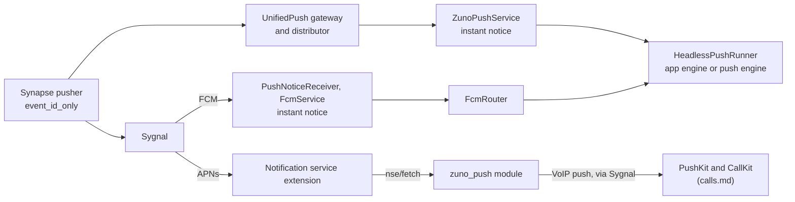

# Notifications

Android receives message pushes over one of three transports: FCM (the default), UnifiedPush, or an always-on background sync. iOS receives them over APNs, and a notification service extension (NSE) fetches and decrypts each message before it shows. Android shows each room as a conversation. On both platforms, Reply and Mark as read run without opening Zuno.

This doc also owns the iOS VoIP push transport, the `zuno_push` contract, the badge, notification settings and the push diagnostics hub. Related topics live elsewhere:

- Ring presentation, declines and the extension's fallback ring: `calls.md`.
- The client lease, `EngineHost`, the notify App Group, Keychain items and the `zuno/*` channel table: `app-foundation.md`.
- What a notification says for each event: `chats-messaging.md` (`event_display.dart`).
- Invitation announcements: `rooms-membership.md`. Join requests: `communities.md`. Which devices count as a new sign-in: `security-verification.md`.
- Why iOS works this way: `../decisions/ios-push-and-ring.md`.

## Architecture

### Push paths

Background sync has no push at all: a foreground service keeps `/sync` running.

### Delivery modes and settings

| Mode | Platform | Provider | Mechanism |
|---|---|---|---|
| `fcm` (default) | Android | `FcmDeliveryProvider` | FCM via Sygnal, received by app-owned Kotlin |
| `unifiedPush` | Android | `UnifiedPushDeliveryProvider` | The installed distributor |
| `backgroundService` | Android | `BackgroundSyncDeliveryProvider` | An always-on `/sync` foreground service |
| `apns` (only mode) | iOS | `ApnsDeliveryProvider` | APNs via Sygnal, then the NSE |

- **`NotificationDeliveryProvider` is the transport abstraction**, one per mode. `_AuthGate` starts the active provider on every relevant rebuild while notifications are allowed, so `start` and `stop` must be idempotent. Every provider also re-checks the permission itself, because some callers bypass `_AuthGate`.
- **The platform decides which modes exist** (`capabilities.deliveryModes`). A stored mode the platform does not offer resolves to the platform's default.
- **Registration heals itself.** Transient failures retry with backoff, and a periodic check re-posts a pusher the homeserver dropped. Final failures, such as missing Play services, are not retried.
- **Pushers.** Every pusher uses format `event_id_only`, so no message content passes through Google or Apple and every push costs a fetch. FCM and APNs pushers point at the homeserver's own host, which must route to Sygnal (see the `zuno_push` contract). A UnifiedPush pusher points at the distributor server's own Matrix gateway when it advertises one, else at the public one.
- **A failure becomes one `DeliveryFailure`**: a message and one action, shown on the home banner and, on iOS, as a problem row on the Notifications page. While notifications are off, only the iOS calls failure still shows, since a VoIP ring needs no notification permission.
- **Auto-fallback.** When FCM cannot work (no Play services, or a build without Firebase config), the user never chose a mode and no FCM registration exists, the mode moves to UnifiedPush if a distributor is installed, else to background sync. A one-time notice says so.
- **Settings → Notifications** holds the permission, sounds, Notify me, Diagnostics and, on iOS, Notification content (the preview level). Delivery gets its own page only on Android, where there is a mode choice.

### Push handling and posting (Dart)

- **Every Android push goes through `HeadlessPushRunner.deliver`** into `handleIncomingPushNotification`, which resolves the event and dispatches in a fixed order: ring, room invitation, verification request, message.
- **The runner owns the client a push uses.** In the app engine it uses the app's live client. In a push engine it opens a burst client under a background lease (`app-foundation.md`) and keeps it open across a burst, so a burst costs one catch-up sync rather than one per push.
- **The runner drops a push** while the app is resumed, syncing and really in front, and when the user is signed out or the lease is denied. A locked keyguard never counts as in front, so a hang-up push still stops a ring shown over the lock screen.
- **Post first, refine later.** When the fetch is slow, a "New message" placeholder posts for the room, and the real content replaces it silently. Avatars and photo thumbnails refine the posted line afterwards, so the FCM ack never waits for them.
- **The fetch contract** (`getEventByPushNotification`). `null` means there is nothing to show, such as a message read on another device, and retracts any placeholder. Only a throw, meaning the fetch failed, keeps the placeholder.
- **A stale app client catches up beside the fetch**, so a message already read on another device stays silent.
- **One poster for both producers.** The push handler and the sync path (`MessageNotificationNotifier`) both call `postMessageNotification`, never `showMessage`, with text from `event_display.dart`. Invitations, verification requests and join requests post through it too. The notified-events store makes each event notify once, whichever path posts first.
- **Mentions-only** posts other messages quietly, and not at all while Zuno is in front.
- **The sync path ignores the initial sync**, so a cache clear cannot replay old messages as new.

### Android presentation

- **One notification per room.** Its id is an FNV-1a hash of the room id, because Dart's `String.hashCode` is not Java's and native code must hit the same id.
- **Each room is a `MessagingStyle` conversation**: a thread of its latest lines plus a long-lived conversation shortcut, which puts it in Android's Conversations section.
- **New sign-in alerts** post for every new own device on the `security` channel, which chat mute cannot silence.
- **Reply and Mark as read** run in flutter_local_notifications' (FLN) action engine. They go to the running app first, through its live route (`calls.md`). With no live app, they open a one-shot client under a background lease.
- **The native plugins in `packages/` are real `FlutterPlugin`s** (`zuno_notifications`, `zuno_vibration`, `zuno_call_style`), because a hand-attached channel exists only on the engine that attached it. On an engine without the handler, a call throws `MissingPluginException`, which best-effort callers swallow: no ring, no vibration, no error.

| Channel group | Channels |
|---|---|
| Chats | `direct_messages`, `group_messages`, `quiet_messages` (low importance) |
| Calls | `calls_ringing`, `calls_ringing_group`, `calls_ongoing` |
| Account | `security` (new sign-ins) |
| Background | `background_sync`, `uploads` |

### Android: FCM pipeline

FCM is app-owned Kotlin on the Firebase Android SDK, in the app module. Dart reaches it only through `FcmBridge` over `zuno/fcm`.

1. `PushNoticeReceiver`, beside Firebase's own receiver, drops duplicates and posts the instant notice for an event push.
2. `FcmService` handles a badge push natively: an `unread` count of 0 clears the chat notifications without booting an engine. It hands an event push to `FcmRouter` and waits for Dart's ack, so the process keeps service priority and Firebase's wake lock while Dart works.
3. `FcmRouter`, over the pure, JUnit-tested `FcmRouting`, picks the engine:

| Situation | Result |
|---|---|
| The app engine is ready, or starting within its grace period | The app takes the push |
| No app engine takes pushes | A headless engine (`--fcm-bg`), booted if needed |
| An engine goes away with pushes in flight | The pushes are re-sent to another engine, and Dart dedupes them |
| A push has gone stale | It is finished, never replayed, so no stale ring |
| A headless engine is idle | It retires only once it answers that it is quiet, because an engine destroyed mid-write loses that write |

- **One classifier for every Android push** (`PushKind`, in `zuno_notifications`): test, message or badge. FCM and UnifiedPush both switch on it, so a rule for one kind of push lives in one place.
- **The instant notice** is a "New message" line posted natively before any Dart runs, under the room's notification id and its cached name. It posts only while the app is not in front, nothing shows for the room, and Notify me is not mentions-only. Dart later replaces it in place or retracts it.
- **Tokens.** FCM auto-init stays off until `getToken`, so a device on another mode never talks to Firebase. The deprecated token APIs stay, because their replacement needs Firebase's newer installation-ID registration, judged too new for the push path.

### Android: UnifiedPush, background sync and push engines

- **`ZunoPushService` replaces the UnifiedPush connector's service**, because the connector's bound-service delivery holds no wake lock. It posts the instant notice, holds a wake lock until Dart has handled the push, and delivers to the app engine, else to a headless engine (`--unifiedpush-bg`).
- **Push engines register an explicit plugin allowlist** (`PushEnginePlugins`), not the generated registrant, because some plugins carry process-wide state. flutter_webrtc, for one, repoints its process-wide singleton at the newest engine that registers it, which would send a live call's WebRTC events to a push engine.
- **Battery.** Both fallbacks need a battery exemption, and UnifiedPush needs one for the distributor as well. Where a maker's autostart screen exists, Delivery shows an Autostart row and onboarding asks once (`onboarding.md`).
- **Background sync** is a foreground service running `/sync`, typed `specialUse` on Android 14+.
- **Designed, off: UnifiedPush over WebPush** through the homeserver's own Sygnal instead of a third-party Matrix gateway. It needs a WebPush pushkin in Sygnal first.

### iOS: APNs alerts

- **The pusher's app id** (`im.zuno.chat.ios` or `.ios.dev`) follows the APNs environment, read from the signing profile at runtime, because a token sent to the wrong environment is rejected and its pusher deleted.
- **The pusher's `default_payload`** is a "New message" alert with `mutable-content: 1`, which runs the NSE. The static text shows only when the NSE cannot run. The payload names the message tone only while Message tone is on, so toggling the tone re-posts the pusher.
- **Dropped pushers are counted.** Sygnal deletes a pusher only after APNs rejected its token, so the app counts each drop before re-posting and shows the count in the banner and diagnostics. A quiet re-post would hide a wrong environment, topic or encoding.
- **The app presents in front, the NSE out of front.** In front, the app posts from sync and records what it showed, so no event shows twice, and a pushed alert that arrives in front shows nothing.
- **The badge is computed on the device**, from rooms with unread messages or an invitation. The app sets it from sync, and the NSE with each line. The iOS Sygnal apps need `send_badge_counts: false`, or receipt-driven badge pushes overwrite it.
- **Alerts leave once read.** The app removes a read room's pushed alerts, and the NSE sweeps them on its next fetch.

### iOS: the notification service extension

The target is `ios/NotificationService/`, with its logic in `ios/NotifyShared/` (`NsePipeline`), Swift only.

1. With no read model (before first unlock, or signed out), Apple's static alert passes through.
2. A floor goes in first, the room's name and "New message", so a timeout still shows names. At preview Nothing it stops there, with no network call.
3. `POST nse/fetch` returns the event only if it is recent, unread and notified this user, else `read` or `gone`.
4. An encrypted event decrypts with a Megolm session the app exported, through the app's own vodozemac.
5. `NseClassifier`, a Swift twin of the Dart decisions, picks the line. Catch-up and the badge follow.

| Outcome | Shows |
|---|---|
| Message, invitation, verification request | The line at the preview level. Under mentions-only, other messages show passively, with mentions in encrypted events matched on the device |
| Call invite | A passive line once CallKit rang, else the fallback ring (`calls.md`) |
| Read, duplicate, or nothing to show (edits, reactions, own events) | A passive line |
| `gone`, rate limited | A quiet floor |
| Undecryptable, no credential, route failure | A loud floor |

- **Every push shows something.** Without Apple's filtering entitlement an extension cannot drop a push, so passive lines stand in for silence.
- **Catch-up.** Each fetch reply also carries `missed` events and `read_rooms`, so the extension posts what it missed and takes down alerts for rooms read elsewhere. It exists because APNs keeps only one pending push per app for an offline device.
- **Trimmed session export.** Per room, the app exports only recent sessions, each starting just past what it had already decrypted, so the extension can decrypt new messages but never history. Muted rooms, idle rooms, preview Nothing and notifications off export none.
- **The extension's credential** is minted by the app (`POST nse/credential`) and re-minted well inside its expiry, so the extension never holds a Matrix token.

**The read model** (`zuno-nse/` in the notify App Group) is written by the app over `zuno/nse` and read by the extension. `ReadModelPublisher` writes it after syncs and at pause, and `NseServices` keeps the credential, the badge and the extension's outcomes.

| File | Written by | Holds |
|---|---|---|
| `meta` | App | The account, settings, unread rooms and mention rules |
| `rooms/<t>` | App | Title, DM partner and exported sessions |
| `ledger` | App | Recent CallKit calls (`calls.md`) |
| `shown.app`, `shown.nse` | Each side | Events already shown, so nothing shows twice |
| `nse.marks` | Extension | What the app must act on, such as call summaries and invitations |

Files are sealed under the notify Keychain item and named by HMAC tokens, and thread ids, `userInfo` and the CallKit handle carry only tokens. Dart never sees the key.

### iOS: preview levels, taps and actions

| Level (`NotificationPreview`) | Line | Actions | CallKit name |
|---|---|---|---|
| Name and message (default) | Name and text | Reply, Mark as read | Caller or room |
| Name only | Name and "New message" | None | Caller or room |
| Nothing | "Zuno", "New message" | None | "Zuno call" |

- **The level governs every surface that can keep text**: the extension, the app's own posts and CallKit, because the OS keeps what a notification showed.
- **Runner is the `UNUserNotificationCenter` delegate** and completes every response exactly once. FLN completes its own notifications synchronously, so a response still open after FLN is a pushed alert or extension line, and a tap on one opens its room.
- **Reply and Mark as read run in the app's own Dart.** Native code queues the action under a background task, `EngineHost` starts the app headless if needed, and the app's client runs it. A Reply that fails leaves a "not sent" line in its thread.
- **Wake locks are background tasks on iOS.** Sends hold one until the SDK returns, so a message sent just before leaving Zuno finishes its key share and the recipients' extensions can decrypt it.

### `zuno_push` contract

`zuno_push` is a Synapse module in its own repo, at `/_synapse/client/zuno/push/v1/`. This repo implements only the client side. iOS needs the module for rings and message content, while Android uses only `health` and `test`.

| Endpoint | Caller, auth | Purpose |
|---|---|---|
| `PUT voip`, `DELETE voip` | App, Matrix bearer | Register or clear this device's PushKit token and payload key |
| `DELETE device` | App, bearer | At sign-out, forget everything held for this device |
| `GET health` | App, bearer | Pusher, VoIP and credential health |
| `POST test` | App, bearer | A test alert through Synapse's own pusher |
| `POST nse/credential` | App, bearer | Mint the extension's credential (30-day expiry) |
| `POST nse/fetch` | Extension, `ZunoNotify` credential | The pushed event, `read` or `gone`, plus catch-up |
| `POST ring/status` | Extension, credential | Whether the module rang this device for a call (`calls.md`) |

What the app relies on:

- **Every module reply carries `X-Zuno-Push: 1`.** A reply without it, such as a proxy page or Synapse's own 404, is a route failure, never an answer. The extension shows a loud floor for it, so a misrouted proxy never silences notifications.
- **Reply shapes.** Errors are Matrix-shaped, with `retry_after_ms` on a rate limit. Every 200 carries `server_ts`, which serves as the server clock. Clients ignore unknown fields, so the module can add fields without breaking older apps.
- **The fetch scope.** `ok` means the event notified this user, is still unread by Synapse's own thread-aware receipt rule, and is recent. `gone` is deliberately uniform, so the endpoint never confirms that an event exists.
- **Credential rotation.** Minting replaces the credential, and the previous one stays valid for 10 minutes, so an extension in the middle of a push never fails on a rotation.
- **Failures.** Route, network, startup (`IM.ZUNO.STARTING`), 5xx and rate-limit failures back off quietly, while a refusal such as `IM.ZUNO.PUSH_DISABLED` surfaces to the user. Starting has its own code so a module still running its startup checks never reads as disabled. `DELETE voip` and `DELETE device` are never held back by startup, so sign-out always reaches the module.
- **Server routing.** The homeserver's proxy must route `/_matrix/push/v1/notify` to Sygnal. Without that route Synapse answers with a 404, and every alert push is dropped while Delivery still looks healthy. The module posts rings to Sygnal directly, so rings and message pushes can fail independently, and `GET health` shows which.
- **VoIP push transport.** The module watches `m.call.member` and sends one VoIP push per target device through Sygnal's VoIP apps (`im.zuno.chat.ios.voip`, `.ios.dev.voip`). The payload is one sealed, fixed-size blob (`VoipBlob`): ChaCha20-Poly1305 under the device's own key, with the key id and expiry as associated data.
- **VoIP registration.** The app sends its PushKit token and payload key at sign-in, and again when either changes or the registration has aged. It never depends on notification permission. The key is new for each session and token, and the previous key still opens blobs for a grace period.
- **Shared vectors** in `test/fixtures/push/` (the VoIP blob, opaque ids, sealed files, the extension's decisions) run in both Dart and Swift tests, and the module must pass the same files.

### Push diagnostics hub

Settings → Notifications → Diagnostics, on both platforms. `push_diagnostics_report.dart` builds its sections from a native snapshot (`zuno/push_diag`) and server checks, chosen by the data present and the capability flags, never by a platform check.

Both platforms show the permission, this device's registration and the module's health. iOS adds the VoIP registration and recent rings, the extension's recent runs, and MetricKit exit and crash summaries.

- **Every native read is best-effort.** A failed read shows as unknown, never as a denial.
- **A missing or disabled module** is informational on Android, which does not need it, and a problem on iOS.
- **A refused VoIP registration** shows the module's answer under Calls until a registration goes through or the user signs out, since the home banner cannot say why calls will not ring.
- **Send a test notification** goes through the module and Synapse's pusher, so it is unavailable without the module or under background sync. It shows even in front. On Android a test push never reaches Dart (`PushKind.TEST`), so Dart never fetches its fake event.
- **Recent pushes** merges the FCM delivery log, the extension and app logs and the call ledger into one list, never with text or names. Android shows it only under FCM, the one mode where app code sees every push.
- **Push target** shows this device's pusher details and last error, and lets the user remove other registrations.
- **Share diagnostics** redacts Matrix ids, URLs and long tokens.

## Decisions

- **FCM is app-owned Kotlin, not the Flutter Firebase plugins.** `firebase_messaging` builds its own background engine, so the app could not route a push to the running app, choose that engine's plugins or hold the service while Dart works. A Flutter plugin would also compile Firebase into iOS.
- **Pushes go to the running app first.** While the app holds the client lease, a push engine cannot open a client at all, and the app's warm client skips an engine boot.
- **FCM first, then UnifiedPush, then background sync.** Only a high-priority FCM message earns a temporary power allowlist, while the fallbacks depend on battery exemptions.
- **An instant notice whenever the app is not in front.** A cold push takes seconds to reach the screen, while the notice lands at process start.
- **No foreground service on the cold push path.** Its gain is unmeasured and Play's foreground-service policy would apply, so the cold path stays in the background CPU class.
- **Every high-priority push ends in a notification**, because FCM deprioritizes an app whose high-priority messages repeatedly show nothing. Only a message already read elsewhere and a declined call summary stay silent.
- **The app maintains server push rules** (`server_push_rules.dart`). Override rules stop `m.annotation` and `m.reference` relations from pushing, since those stay cleartext in encrypted events, so encrypted reactions, call declines and verification follow-ups never push. `.m.rule.message` gets a `sound` tweak, because Synapse otherwise sends an unencrypted event at normal priority, which Doze holds. The cost is that other clients on the account play a sound too. An event that must never notify gets a cleartext relation, not a new push rule.
- **Notification actions stay in Dart.** On Android a native renderer would re-implement `MessagingStyle` and `RemoteInput`. On iOS a second engine would mean a second client, so native code only queues the action.
- **No explicit group summary.** Native Mark as read cancels a chat notification before Dart runs and would leave a childless summary, which Android shows as an ordinary notification. Android bundles four or more chats by itself.

## Gotchas

- **The APNs pushkey is the token bytes in base64, never hex**, because Sygnal base64-decodes it and hex decodes to junk that APNs rejects, deleting the pusher with no symptom.
- **`stopAllNotificationDelivery` is every sign-out's push teardown**, run while the token still works (`authentication.md`): it stops every mode and, on iOS, tells the module to forget the device and wipes the read model and VoIP keys.
- **A notification-permission revoke kills the process**, so both push providers' `stop` fall back to the persisted registration, or the pusher would stay on the homeserver.
- **Sygnal omits falsy counts and drops the empty badge push**, so an `unread` 0 clear may never arrive and the next sync cleans up instead.
- **Background audio hardening mutes app-process sound** once no activity is visible, so one-shot sounds play as a channel's own sound, which the system plays.
- **Never reuse a retired channel id** (`messages`, `messages_group`, `messages_sound_v1`, `messages_group_sound_v1`), because recreating one restores its old settings.
- **The instant notice never creates a channel**, so a missing channel means no notice.
- **Message vibration is done by hand with notification usage**, because message channels have vibration off and Android 12+ drops background vibrations of other usages.
- **A call or invitation push first gets the instant notice**, since `event_id_only` carries no event type, and Dart then replaces or retracts it.
- **The FCM ack must not wait on a ring hold**, because the service handles one message at a time and the hang-up push would queue behind the hold.
- **A plugin a push engine calls must be in `PushEnginePlugins`**, or its `MissingPluginException` is silently swallowed.
- **Sound settings and the room-name cache are raw SharedPreferences keys**, because headless engines have no provider scope and native code reads the cache.
- **Each maker's autostart package must be listed in the manifest's `<queries>`**, or Android 11+ hides it and the Autostart row never appears.
- **Background sync must not be `dataSync` on Android 14+**, because Android 15 caps that type at 6 h a day and crashes the app past it.
- **FLN on iOS must never prompt and gets no categories**, because its prompt would stall cold start and its categories would replace the set native code registers.
- **On iOS, Runner handles any response FLN did not complete synchronously**, so an FLN upgrade that completes asynchronously would open a tapped room twice.
- **The extension needs `flutter_vodozemac`'s `ios_decrypt_event` and `ios_free_result`**, and an upgrade that drops them turns every encrypted push into a floor, which `VodozemacMegolmTests` catches.
