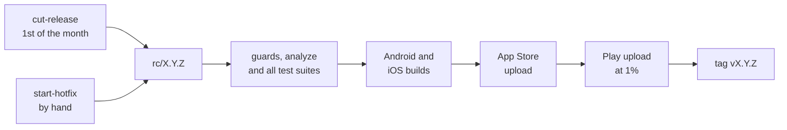

# Releases

Releases to Google Play and the App Store are automated. On the 1st of each
month, everything on `master` since the last release is tested, built,
signed and submitted straight to production, with no human step; any
failure stops the release. Hotfixes run through the same pipeline when
started by hand. Commit subjects decide the version, and a draft file
supplies the store notes.

The logic (versions, build numbers, commit types, guards) is pure Dart in
`tool/release/`, and the store work is in `fastlane/Fastfile`.

## Commit types and versions

- **The commit type sets the version.** Minor if any `feat` landed since
  the highest tag, else patch if any `fix` did, else no release that month.
  Major is manual.
- **Every type in a combined subject counts** (`chore: …; fix: …`).
- **`feat` must mean user-facing.** Tooling filed under `feat` forces a
  minor release, so it belongs under `chore`.
- **Build number**: MAJOR×1,000,000 + MINOR×1,000 + PATCH, the same on both
  stores. MINOR and PATCH stay at 999 or below, and MAJOR at 2099 or below
  (Android's version-code ceiling).
- **One build per version**, so a binary a store rejects ships as the next
  patch.
- **Notes**: at the cut, `docs/release-notes/next.txt` becomes `X.Y.Z.txt`
  and a fresh empty `next.txt` takes its place. The notes must be non-empty
  and at most 500 characters (Play's limit), or the cut stops.

## Workflows

| Workflow | Trigger | Does |
|---|---|---|
| `cut-release` | Cron on the 1st, or by hand | Computes the version, commits `chore: release X.Y.Z` (pubspec bump, notes moved) to `master`, pushes `rc/X.Y.Z` and dispatches `release` |
| `start-hotfix` | By hand, with master commit SHAs and notes | Branches `rc/X.Y.Z` from the highest tag as the next patch, cherry-picks with `-x`, commits the bump and notes on the rc branch, dispatches `release` |
| `release` | Dispatch, on `rc/*` only | Guards → analyze and the Dart, Kotlin and Swift suites → both builds → iOS upload → Android upload → tag `vX.Y.Z` |
| `advance-rollout` | Daily | Moves Play one step up Apple's phased ladder (1, 2, 5, 10, 20, 50, 100%) |

- **The release branch name is the version**, and the tag is pushed only
  after both uploads succeed.
- **The guards** fail if the tag exists, if the version is not above the
  highest tag, if the pubspec disagrees, or if the notes are invalid.
- **iOS uploads first**, because an App Store submission can be withdrawn
  while a Play production commit can only be halted.
- **The next monthly cut skips commits named in a `cherry picked from`
  trailer**, so a fix shipped as a hotfix is not counted twice. Take a
  shipped hotfix's fixes off the bug count in `next.txt` for the same reason.
- **Dry run**: dispatch `release` on `rc/dry-run` with `dry_run`. It runs
  the full gate, both signed builds and store validation, and pushes no tag.

## Environments

Secrets live in two GitHub environments. `release` is restricted to `rc/*`
and holds `.env`, `google-services.json`, the keystore, the store keys and
the match secrets. `rollout` is restricted to `master`, where the cron runs,
and holds only the Play key. CI writes the gitignored inputs from these
secrets and fails if one is missing, since the build would otherwise ship
green without FCM or crash reporting.

## Recovery

| Case | Do |
|---|---|
| A gate or build fails | Nothing was uploaded. Fix on `master`, `git cherry-pick -x` onto the rc branch, re-dispatch `release` |
| An upload fails | "Re-run failed jobs". If Apple already holds the build, the iOS lane submits it without re-uploading |
| A store rejects the binary | The build number is spent. Ship the fix as the next patch through `start-hotfix` |
| A bad release is live | Halt the Play rollout or pause the phased release, then `start-hotfix` |
| `cut-release` failed partway | Re-run it. It resumes without dropping new notes |
| A failed rc is still untagged on the next 1st | The cut fails on the name clash. Delete the stale branch |

## Gotchas

- **A real release's failure emails nobody**, because the bot dispatched it,
  so check Actions after the 1st and after a hotfix.
- **A hotfix must be done by hand** when its base tag predates the pipeline
  (`v1.3.0` and earlier) or the fix touches `.github/workflows/`, which
  `GITHUB_TOKEN` cannot push.
- **A public repo disables scheduled workflows after 60 days** without
  commits, so re-enable `cut-release` and `advance-rollout` after a quiet
  spell.
