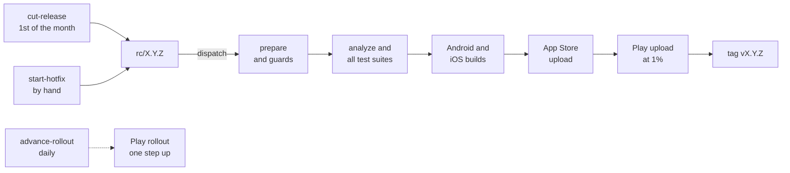

# Releases

Releases to Google Play and the App Store are automated. On the 1st of each
month, everything on `master` since the last release is tested, built,
signed and submitted straight to production, with no human step; any
failure stops the release. Hotfixes run through the same pipeline when
started by hand. Commit subjects decide the version, and a draft file
supplies the store notes.

## Architecture

| File | Owns |
|---|---|
| `tool/release/release.dart` | Pure logic: versions, build numbers, commit types, notes limits, guards, the rollout ladder |
| `tool/release/cli.dart` | The CLI the workflows and scripts call |
| `tool/release/cut.sh`, `hotfix.sh` | The only code that pushes: the release commit, the `rc/X.Y.Z` branch, the dispatch |
| `fastlane/Fastfile` | match signing, `supply` and `deliver` uploads, Play rollout steps |

| Workflow | Trigger | Does |
|---|---|---|
| `cut-release` | Cron at 06:17 UTC on the 1st (off the hour, where GitHub delays runs), or by hand | Computes the version, commits `chore: release X.Y.Z` (pubspec bump, notes moved) to `master`, pushes `rc/X.Y.Z` and dispatches `release` |
| `start-hotfix` | By hand, with master commit SHAs and notes | Branches `rc/X.Y.Z` from the highest tag, cherry-picks, commits the bump and notes on the rc branch, dispatches `release` |
| `release` | Dispatch, on `rc/*` only | Prepare (version from the branch name, guards) → analyze, the Dart suite, Kotlin tests, Swift XCTests → Android and iOS builds → iOS upload → Android upload → tag `vX.Y.Z` |
| `advance-rollout` | Daily at 04:43 UTC, before the cut | Moves Play one step up the rollout ladder |

- **Concurrency**: `cut-release`, `start-hotfix` and `release` share the
  `release` group, so they never overlap. `advance-rollout` has its own
  `rollout` group.
- **Dispatch is explicit.** A push made with `GITHUB_TOKEN` triggers no
  workflow; a dispatch is the one exception, so the scripts dispatch
  `release` themselves.
- **Secrets live in two environments.** `release` is restricted to `rc/*`
  and holds `.env`, `google-services.json`, the keystore, the store keys and
  the match secrets. `rollout` is restricted to `master`, where the cron
  runs, and holds only the Play key.
- **Permissions**: `release` runs read-only except its tag job, and every
  job has a timeout.

## Decisions

- **Version**: minor if any `feat` landed since the highest tag, else patch
  if any `fix` did, else no release that month. Major is manual. Every type
  in a combined subject (`chore: …; fix: …`) counts.
- **Build number**: MAJOR×1,000,000 + MINOR×1,000 + PATCH, the same on both
  stores, so there is no store lookup. MINOR and PATCH stay at 999 or below,
  and MAJOR at 2099 or below (Android's version-code ceiling). There is one
  build per version, so a binary a store rejects ships as the next patch.
- **One branch per release, `rc/X.Y.Z`**, whose name is the version. The
  bot's `chore: release X.Y.Z` commit bumps `pubspec.yaml`: on `master` for a
  monthly cut, on the rc branch only for a hotfix. The tag is pushed only
  after both uploads succeed.
- **Guards**: `prepare` fails if the tag already exists, if the version is
  not above the highest tag (the App Store rejects a lower one), if the
  pubspec does not declare `X.Y.Z+N`, or if the notes are invalid.
- **Notes**: at the cut, `docs/release-notes/next.txt` becomes `X.Y.Z.txt`
  and a fresh empty `next.txt` takes its place. The notes must be non-empty
  and at most 500 characters (Play's limit), or the cut stops. Uploads carry
  the binary and notes only; store listings and screenshots are managed by
  hand.
- **Builds are separate jobs from uploads**, so a failed build ships
  nothing. Artifacts last 7 days, so "Re-run failed jobs" still has them.
- **iOS uploads first.** An App Store submission can be withdrawn, while a
  Play production commit can only be halted. The App Store gets a review
  submission with automatic and phased release; Play starts production at
  1%.
- **Play's rollout climbs Apple's phased ladder**, one step a day: 1, 2, 5,
  10, 20, 50, 100%. It is stateless, since the next step comes from the
  current fraction, and it leaves halted or completed releases alone. It
  cannot see Play review, so a release still in review keeps climbing and
  may first reach users above 1%.
- **Toolchains are pinned, never `-latest`**: the `ubuntu-24.04` and
  `xcode-27` images, Xcode `27.0` (the build used locally) and the Flutter
  version. A runner label migration then cannot change a release
  unannounced. Moving to a new toolchain is a deliberate change, made after
  a green dry run.
- **Workflow scripts never interpolate inputs or secrets into `run:`.**
  They pass through `env:`, so a hotfix input cannot inject shell.
- **Failures never open issues.** GitHub's failure email is the alert (see
  Gotchas for who gets it).

## Hotfixes

- **Inputs**: master commit SHAs, oldest first, and the store notes. No
  version is typed: it is the next patch after the highest tag.
- **Each commit must already be on `master`.** A pick that does not apply
  cleanly aborts with nothing pushed.
- **Each pick keeps its original author and message**, plus a `(cherry
  picked from commit …)` trailer. `next.txt` is restored from the base tag,
  so draft notes added on `master` never conflict.
- **The next monthly cut skips master commits named in such a trailer**, so
  a fix shipped as a hotfix neither triggers nor inflates it. Pick onto an rc
  by hand with `-x` for the same reason, and remove a shipped hotfix's line
  from `next.txt`, or the next release announces it again.
- **Some hotfixes must be done by hand**: when the base tag predates the
  pipeline (it contains no `release.yml`; `v1.3.0` and earlier), or when the
  fix touches `.github/workflows/`, which `GITHUB_TOKEN` cannot push.

## One-time setup

- A Play service account with release permission on production, and an
  App Store Connect API key (App Manager).
- A private match repo with a read-only token, signing all three bundle IDs
  (`fastlane match appstore` once, by an Admin). The match auth secret is
  base64 of `username:token` with no `Basic ` prefix; CI checks its shape.
- The `release` and `rollout` environments above, holding those secrets.
- Actions may write, and nothing on `master` blocks `github-actions[bot]`
  pushes.
- Store listings in `en-US` on both stores.

## Recovery

| Case | Do |
|---|---|
| A gate or build fails | Nothing was uploaded. Fix on `master`, `git cherry-pick -x` onto the rc branch, re-dispatch `release` |
| An upload fails | "Re-run failed jobs". If Apple already holds build N, the iOS lane submits it without re-uploading. Play never accepted N if its job failed |
| A store rejects the binary | Build N is spent for that version. Ship the fix as the next patch through `start-hotfix` |
| A bad release is live | Halt the Play rollout or pause the phased release, then `start-hotfix`. `reject_if_possible` withdraws a version still in App Store review and submits the hotfix instead |
| `cut-release` failed partway | Re-run it. If `X.Y.Z.txt` already exists it skips the commit, but fails if `next.txt` has new notes, so they are never dropped. An rc branch at `master`'s HEAD is reused |
| A failed rc is still untagged on the next 1st | The cut fails on the name clash. Delete the stale branch |

## Gotchas

- **`feat` must mean user-facing.** Tooling filed under `feat` forces a
  minor release; it belongs under `chore`.
- **A real release's failure emails nobody**, because the bot dispatched it.
  Check Actions after the 1st and after a hotfix. A failed scheduled cut
  emails whoever last edited its cron, and a failed manual run (a dry run, a
  hotfix start) emails whoever dispatched it.
- **CI writes the gitignored inputs from secrets and fails if one is
  missing or invalid.** Without `google-services.json` the AAB would build
  green and ship without FCM; without `SENTRY_DSN`, without crash
  reporting.
- **iOS signing switches the three targets to manual signing in CI only**;
  the committed project keeps automatic signing.
- **The iOS jobs need the Xcode 27 SDK.** `MetricsSubscriber` uses
  `MetricManager` behind `#available(iOS 27.0, *)`, but the type must still
  exist at compile time, and the `macos-26` image tops out at Xcode 26.6.
  `xcode-27` is a GitHub preview image, so expect occasional queueing.
- **Swift XCTests run serially** (`-parallel-testing-enabled NO`): parallel
  clone simulators each cold-start the notification daemon, which pushes the
  tests past their 60 s budget. CI also passes
  `-collect-test-diagnostics never`, or xcodebuild then stalls on a
  simulator diagnostics collection that times out anyway.
- **Only one run per concurrency group can wait.** A third queued run
  silently cancels the pending one.
- **A public repo disables scheduled workflows after 60 days** without
  commits. Re-enable `cut-release` and `advance-rollout` after a quiet
  spell.
- **`ITSAppUsesNonExemptEncryption` is declared in `Info.plist`.** Without
  it, an export-compliance prompt blocks the automated submission.

## Testing

- `test/tool/release/` covers the logic, the CLI (against temp git repos)
  and both scripts (against a temp bare remote with a fake `gh`). It runs in
  the normal suite.
- **Dry run**: dispatch `release` on `rc/dry-run` with `dry_run`. It skips
  the version guards and uses the version the next cut would compute (or the
  next patch), bumped in the workspace only. It runs the full gate, both
  signed builds, an App Store `verify_only` check and a Play `validate_only`
  upload. No tag is pushed.
