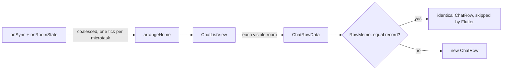

# Rooms & Membership

The chat list, room creation and access, room info and settings, the 4-tier
role model, invitations, the room media feed, and person-level moderation
(block, report). Zuno targets one self-hosted, non-federated homeserver, and
that single fact shapes ID entry, permission defaults and what discovery can
mean. There is no repository layer: screens call the `matrix` SDK directly,
and live Matrix room state, read from the SDK's in-memory `Room` objects, is
the only source of truth.

## Architecture

| Area | Components |
|---|---|
| Chat list | `RoomListPage` keeps the page-level duties: the new-chat flows, onboarding, the verification and incoming-call listeners, and the long-press sheet. `ChatListView` draws the list. The Chats and Communities tabs share one `arrangeHome` split per sync (`communities.md`). |
| Rows | Each visible room is read into a value-equal `ChatRowData` (`features/rooms/data/`) that already holds its time label. `RowMemo` hands back the identical `ChatRow` for an unchanged record (pattern: `app-foundation.md`). `ChatRow` is presentational: its preview is a widget slot, filled by `LastMessagePreview` (summary rules: `chats-messaging.md`). Rows share one height through `SliverPrototypeExtentList`, and incoming invitations sit above them in `InvitationGroup`. |
| Creation | The + menu on the Chats tab offers New chat, New room and Find public rooms. `createGroupRoom` (`room_access.dart`) is the one call behind New room. |
| Directory | `public_rooms_sheet.dart` searches the server directory a page at a time, loading more as the end scrolls into view, and drops responses that a newer search has superseded. The sheet hands back a room ID; the chat list joins it through `joinAndAwaitRoom`, which waits for the sync that brings the room, and then opens it. |
| Access | `room_access.dart` treats access as one concept over two server facts, the join rule and the directory listing (table under Decisions). `room_access_label.dart` shows it in the room info header and under the name in a group's chat header. |
| Room info | `lib/features/room_info/`: header, quick actions, members (`member_tile.dart`, `members_sheet.dart`), settings, permissions and media. Details below. |
| Shared rules | `room_exit.dart` (the exit rule and its confirmation), `room_title.dart` (the one title every surface shows), `room_avatar.dart` (upload, state write and optimistic state in one step), `optimistic_room_state.dart`. |
| Roles | `room_roles.dart`: read-only `-1`, member `0`, moderator `50`, admin `100`. Any other level reads as the tier below it. Also `canManageMember`, `assignableRolesFor`, owner detection and `bannedUserIds`. |
| Permissions | `room_permission.dart`: the permission catalog, where each entry is one field or `events` override of `m.room.power_levels`, and `defaultGroupPowerLevels(public:)` for new rooms. `RoomPermissionsPage` shows it for rooms and, with `communityPermissionGroups`, for communities. |
| Call gating | `call_member_state.dart` owns `canPublishCallMemberState` (the `m.call.member` level) and `hasSomeoneToCall`. The chat header, room info and the catalog's calls entry all use it. |
| Invitations | `room_invite.dart`: pure functions that decide how an invitation is displayed and notified. The chat list, the chat header, `RoomInvitePage` and both notification paths share them. |
| Room media | `room_media_feed.dart`, `room_media_section.dart`, `room_media_page.dart`. Details below. |
| Moderation | `abuse_report.dart` and `report_sheet.dart` sit behind every report entry point; `block_person.dart` sits behind every Block entry point, and `blocked_people_page.dart` lists blocked people under Settings → Security. |

Add to home screen is Android only (`homeScreenShortcuts`). The
`zuno/shortcuts` channel pins a native shortcut, because no Flutter plugin
covers Android's pinned-shortcut API, and the same channel opens the room
when the shortcut is tapped.

### Chat list updates

The page listens to both streams because they decide order and membership.

### Room info

- **Layout.** A header (avatar, name, encryption and access, topic), quick actions (Call and Video, Mute or Unmute, Invite), then grouped cards.
- **Calls from room info.** Call and Video appear only when `RoomPage` passes `onStartCall`, the room allows calls and someone else is there. The callback pops room info and starts the call.
- **Leaving.** Block, Report and the exit row close the page. Exiting pops `RoomInfoResult.left`, and `RoomPage` then pops itself.
- **Members.** Room info shows the first few members, owner first, then a row that opens the full, searchable `members_sheet.dart`. Members are requested after the push slide (`onRouteSettled`). If that request fails, the members already in memory show, and the count comes from the room summary.
- **Live edits.** `RoomInfoPage` listens to `client.onRoomState`, so settings, role and member changes show without reopening the page.

Which sections show depends on the kind of room:

| Section | Direct chat | Group room |
|---|---|---|
| Members | Hidden | Shown |
| Settings | Hidden | Shown when you can change any setting |
| Permissions | Hidden | Admins edit, moderators read, others do not see it |
| Security (per-person trust) | Shown | Hidden |
| Advanced (room ID and address) | Owners and admins | Owners and admins |

### Room media feed

- **Source.** `room_media_feed.dart` is a cursor-paged feed per room over the SDK's `Room.searchEvents`. That call reads the local database first, then pages through server history, decrypting as it goes.
- **Loads.** Each load gathers a batch of media events over a bounded number of requests, deduplicated by event ID. The kind (photo, video, file) comes from `summarize` in `event_display.dart`. Voice messages, edits and unsent events are excluded.
- **Live updates.** New media from `client.onTimelineEvent` is prepended, and a redaction removes its target.
- **Lifetime.** `roomMediaFeedProvider` is a keep-alive family keyed by room, so each feed lasts the session. It invalidates itself on logout.
- **Screens.** `room_media_section.dart` previews the latest thumbnails in room info. `room_media_page.dart` is the tabbed page: photos and videos grouped by month, and files. It keeps loading while history yields media, offers Load older after a load that found nothing (`stalled`) and Try again after a failure (`failed`). Thumbnails open `GalleryViewerPage` over the loaded list.

## Data and state

- **An invitation is nothing but `m.room.member` state.** There is no separate invite entity. Anything that must answer "is someone still deciding" after a cold start reads the `RoomSummary` counts and heroes (`m.invited_member_count`, `m.joined_member_count`, `m.heroes`), because full member state does not survive one (see Gotchas).
- **Banned users come from cached member state** (`bannedUserIds`), since the SDK has no call that lists bans.

## Decisions

**Rooms and access**
- **One kind-aware exit, not Leave plus Delete.** The two look identical to a user: `client.rooms` excludes left rooms, so both make the row vanish, and only the server-side archive differs. `exitRoom` leaves every room but forgets only a direct chat, which has no history to come back to. A group is left but kept, since it persists without you and may be rejoinable. Declining an invitation is the same question, so `declineInvite` delegates to it. The label follows the kind, and both the chat list sheet and the chat menu confirm first.
- **Access is one of four choices**, and each maps to a join rule and a directory listing:

  | Access | Join rule | Listed | Offered for |
  |---|---|---|---|
  | Public | `public` | Yes | Rooms outside a community, and communities |
  | Community | `restricted` to the room's communities | No | Rooms inside a community (`communities.md`) |
  | Ask to join | `knock` | No | Rooms inside a community |
  | Private | `invite` | No | Everything; the default for a new room outside a community |

- **Public means listed and open.** One without the other leaves a room either invisible or unjoinable. The write order is chosen for its failure mode: going public lists first, then opens, so a refused listing changes nothing; going private closes first, then unlists, because stopping joins matters most. Changing access is admin-only, never offered in direct chats, and asks first with the consequences of that direction.
- **A new public room is one `createRoom` call** (public preset and public visibility, still encrypted), not create followed by an access change. A server that refuses the listing then creates nothing, instead of leaving a private room behind an error. The New room dialog explains Public under the choice, so creation needs no separate confirmation.
- **Rooms are joined from the directory or an invitation, never by a typed ID.**
- **New rooms get Zuno's own power levels** through `power_level_content_override`. Homeserver presets set several of these to moderator, which would contradict the permissions UI from the moment a room exists. The defaults:

  | Role | Permissions |
  |---|---|
  | Admin | Name, topic, photo, address, settings (`state_default`), history visibility, permissions, encryption |
  | Moderator | Remove, ban, delete others' messages, notify everyone |
  | Member | Invite, send messages, start or join calls |

  A public room differs only in calls, which need a moderator. `users_default` is left unset, because its spec fallback already matches Zuno's default role. The table applies at creation only: making an existing room public leaves its permissions alone, since an admin may have set them.
- **Edits are optimistic.** Settings, access, role and member changes write local state once the server accepts them (`applyOptimisticRoomState`). The SDK setters return only an event ID, so without this a page would stay stale until reopened.
- **The settings editors cap name, address and topic length** (constants in `room_settings_page.dart`).
- **The topic shows only in room info.** A chat-header subtitle had almost no width beside the call buttons, and a strip below the header cost a row in every room.

**Roles and permissions**
- **Read-only (`-1`) is a Zuno extension.** Matrix convention uses 0, 50 and 100, but the SDK does not floor power levels at 0. Read-only needs no code of its own: the existing per-feature power checks already refuse messages, metadata edits and calls.
- **Gate on "can do X" through the SDK getter, never on "will the server accept".** Each catalog entry is checked against the getter it must agree with (`canBan`, `canKick`, `canSendEvent`, `canSendDefaultStates` and so on). `canSendDefaultMessages`, for example, already handles encrypted and tombstoned rooms, which avoids `M_FORBIDDEN` errors discovered only after sending.
- **`users_default` is the room's default role**, shown as its own setting rather than as a catalog row.
- **Some permissions are deliberately absent from the catalog.** `m.room.server_acl` governs federation, which Zuno does not have. Room upgrade is one-way, has a high blast radius and needs its own design. Widgets are ruled out (`../decisions/excluded.md`).
- **Permission editing is admin-only**, stricter than the room's own "change permissions" level. Moderators see the page read-only, and members do not see it at all. Every value the page writes is at most 100 and editing needs 100, so Matrix's rule that the sender's level must be at least both the old and the new value holds by construction.
- **Member actions narrow the server's rule.** The server refuses actions on anyone whose level is at or above yours. Zuno adds that only admins make admins, that moderators can only move someone down to member or read-only, and that nobody edits themselves. Because the app rule is narrower, the UI never offers an action the server would refuse.
- **The owner is the sender of the create event** (`creatorUserIds`, including v12 `additional_creators`). The owner is listed first and badged for everyone, but is still an admin underneath. Below room version 12 the creator can be demoted, so ownership is a label, never a permission gate.
- **Badges depend on who is looking.** Owner and Invited show to everyone; role badges show only to admins and moderators.
- **Room info follows the kind** (table above). Per-person trust shows only in direct chats, because encryption is universal and trust belongs to the one-to-one relationship.
- **Calls need someone to call.** Call buttons require both `canPublishCallMemberState` and `hasSomeoneToCall`, which means at least one other joined member, read from the room summary. A permission check alone would offer calls in pending or emptied rooms that can never connect.

**Chat list**
- **Snapshot and memo, not per-room notifiers.** `room.onUpdate` is deprecated, and a missed signal would leave a stale row that nothing catches.
- **The time label lives in the record**, so 09:41 turns into Yesterday on the first sync after midnight without a timer. `chat_list_time.dart` is a pure function of the timestamp, the current time and the phone's 24-hour setting. The label steps from the time of day to Yesterday, the weekday, then the date, adding the year once it differs.
- **No empty state before the first sync.** Until a fresh session's first sync (`firstSyncProvider`), a client with no rooms shows a spinner on both tabs, so a new sign-in never claims there are no chats while they are still on their way.
- **One preview line.** Two lines would expose more message text on a screen people glance at in public.
- **Muted, awaiting acceptance and partner left share one dimming** (`ChatRowData.dimmed`). None of them is a live chat: you asked not to hear from it, there is no conversation yet, or the conversation is over. A status glyph and the subtitle carry the specifics.
- **Mark the exception.** Only the rare unencrypted room is marked, never every encrypted one; silence is the safe default (attention rules: `security-verification.md`).
- **The person or group indicator is a badge on the avatar** (`room_kind_avatar.dart`), so it costs no width in the one-line title.
- **The rows get a heading only under invitations.** The Chats (or Communities) label shows only when invitations sit above the rows, so invitations alone never end in a heading with nothing under it.
- **An abandoned direct chat is read-only, not broken.** Once the partner leaves, the SDK names the room "Empty chat (was …)", which is wrong because the history is still there. `roomTitle()` names the partner instead and is the single title source for every surface: the list, the chat, notifications, calls, room info and the share picker. `canPostInRoom()` removes composing, mentions, replies, reactions, edits and the room's place in the share picker. Deleting your own message stays, since that is cleanup, not communication. Calls need no extra gate, because `hasSomeoneToCall` already requires another joined member.
- **The official chat is known by its creator.** `isOfficialZunoRoom` requires both the server-notice tag and `@notices:zuno.chat` as the room's creator. Anyone can tag their own room, but nobody can forge a creator, so the badge cannot be copied. The ID carries the `zuno.chat` domain literally.
- **Names cannot contain "Zuno".** `roomNameError` ignores case and catches a zero for the o, and gates both creation and renaming. It is a client-side rule only; the creator check is what actually protects the badge.
- **Server isolation.** The server part of a Matrix ID is never shown or asked for. Lookups for a new chat or an invitation take a local username, and every read-only display, mentions included, shows `@user`. The server the dialogs append is `ownServerName` (`server_name.dart`), never `client.homeserver.host`: that is the delegated API host, and using it would make every local invitation look federated.

**Invitations**
- **Sender and receiver views are deliberately asymmetric.**
  - The sender sees no profile for an invitee who has not accepted, because the server hands over their member state before they have agreed to anything. Until they accept, the room is titled with the typed username (or a count for several invitees) and has no avatar. A room with its own name is exempt, since its name is about the room, not the person.
  - The receiver sees the inviter's name and avatar in full, because "who is this?" is the whole question.
- **One notification per invitation.** Two paths can announce the same invitation, and both claim it first:
  - The live path listens to `client.onNotification`, because an invitation is stripped state for an unjoined room, not a timeline event. It posts without an event ID, since the SDK's ID for it is a synthetic `invite_for_<roomId>`.
  - The push path goes through `inviteNotificationFor`, because the default push handler recognizes only messages and drops `m.room.member`.
  - Before posting, each path claims the room in `notifications.announced_invites`. A failed post gives the claim back, and a sync that shows the room joined or left forgets it, so a later invitation announces again.
  - A push for an invitation that was already announced retracts its instant notice, unless the announcement was moments earlier and its post has already replaced that notice in place. The iOS extension side is in `notifications.md`.
- **Tapping an invitation opens `RoomInvitePage`**, never the room: an unjoined room has no timeline or composer.

**Moderation**
- **Moderation tooling stays out of the app** (`../decisions/excluded.md`). Room admins act inside their rooms (remove, ban, delete). Reports go to the operator, through a separate surface the client knows nothing about, and cover what admins cannot: chats and invitations, which have no admin, an abusive admin, illegal content and account-level action. Anyone can report anyone but themselves.
- **A report carries IDs and a reason, never content.** Everything is end-to-end encrypted, so the server receives the event or user ID and a reason string. The reason has one format, built for filtering: `category[: note] [(room <id>)]`, with the categories `spam`, `harassment`, `illegal` and `other` (which requires a note). Reports start from a message's long-press menu, the member sheet, chat info and the invitation page.
- **An invitation is reported by its sender**, with the room ID in the reason. Invite state has no event ID to report, and the sender is what invite-abuse limits key on. Report and decline declines only after the report is accepted; a refused report leaves the invitation alone.
- **Blocking is the SDK's `ignoreUser` with its defaults.** It leaves the direct chat, declines the person's pending invitations, stores them in `m.ignored_user_list` and clears the local cache, so the server resends every room without their messages. Leaving is deliberate: a kept chat would show only one side and still let the blocker send. The cost is that unblocking never brings the chat back, which the dialog says when a chat exists.
- **Anyone can block anyone, whatever their role.** It is the one tool that works in chats and on invitations, and Google Play requires it for direct messages. The exception is `@notices:zuno.chat` (`canBlockPerson`), because server notices carry the shutdown notice the terms promise.

## Gotchas

- **Member state is not loaded at cold start, and an invitation is nothing but member state.** `getRoomList` rebuilds rooms from the preload box only, never from the separate box that holds `m.room.member` events. Symptoms: the inviter shown as "Someone", a direct invitation accepted as a group, and the sender's pending marker vanishing after a restart. `loadInviteMembers` reads the member box directly and restores it before any accept or decline, and `inviterId` falls back to the summary heroes.
- **A member event whose sender is its own subject is a substitute.** `unsafeGetUserFromMemoryOrFallback` synthesizes one from the global profile when no member event is found (invite rooms refuse `/state` before joining), and it can overwrite real invite data. Since nobody invites themselves, such an event is treated as not loaded.
- **Never reload members right after changing one.** Before the change, the local list matches the room summary, so `requestParticipants` returns it unchanged. After an optimistic change the counts disagree, and it re-reads the database's member events, restoring the old membership. Room info edits its list in place and lets sync confirm.
- **Mute waits for the push-rules sync.** `setPushRuleState` does nothing when the new state equals `room.pushRuleState`, and that value changes only when sync delivers `m.push_rules`. Without care, Mute followed at once by Unmute would silently do nothing. Room info locks the switch while a change is in flight and holds the new state until that sync arrives or a timeout passes. A refused request flips back and says so.
- **A field missing from `ChatRowData` is a stale row.** The record must hold everything the row or its preview shows, plus the last event's ID and status. Those two are not displayed, but they keep the memoized preview on the current `Event` instance (`chats-messaging.md`). Adding something to the row means adding it to the record.
- **The list delegate needs `findChildIndexCallback` keyed on the room ID.** Without it, a chat jumping to the top shifts every index and remounts every row in between, memo or not.
- **Every text line in a row is strut-locked** (`core/ui/line_strut.dart`). The list is fixed-extent, and fallback fonts such as Thai and Devanagari grow a row by a few pixels at larger font sizes. A style's `height` does not stop that; a forced strut does, without clipping glyphs. Any text added to a row needs the strut too.
- **An invitee cannot be verified before joining.** Verification is a room message, and an invitee has no timeline yet, only stripped invite state. Room info shows a passive row instead of a flow that would hang.
- **Synapse 1.126 and later refuse directory publishing by default** (`room_list_publication_rules`). Without an allow rule the directory is empty and Public fails. The app reports that the server does not allow listing rooms and keeps the room private.
- **The access label reads the join rule, not the directory listing**, because the listing costs an HTTP call per room. A room listed by other means but still invite-only therefore reads as private.
- **Clearing an address** deletes the old alias from the directory (tolerating not-found) and writes an empty canonical alias. An unguarded empty value would send `#:server`.
- **A room without `m.room.history_visibility` reads as `shared`**, the Matrix default, because the SDK returns null for it.
- **The media feed's first load always hits the server once.** `searchEvents` scans the database and fetches the first server page in one call, even when the database already held enough media. Media that fails to decrypt on arrival is skipped by the live prepend and shows only in a fresh feed.
- **Blocked people show as usernames.** Servers refuse profile lookups for people you share no room with, which is the usual case after a block.
- **End-to-end encryption rules out server-side content filtering for spam.** Every available signal is metadata: account age, invite fan-out, accept ratio and timing.

## Designed, not built

- **Message requests.** Invitations from someone you share no room with would get neutral notification copy and land in a quiet Requests section. This amends the receiver rule rather than reversing it: full disclosure stays, but only once the user opens `RoomInvitePage`. The open problem is the shared-room test, which needs member state that is missing at cold start, and push handling is a cold start. When the test cannot answer, fail quiet and treat the inviter as known: a false negative costs one ordinary notification, while a false positive reopens the whole spam problem. Check MSC4155 (client-side invite filtering) before building a bespoke schema, and decide the test once, beside `room_invite.dart`.
- **An existence check before a direct chat.** The room is created before the invitation, so a mistyped username leaves an orphan room waiting for nobody. A profile pre-check must not undo the sign-in form's stance against account enumeration, and it needs a fallback where servers restrict profile lookups.
- **Finding people** works only by exact username. Invite links, which open a direct chat with the link's creator without a directory or enumeration, are preferred over user-directory search, which would be another enumeration surface.

## Extending

- **A new permission-gated surface** gets a catalog entry in `room_permission.dart`, mapped to the SDK getter it must agree with, following the per-field `canChangeStateEvent` pattern rather than a blanket "can edit room" check. Never hand-roll a second power-level check. The entry also needs a role in the default table; an assert enforces it.
- **A new member action** (kick- or ban-shaped) reuses `canManageMember` and `assignableRolesFor` for the self, peer and superior exclusions.
- **Invite-adjacent UI** (requests, first-contact handling) belongs beside `room_invite.dart`'s pure functions, so notification and chat list code never drift into separate checks.
- **Anything that must work at cold start** before member state loads reads `RoomSummary` fields, as invitation-pending detection and `hasSomeoneToCall` do.
- **A new place to block from** calls `confirmAndBlockPerson`, hides behind `canBlockPerson`, and returns to the chat list afterwards: the cache clear makes every open `Room` stale.
- **A new thing to report** opens `showReportSheet` with its own title and explanation and sends through `abuse_report.dart`, so the reason format stays single. The server also accepts room reports (`client.reportRoom`); nothing uses them yet.

## Testing

- `ChatListView` and `ChatRow` test without the page, from fake rooms. `RoomListPage` renders with `TimelineCapableFakeDatabaseApi`, `room.partial = false` and an `UncontrolledProviderScope` whose container outlives the tree, because `RoomPage.dispose` reads a provider in a microtask.
- Block tests inject `blockPerson` and `unblock`, since the fake database cannot clear a cache. `block_on_server_test.dart` runs the real call against a fake server.
