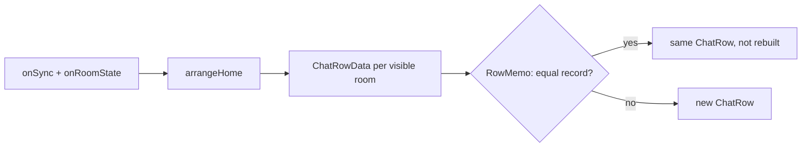

# Rooms & Membership

The chat list, room creation and access, room info and settings, the 4-tier
role model, invitations, the room media feed, and person-level moderation
(block, report). Zuno targets one self-hosted, non-federated homeserver, and
that single fact shapes ID entry, permission defaults and what discovery can
mean. Screens call the `matrix` SDK directly, and live Matrix room state is
the only source of truth.

## Architecture

| Area | Components |
|---|---|
| Chat list | `RoomListPage` owns the new-chat flows and the long-press sheet, and `ChatListView` draws the list. The Chats and Communities tabs share one `arrangeHome` split per sync (`communities.md`). |
| Rows | Each visible room is read into a value-equal `ChatRowData`, and `RowMemo` hands back the identical `ChatRow` for an unchanged record (pattern: `app-foundation.md`). Incoming invitations sit above the rows. |
| Directory | `public_rooms_sheet.dart` searches the server directory. The chat list joins the chosen room and opens it once sync brings it. |
| Access | `room_access.dart` treats access as one concept over two server facts, the join rule and the directory listing (table under Decisions). |
| Room info | `lib/features/room_info/`: header, quick actions, members, settings, permissions and media. Which sections show depends on the kind of room (table below). |
| Shared rules | `room_exit.dart` (the exit rule), `room_title.dart` (the one title every surface shows), `optimistic_room_state.dart`. |
| Roles | `room_roles.dart`: read-only `-1`, member `0`, moderator `50`, admin `100`, where any other level reads as the tier below it. It also decides who may manage whom (`canManageMember`, `assignableRolesFor`). |
| Permissions | `room_permission.dart`: the permission catalog, where each entry is one field of `m.room.power_levels`, and the defaults for new rooms. `RoomPermissionsPage` shows it for rooms and communities. |
| Call gating | `call_member_state.dart`: `canPublishCallMemberState` and `hasSomeoneToCall`, used by every call button. |
| Invitations | `room_invite.dart`: pure functions that decide how an invitation is displayed and notified, shared by the chat list, the chat header, `RoomInvitePage` and both notification paths. |
| Room media | `room_media_feed.dart` (the feed) and `room_media_page.dart` (the tabbed screen). |
| Moderation | `abuse_report.dart` and `report_sheet.dart` sit behind every report entry point, and `block_person.dart` behind every Block entry point. Blocked people are listed under Settings → Security. |

Add to home screen is Android only: the `zuno/shortcuts` channel pins a
native shortcut, because no Flutter plugin covers Android's pinned-shortcut
API.

### Chat list updates

### Room info

| Section | Direct chat | Group room |
|---|---|---|
| Members | Hidden | Shown |
| Settings | Hidden | Shown when you can change any setting |
| Permissions | Hidden | Admins edit, moderators read, others do not see it |
| Security (per-person trust) | Shown | Hidden |
| Advanced (room ID and address) | Owners and admins | Owners and admins |

Per-person trust shows only in direct chats, because encryption is universal
and trust belongs to the one-to-one relationship.

### Room media feed

`room_media_feed.dart` is a paged feed per room over the SDK's
`Room.searchEvents`, which reads the local database first and then pages
through server history, decrypting as it goes. New media from sync is
prepended and a redaction removes its target. The feed is a keep-alive
provider per room, so it lasts the session. Room info previews the latest
thumbnails, and `room_media_page.dart` shows photos and videos by month, and
files.

## Decisions

**Rooms and access**
- **One kind-aware exit, not Leave plus Delete.** Both make the row vanish, so a user cannot tell them apart. `exitRoom` forgets a direct chat, which has no history to come back to, but only leaves a group, which persists without you and may be rejoinable. Declining an invitation goes through the same rule.
- **Leaving, deleting or blocking ends that room's call first**, while the user is still a member, so the call's summary and membership clear still go out (`calls.md`).
- **Access is one of four choices**, and each maps to a join rule and a directory listing:

  | Access | Join rule | Listed | Offered for |
  |---|---|---|---|
  | Public | `public` | Yes | Rooms outside a community, and communities |
  | Community | `restricted` to the room's communities | No | Rooms inside a community (`communities.md`) |
  | Ask to join | `knock` | No | Rooms inside a community |
  | Private | `invite` | No | Everything; the default for a new room outside a community |

- **Public means listed and open**, since one without the other leaves a room invisible or unjoinable. Going public lists first, so a refused listing changes nothing. Going private closes first, because stopping joins matters most. Changing access is admin-only and never offered in direct chats.
- **A new public room is one `createRoom` call**, so a server that refuses the listing creates nothing instead of leaving a private room behind an error.
- **Rooms are joined from the directory or an invitation, never by a typed ID.**
- **New rooms get Zuno's own power levels**, because homeserver presets set several of them to moderator and would contradict the permissions UI from the start:

  | Role | Permissions |
  |---|---|
  | Admin | Name, topic, photo, address, settings, history visibility, permissions, encryption |
  | Moderator | Remove, ban, delete others' messages, notify everyone |
  | Member | Invite, send messages, start or join calls, share live location |

  A public room differs only in calls and live location, which need a moderator. The table applies at creation only: making an existing room public leaves the permissions an admin may have set.
- **Edits are optimistic.** Settings, access, role and member changes write local state once the server accepts them, because the SDK setters return only an event ID and a page would otherwise stay stale.

**Roles and permissions**
- **Read-only (`-1`) is a Zuno extension.** The SDK does not floor power levels at 0, so the existing power checks already refuse messages, edits and calls, and read-only needs no code of its own.
- **Gate on "can do X" through the SDK getter, never on "will the server accept".** Each catalog entry agrees with its getter (`canBan`, `canSendEvent` and so on), which already handle cases such as encrypted and tombstoned rooms. A new permission-gated surface gets a catalog entry, never a hand-rolled power-level check.
- **Some permissions are deliberately absent from the catalog.** Server ACLs are left out because Zuno has no federation, room upgrade because it needs its own design, and widgets because they are ruled out (`../decisions/excluded.md`).
- **Permission editing is admin-only**, stricter than the room's own level. Every value the page writes is at most 100, so Matrix's rule that the sender must outrank both the old and the new value holds by construction.
- **Member actions narrow the server's rule.** Only admins make admins, moderators can only move someone down, and nobody edits themselves, so the UI never offers an action the server would refuse.
- **The owner is the sender of the create event**, listed first and badged, but still an admin underneath. Ownership is a label, never a permission gate, because below room version 12 the creator can be demoted.
- **Calls need someone to call.** Call buttons require both the call permission and at least one other joined member, read from the room summary, so calls are never offered in pending or emptied rooms.

**Chat list**
- **Snapshot and memo, not per-room notifiers.** `room.onUpdate` is deprecated, and a missed signal would leave a stale row that nothing catches.
- **The time label lives in the record**, so 09:41 turns into Yesterday on the first sync after midnight without a timer.
- **No empty state before the first sync**, so a new sign-in never claims there are no chats while they are still on their way.
- **Only the rare unencrypted room is marked**, never every encrypted one (attention rules: `security-verification.md`).
- **An abandoned direct chat is read-only, not broken.** `roomTitle()` names the partner instead of the SDK's "Empty chat (was …)" on every surface, and `canPostInRoom()` removes everything that would communicate.
- **The official chat is known by its creator.** Its badge requires both the server-notice tag and `@notices:zuno.chat` as the creator, because anyone can tag a room but nobody can forge a creator. Room names containing "Zuno" are also refused, but only as a client-side courtesy.
- **Server isolation.** The server part of a Matrix ID is never shown or asked for: lookups take a local username, and displays show `@user`. The server the dialogs append is `ownServerName`, never `client.homeserver.host`, which is the delegated API host and would make every local invitation look federated.

**Invitations**
- **An invitation is nothing but `m.room.member` state**, with no separate entity behind it.
- **Sender and receiver views are deliberately asymmetric.** The sender sees no profile for an invitee who has not accepted, because the server hands over their member state before they have agreed to anything, so the room is titled with the typed username until then. The receiver sees the inviter's name and avatar in full, because "who is this?" is the whole question.
- **One notification per invitation.** Two paths can announce it: the live path listens to `client.onNotification`, since an invitation is stripped state and not a timeline event, and the push path uses `inviteNotificationFor`, since the default push handler drops `m.room.member`. Each claims the room before posting, and a sync that shows the room joined or left releases the claim.
- **Tapping an invitation opens `RoomInvitePage`**, never the room, which has no timeline or composer yet.

**Moderation**
- **Moderation tooling stays out of the app** (`../decisions/excluded.md`). Room admins act inside their rooms, and reports go to the operator for what admins cannot handle: chats and invitations, an abusive admin, illegal content and account-level action.
- **A report carries IDs and a reason, never content**, because everything is end-to-end encrypted. The reason has one filterable format, `category[: note] [(room <id>)]`, with the categories `spam`, `harassment`, `illegal` and `other` (which requires a note).
- **An invitation is reported by its sender**, with the room ID in the reason, because invite state has no event ID and invite-abuse limits key on the sender.
- **Blocking is the SDK's `ignoreUser` with its defaults**: it leaves the direct chat, declines the person's invitations and clears the local cache so the server resends rooms without their messages. A kept chat would show only one side, so leaving is deliberate, and unblocking never brings the chat back.
- **Anyone can block anyone, whatever their role**, since Google Play requires it for direct messages. The exception is `@notices:zuno.chat`, which carries the shutdown notice the terms promise.

## Gotchas

- **Member state is not loaded at cold start**, so invitation checks after a restart read the `RoomSummary` counts and heroes, and `loadInviteMembers` restores the member state before an accept or decline.
- **A member event whose sender is its own subject is an SDK-made substitute**, since nobody invites themselves, so it is treated as not loaded rather than allowed to overwrite real invite data.
- **Never reload members right after changing one**, because `requestParticipants` would re-read the database and restore the old membership, so room info edits its list in place.
- **Mute waits for the push-rules sync**, because `setPushRuleState` compares against a value that changes only when sync delivers `m.push_rules`, so room info locks the switch until then.
- **A field missing from `ChatRowData` is a stale row**: the record must hold everything the row or its preview shows.
- **The list delegate needs `findChildIndexCallback` keyed on the room ID**, or a chat jumping to the top remounts every row in between.
- **Every text line in a row is strut-locked** (`core/ui/line_strut.dart`), because the list is fixed-extent and fallback fonts would otherwise grow a row.
- **Synapse refuses directory publishing by default** (`room_list_publication_rules`), so Public fails until the server allows it, and the app keeps the room private.
- **The access label reads the join rule, not the directory listing**, which costs a request per room, so an invite-only room listed by other means reads as private.
- **Blocking clears the local cache**, which makes every open `Room` stale, so every Block entry point returns to the chat list.
- **Blocked people show as usernames**, because servers refuse profile lookups for people you share no room with.
- **End-to-end encryption rules out server-side spam filtering**, so every available signal is metadata.
- **`RoomListPage` tests need an `UncontrolledProviderScope` whose container outlives the tree**, because `RoomPage.dispose` reads a provider in a microtask.

## Designed, not built

- **Message requests.** Invitations from someone you share no room with would land quietly in a Requests section. The open problem is the shared-room test at cold start, where it should fail quiet and treat the inviter as known. Check MSC4155 before building a bespoke schema.
- **An existence check before a direct chat**, so a mistyped username does not leave an orphan room, without reopening account enumeration.
- **Finding people** works only by exact username. Invite links are preferred over user-directory search, which would be another enumeration surface.
