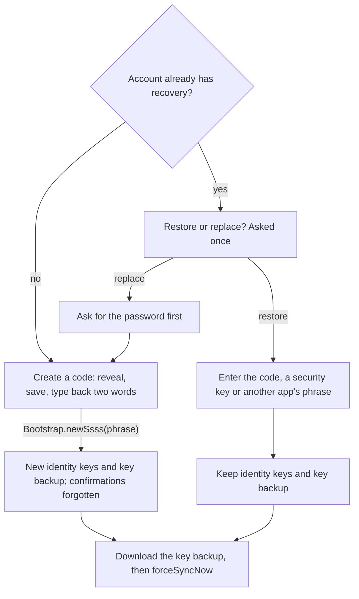

# Security & Verification

Recovery, device approval and confirming people, told as one story instead of
Matrix's four mechanisms (device keys, verification, cross-signing, and secret
storage with key backup). Each mechanism is sound, but a user has to learn all
four and assemble the story alone. Almost nobody does, so people end up with
encryption on, no recovery, nobody confirmed, and a settings page of marks
they cannot read. The `matrix` SDK does all the cryptography; the app changes
only what things are called, when the user is asked, and how it looks. Logic
lives in `lib/core/security/`, screens in `features/settings/` and
`features/verification/`.

Three rules govern every surface:

- **One story, not four features.** Keys live on devices, so you need to know
  which devices are really yours and a way to survive losing them all. The app
  teaches this through three moments (set up recovery, approve a new device,
  confirm a person) and never names a mechanism.
- **Every warning has exactly one button that resolves it.** A warning nobody
  can act on teaches people to dismiss warnings, including the ones that
  matter.
- **Absence is the default.** No badge, mark or color appears unless something
  is wrong and the user can act on it now.

## Architecture

| Area | Main files |
|---|---|
| Status | `account_security_status.dart`, `security_providers.dart`, `security_status_card.dart` |
| Recovery | `recovery_code.dart`, `secure_backup_page.dart`, `recovery_code_screens.dart`, `restore_key_backup.dart` |
| Devices | `verification_page.dart`, `approve_this_device_page.dart`, `qr_scanner_page.dart`, `active_sessions_page.dart`, `session_info.dart` |
| People | `user_trust.dart`, `confirmed_identity_store.dart`, `confirm_person.dart`, `why_confirm_sheet.dart`, `reset_confirmations.dart` |
| Device watch | `known_devices_store.dart`, `new_device_alert*.dart`, `unverified_device_warning*.dart` |
| Messages | `undecryptable_reason.dart`, `retry_decrypt_last_event.dart` (both `lib/core/matrix/`), `recovery_code_leak.dart`, `verification_signaling.dart` |
| Shared | `security_emphasis.dart`, `sensitive_clipboard.dart`, `prepared_uia_password.dart`, `verification_cancel_message.dart` |

`device_safety.dart` and `password_strength.dart` belong to
`authentication.md`, `secret_store.dart` to `app-foundation.md`, and
`screen_security_service.dart` to `settings.md`.

### Status

`accountSecurityFactsOf` reads five facts on every sync, and the pure function
`accountSecurityStatus` turns them into one status. Settings → Security shows
it as one card with at most one button. Each account-wide fact has a
this-device twin, and those pairs are what separate `noRecovery` from
`deviceLocked` and `recoveryStale` from `protected`.

| Fact | SDK source |
|---|---|
| `recoveryExists` / `thisDeviceHasIdentityKeys` | `crossSigning.enabled` / `crossSigning.isCached()` |
| `keyBackupExists` / `keyBackupUsableHere` | `keyManager.enabled` / `keyManager.isCached()` |
| `unapprovedOtherDevices` | own devices other than this one that are not `verified` |

The first matching row wins:

| Status | When | The one button opens |
|---|---|---|
| `noRecovery` | The account has no recovery | `SecureBackupPage` (set up) |
| `deviceLocked` | Recovery exists, but this device lacks the identity keys | `ApproveThisDevicePage` |
| `deviceWaiting` | Another own device is not approved | Your devices |
| `recoveryStale` | A key backup exists that this device cannot open, usually because the code was replaced elsewhere | `SecureBackupPage`, restoring with the current code |
| `protected` | None of the above | No button |

`deviceLocked` must come before `deviceWaiting`. A device that never unlocked
recovery has directly trusted nothing, so every other device looks unapproved
to it, even correctly cross-signed ones: their signature chain ends at a
master key this device would have to trust directly. Without that order, a
freshly signed-in phone would accuse every other device instead of asking to
be approved itself.

### Recovery

`SecureBackupPage` answers the checkpoints of the SDK's own `Bootstrap` state
machine and never reimplements secret storage. One key encrypts both the
cross-signing keys and the key backup, so recovery, cross-signing and key
backup are one flow, even though Settings offers several entry points onto it.

- **One choice answers every later checkpoint.** Restore or replace is asked
  once, and the answer auto-answers each "wipe this too?" checkpoint
  `Bootstrap` raises afterwards (cross-signing, key backup). Otherwise the
  user would face the same keep-or-replace question three times for one
  decision. A caller that already knows the answer skips the question.
- **Creating a code** goes reveal → save → type back → only then
  `Bootstrap.newSsss(phrase)`. The reveal offers ways to save the code and
  invites writing the words down; Continue comes after them, so nobody moves
  on without passing the words. The type-back asks for two words at random
  positions from the saved copy. It is the only step that separates "saved
  it" from "saw it", and the one place where added friction is right. Asking
  for the whole phrase would test stamina, not saving. A wrong answer offers
  the code again instead of failing the flow. Quitting before the type-back
  leaves nothing on the server.
- **Entering a code** accepts the twelve words, a base58 security key or a
  phrase set up in another client. `recoveryUnlockInput` normalizes the input
  only when it is a valid twelve-word code, so a chosen phrase is never
  altered. Text correction is off in the field, because autocorrect mangling
  a word is the likeliest real-world failure of the whole design. Unknown
  words get near-match suggestions, which the edit-distance property makes
  safe. Validation is only a hint and never blocks submission, so a valid
  code still works if the validator has a bug.
- **Rarer checkpoints** (unreadable recovery data, older secret-storage keys
  to migrate) are answered too.
- **Modes.** The generated code is the default `SecureBackupMode`. A raw
  security key or a self-chosen phrase is reachable only from Advanced, a
  disabled placeholder for now (`settings.md`).

### Device approval and verification

One `KeyVerification` state machine and one screen (`verification_page.dart`)
serve both own devices (over to-device events) and people (over in-room
events in a DM). QR comes first, and comparing emoji ("pictures" in the UI)
is the fallback.

| `KeyVerificationState` | Screen |
|---|---|
| `askChoice` | Show our code, scan theirs, or compare pictures instead |
| `askSas` | Compare the pictures |
| `showQRSuccess` | Scanner side: wait for the other side to confirm |
| `confirmQRScan` | Showing side: confirm the other device scanned (`acceptQRScanConfirmation`) |
| `askSSSS` | This device must unlock recovery first |
| `done` | Approved or confirmed |
| canceled, `error` | A mapped stop message (`verification_cancel_message.dart`) |

- **The QR choice follows the methods both sides support.** Our code shows
  only with `QRShow`, the scan button only with `QRScan`. With neither, the
  picture check starts by itself, and a start that fails cancels the check
  instead of leaving a spinner.
- **Each button sends once.** Taps during a send are dropped, and a failure
  shows one line and leaves the screen retryable.
- **Leaving a check cancels it with `m.user`**, because the SDK default
  `m.unknown` reads as a fault on the other side. A check that starts after
  its caller is gone is canceled the same way, or the other device would ring
  for nobody.
- **`ApproveThisDevicePage`** offers another device before the recovery code,
  since most people still have the old phone. It closes only once the device
  is approved (the check reaches `done`, or recovery returns with identity
  keys); a stopped check or Back from recovery keeps the other ways open.
  From onboarding it also offers starting over when the old code is gone.
- **`QrScannerPage` asks for the camera itself** and picks up a permission
  granted later in system settings. The caller words the way around a
  refusal, because the sign-in scanner (`authentication.md`) has no pictures
  to compare.

**Your devices** (`ActiveSessionsPage`) lists the union of `/devices` and
`client.userDeviceKeys`, so a device known to only one source still gets a
row. From it the user approves another device, signs out one or all other
devices behind a password prompt, or opens sign-in on another device
(`authentication.md`). `sessionApproval` is the single verdict for every row:

| Row | Verdict |
|---|---|
| This device | `thisDeviceHasIdentityKeys`, never its `verified` flag |
| Another device, and this device holds the identity keys | That device's `verified` |
| Another device, and this device lacks the identity keys | Unknown ("cannot check"), not a false "not approved" on every row |

**Password prompts (UIA).** Uploading new cross-signing keys, signing out
other devices, deleting the account and minting a sign-in code all go through
`answerUiaWithPassword`. Signing out this device needs no prompt, since its
valid token is enough for `logout()`.

### People

`confirmPerson` is the one entry point for confirming a contact:

1. Without recovery or identity keys here, it offers to set recovery up
   inline rather than failing with a cross-signing error, then stops quietly
   if they are still missing: Back from `SecureBackupPage` looks like
   finishing, and continuing would start a check this device cannot sign.
2. A contact with no master key has nothing to confirm.
3. Otherwise it runs the in-room check (pictures first from a call) and, once
   the contact's master key is directly verified, records that key in
   `ConfirmedIdentityStore`.

The two offered paths depend on the situation: in person, scan their code;
apart, compare the pictures while on a call in the app.

`userTrustState` reads the contact's master key, the SDK's `directVerified`
flag on it, whether any of their devices is unsigned, and the key saved in
`ConfirmedIdentityStore`:

| State | Meaning | Shown as |
|---|---|---|
| `noIdentity` | They never set up recovery | Nothing to confirm; the unvouched-device banner can fire |
| `unconfirmed` | Not confirmed by us | A confirm row in room info, "Why confirm" in an empty one-to-one chat, the call pill |
| `confirmed` | Confirmed, every device signed | A muted check in the chat header |
| `confirmedWithPendingDevice` | Confirmed, but one of their devices is not approved by them | The check, a passive line in room info, a row in the message's long-press sheet |
| `identityChanged` | Their master key differs from the one we confirmed | A banner in the chat, attention in room info, the call pill |

`ConfirmedIdentityStore` also keeps when each confirmation happened. Entries
from before the timestamp existed have none and are never backfilled, since a
made-up date could misstate something the user remembers doing differently.

### Device watch

`KnownDevicesStore` remembers device IDs per user. It backs two warnings:

- **Own new sign-in**: a banner on the chat list and a notification
  (delivery: `notifications.md`).
- **Unvouched contact device**: when a contact without a master key adds a
  device, a banner in the chat. The default key policy sends that device room
  keys, so this is the one case where a new device can read along unnoticed.

Both follow the same rules. The first check for a user seeds the store
silently, IDs are saved before anything shows, and dismissal lives in memory
only. Only contacts sharing a non-public room are watched, and the banner
stays silent in public rooms: strangers' devices are noise, and tracking them
costs a store entry per stranger. The warning fires on a device appearing,
not as a standing state, because "has no identity" is true of most contacts
and would become wallpaper.

### Undecryptable messages

`undecryptableReason` keys on whether an action exists, not on the cause:

| Reason | When | Action |
|---|---|---|
| `recoverable` | A key backup exists that this device has not opened | Inline unlock |
| `keyNeverShared` | Anything else | None; a button that cannot work is worse than no button |

The cause is not knowable. The SDK has no device creation time
(`DeviceKeys.lastActive` moves), and decryption error text varies and covers
both causes. `undecryptableReason` reads the same facts as the status card,
so a message and the card never contradict each other. Display:
`chats-messaging.md`.

### Leak check

`recovery_code_leak.dart` flags outgoing text that contains ten consecutive
wordlist words or a run shaped like a base58 security key. The composer warns
before sending it (`chats-messaging.md`). Ten sits under the code's twelve so
that a partly mistyped paste still trips it, and the list has no word under
four letters, so the commonest words of ordinary prose break any run.

### Integration

- `CallSession` checks call-key senders against the same device keys and
  ignores blocked devices (`calls.md`).
- Onboarding asks for approval and recovery from the raw facts, not the
  status (`onboarding.md`).

## Decisions

- **The recovery code is twelve generated words fed to the existing
  passphrase path** (`Bootstrap.newSsss(phrase)`). Every option unlocks the
  same 32-byte vault key; the choice is only what the user keeps.

| Option | Verdict |
|---|---|
| Base58 key (`OpenSSSS.recoveryKey`) | Strongest (256 bits, no passphrase to grind), but cannot be written down, read aloud or recalled, so recovery hinges on a password manager. Kept on Advanced. |
| A phrase the user chooses | Typed zero times between setup and disaster, then forgotten. Its strength is whatever the user picked, and the vault can be ground offline. Kept on Advanced. |
| Words encoding the 32 bytes (BIP39-style) | 256 bits, but about 25 words, a Zuno-only format, and two forms of one secret |
| **Twelve generated words** | Uniform strength, writable on paper, sayable on a call, typeable without a password manager. Also works in other clients' phrase fields. |

- **No protocol or server change.** The code is a client-side choice of what
  feeds key derivation, which is why a change this visible carries near-zero
  protocol risk. New secret-derived material should reuse `newSsss(phrase)`
  and the same normalization rather than add a derivation path.
- **Why twelve.** The words are a passphrase, not an encoding of the key:
  PBKDF2-HMAC-SHA512 at 500,000 iterations turns them into the same vault key
  the base58 key opens. An attacker takes the cheaper door, so the account is
  only as strong as the words, and the vault can be ground offline with no
  rate limit. Apps that accept short PINs rely on server hardware that limits
  guesses; Matrix has nothing like it, and the prize is a permanent archive on
  a server the app treats as hostile. Seven words (~72 bits) is beyond GPUs
  but within reach of a Bitcoin-scale ASIC farm in months; twelve (~124 bits)
  is not, and matches BIP39's floor. The SDK hardcodes the iteration count
  (`Ssss.createKey`), so word count is the only lever.
- **The wordlist** (`assets/wordlist/recovery_words.txt`, built by
  `tool/generate_wordlist.py`) is the system dictionary intersected with
  `cracklib-small`, which stands in for frequency data. Inflected forms are
  removed, slurs and crude or easily misheard words are blocked, and words are
  picked greedily, shortest first. Tests check the shipped file, not the
  generator, since checking the generator only proves it agrees with itself:

| Property | Why |
|---|---|
| 1296 words (6⁴, ~10.3 bits each), 4–8 lowercase ASCII letters | Nothing to transliterate, render oddly or mishear |
| Unique three-letter prefixes | Autocomplete takes about three keystrokes a word |
| Edit distance at least 2, checked by deletion neighborhoods, which can only over-reject | A single typo never makes another valid word, and entry offers near matches. Distance 3 would make every typo uniquely correctable, but forces words like "akimbo", which are worse to read off paper. |

- **Duplicate words are allowed** in a generated code. Rejecting them looks
  tidier and lowers entropy.
- **Normalization**: a code is words made of `a–z`, and every other character
  separates them. Lowercase, turn anything else into a separator, collapse
  runs and trim. It is the simplest rule that can be restated exactly years
  later. Separating rather than stripping survives pastes whose spaces became
  non-breaking or zero-width; stripping would glue two words into one.
  Generated codes are already normalized, so setup and entry hash the same
  string.
- **No forced migration.** Replacing a code makes every other device
  re-approve, so existing keys and chosen phrases keep working and replacing
  is always an explicit choice, never a side effect of an update.
- **Vocabulary is a deliverable, not polish.** Matrix's security key and
  security phrase were never two things, so they merge into one secret, the
  recovery code, under one mechanism, recovery. Own devices are approved;
  people are confirmed. Protocol words (cross-signing, secret storage,
  megolm, fingerprint, bootstrap, session) appear only on Advanced, where
  they help debugging and anyone who already knows Matrix. Word table:
  `../brand-voice.md`.
- **Confirm people, not devices.** A contact's unapproved device gets no room
  keys and clears itself once they approve it; only they can act, so it earns
  a passive line. An identity change voids a confirmation only the user can
  remake, so it gets a banner. In short, a new device is their problem and a
  new identity is ours. Their devices are never listed, and one confirmation
  covers every future device. `why_confirm_sheet.dart` tells the story
  ("a device someone else added could read along and write as them") from the
  empty one-to-one notice and the call pill (`calls.md`). The onboarding card
  (`onboarding.md`) is the one ambient exception.
- **Security copy appears only about someone specific, at a moment of
  consequence.** Persistent reassurance decays like persistent warnings, and
  an app that keeps saying it is safe reads as worried:

| Surface | Rule |
|---|---|
| Confirmed person | A muted check, once per screen. It is a receipt, so confirming leaves a trace; absence means nothing. |
| Empty room | One line that clears itself. Only once the person is confirmed does it say that only the two of you can read the chat; before that, the design cannot keep that promise. |
| Room list | Nothing: the same words about nobody read as marketing |
| Message from a confirmed person's unapproved device | Long-press sheet only. A per-message mark becomes wallpaper and makes its absence look unsafe, or floods, since most contacts are never confirmed. |
| Contact's row | No device count, which reads as a score that never passes |

- **Three visual states, no shields** (shields mean nothing outside Matrix):
  nothing, a muted check, and attention (`security_emphasis.dart`). Attention
  is a filled glyph among outlined icons, so it differs in kind before color,
  which also keeps it legible at small sizes and to people who cannot tell the
  colors apart. It adds a thin error stripe (a full error fill reads as a
  crash) and a filled button. There is no "settled" color: two colored ends
  would read as a scale, making an unmarked room look unsafe. A mark this loud
  works only because nothing marks every encrypted room
  (`rooms-membership.md`). The devices screen alone uses green and red,
  because sorting pass from fail is its whole job; it is not a precedent.
- **Ask about recovery at a moment of consequence** (`security_prompt.dart`):
  only in `noRecovery` with a conversation, after a few days of use or once a
  second own device appears, with a cooldown between asks, never at
  registration (nothing to lose yet, least patience). It shows from the chat
  list, never from a settings visit, and defers to onboarding.
- **Logic stays in pure functions** over SDK state (`accountSecurityStatus`,
  `sessionApproval`, `userTrustState`, `undecryptableReason`, normalization,
  cancel messages), so it is unit-tested without a live `Client`. A new
  account-wide signal becomes another status with a place in the order, never
  a second line on the card.
- **Not built: room-key export and import** (placeholders on Advanced).
  Neither the SDK nor vodozemac exposes the standard encrypted export format,
  only unencrypted per-session export. Building it means PBKDF2, AES-256-CTR
  and HMAC compatible with the standard file, a security pass of its own.
- **The recovery code restores message history, not account access.** There
  is no email reset (`authentication.md`), so a forgotten password loses the
  account whatever code is saved; keep the two apart when extending either.
  Crypto state is only as safe as the encrypted database (`app-foundation.md`).

## Gotchas

- **`Client.verificationMethods` must be non-empty** (`createMatrixClient`).
  With none, incoming requests are dropped before `onKeyVerificationRequest`,
  and outgoing ones advertise no methods, so the other side cancels.
- **The QR payload is binary, not text.** Scan `rawDecodedBytes` (on iOS,
  `rawBytes` still carries the QR framing) and render with
  `QrCode.fromUint8List`. The string paths produce a code that scans cleanly
  and then fails verification, and the SDK answers a failed scan by canceling
  the check.
- **The enum's declaration order is not the precedence.** Only the branch
  order in `accountSecurityStatus` decides which status wins.
- **Nothing above `MobileScanner` may listen to its controller.** `start()`
  notifies inside its `initState`, marking the listening ancestor dirty
  mid-build; the caption and failure view go through `overlayBuilder` and
  `errorBuilder`.
- **In-room verification events carry a fallback body that reads as a
  failure.** `isVerificationSignalingMessage` hides the whole
  `m.key.verification.*` family from the timeline and notifications,
  whatever the show-hidden toggle says: the body is wrong, not just noisy.
- **Never render `canceledReason` raw.** It is free text from the other side.
  Map the code, never show a string starting with `m.`, and give a real
  mismatch its own alarming copy, since only a mismatch means the check ran
  and disagreed. Prose the other side actually wrote is passed through.
- **The SDK marks this device's own keys `directVerified`.** That answers "do
  I trust the keys I hold" (always yes), not "has the account vouched for this
  device", which is why `sessionApproval` ignores it for this device's row.
- **Device checks run on `SyncStatus.finished`, skip `outdated` lists and
  only add.** The SDK empties and refills a device list across awaits, so
  saving a half-filled list would later report the missing devices as new
  sign-ins.
- **A just-deleted device lingers on Your devices.** It leaves `/devices` at
  once, but `userDeviceKeys` refreshes only when the list is marked outdated,
  which normally takes a sync. `markOwnDeviceKeysOutdated` forces that before
  the refresh that follows a change.
- **Unlocking recovery does not download the backup.** It grants access, and
  keys otherwise arrive lazily, one session at a time, when something tries
  to decrypt. `restoreKeyBackupFromRecovery` must run before the post-restore
  sync, or that sync rebuilds previews from the same locked state.
- **Late keys arrive per room** (`Room.onSessionKeyReceived`), not on
  `onSync`. An open `Timeline` heals itself, but `Room.lastEvent` is
  decrypted once and cached, so the room list preview subscribes and retries
  itself (`retryDecryptIfUndecryptable`).
- **`confirmPerson` reads the confirmed-identity store before its first
  await.** Callers unmount mid-check (the empty-room notice when a first
  message lands, a call that ends), and the confirmation must still be
  recorded.
- **Starting over mints a new identity, orphaning every confirmation.**
  `forgetConfirmationsAfterIdentityReset` clears both the store and the SDK's
  `directVerified` flag on other people's master keys. Clearing only the store
  leaves a stale confirmation; clearing only the flag leaves a stored key that
  later reads as a false `identityChanged`. Restoring keeps the same identity,
  so it clears nothing.
- **The default key policy guards only contacts with a master key.** Without
  one, their new devices get keys, hence the unvouched-device warning. With
  one, an unapproved device gets nothing until approved, so messages to it
  stay undecryptable until then; that is the policy working, not a bug.
  Encrypt-to-verified stays disabled until another own device is directly
  verified, because with none it shares keys with nobody, including the
  sender.
- **UIA.**
  - Replacing a code asks for the password first, because `Bootstrap`
    reaches the password checkpoint only after the old code is gone.
    `PreparedUiaPassword.take()` is consume-once, so a rejected password is
    never resent.
  - The SDK re-asks a rejected password with no error, so
    `answerUiaWithPassword` tracks which requests got one to say it was
    wrong. A next stage that is not a password is canceled.
  - Two `onUiaRequest` listeners open two dialogs, so a listening page
    unsubscribes before pushing another listener and resubscribes on return.
  - `uiaRequestBackground<T>` completes before it sets its result, so call
    it as `<void>` and capture the response inside the request.
- **Sensitive clipboard.** No API deletes a clip, so Android marks it
  sensitive and overwrites it shortly after, only if it still holds our text.
  iOS writes a local-only item that expires on its own (Dart timers stop
  while suspended) and compares `changeCount`, since reading the pasteboard
  raises the paste prompt.
- **Never edit `normalizeRecoveryPhrase` or the shipped wordlist.** A
  normalization change silently gives every existing code a different key,
  with no error and no way back. A new list leaves existing codes working
  (the phrase string is what gets hashed) but breaks validation and
  autocomplete for them. Either needs a migration.

## Testing

- `SecureBackupPage.createBootstrap` takes a fake `Bootstrap`, since a widget
  test has no encryption. A test reaching `done` must start there: arriving
  via `onUpdate` starts a restore and a sync.
- `verification_harness.dart` fakes `KeyVerification`, device lists,
  `MobileScannerPlatform` and camera permission; `MobileScanner` needs a few
  bounded pumps to reach running. `EncryptedTestClient.unlockRecovery()`
  gives this device its identity keys.
- The status copy is pinned by tests: every status except `protected` offers
  exactly one action, and no status uses protocol vocabulary.
- The QR byte round trip and full verification flows need two real devices.
