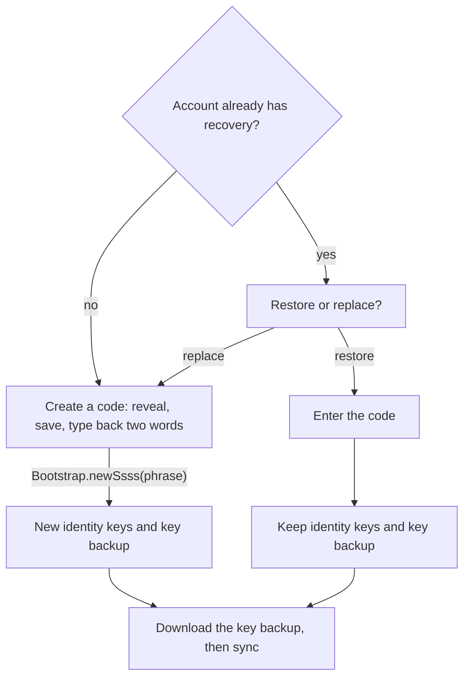

# Security & Verification

Recovery, device approval and confirming people, told as one story instead of
Matrix's four mechanisms (device keys, verification, cross-signing, and secret
storage with key backup). Each mechanism is sound, but almost nobody assembles
the story alone, so people end up with encryption on, no recovery, nobody
confirmed, and a settings page of marks they cannot read. The `matrix` SDK
does all the cryptography. The app changes only what things are called, when
the user is asked, and how it looks.

Three rules govern every surface:

- **One story, not four features.** Keys live on devices, so you need to know
  which devices are really yours and a way to survive losing them all. The app
  teaches this through three moments (set up recovery, approve a new device,
  confirm a person) and never names a mechanism.
- **Every warning has exactly one button that resolves it.** A warning nobody
  can act on teaches people to dismiss warnings, including the ones that
  matter.
- **Absence is the default.** No badge, mark or color appears unless something
  is wrong and the user can act on it now.

## Architecture

Logic lives in `lib/core/security/`, screens in `features/settings/` and
`features/verification/`.

| Area | Main pieces |
|---|---|
| Status | `account_security_status.dart`, shown by `security_status_card.dart` |
| Recovery | `recovery_code.dart` (generation, normalization), `recovery_code_file.dart` (the saved file), `secure_backup_page.dart` |
| Devices | `verification_page.dart`, `approve_this_device_page.dart`, `active_sessions_page.dart` |
| People | `user_trust.dart`, `confirmed_identity_store.dart`, `confirm_person.dart` |
| Device watch | `known_devices_store.dart` and the new-device banners |
| Messages | `undecryptable_reason.dart`, `recovery_code_leak.dart` |

Calls check call-key senders against the same device keys (`calls.md`), and
onboarding asks for approval and recovery from the raw facts rather than the
status (`onboarding.md`).

### Status

The pure function `accountSecurityStatus` turns five facts, read on every
sync, into one status. Settings → Security shows it as one card with at most
one button. Each account-wide fact has a this-device twin, and those pairs
are what separate a missing recovery from a locked device.

| Fact | SDK source |
|---|---|
| Recovery exists / this device has the identity keys | `crossSigning.enabled` / `crossSigning.isCached()` |
| Key backup exists / is usable here | `keyManager.enabled` / `keyManager.isCached()` |
| Unapproved other devices | Own devices other than this one that are not `verified` |

The first matching status wins:

| Status | When | The one button opens |
|---|---|---|
| `noRecovery` | The account has no recovery | Recovery setup |
| `deviceLocked` | Recovery exists, but this device lacks the identity keys | Approve this device |
| `deviceWaiting` | Another own device is not approved | Your devices |
| `recoveryStale` | This device cannot open the key backup, usually because the code was replaced elsewhere | Restore with the current code |
| `protected` | None of the above | No button |

`deviceLocked` must come before `deviceWaiting`. A device without the identity
keys trusts nothing directly, so every other device looks unapproved to it,
and a freshly signed-in phone would accuse them all instead of asking to be
approved itself.

### Recovery

`SecureBackupPage` answers the checkpoints of the SDK's `Bootstrap` state
machine and never reimplements secret storage. One key encrypts both the
cross-signing keys and the key backup, so recovery is one flow behind several
entry points in Settings.

- **Restore or replace is asked once.** The answer auto-answers every later
  "wipe this too?" checkpoint `Bootstrap` raises, so the user never meets the
  same decision three times.
- **Creating a code** goes reveal, save, type back two words at random
  positions, and only then `Bootstrap.newSsss(phrase)`. The type-back is the
  one step that separates "saved it" from "saw it", and quitting before it
  leaves nothing on the server.
- **Entering a code** accepts the twelve words, a base58 security key or a
  phrase set up in another client, typed or opened from a saved file.
  Opening a file only fills the field, and any short plain-text file opens,
  so another client's exported key works as well as Zuno's own saved code.
  Text correction is off in the field, because autocorrect mangling a word
  is the likeliest real-world failure of the design. Validation only hints
  and never blocks submission.

### Device approval and verification

One SDK `KeyVerification` state machine and one screen
(`verification_page.dart`) serve both own devices (over to-device events) and
people (over in-room events in a DM). Scanning a QR code comes first, offered
only in the directions both sides support, and comparing emoji ("pictures" in
the UI) is the fallback.

`ApproveThisDevicePage` offers another device before the recovery code, since
most people still have the old phone. It closes only once this device is
approved, so a stopped check keeps the other ways open.

**Your devices** lists the union of the server's `/devices` and the SDK's
device keys, so a device known to only one source still gets a row. From it
the user approves or signs out other devices, or signs in a new one
(`authentication.md`). `sessionApproval` is the single verdict for every row:

| Row | Verdict |
|---|---|
| This device | Whether it holds the identity keys, never its `verified` flag |
| Another device, and this device holds the identity keys | That device's `verified` |
| Another device, and this device lacks the identity keys | "Cannot check", not a false "not approved" on every row |

Uploading new cross-signing keys, signing out other devices, deleting the
account and minting a sign-in code all ask for the password (UIA) through
`answerUiaWithPassword`.

### People

`confirmPerson` is the one entry point for confirming a contact. Without
recovery on this device it first offers to set it up inline, because the
device cannot sign the result otherwise. It then runs the in-room check (in
person, scan their code; apart, compare pictures on a call in the app) and
records the contact's master key in `ConfirmedIdentityStore`.

`userTrustState` compares the contact's master key, the SDK's verification of
it, their devices' signatures and the key we stored:

| State | Meaning | Shown as |
|---|---|---|
| `noIdentity` | They never set up recovery | Nothing to confirm; the new-device banner can fire |
| `unconfirmed` | Not confirmed by us | A confirm row in room info, a note in an empty one-to-one chat, the call pill |
| `confirmed` | Confirmed, every device signed | A muted check in the chat header |
| `confirmedWithPendingDevice` | Confirmed, but one of their devices is not approved by them | The check plus a passive line in room info |
| `identityChanged` | Their master key differs from the one we confirmed | A banner in the chat, the call pill |

### Device watch

`KnownDevicesStore` remembers device IDs per user and backs two warnings: a
new sign-in on the user's own account (a banner and a notification,
`notifications.md`), and a new device for a contact without a master key (a
banner in the chat). The default key policy sends that contact's new devices
room keys, so it is the one case where a device can read along unnoticed.

The first check for a user seeds the store silently. Only contacts sharing a
non-public room are watched, because strangers' devices are noise. The
warning fires on a device appearing rather than as a standing state, because
"has no identity" is true of most contacts and would become wallpaper.

### Undecryptable messages

`undecryptableReason` keys on whether an action exists, since the SDK cannot
tell why a key is missing. A message is `recoverable` (inline unlock) when a
key backup exists that this device has not opened, and `keyNeverShared`
otherwise, with no button, because a button that cannot work is worse than
none. It reads the same facts as the status card, so the two never
contradict each other. Display: `chats-messaging.md`.

### Leak check

`recovery_code_leak.dart` flags outgoing text that contains ten consecutive
wordlist words or a run shaped like a base58 security key, and the composer
confirms before sending it (`chats-messaging.md`). Ten sits under twelve so a
partly mistyped paste still trips it, and no word is under four letters, so
the commonest words of ordinary prose break any run.

## Decisions

- **The recovery code is twelve generated words fed to the SDK's passphrase
  path** (`Bootstrap.newSsss(phrase)`), so it needs no protocol or server
  change. Every option unlocks the same vault key; the choice is only what the
  user keeps. The base58 key and a self-chosen phrase stay on Advanced, a
  disabled placeholder for now (`settings.md`).

| Option | Verdict |
|---|---|
| Base58 key | Strongest (256 bits), but cannot be written down, read aloud or recalled |
| A phrase the user chooses | Typed zero times between setup and disaster, then forgotten, and only as strong as the user's pick |
| Words encoding the key (BIP39-style) | 256 bits, but about 25 words and a Zuno-only format |
| **Twelve generated words** | Uniform strength, writable on paper, sayable on a call, typeable without a password manager, and accepted by other clients' phrase fields |

- **One derivation path.** New secret-derived material reuses
  `newSsss(phrase)` and the same normalization rather than adding another.
- **Why twelve.** The words are a passphrase, not an encoding of the key, so
  the account is only as strong as the words, and the vault can be ground
  offline with no rate limit. Seven words (~72 bits) is within reach of a
  Bitcoin-scale ASIC farm in months; twelve (~124 bits) is not, and matches
  BIP39's floor. The SDK hardcodes the derivation (PBKDF2, 500,000
  iterations), so word count is the only lever.
- **The wordlist** (`assets/wordlist/recovery_words.txt`, built by
  `tool/generate_wordlist.py`) is the system dictionary intersected with
  `cracklib-small`, which stands in for frequency data. Inflected forms,
  slurs and crude or easily misheard words are removed, and words are picked
  greedily, shortest first, until the list has the properties below. Tests
  check the shipped file rather than the generator, since checking the
  generator only proves it agrees with itself.

| Property | Why |
|---|---|
| 1296 words (6⁴, ~10.3 bits each), 4–8 lowercase ASCII letters | Nothing to transliterate, render oddly or mishear |
| Unique three-letter prefixes | Autocomplete takes about three keystrokes a word |
| Edit distance at least 2 | A single typo never makes another valid word, and entry can offer near matches. Distance 3 would force worse words like "akimbo". |

- **Duplicate words are allowed** in a generated code, because rejecting them
  lowers entropy.
- **Normalization**: lowercase, turn every character outside `a–z` into a
  separator, collapse runs and trim. It is the simplest rule that can be
  restated exactly years later, and separating rather than stripping survives
  pastes whose spaces became non-breaking or zero-width.
- **No forced migration.** Replacing a code makes every other device
  re-approve, so existing keys and chosen phrases keep working and replacing
  is always an explicit choice.
- **Vocabulary is a deliverable, not polish.** Security key and security
  phrase merge into one secret, the recovery code, under one mechanism,
  recovery. Own devices are approved; people are confirmed. Protocol words
  appear only on Advanced. Word table: `../brand-voice.md`.
- **Confirm people, not devices.** A contact's unapproved device gets no room
  keys and only they can fix it, so it earns a passive line. An identity
  change voids a confirmation only the user can remake, so it gets a banner.
  Their devices are never listed, and one confirmation covers every future
  device.
- **Security copy appears only about someone specific, at a moment of
  consequence.** Persistent reassurance decays like persistent warnings, and
  an app that keeps saying it is safe reads as worried:

| Surface | Rule |
|---|---|
| Confirmed person | A muted check, once per screen, as a receipt; absence means nothing |
| Empty room | One line that clears itself, promising privacy only once the person is confirmed |
| Room list | Nothing, because the same words about nobody read as marketing |
| Message from a confirmed person's unapproved device | Long-press sheet only, since a per-message mark becomes wallpaper |

- **Three visual states, no shields** (shields mean nothing outside Matrix):
  nothing, a muted check, and attention (`security_emphasis.dart`). Attention
  is a filled glyph among outlined icons, so it differs in kind before color
  and stays legible to people who cannot tell colors apart. There is no
  "settled" color, because two colored ends would read as a scale and make an
  unmarked room look unsafe. The devices screen alone uses green and red,
  because sorting pass from fail is its whole job.
- **Ask about recovery at a moment of consequence** (`security_prompt.dart`):
  only without recovery and with a conversation, after a few days of use or
  once a second own device appears, with a cooldown, and never at
  registration, when there is nothing to lose yet.
- **Logic stays in pure functions** over SDK state, so it is unit-tested
  without a live `Client`. A new account-wide signal becomes another status
  with a place in the order, never a second line on the card.
- **Not built: room-key export and import** (placeholders on Advanced).
  Neither the SDK nor vodozemac exposes the standard encrypted export format,
  so building it means implementing that format's cryptography, which needs
  a security pass of its own.
- **The recovery code restores message history, not account access.** There
  is no email reset (`authentication.md`), so a forgotten password loses the
  account whatever code is saved.

## Gotchas

- **`Client.verificationMethods` must be non-empty**, or incoming requests are
  dropped and outgoing ones advertise no methods, so the other side cancels.
- **The QR payload is binary, not text**, so scan and render raw bytes: the
  string paths produce a code that scans cleanly and then fails verification.
- **The status enum's declaration order is not the precedence**; only the
  branch order in `accountSecurityStatus` decides which status wins.
- **In-room verification events carry a fallback body that reads as a
  failure**, so the whole `m.key.verification.*` family is hidden from the
  timeline and notifications, whatever the show-hidden toggle says.
- **Never render `canceledReason` raw**, because it is free text from the
  other side; map the code and give a real mismatch its own alarming copy.
- **The SDK marks this device's own keys `directVerified`**, which says
  nothing about whether the account vouched for it, so `sessionApproval`
  ignores it.
- **Device checks run only on finished syncs and only add**, because the SDK
  empties and refills a device list across awaits, and saving a half-filled
  list would later report the missing devices as new sign-ins.
- **Unlocking recovery does not download the backup**, so the restore must run
  before the post-restore sync, or that sync rebuilds previews from the same
  locked state.
- **Late keys arrive per room** (`Room.onSessionKeyReceived`), not on sync,
  and `Room.lastEvent` is decrypted once and cached, so the room list preview
  retries itself.
- **Starting over mints a new identity**, so it must clear both the
  confirmed-identity store and the SDK's `directVerified` flags, or a stale
  confirmation or a false `identityChanged` follows. Restoring clears nothing.
- **A contact with a master key gets no room keys on an unapproved device**,
  so messages stay undecryptable there until they approve it, which is the
  default key policy working, not a bug.
- **The file picker leaves a copy of an opened file in the app's temporary
  storage**, so the copy is deleted after reading, or the code lingers there
  in plaintext; only a copy inside that storage is ever deleted, never the
  user's original.
- **Replacing a code asks for the password first**, because `Bootstrap`
  reaches the password checkpoint only after the old code is gone.
- **Two `onUiaRequest` listeners open two dialogs**, so a listening page
  unsubscribes before pushing another listener.
- **Never edit `normalizeRecoveryPhrase` or the shipped wordlist.** A
  normalization change silently gives every existing code a different key,
  and a new list breaks validation and autocomplete for existing codes, so
  either needs a migration.

`verification_harness.dart` fakes `KeyVerification`, device lists and the
scanner, and `SecureBackupPage` takes a fake `Bootstrap`, since widget tests
have no encryption.
